# Viseart 丁香系对比：Lilas Lumière & Petits Fours Lilas

对比以下两款：

- **LL** · [丁香流辉盘 Lilas Lumière Étendu (2025)](./middle-12-lilas-lumiere-etendu/README.md) — 12色 中号
- **Li** · [四色丁香盘 Petits Fours Lilas](./middle-4-lilas/README.md) — 4色 中号

> **核心结论**：四色丁香盘（Li）是十二色流辉盘（LL）的精简子集——4个色号中有3个与 LL 完全相同（Fondant、Tiramisu、Argentée），第4个（Lilas）是 LL Pompidou 的近亲变体。

---

## 一、完全相同

四色丁香盘的三个色号在流辉盘中原样出现，名称几乎一致。

### 1. Fondant — 冰粉银玫瑰闪

| 流辉 LL8 · Fondant | 四色丁香 Li1 · Fondant |
|:---:|:---:|
| 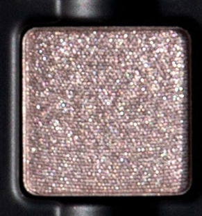 | 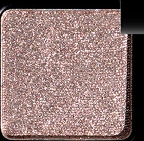 |
| 冰粉银玫瑰闪，shimmer | 冰粉银玫瑰闪，shimmer |

---

### 2. Tiramisu — 浅冷灰褐哑光

| 流辉 LL5 · Tiramisu | 四色丁香 Li3 · Tiramisu |
|:---:|:---:|
| 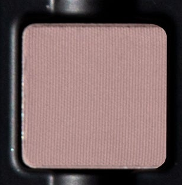 | 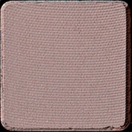 |
| 浅冷调灰褐，哑光 | 浅冷调灰褐，哑光 |

---

### 3. Argenté / Argentée — 银色闪光

| 流辉 LL6 · Argenté | 四色丁香 Li4 · Argentée |
|:---:|:---:|
| 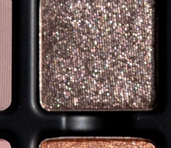 | 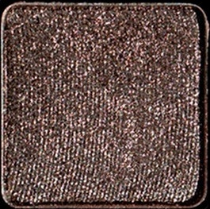 |
| 银色闪光，shimmer | 银色闪光，shimmer（盘拍曝光较深，实为同款） |

---

## 二、近似变体

### 4. 柔雾粉丁香哑光 — Pompidou · Lilas

两款同属柔雾冷调粉丁香哑光；Pompidou 偏灰冷，Lilas 略偏粉饱和（四色盘的命名色）。

| 流辉 LL9 · Pompidou | 四色丁香 Li2 · Lilas |
|:---:|:---:|
| 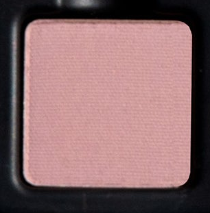 | 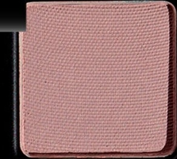 |
| 柔雾冷粉丁香，哑光 | 柔雾粉丁香（略偏粉），哑光 |

---

## 三、各盘独有色

### 流辉 Lilas Lumière 独有（8色）

四色盘未收录的 8 个色号：

| LL1 · Perle D'or | LL2 · Rosée | LL3 · Soft Pink | LL4 · Isolde |
|:---:|:---:|:---:|:---:|
| 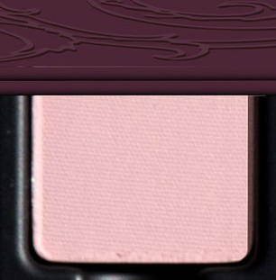 | 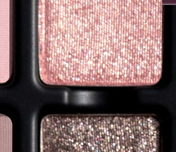 | 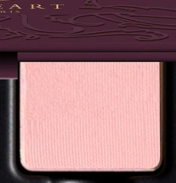 | 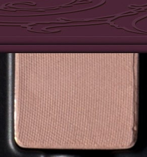 |
| 极浅冷粉，哑光 | 浅暖粉，金属闪 | 极浅软粉，哑光 | 浅石感裸棕，哑光 |

| LL7 · Burlesque | LL10 · Dulce | LL11 · Cambresine | LL12 · Espresso |
|:---:|:---:|:---:|:---:|
| 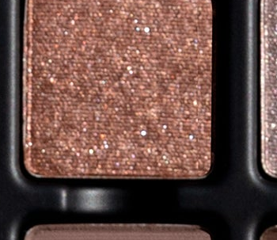 | 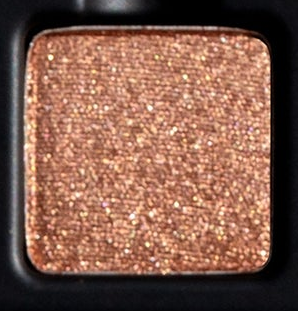 | 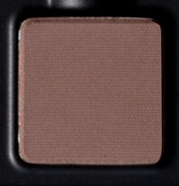 | 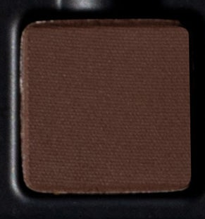 |
| 焦糖双色光，缎光 | 暖铜棕，metallic | 中调灰米棕，哑光 | 深苦棕，哑光 |

---

## 四、速查总表

| 色系 | 流辉 LL (12色) | 四色丁香 Li (4色) |
|---|---|---|
| 极浅冷粉哑光 | LL1 Perle D'or | — |
| 极浅软粉哑光 | LL3 Soft Pink | — |
| 浅暖粉金属闪 | LL2 Rosée | — |
| 浅石感裸棕哑光 | LL4 Isolde | — |
| 浅冷灰褐哑光 | **LL5 Tiramisu** | **Li3 Tiramisu** |
| 银色闪光 | **LL6 Argenté** | **Li4 Argentée** |
| 焦糖双色光缎 | LL7 Burlesque | — |
| 冰粉银玫瑰闪 | **LL8 Fondant** | **Li1 Fondant** |
| 柔雾冷粉丁香哑光 | LL9 Pompidou | Li2 Lilas |
| 暖铜棕金属闪 | LL10 Dulce | — |
| 中调灰米棕哑光 | LL11 Cambresine | — |
| 深苦棕哑光 | LL12 Espresso | — |

粗体 = 近乎相同的跨盘对应色。
