# 果仁糖系三盘对比 Praline Series Compare

**三盘简称：**
- **甜盘 D** — 蜜甜果仁糖盘 Praline Dulce Étendu（2026）
- **原盘 P** — 果仁糖盘 Praline Étendu（2025）
- **糖盘 BB** — 糖果果仁盘 Bon Bon Praline Étendu（2026）

---

## 1. 近乎相同

### 1a. 霜金香槟闪光 — D·1 Dulce d'Or × P·1 Folies

| 甜盘 D · 1 · Dulce d'Or | 原盘 P · 1 · Folies |
|:---:|:---:|
|  | 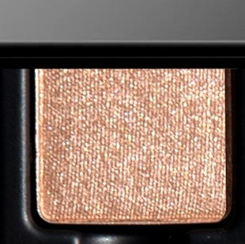 |
| 霜感香槟金，中等密度微光 | 亮金属光，质感更顺滑 |

### 1b. 粉米哑光高光 — D·3 Lait Sucré × BB·1 Nougat Blanc

| 甜盘 D · 3 · Lait Sucré | 糖盘 BB · 1 · Nougat Blanc |
|:---:|:---:|
|  |  |
| 浅粉米哑光，描述偏冷调 | 浅粉米哑光，描述偏暖调，视觉上近乎一致 |

### 1c. 玫铜密闪 — D·11 Amberine × BB·4 Cassis Ambré

| 甜盘 D · 11 · Amberine | 糖盘 BB · 4 · Cassis Ambré |
|:---:|:---:|
|  |  |
| 炙烤琥珀，玫瑰铜色密闪 | 玫瑰金带铜光，同等密闪质感 |

### 1d. 灰梅哑光 — P·3 Mousseline × BB·10 Bastia Rose

| 原盘 P · 3 · Mousseline | 糖盘 BB · 10 · Bastia Rose |
|:---:|:---:|
| 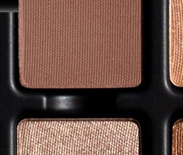 |  |
| 焦梅玫棕，中调哑光 | 紫灰梅子，中调哑光，稍偏冷 |

### 1e. 浓咖深棕哑光 — D·12 Cocoa × P·12 Veloutine

| 甜盘 D · 12 · Cocoa | 原盘 P · 12 · Veloutine |
|:---:|:---:|
|  | 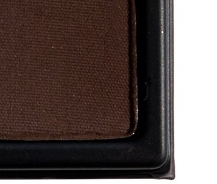 |
| 浓咖深棕，哑光 | 浓缩苦棕，哑光，稍深稍冷 |

---

## 2. 同系相似

### 2.1 暖金裸色缎光系

暖调香槟/裸金，从亮缎到哑金渐次递减。

| 甜盘 D | 原盘 P | 糖盘 BB |
|:---:|:---:|:---:|
| **2 · Lait de Miel** | **9 · Archives** | **11 · Miel Sauvage** |
|  | 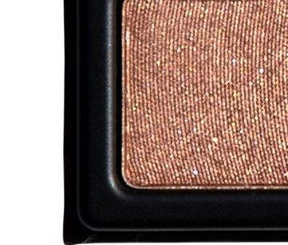 |  |
| 暖玫香槟，绸缎质地 | 裸香槟铜光，金属缎面稍浓郁 | 暖琥珀蜜金，颗粒最细最柔 |

| 甜盘 D | 原盘 P | 糖盘 BB |
|:---:|:---:|:---:|
| **9 · Orbs** | **7 · Laughter** | **2 · Caramel Salé** |
|  | 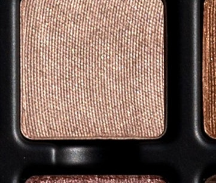 |  |
| 贴肤裸铜微光叠擦专色 | 裸米缎金，自然光泽 | 浅焦糖裸色，微光绸缎，稍带暖棕 |

差异说明：D9 Orbs 为半透明叠擦质地，BB2 Caramel Salé 带细微棕调，其余四色均属暖金主调。

### 2.2 香槟玫粉闪光系

三色均带粉调或丁香调金属感，与 2.1 的中性金相区别。

| 糖盘 BB | 糖盘 BB | 原盘 P |
|:---:|:---:|:---:|
| **5 · Lin Froissé** | **7 · Sieste Dorée** | **11 · Cire** |
|  |  | 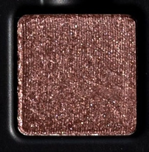 |
| 香槟灰褐缎光，粉调彩虹光 | 香槟粉，高光金属，最亮最粉 | 丁香灰褐金属，带最明显紫调 |

### 2.3 古铜焦糖闪光系

暖调橙铜或青铜系微光/金属色。

| 甜盘 D | 原盘 P | 原盘 P | 糖盘 BB |
|:---:|:---:|:---:|:---:|
| **6 · Délice** | **8 · Cabaret** | **4 · Sucré** | **3 · Soleil Doré** ⭐独有 |
|  | 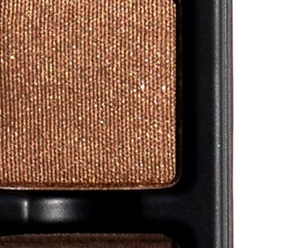 | 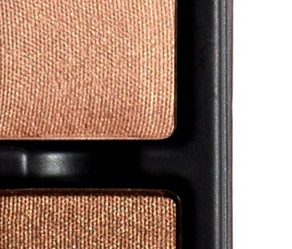 |  |
| 烤杏仁铜，密闪感强 | 金古铜，顺滑金属 | 暖棕闪，橙铜调 | 日晒黄金，含冷蓝反光，系列唯一黄调⭐ |

### 2.4 玫金双偏光系

两色均带双偏光/duochrome 感，比 1c 的密闪更顺滑通透。

| 原盘 P | 糖盘 BB |
|:---:|:---:|
| **6 · Jazz** | **6 · Abricot Confit** |
| 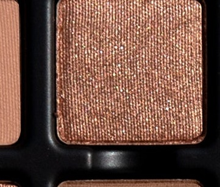 |  |
| 玫瑰金双偏光，暖铜底 | 杏粉双偏光，更浅更粉更通透 |

### 2.5 浅米粉哑光高光系

最浅色区间，含近乎相同的 D3/BB1，P2 更偏桃粉。

| 甜盘 D | 糖盘 BB | 原盘 P |
|:---:|:---:|:---:|
| **3 · Lait Sucré** ≈ | **1 · Nougat Blanc** ≈ | **2 · Pigalle** |
|  |  | 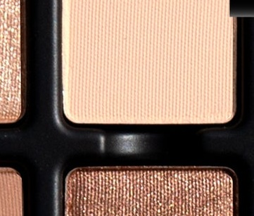 |
| 浅粉米哑光（见1b） | 浅粉米哑光（见1b） | 更浅，香草蜜桃奶白，最轻盈 |

### 2.6 浅中暖褐哑光系

浅至中等暖棕/驼色区间，深度递进。

| 原盘 P | 甜盘 D | 糖盘 BB | 糖盘 BB |
|:---:|:---:|:---:|:---:|
| **5 · Muscade** | **4 · Tarte Tatin** | **8 · Sable Fin** | **2 · Caramel Salé** |
| 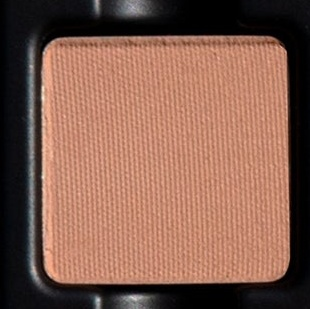 |  |  |  |
| 最浅，桃棕暖褐 | 驼棕，玫瑰暖调 | 沙感灰褐，柔和中性 | 浅焦糖棕，带缎光（亦见2.1） |

### 2.7 中调暖棕哑光系

中深程度暖棕，均为哑光，深度与色调各有差异。

| 甜盘 D | 甜盘 D | 甜盘 D | 原盘 P | 糖盘 BB |
|:---:|:---:|:---:|:---:|:---:|
| **5 · Frangipane** | **10 · Amandine** | **7 · Confiture** | **10 · Pecan** | **9 · Calanque** |
|  |  |  | 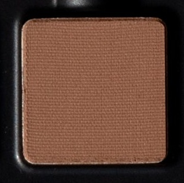 |  |
| 拿铁棕，暖玫调 | 暖灰褐棕，稍含橙调 | 焦糖灰褐，玫棕混调 | 赭石棕，稍偏冷 | 地中海岩棕，偏中性 |

### 2.8 深棕哑光系

深色区间，含近乎相同的 D12/P12，D8 略浅，BB12 带红调。

| 甜盘 D | 糖盘 BB | 甜盘 D | 原盘 P |
|:---:|:---:|:---:|:---:|
| **8 · Feuilleté** | **12 · Nuit Tiède** | **12 · Cocoa** ≈ | **12 · Veloutine** ≈ |
|  |  |  |  |
| 暖深棕，最浅 | 深棕红，最深，红调明显 | 浓咖棕（见1e） | 浓咖苦棕（见1e） |

---

## 3. 各盘独有

### 甜盘 D 独有

| 色号 | 图片 | 说明 |
|:---:|:---:|:---|
| **9 · Orbs** |  | 贴肤裸铜叠擦专色，功能性独特——作透明叠光用，而非覆盖性铺色 |

### 原盘 P 独有

原盘所有色号均可在其他盘找到同系相似或近乎相同的对应色，无完全独立的色调。

### 糖盘 BB 独有

| 色号 | 图片 | 说明 |
|:---:|:---:|:---|
| **3 · Soleil Doré** |  | 日晒黄调闪光，含冷蓝反光，三盘唯一黄色调 |
| **6 · Abricot Confit** |  | 杏桃粉双偏光叠擦色；P6 Jazz 为玫金调，两者方向不同 |

---

## 4. 速查总表

≈ = 近乎相同  ·  ~ = 同系相似  ·  ⭐ = 独有

| 色系 | 甜盘 D | 原盘 P | 糖盘 BB |
|:---|:---|:---|:---|
| 浅金香槟闪光 | **1 Dulce d'Or** ≈ | **1 Folies** ≈ | — |
| 暖裸金缎光 | 2 Lait de Miel, 9 Orbs | 7 Laughter, 9 Archives | 2 Caramel Salé, 11 Miel Sauvage |
| 香槟玫粉闪光 | — | 11 Cire | 5 Lin Froissé, 7 Sieste Dorée |
| 古铜焦糖闪光 | 6 Délice | 4 Sucré, 8 Cabaret | **3 Soleil Doré** ⭐ |
| 玫铜密闪 | **11 Amberine** ≈ | — | **4 Cassis Ambré** ≈ |
| 玫金/杏粉双偏光 | — | 6 Jazz | **6 Abricot Confit** ⭐ |
| 浅粉米哑光 | **3 Lait Sucré** ≈ | 2 Pigalle | **1 Nougat Blanc** ≈ |
| 浅中暖褐哑光 | 4 Tarte Tatin | 5 Muscade | 2 Caramel Salé, 8 Sable Fin |
| 中调暖棕哑光 | 5 Frangipane, 7 Confiture, 10 Amandine | 10 Pecan | 9 Calanque |
| 灰梅哑光 | — | **3 Mousseline** ≈ | **10 Bastia Rose** ≈ |
| 深棕哑光 | 8 Feuilleté, **12 Cocoa** ≈ | **12 Veloutine** ≈ | 12 Nuit Tiède |
