# Viseart 哑光盘横向对比：35格专业大盘 × Big-12 哑光系列

比较范围：**middle-35-pro-x1**（35格全哑光）与 7 款 Big-12 哑光盘。

| 简称 | 全名 |
|---|---|
| **x1** | middle-35-pro-x1 |
| **01** | big-12-01-mattes-neutral |
| **04** | big-12-04-mattes-dark |
| **07** | big-12-07-mattes-cool-original |
| **08** | big-12-08-mattes-editorial-brights |
| **10** | big-12-10-mattes-warm |
| **11** | big-12-11-mattes-cool2 |
| **14** | big-12-14-mattes-neutral-milieu |

---

## 1. 近乎相同

颜色、深浅与质感高度一致，日常使用可互相替换。

### 1-a. 自然黑
| x1 · #35 · Carbon Black | 01 · #9 · Carbon |
|:---:|:---:|
| 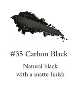 | 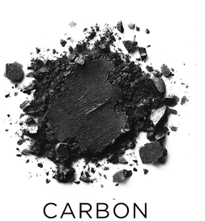 |
| 自然黑，哑光 | 自然黑，哑光 |

### 1-b. 深灰（同名同色）
| x1 · #32 · Souris Grey | 01 · #10 · Souris |
|:---:|:---:|
| 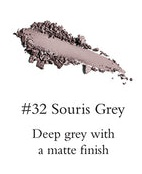 | 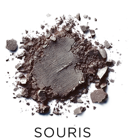 |
| 深灰，哑光 | 深灰，哑光 |

### 1-c. 深巧克力红棕
| x1 · #7 · Chocolate | 01 · #5 · Chocolat |
|:---:|:---:|
| 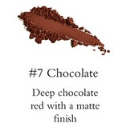 | 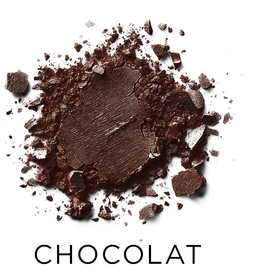 |
| 深巧克力红棕，哑光 | 暖调巧克力红棕，哑光 |

### 1-d. 纯白
| x1 · #29 · Blanc White | 08 · #1 · White |
|:---:|:---:|
| 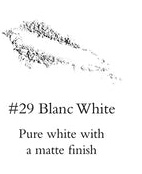 | 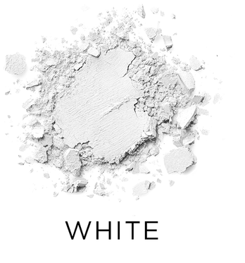 |
| 纯白，哑光 | 明亮纯白，哑光 |

### 1-e. 暖中深棕
| x1 · #12 · Milk Chocolate | 10 · #10 · Nutmeg |
|:---:|:---:|
| 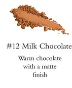 | 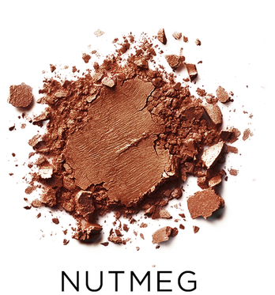 |
| 暖巧克力棕，哑光 | 中深棕，细微红调，哑光 |

### 1-f. 深莓紫棕
| x1 · #21 · Blackened Honey | 04 · #5 · Pinot |
|:---:|:---:|
| 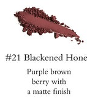 | 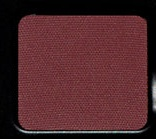 |
| 偏紫棕莓果深色，哑光 | 深玫瑰李子色，哑光 |

---

## 2. 同系相似

同色系，但深浅、饱和度或底调有所差异。

### 2-a. 焦橘调哑光
Pumpkin 偏黄橘，Persimmon 更红橙，Flame 红调最重。

| x1 · #6 · Pumpkin | 04 · #8 · Persimmon | 10 · #8 · Flame |
|:---:|:---:|:---:|
| 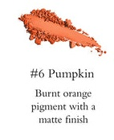 | 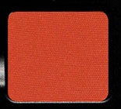 | 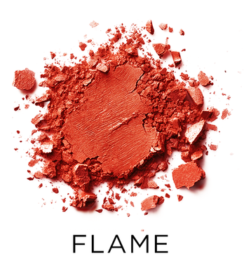 |
| 焦橘，偏黄 | 深橘，偏红 | 焰橘，最红 |

### 2-b. 姜黄-黄赭
Mustard 更柔和哑光，Curcumin 饱和度更高更橙。

| x1 · #13 · Mustard | 04 · #7 · Curcumin |
|:---:|:---:|
| 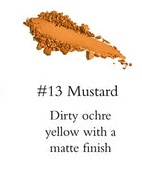 | 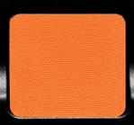 |
| 柔和黄赭/芥末色 | 明亮黄橘/姜黄 |

### 2-c. 陶土-赭石暖调
Café Crème 最浅、最裸，Roussillon 饱和赤陶，Brique 最红最深。

| x1 · #3 · Café Crème | 14 · #3 · Roussillon | 01 · #6 · Brique |
|:---:|:---:|:---:|
| 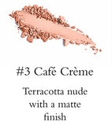 | 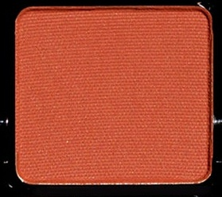 | 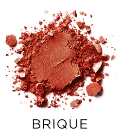 |
| 浅陶土裸色 | 饱和赤陶中调 | 暖赭石砖红 |

### 2-d. 浅暖焦糖-骆驼
同属浅至中调暖焦糖系，Milk Caramel 最浅，Cidre/Crème Brûlée 带更多金黄/橙感。

| x1 · #4 · Milk Caramel | 04 · #1 · Toffee | 10 · #5 · Brioche | 10 · #7 · Cidre |
|:---:|:---:|:---:|:---:|
| 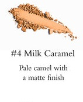 | 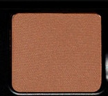 | 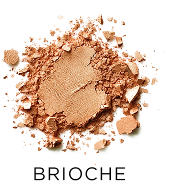 | 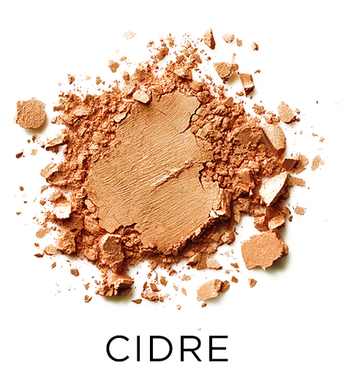 |
| 浅骆驼焦糖，最淡 | 暖浅棕，略深 | 软棕偏黄调 | 中棕偏金黄 |

### 2-e. 中暖棕-焦糖棕
同属中调暖棕，深浅与底调略有差异。

| x1 · #5 · Nude Caramel | 14 · #4 · Platane | 14 · #5 · Latte | 14 · #8 · Nue | 11 · #5 · Shoreline | 10 · #9 · Brûlée |
|:---:|:---:|:---:|:---:|:---:|:---:|
| 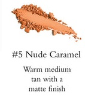 | 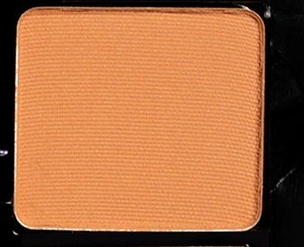 | 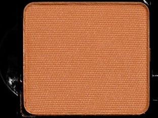 | 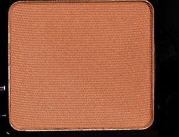 | 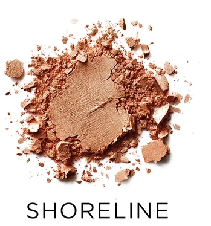 | 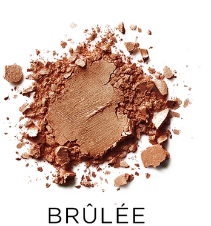 |
| 暖中棕褐 | 焦糖裸棕 | 黄褐米棕 | 灰褐棕 | 中冷棕 | 中深暖棕 |

### 2-f. 米灰褐过渡色
哑光中性过渡色，Bis 最粉暖，Dunaire 沙感，Taupe 偏暖焦糖。

| x1 · #11 · Bis | 01 · #7 · Taupe | 07 · #3 · Dunaire |
|:---:|:---:|:---:|
| 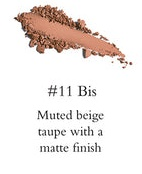 | 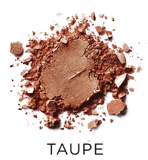 | 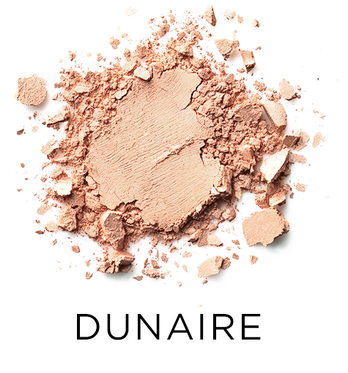 |
| 米灰褐，偏粉暖 | 焦糖暖棕过渡 | 沙感浅灰棕 |

### 2-g. 深暖-冷棕
深棕系，Espresso/Cacao 偏暖，Elk/Hazelnut 偏冷灰，Ghirardelli 暖铜感。

| x1 · #14 · Espresso | 14 · #9 · Cacao | 11 · #10 · Elk | 04 · #2 · Hazelnut | 11 · #9 · Ghirardelli |
|:---:|:---:|:---:|:---:|:---:|
| 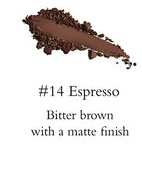 | 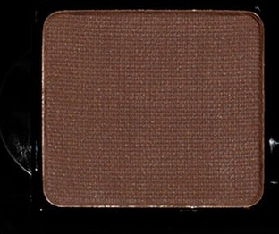 | 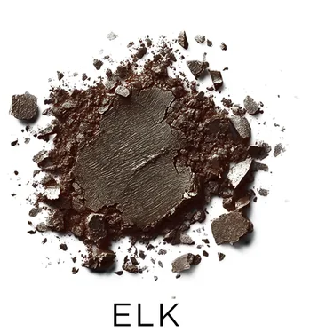 | 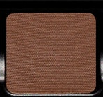 | 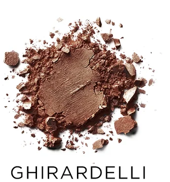 |
| 深苦棕，暖 | 深巧克力，中性 | 深苦棕，冷 | 深灰棕，冷 | 巧克力铜棕 |

### 2-h. 深茄紫-葡萄酒
Blackberry 偏红，Beaujolais 更深更紫；Blackcurrant 近黑，Myrtille 中调蓝紫。

| x1 · #26 · Blackberry | 04 · #6 · Beaujolais | x1 · #28 · Blackcurrant | 04 · #9 · Myrtille |
|:---:|:---:|:---:|:---:|
| 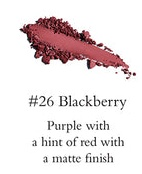 | 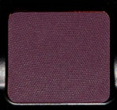 | 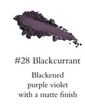 | 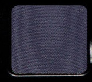 |
| 深紫红，带红 | 茄紫，更暗 | 近黑紫罗兰 | 中调蓝紫 |

### 2-i. 灰调紫-哑光薰衣草
由浅至深的灰紫-玫紫系，Thistle 最浅最灰，Lupine 中调饱和紫，Violacé 最深最暗玫紫。

| x1 · #31 · Thistle | x1 · #17 · Heather | 11 · #8 · Lupine | 07 · #7 · Violacé |
|:---:|:---:|:---:|:---:|
| 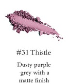 | 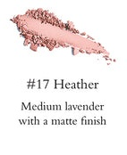 | 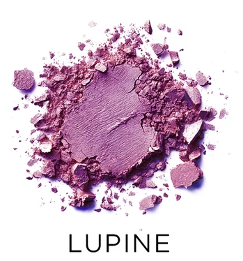 | 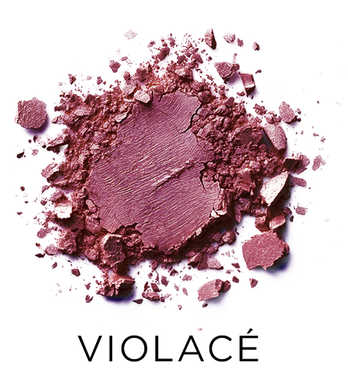 |
| 浅灰调紫 | 中调薰衣草 | 饱和柔紫 | 深玫紫茄调 |

### 2-j. 淡粉紫-薰衣草
同为浅紫-粉紫系，Liaison 更苍白偏粉，Lilac 更鲜更紫。

| x1 · #23 · Liaison | 11 · #4 · Lilac |
|:---:|:---:|
| 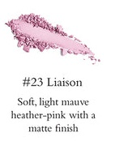 | 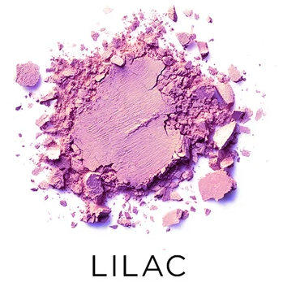 |
| 浅苍粉紫，偏粉 | 浅紫，更鲜明 |

### 2-k. 冷调灰系
Fog 最浅，Slate 中调，Souris Grey/Souris 最深（已列近乎相同）；Charcoal Grey 偏中性炭灰，Pewter 带棕，Sediment 最深近黑炭。

| 11 · #6 · Fog | 07 · #11 · Slate | x1 · #33 · Charcoal Grey | 07 · #8 · Pewter | 07 · #12 · Sediment |
|:---:|:---:|:---:|:---:|:---:|
| 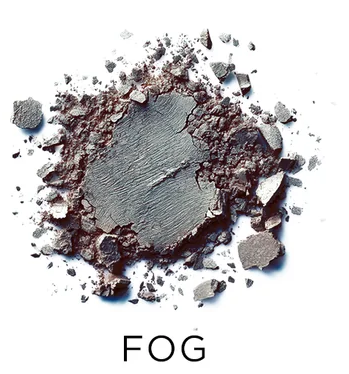 | 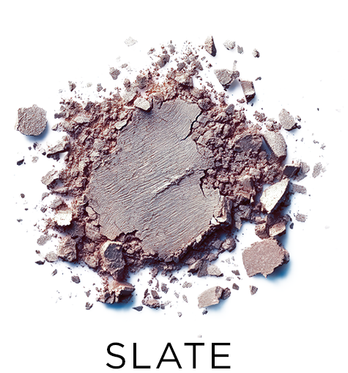 |  |  |  |
| 浅冷灰 | 中调石板灰 | 深炭灰，中性 | 深炭灰，带棕 | 最深炭灰近黑 |

### 2-l. 浅骨色-香草裸白
近白的浅裸色系，各有微妙底调差异。

| x1 · #1 · Eggshell | 07 · #1 · Saltstone | 11 · #1 · Salt | 01 · #4 · Ivoire |
|:---:|:---:|:---:|:---:|
|  |  |  |  |
| 近白微桃 | 香草裸米白 | 淡骨色 | 象牙骨白 |

### 2-m. 浅桃-蜜桃裸色
偏暖桃/蜜桃调的浅肤色系。

| x1 · #2 · Apricot Nude | x1 · #8 · Vanilla | 01 · #3 · Pêche | 01 · #2 · Beige | 11 · #2 · Sand |
|:---:|:---:|:---:|:---:|:---:|
|  |  |  |  |  |
| 浅杏裸，极淡 | 浅桃香草，极淡 | 浅蜜桃米 | 暖蜜桃米 | 冷调浅米 |

### 2-n. 软粉-腮红粉
由裸粉至亮粉的渐层。

| x1 · #16 · Piglet | x1 · #22 · Ballet Pink | 11 · #3 · Seashell | 07 · #6 · Shell |
|:---:|:---:|:---:|:---:|
|  |  |  |  |
| 裸粉，最柔 | 柔和芭蕾粉 | 温暖浅玫粉 | 明亮泡泡糖粉 |

### 2-o. 尘玫-石榴红
Framboise 柔雾玫瑰，Groseille 深饱和石榴红。

| x1 · #25 · Framboise | 14 · #7 · Groseille |
|:---:|:---:|
|  |  |
| 柔雾玫瑰，淡 | 深石榴红，饱和 |

### 2-p. 洋红-紫粉
高饱和洋红/紫粉系，Pink 最霓虹，Dahlia 偏纯洋红，Bougainvillea 最偏紫。

| x1 · #27 · Bougainvillea | 14 · #10 · Dahlia | 08 · #5 · Pink |
|:---:|:---:|:---:|
|  |  |  |
| 高饱和紫粉，偏紫 | 洋红，温暖 | 霓虹亮粉 |

### 2-q. 浅蓝-灰蓝
Tiffany Blue 雾感极强，Sky 更清透明亮。

| x1 · #30 · Tiffany Blue | 11 · #7 · Sky |
|:---:|:---:|
|  |  |
| 极淡灰蓝，雾感强 | 浅天蓝，较鲜明 |

### 2-r. 钴蓝-亮蓝
Azure 最亮/电光蓝，Cobalt Blue 标准钴蓝，Pénombre 深度蓝偏靛海军。

| x1 · #34 · Cobalt Blue | 08 · #12 · Azure | 14 · #12 · Pénombre |
|:---:|:---:|:---:|
|  |  |  |
| 钴蓝 | 天青/电光蓝 | 深钴/靛蓝 |

---

## 3. 各盘独有

### 3-a. middle-35-pro-x1 独有

该盘独有的粉调、mauve 与调色系色号，其余盘均不具备：

| 色号 | 色块 | 描述 |
|:---:|:---:|---|
| #9 Crème |  | 浅米粉色，偏粉的奶油裸色 |
| #15 Letterbox |  | 带粉底调的浅奶油米色 |
| #18 Dusty Mauve |  | 温暖尘感藕紫/粉棕 mauve |
| #19 Blush |  | 低饱和陶土玫紫，兼具腮红调 |
| #20 Red Coral |  | 带粉调的红色，珊瑚红 |
| #24 Cotton Candy |  | 糖果粉，比 Ballet Pink 更鲜亮 |

### 3-b. big-12-01-mattes-neutral 独有

| 色号 | 色块 | 描述 |
|:---:|:---:|---|
| #1 Canelle |  | 深蜜桃/三文鱼肉色 |
| #6 Brique |  | 暖赭石砖红，偏橙红 |
| #8 Cafe |  | 冷调灰棕 taupe |
| #11 Cendre |  | 柔和冷调灰棕，中性修容色 |
| #12 Noisette |  | 浅冷棕，明亮裸棕 |

### 3-c. big-12-04-mattes-dark 独有

| 色号 | 色块 | 描述 |
|:---:|:---:|---|
| #3 Sienna |  | 柔和玫瑰棕，深调 |
| #4 Sepia |  | 柔和橘棕/焦赭色 |
| #10 Minuit |  | 深海军蓝，深调哑光 |
| #11 Fôret |  | 森林绿 |
| #12 Olive |  | 橄榄绿 |

### 3-d. big-12-07-mattes-cool-original 独有

| 色号 | 色块 | 描述 |
|:---:|:---:|---|
| #2 Mauvewood |  | 裸玫瑰棕，暖调裸色 |
| #5 Drift |  | 深冷调页岩棕 |
| #9 Mariner |  | 天穹蓝/天顶蓝 |
| #10 Grisaille |  | 雾感中调李子灰棕 |

### 3-e. big-12-08-mattes-editorial-brights 独有

亮彩盘大多数色号均无对应，为创意调色专用。

| 色号 | 色块 | 描述 |
|:---:|:---:|---|
| #2 Lime |  | 霓虹黄绿 |
| #3 Kelly |  | 亮绿 |
| #4 Aqua |  | 亮水蓝绿 |
| #6 Orange |  | 原色橙 |
| #7 Yellow |  | 原色黄 |
| #8 Periwinkle |  | 青蓝色 |
| #9 Red |  | 霓虹红 |
| #10 Raspberry |  | 亮树莓红紫 |
| #11 Grape |  | 亮洋红紫 |

### 3-f. big-12-10-mattes-warm 独有

| 色号 | 色块 | 描述 |
|:---:|:---:|---|
| #1 Beurre |  | 奶油黄 |
| #2 Croissant |  | 中调暖黄 |
| #3 Bisque |  | 软棕，黄橘底调 |
| #4 Saffron |  | 明亮黄（缎光质地） |
| #6 Cantaloup |  | 橘橙，暖黄底调 |
| #11 Mocha |  | 深暖棕，比 Nutmeg 更深 |
| #12 Brick |  | 深柔雾红，砖红 |

### 3-g. big-12-11-mattes-cool2 独有

| 色号 | 色块 | 描述 |
|:---:|:---:|---|
| #11 Bluebells |  | 深清爽蓝 |
| #12 Iris |  | 深紫蓝 |

### 3-h. big-12-14-mattes-neutral-milieu 独有

| 色号 | 色块 | 描述 |
|:---:|:---:|---|
| #1 Chiffon |  | 柔和哈密瓜橘，蜜桃橘调 |
| #2 Crème Brûlée |  | 金橙奶油色 |
| #6 Sorrel |  | 暖肉桂橘棕 |
| #11 Baie |  | 深灰调李子紫 |

---

## 4. 速查总表

`**粗体**` = 近乎相同对应色

| 色系 | x1 (35格) | 01 中性 | 04 深调 | 07 冷调 | 08 亮彩 | 10 暖调 | 11 冷调2 | 14 Milieu |
|---|---|---|---|---|---|---|---|---|
| **纯白** | **#29 Blanc White** | — | — | — | **#1 White** | — | — | — |
| 浅骨/香草裸 | #1 Eggshell | #4 Ivoire | — | #1 Saltstone | — | — | #1 Salt | — |
| 浅桃/蜜桃裸 | #2 Apricot Nude / #8 Vanilla | #2 Beige / #3 Pêche | — | — | — | — | #2 Sand | — |
| 蜜桃橘/哈密瓜 | — | #1 Canelle | — | — | — | — | — | #1 Chiffon |
| 粉调浅裸 | #9 Crème / #15 Letterbox | — | — | — | — | — | — | — |
| 奶油黄/暖黄 | — | — | — | — | #7 Yellow | #1 Beurre / #2 Croissant / #4 Saffron | — | #2 Crème Brûlée |
| 姜黄-黄赭 | #13 Mustard | — | #7 Curcumin | — | — | — | — | — |
| 蜜瓜橘-焦橘 | #6 Pumpkin | — | #8 Persimmon | — | #6 Orange | #6 Cantaloup / #8 Flame | — | — |
| 陶土-赭石 | #3 Café Crème | #6 Brique | — | — | — | — | — | #3 Roussillon |
| 浅焦糖-骆驼 | #4 Milk Caramel | — | #1 Toffee | — | — | #5 Brioche / #7 Cidre | — | — |
| 中暖棕-焦糖 | #5 Nude Caramel | — | — | — | — | #9 Brûlée | #5 Shoreline | #4 Platane / #5 Latte / #8 Nue |
| 肉桂橘棕 | — | — | — | — | — | — | — | #6 Sorrel |
| 米灰褐 | #11 Bis | #7 Taupe | — | #3 Dunaire | — | — | — | — |
| **暖中深棕** | **#12 Milk Chocolate** | — | — | — | — | **#10 Nutmeg** | — | — |
| 深暖/冷棕 | #14 Espresso | — | #2 Hazelnut | — | — | — | #9 Ghirardelli / #10 Elk | #9 Cacao |
| 深暗棕-Mocha | — | — | — | — | — | #11 Mocha | — | — |
| 玫瑰棕/赭棕 | — | — | #3 Sienna / #4 Sepia | #2 Mauvewood | — | — | — | — |
| 冷调棕-页岩 | — | — | — | #5 Drift | — | — | — | — |
| 冷褐/榛棕 | — | #8 Cafe / #11 Cendre / #12 Noisette | — | — | — | — | — | — |
| **深巧克力红棕** | **#7 Chocolate** | **#5 Chocolat** | — | — | — | — | — | — |
| **深灰** | **#32 Souris Grey** | **#10 Souris** | — | — | — | — | — | — |
| 浅冷灰 | — | — | — | — | — | — | #6 Fog | — |
| 中调石板灰 | — | — | — | #11 Slate | — | — | — | — |
| 深炭灰 | #33 Charcoal Grey | — | — | #8 Pewter / #12 Sediment | — | — | — | — |
| **自然黑** | **#35 Carbon Black** | **#9 Carbon** | — | — | — | — | — | — |
| 砖红/深哑红 | — | — | — | — | — | #12 Brick | — | — |
| 深莓紫棕 | #21 Blackened Honey | — | **#5 Pinot** | — | — | — | — | — |
| 深紫红-茄紫 | #26 Blackberry | — | #6 Beaujolais | — | — | — | — | — |
| 深紫-深李子 | — | — | — | — | — | — | — | #11 Baie |
| 近黑紫罗兰 | #28 Blackcurrant | — | #9 Myrtille | — | — | — | — | — |
| 深海军蓝 | — | — | #10 Minuit | — | — | — | — | — |
| 灰调紫/薰衣草 | #31 Thistle / #17 Heather | — | — | #7 Violacé | — | — | #8 Lupine | — |
| 灰李子/雾感紫 | — | — | — | #10 Grisaille | — | — | — | — |
| 淡紫粉 | #23 Liaison | — | — | — | — | — | #4 Lilac | — |
| 裸玫瑰棕 | #18 Dusty Mauve / #19 Blush | — | — | — | — | — | — | — |
| 软粉-腮红粉 | #16 Piglet / #22 Ballet Pink | — | — | #6 Shell | — | — | #3 Seashell | — |
| 棉花糖粉 | #24 Cotton Candy | — | — | — | — | — | — | — |
| 尘玫/石榴红 | #25 Framboise | — | — | — | — | — | — | #7 Groseille |
| 石榴红/砖红 | #20 Red Coral | — | — | — | — | — | — | — |
| 洋红-紫粉 | #27 Bougainvillea | — | — | — | #5 Pink | — | — | #10 Dahlia |
| 浅蓝-灰蓝 | #30 Tiffany Blue | — | — | — | — | — | #7 Sky | — |
| 天穹蓝 | — | — | — | #9 Mariner | — | — | — | — |
| 深清爽蓝 | — | — | — | — | — | — | #11 Bluebells | — |
| **钴蓝** | **#34 Cobalt Blue** | — | — | — | #12 Azure | — | — | **#12 Pénombre** |
| 深紫蓝 | — | — | — | — | — | — | #12 Iris | — |
| 森林/橄榄绿 | — | — | #11 Fôret / #12 Olive | — | — | — | — | — |
| 亮绿/黄绿 | — | — | — | — | #2 Lime / #3 Kelly | — | — | — |
| 亮水蓝绿 | — | — | — | — | #4 Aqua | — | — | — |
| 青蓝/长春花 | — | — | — | — | #8 Periwinkle | — | — | — |
| 霓虹红 | — | — | — | — | #9 Red | — | — | — |
| 亮树莓 | — | — | — | — | #10 Raspberry | — | — | — |
| 亮洋红紫 | — | — | — | — | #11 Grape | — | — | — |
