# Viseart 三款紫罗兰系 Étendu 色号对比

对比以下三款同系列盘的色号异同：

- **L** · [紫罗兰流辉盘 Violette Lumière Étendu (2026)](./middle-12-violette-lumiere-etendu/README.md)
- **N** · [紫罗兰夜曲盘 Violette Nocturne Étendu (2025)](./middle-12-violette-nocturne-etendu/README.md)
- **V** · [紫罗兰暮光盘 Violette Vespertine Étendu (2023)](./middle-12-violette-vespertine-etendu/README.md)
- **Vi** · [四色紫罗兰盘 Petits Fours Violetta (2022)](./middle-4-violetta/README.md) — 4色 中号

---

## 一、近乎相同

### 1. 亮丁香紫哑光

两款色号描述几乎一致，视觉上可视为同款色。

| 流辉 L5 · Lilasé | 夜曲 N10 · Fleur de Nuit |
|:---:|:---:|
|  | 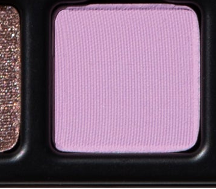 |
| 柔雾冷调丁香紫，哑光 | 浅柔薰衣草，哑光 |

---

### 2. 深紫李棕哑光

两款的官方描述均为 "deep elderberry purple-brown, matte"，色调极为接近；Châtelet 偏暖红调黑莓紫，三者同属深暗哑光。

| 流辉 L12 · Prunelle | 夜曲 N12 · Nocturna | 紫罗兰 Vi3 · Châtelet |
|:---:|:---:|:---:|
|  | 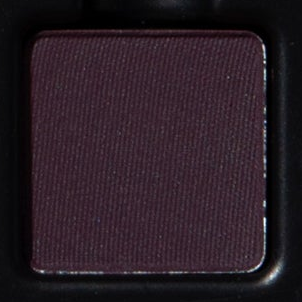 | 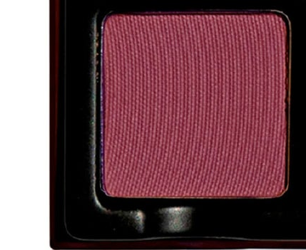 |
| 深接骨木紫棕，哑光 | 深接骨木紫棕，哑光 | 浓郁黑莓紫，哑光（偏暖红调）|

---

### 3. 暖调裸粉哑光

两款均为暖调浅裸粉哑光，色调极近；Reine-des-Prés 略偏桃粉，Pétaline 略偏奶白粉。

| 流辉 L1 · Pétaline | 暮光 V2 · Reine-des-Prés |
|:---:|:---:|
|  | 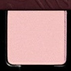 |
| 浅冷调裸粉，哑光 | 柔和暖调裸粉，哑光 |

---

## 二、同系相似

### 4. 铜棕金属闪

两款同为暖调铜棕金属闪；Améthyste 带玫瑰金调，Sariette 更偏纯铜色。

| 流辉 L3 · Améthyste | 暮光 V5 · Sariette |
|:---:|:---:|
|  | 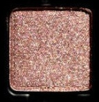 |
| 古铜玫瑰金闪，缎光 | 暖铜棕金属闪 |

---

### 5. 深紫偏光缎

同为带蓝移的深紫偏光缎；Violine 更亮更偏蓝紫，Pensée 更深更偏黑李紫，Verrerie 为午夜紫底带蓝绿双偏光。

| 流辉 L6 · Violine | 暮光 V6 · Pensée | 紫罗兰 Vi2 · Verrerie |
|:---:|:---:|:---:|
|  | 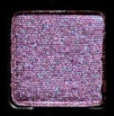 | 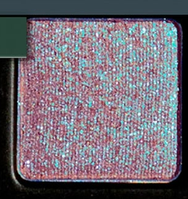 |
| 深紫蓝偏光，缎光，色调较亮 | 深李紫蓝偏光，缎光，色调更深 | 午夜紫，蓝绿双偏光，metallic |

---

### 6. 粉紫闪色

同系粉紫金属闪色；Opaline 最浅最轻透，Ipomée 最饱和，Belle de Nuit 底色较深，Serpentine 在最暗的深紫底上呈现棱彩闪光。

| 流辉 L7 · Opaline | 流辉 L8 · Ipomée | 暮光 V11 · Belle de Nuit | 夜曲 N6 · Serpentine |
|:---:|:---:|:---:|:---:|
|  |  | 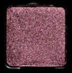 | 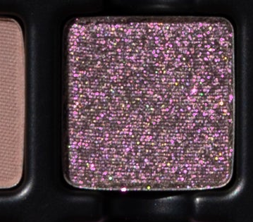 |
| 薰衣草蓝紫偏光，轻透 | 鲜亮粉紫棱彩闪，饱和 | 深调粉紫金属闪 | 深暗底+棱彩银粉闪 |

---

### 7. 灰雾紫哑光渐层

四款同属"灰雾冷调紫/豆沙"哑光，依深浅成梯度：Mauve des Bois 最浅偏玫瑰，Couperin 柔雾灰紫（带金粉混闪），Iantha 居中偏紫，Sureau 最深偏烟灰紫。

| 暮光 V3 · Mauve des Bois | 紫罗兰 Vi1 · Couperin | 夜曲 N7 · Iantha | 流辉 L10 · Sureau |
|:---:|:---:|:---:|:---:|
| 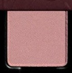 | 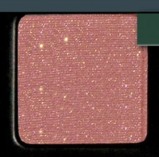 | 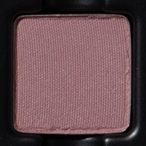 |  |
| 最浅，灰雾玫瑰豆沙 | 柔雾灰紫，混闪哑光 | 中调，灰雾冷调紫 | 最深，烟熏冷灰紫 |

---

### 8. 暖调中灰褐哑光

三款同属暖-中调豆沙/灰褐哑光；Charoïte 最粉最浅，Liatris 居中，Silène Noctiflore 最中性偏米棕。

| 流辉 L11 · Charoïte | 暮光 V10 · Liatris | 夜曲 N8 · Silène Noctiflore |
|:---:|:---:|:---:|
|  | 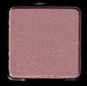 | 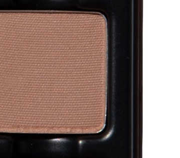 |
| 最浅，冷调石感裸玫瑰 | 中调，暖调豆沙灰褐 | 中调，中性米棕灰褐 |

---

### 9. 丁香紫家族（亮 vs 灰雾）

Cendres Lilas 与 Lilasé / Fleur de Nuit 同属丁香紫，但 Cendres Lilas 明显更低饱和、更灰雾，适合烟熏底色；另两款更适合鲜亮妆效。

| 流辉 L5 · Lilasé | 夜曲 N10 · Fleur de Nuit | 暮光 V9 · Cendres Lilas |
|:---:|:---:|:---:|
|  |  | 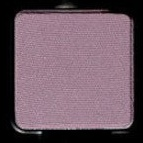 |
| 亮丁香紫 | 亮丁香紫（同 L5） | 灰雾丁香紫，更低饱和 |

---

## 三、各盘独有色

### 流辉 Lumière 独有

| L2 · Orchidée | L4 · Taupeline | L9 · Prisme |
|:---:|:---:|:---:|
|  |  |  |
| 浅花瓣粉，洋红反光，缎光 | 浅冷调裸灰褐，哑光 | 裸玫瑰豆沙，强蓝偏光，缎光 |

---

### 夜曲 Nocturne 独有

| N1 · Plume | N2 · Violetine | N3 · Chimère |
|:---:|:---:|:---:|
| 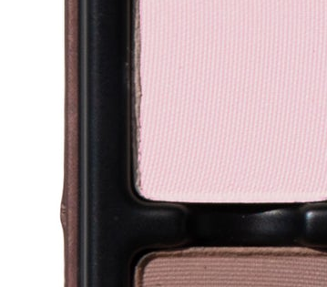 | 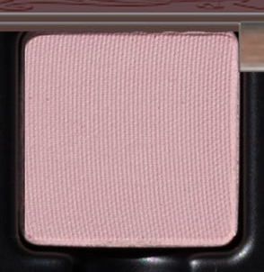 | 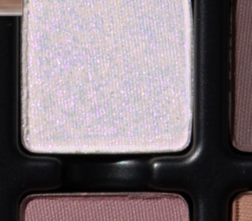 |
| 浅冷调裸粉（比 L1 更偏薰衣草） | 浅玫粉，哑光 | 近白珍珠双偏光，极轻透 |

| N4 · Cendrée | N5 · Astraea | N6 · Serpentine | N9 · Gris Fumé | N11 · Mûre Sauvage |
|:---:|:---:|:---:|:---:|:---:|
| 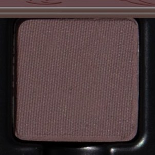 | 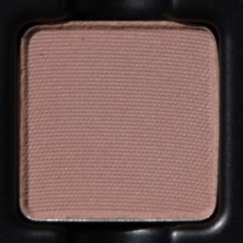 |  | 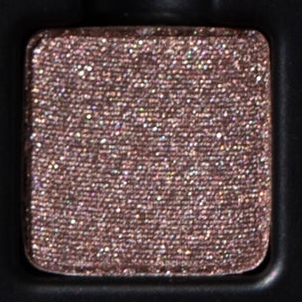 | 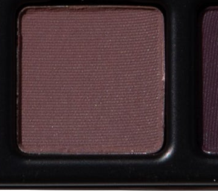 |
| 中调灰米紫，哑光 | 冷调中灰棕，哑光 | 深紫底棱彩闪（见 §6） | 烟熏铜棕，银闪光 | 深可可棕，哑光 |

---

### 暮光 Vespertine 独有

| V1 · Perle d'Or | V4 · Brunelle | V8 · Lys des Pyrénées |
|:---:|:---:|:---:|
| 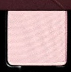 | 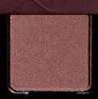 | 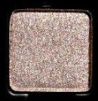 |
| 暖调金珍珠粉，缎光闪 | 深暖调豆沙棕（暖色系唯一深棕） | 柔和香槟金闪（三盘唯一的金调闪色） |

---

### 四色紫罗兰 Violetta 独有

| Vi4 · Perchoir |
|:---:|
| 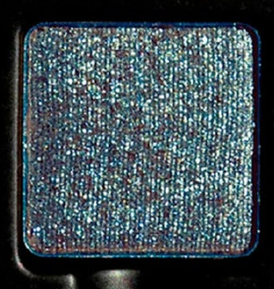 |
| 枪灰蓝绿，metallic pearl（全系唯一的枪灰色调）|

---

## 四、速查总表

| 色系 | 流辉 Lumière | 夜曲 Nocturne | 暮光 Vespertine | 四色紫罗兰 Vi |
|---|---|---|---|---|
| 暖调裸粉哑光 | **L1 Pétaline** | — | **V2 Reine-des-Prés** | — |
| 冷调浅粉哑光 | — | N1 Plume, N2 Violetine | — | — |
| 浅粉缎光 / 反光 | L2 Orchidée | — | V1 Perle d'Or（金珍珠）| — |
| 铜棕金属闪 | **L3 Améthyste** | — | **V5 Sariette** | — |
| 浅冷裸灰褐哑光 | L4 Taupeline | — | — | — |
| 亮丁香紫哑光 | **L5 Lilasé** | **N10 Fleur de Nuit** | — | — |
| 深紫蓝偏光缎 | **L6 Violine**（浅亮）| — | **V6 Pensée**（深暗）| Vi2 Verrerie（双偏光）|
| 浅薰衣草偏光 | L7 Opaline | N3 Chimère（近白）| — | — |
| 粉紫金属闪 | **L8 Ipomée**（鲜亮）| N6 Serpentine（深暗）| **V11 Belle de Nuit** | — |
| 裸玫瑰偏光缎 | L9 Prisme（强蓝闪）| — | — | — |
| 灰雾紫哑光（浅） | — | — | V3 Mauve des Bois | Vi1 Couperin（混闪）|
| 灰雾紫哑光（中） | — | N7 Iantha | — | — |
| 灰雾紫哑光（深）| L10 Sureau | — | — | — |
| 灰雾丁香紫哑光 | — | — | V9 Cendres Lilas | — |
| 暖中调豆沙灰褐哑光 | L11 Charoïte | N8 Silène Noctiflore | V10 Liatris | — |
| 深暖棕哑光 | — | N11 Mûre Sauvage | V4 Brunelle | — |
| 深接骨木紫棕哑光 | **L12 Prunelle** | **N12 Nocturna** | V12 Burple Bleuet（偏蓝紫）| Vi3 Châtelet（偏暖红）|
| 香槟金闪 | — | — | V8 Lys des Pyrénées | — |
| 中调灰米紫哑光 | — | N4 Cendrée | — | — |
| 冷灰棕哑光 | — | N5 Astraea | — | — |
| 烟熏铜棕闪 | — | N9 Gris Fumé | — | — |
| 枪灰蓝绿金属珠光 | — | — | — | Vi4 Perchoir |
