# Viseart 12色 中号 杏光流辉盘 Apricotine Lumière Étendu
*发布：2026*

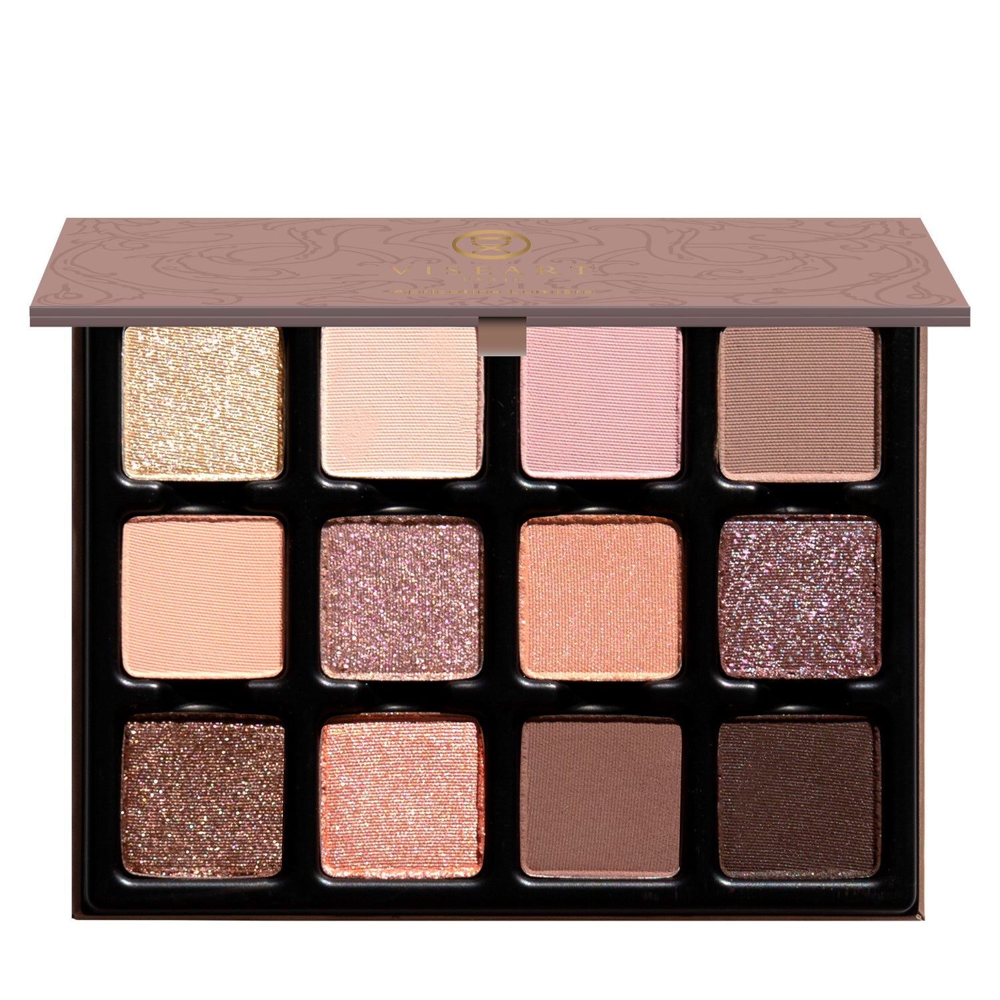

> 灵感源自巴黎甜点铺，杏光流辉盘以 12 个色调演绎沉浸于甜蜜之中的愉悦。柔软奶霜、糖渍杏桃与果酱调成蓬松哑光、冰霜缎光与闪耀亮光，再淋上随动作折射光芒的双色流光。浓郁焦糖铜色与奶油巧克力拿破仑交融，点燃诱人的余晖。

> *Délice! Inspired by Parisian pâtisseries, Apricotine Lumière Étendu evokes the pleasure of sweet indulgence. Soft creams, sugared fruits, and apricot compôte are whipped into chiffon-soft mattes, iced satins, and shimmery toppers, drizzled with duochromatic icing that catches the light when you move. Brûléed bronzes and glowing creamy chocolate puff pastry melt and ignite a seductive lingering afterglow.*

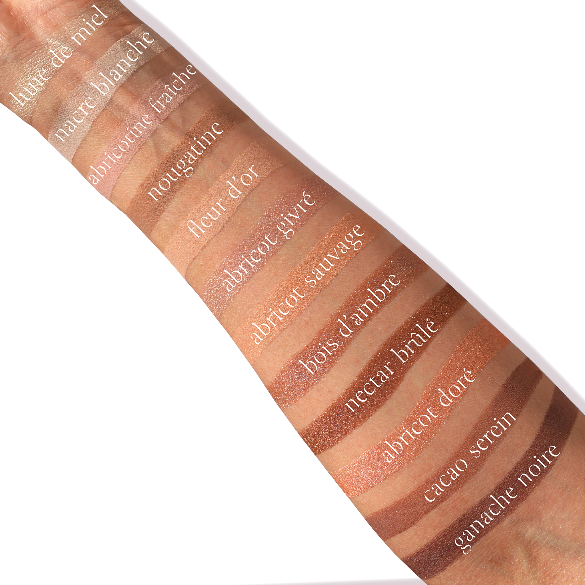
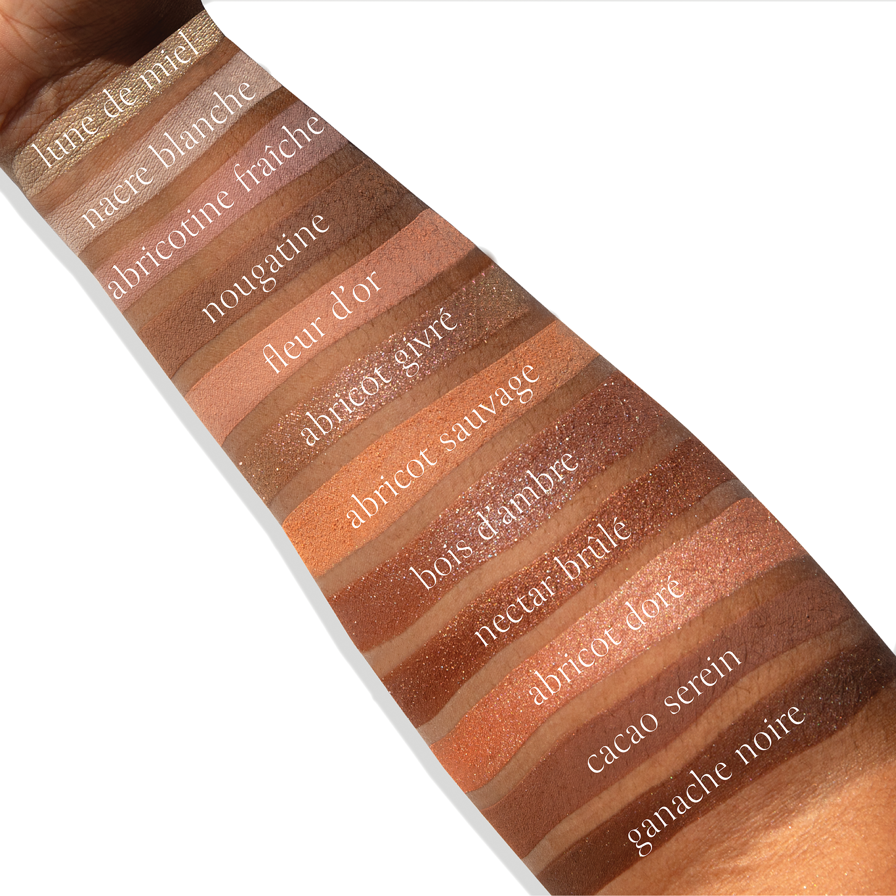

## Shade 1: Lune de Miel — Light, citron champagne with a shimmer finish.
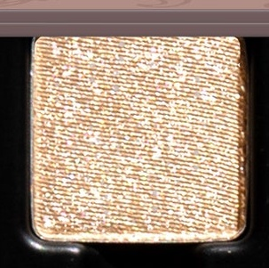

Use: Use this citron champagne shade as an all-over lid colour, to highlight the brow bone and inner corners of the eyes, or in the center of the eyes for a burst of luminosity. Wear with shades ‘Nacre Blanche’ and ‘Abricot Givré’ for a softly luminous look, touched with patisserie warmth. Apply with a brush for your desired level of intensity.

##### 色号 1：蜜月光 (Lune de Miel) —— 浅柠香槟色，闪光质地。
用途：可作全眼铺色，用于眉骨和眼头提亮，或点在眼中位置增强光感。与 `Nacre Blanche` 和 `Abricot Givré` 搭配，可呈现带法式甜点暖意的柔亮妆效。可用刷具按需叠加显色度。

## Shade 2: Nacre Blanche — Soft pearl crème with a matte finish.
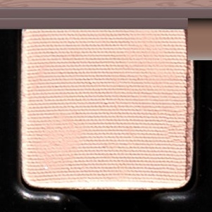

Use: Use this soft pearl crème shade as an all-over lid colour, to highlight the brow bone and inner corners of the eyes, or as an adjustor tone above or below complementary shades. Wear with shades ‘Fleur d’Or’ and ‘Abricot Sauvage’ for a soft, peach-lit eye, kissed by French morning light. Apply with a brush for your desired level of intensity.

##### 色号 2：白珠光 (Nacre Blanche) —— 柔和珍珠奶霜色，哑光质地。
用途：可作全眼铺色，用于眉骨和眼头提亮，或作为互补色上下方的调和色。与 `Fleur d’Or` 和 `Abricot Sauvage` 搭配，可营造法式晨光轻吻般的柔和蜜桃眼妆。可用刷具按需叠加显色度。

## Shade 3: Abricotine Fraîche — Light nude pink with a matte finish.
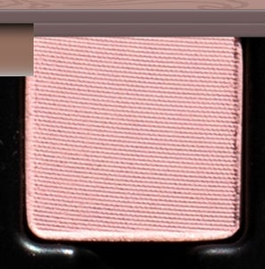

Use: This nude light pink shade can be used as an all-over lid colour, to highlight the brow bone and inner corners of the eyes, or as an adjustor tone above or below complementary shades. Pair with shades ‘Nougatine’ and ‘Bois d’Ambre’ for a rosewood nude eye look, reminiscent of diffused Parisian light at dusk. Apply with a brush for your desired level of intensity.

##### 色号 3：鲜杏粉 (Abricotine Fraîche) —— 浅裸粉色，哑光质地。
用途：可作全眼铺色，用于眉骨和眼头提亮，或作为互补色上下方的调和色。与 `Nougatine` 和 `Bois d’Ambre` 搭配，可呈现暮色巴黎般柔散光线中的玫瑰木裸妆感。可用刷具按需叠加显色度。

## Shade 4: Nougatine — Light, taupe fawn brown with a matte finish.
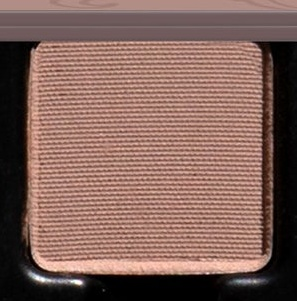

Use: This light, taupe fawn brown shade can be used as an all-over lid colour, as a base tone beneath complementary shades, or as a transitional shade to build soft depth and dimension. Pair with shades ‘Nectar Brûlé’ and ‘Cacao Serein’ for a decadent trio of cocoa-dusted browns, silken, and richly indulgent. Apply with a brush for your desired level of intensity.

##### 色号 4：牛轧糖 (Nougatine) —— 浅灰褐小鹿棕，哑光质地。
用途：可作全眼铺色、互补色下方的打底色，或作为过渡色叠出柔和深度与层次。与 `Nectar Brûlé` 和 `Cacao Serein` 搭配，可组成丝滑浓郁的可可棕三重奏。可用刷具按需叠加显色度。

## Shade 5: Fleur d’Or — Soft, beige-pink crème with a matte finish.
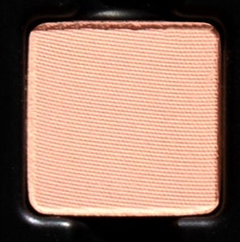

Use: This soft, beige-pink crème shade can be used as an all-over lid colour, to highlight the brow bone and inner corners of the eyes, or as an adjustor tone above or below complementary shades. It can also be used as a blush on light to medium complexions. Pair with shades ‘Abricot Sauvage’ and ‘Abricot Doré’ for a sumptuous trio of peach tones, soft-matte and gently glazed. Apply with a brush for your desired level of intensity.

##### 色号 5：金杏花 (Fleur d’Or) —— 柔和米粉奶霜色，哑光质地。
用途：可作全眼铺色，用于眉骨和眼头提亮，或作为互补色上下方的调和色；浅至中等肤色也可作腮红使用。与 `Abricot Sauvage` 和 `Abricot Doré` 搭配，可呈现柔雾又微釉感的丰润蜜桃色调。可用刷具按需叠加显色度。

## Shade 6: Abricot Givré — Nude plum-rose quartz with silver, pink, and gold duochromatic flecks.
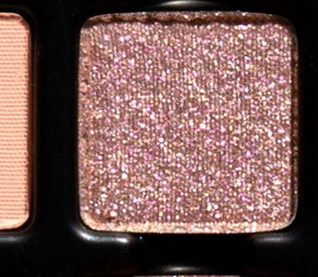

Use: This nude rose quartz shade can be used as an all-over lid colour, placed at the center of the lid for a touch of luminosity, or worn in the inner corners of the eyes for a kiss of brightness. For a high-shine, foiled effect, use with a mixing medium or add to gloss for a dewy, glistening finish. Wear with shades ‘Abricot Sauvage’ and ‘Bois d’Ambre’ for a shimmering velvet peach, second-skin effect.

##### 色号 6：霜杏辉 (Abricot Givré) —— 裸梅玫瑰石英色，带银、粉、金双偏光闪片。
用途：可作全眼铺色，点在眼皮中央增强光感，或用于眼头提亮。搭配调和液可获得更强烈的箔光效果，也可混入唇蜜带出水润闪泽。与 `Abricot Sauvage` 和 `Bois d’Ambre` 搭配，可呈现带天鹅绒质感的贴肤蜜桃微闪效果。

## Shade 7: Abricot Sauvage — Soft, sugared peach with a satin finish.
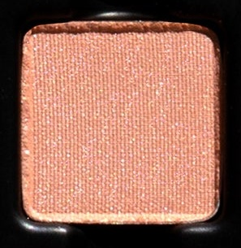

Use: This soft, sugared peach shade can be used as an all-over lid colour, to highlight the brow bone and inner corners of the eyes, as a blush on light to medium complexions, or as a highlighter on medium to deep complexions. Pair with shades ‘Abricotine Fraîche’ and ‘Fleur d’Or’ for a decadent look with brûléed peach warmth. Apply with a brush for your desired level of intensity.

##### 色号 7：野杏桃 (Abricot Sauvage) —— 柔和糖霜蜜桃色，缎光质地。
用途：可作全眼铺色，用于眉骨和眼头提亮；浅至中等肤色可作腮红，中等至深肤色可作高光。与 `Abricotine Fraîche` 和 `Fleur d’Or` 搭配，可呈现焦糖蜜桃般的丰润暖感。可用刷具按需叠加显色度。

## Shade 8: Bois d’Ambre — Rosewood taupe with a blue, pink, and gold duochromatic finish.
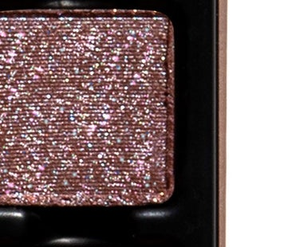

Use: This duochromatic rosewood shade can be worn alone for a wash of brilliant luminosity or layered over complementary tones to accentuate its duochromatic dimension. For a high-shine, foiled effect, use with a mixing medium. It can also be mixed with a gloss for a wet, prismatic look or used as a highlighter. Pair with shades “Abricot Givré” and “Lune de Miel” for a tantalizing glaze of sugared sweetness. Apply with a brush for your desired level of intensity.

##### 色号 8：琥珀木 (Bois d’Ambre) —— 玫瑰木灰褐色，带蓝、粉、金双偏光光泽。
用途：可单独使用呈现明亮光泽，也可叠加在互补色上强化双偏光层次。搭配调和液可获得更强烈的箔光效果，也可与唇蜜混合营造湿润棱彩感，或作高光使用。与 `Abricot Givré` 和 `Lune de Miel` 搭配，可带出糖釉般诱人的甜润光感。可用刷具按需叠加显色度。

## Shade 9: Nectar Brûlé — Honeyed bronze with a metallic finish.
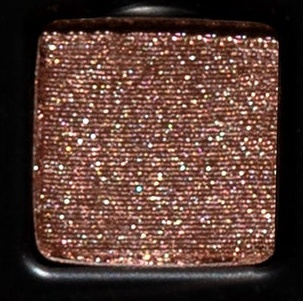

Use: This honeyed bronze shade can be used as an all-over lid colour, to build depth and dimension in the outer corners of the eyes, or as an eyeliner on all complexions. Use with a mixing medium for a foiled effect. Wear with shades ‘Cacao Serein’ and ‘Ganache Noire’ for a shimmering caramelized look, refined with pâtisserie richness. Apply with a brush for your desired level of intensity.

##### 色号 9：焦蜜铜 (Nectar Brûlé) —— 蜜糖古铜色，金属质地。
用途：可作全眼铺色，用于眼尾加深层次，也适合所有肤色作眼线色。搭配调和液可获得箔光效果。与 `Cacao Serein` 和 `Ganache Noire` 搭配，可呈现带法式甜点浓郁感的焦糖微闪妆效。可用刷具按需叠加显色度。

## Shade 10: Abricot Doré — Iced apricot glaze with a satin finish.
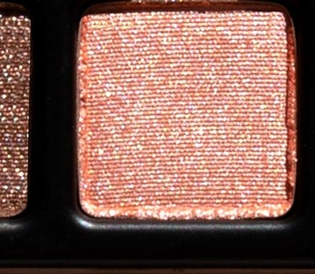

Use: This iced apricot shade can be used as an all-over lid colour, to highlight the brow bone and inner corners of the eyes, as a blush on light to medium complexions, or as a highlighter on medium to deep complexions. Use with a mixing medium for a foiled effect or mix into gloss for a luminous sheen. Pair with shades ‘Abricotine Fraîche’ and ‘Abricot Givré’ for a glacé peach look, cool and softly luminous. Apply with a brush for your desired level of intensity.

##### 色号 10：金杏釉 (Abricot Doré) —— 冰杏釉光色，缎光质地。
用途：可作全眼铺色，用于眉骨和眼头提亮；浅至中等肤色可作腮红，中等至深肤色可作高光。搭配调和液可获得箔光效果，也可混入唇蜜增添明亮釉泽。与 `Abricotine Fraîche` 和 `Abricot Givré` 搭配，可呈现清凉柔亮的冰蜜桃妆感。可用刷具按需叠加显色度。

## Shade 11: Cacao Serein — Midtone brown-plum with a matte finish.
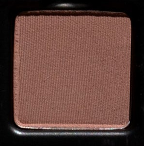

Use: This midtone brown-plum shade can be used as an all over lid colour, as a transition shade to build out the crease and socket, as a soft liner, or as a base tone beneath complementary tones for increased depth and saturation. Pair with shades ‘Nectar Brûlé’ and ‘Ganache Noire’ for a rich and sumptuous look inspired by the indulgence of a chocolate ganache dessert. Apply with a brush for your desired level of intensity.

##### 色号 11：静夜可可 (Cacao Serein) —— 中调棕梅子色，哑光质地。
用途：可作全眼铺色、眼窝过渡色、柔和眼线色，或作为互补色下方的打底加深色，增强深度与饱和度。与 `Nectar Brûlé` 和 `Ganache Noire` 搭配，可呈现如巧克力甘纳许甜点般浓郁丰厚的妆效。可用刷具按需叠加显色度。

## Shade 12: Ganache Noire — Dark cocoa brown with a satin finish.
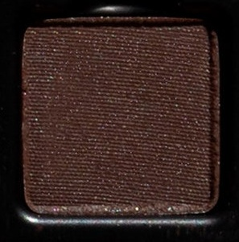

Use: This dark cocoa-brown shade can be used to create depth and dimension in the crease, socket, and lash line. Build up the colour in the outer corners of the eyes for a boldly pigmented finish or use with a mixing medium and liner brush for a graphic finish. Pairs perfectly with ‘Nougatine’ and ‘Bois d’Ambre’ for a richly pigmented, duochromatic look. Use a brush for your desired level of intensity.

##### 色号 12：黑甘纳许 (Ganache Noire) —— 深可可棕色，缎光质地。
用途：适合用于眼窝、轮廓和睫毛根部加深，增强深邃度与立体感。可在眼尾逐步叠加做出高显色效果，也可搭配调和液和眼线刷完成更利落的图形眼线。与 `Nougatine` 和 `Bois d’Ambre` 搭配，可呈现高显色的双偏光深邃妆感。可用刷具按需叠加显色度。
