# Viseart 12色 中号 糖果果仁盘 Bon Bon Praline Étendu
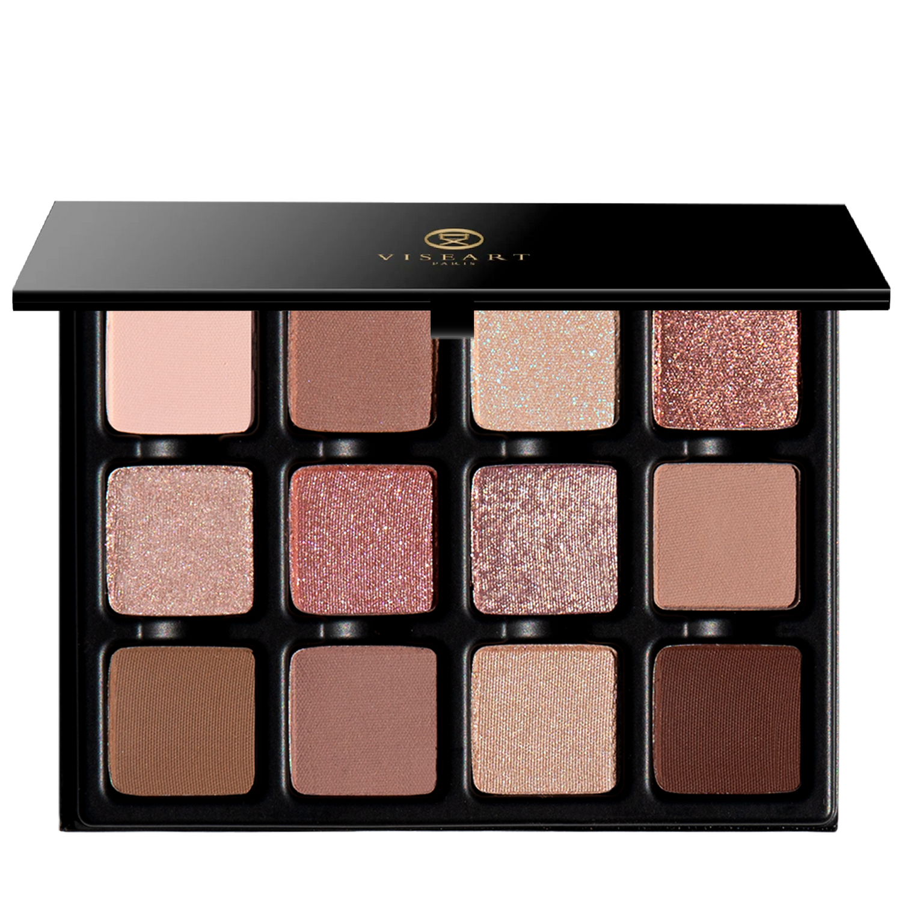

## Shade 1: Nougat Blanc — Light, warm creme taupe with a matte finish. The colour of sun-bleached linen drying on a Provençal windowsill.
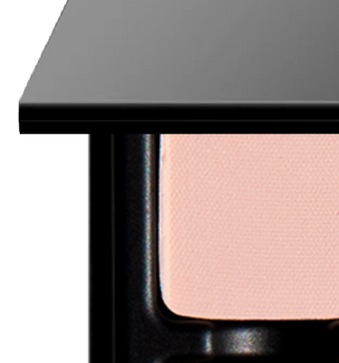

Use: Sweep this warm creme taupe colour across the lid to brighten and create a smooth base for layering, in the crease of the eyes as a transitional hue, or beneath complementary tones. This shade brightens without effort, like the warmth of Riviera sun. Apply with a brush for your desired level of intensity. Pair with shades ‘Sable Fin’ and ‘Calanque’ for a warm, luminous, and impossibly soft finish like the lightest breath of warmth on bare skin.

##### 色号 1：牛轧白 (Nougat Blanc) —— 柔暖奶油灰褐色，哑光质地。像普罗旺斯窗台上被阳光晒白的亚麻布。
用途：可扫满眼皮提亮并作为平滑打底，也可用于眼窝作过渡色，或叠加在互补色下方。此色能轻松提亮，像里维埃拉阳光一样温暖。可用刷具按需叠加显色度。与 `Sable Fin` 和 `Calanque` 搭配，可营造温暖、通透、极致柔和的效果。

## Shade 2: Caramel Salé — Light caramel nude with a subtle shimmery satin finish reminiscent of sun-warmed skin after an afternoon by the sea.
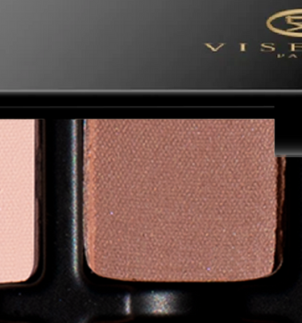

Use: Sweep this light Bretonne caramel shade across the lid for a warm wash of soft radiance, or tap onto the center of the lid to enhance dimension and light. Pairs beautifully with matte, metallic, and satin tones. Apply with a brush for your desired level of intensity. Wear with shades ‘Lin Froissé’ and ‘Sable Fin’ for a sun-warmed bronze glow, undone by sea air!

##### 色号 2：咸焦糖 (Caramel Salé) —— 浅焦糖裸色，带细微缎光闪泽，像午后海边被阳光温热的肌肤。
用途：可扫满眼皮获得温暖柔和的光感，或点在眼皮中央增强立体与亮度。与哑光、金属或缎光色都很合拍。可用刷具按需叠加显色度。与 `Lin Froissé` 和 `Sable Fin` 搭配，可呈现被海风吹散的日晒铜金感。

## Shade 3: Soleil Doré — Sunlit yellow with cool blue reflects and a shimmering topper finish, inspired by the living gold of midday sun on the Côte d’Azur.
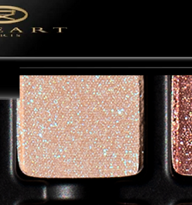

Use: Tap this luminous shade across the lid or onto the center of the eye to create a soft veil of light and dimension. It works beautifully as a shimmering topper layered over matte, metallic, or satin shades. Apply with a brush for a delicate glow or use fingertips to enhance the reflective finish. Pair with shades ‘Nougat Blanc’ and ‘Miel Sauvage’ for a softly illuminated, golden confectionery effect!

##### 色号 3：金日光 (Soleil Doré) —— 沐光黄调，带冷蓝反光与闪耀叠擦质地，灵感来自蔚蓝海岸正午阳光的流金感。
用途：可轻拍满眼或点在眼皮中央，营造柔和光膜与层次。也很适合叠擦在哑光、金属或缎光色之上作闪耀上层。可用刷具获得柔光，或用指腹强化反光效果。与 `Nougat Blanc` 和 `Miel Sauvage` 搭配，可呈现柔亮金色糖果感。

## Shade 4: Cassis Ambré — Bronze-kissed rose gold with a metallic finish, inspired by the rich glow of blackcurrant warmed with amber.
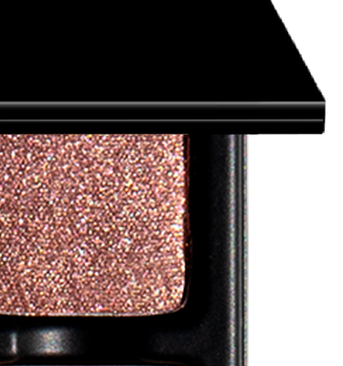

Use: Sweep this luminous rose gold shade across the lid for soft caramelized warmth, or tap onto the center of the eye to enhance depth and dimension. This shade anchors every sun-drenched look with rich complexity. Apply with a brush for your desired level of intensity. Can be used with a mixing medium for an ultra reflective sheen. Pairs perfectly with shades ‘Caramel Salé’ and ‘Nuit Tiède’ for a warm and sculpted rose-bronze look, glowing like a kir royale in the sun.

##### 色号 4：琥珀黑加仑 (Cassis Ambré) —— 带青铜暖意的玫瑰金，金属光泽，灵感来自琥珀加温后的黑加仑。
用途：可扫满眼皮，带出柔和焦糖化暖感，或点在眼皮中央增强深度与立体。这个色号能为日晒妆容增添浓郁层次。可用刷具按需叠加显色度；搭配调和液可获得更强反射光泽。与 `Caramel Salé` 和 `Nuit Tiède` 搭配，可打造温暖而有轮廓的玫瑰铜妆效，像阳光下的 kir royale。

## Shade 5: Lin Froissé — Midtone champagne taupe with a satin finish, inspired by crumpled linen and the colour of warm sand on a slow Riviera morning.
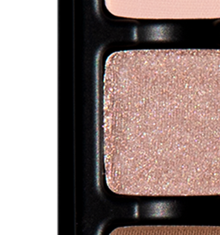

Use: This midtone champagne taupe colour can be used as an all-over base tone, in the center of the lid for dimension and luminosity, or to highlight the browbone and inner corners of the eyes. Can be used with a mixing medium for a high-shine effect. Apply with a brush for your desired level of intensity. Pair with shades ‘Nougat Blanc’ and ‘Calanque’ for a warm and radiant sun-lit glow!

##### 色号 5：皱褶亚麻 (Lin Froissé) —— 中调香槟灰褐色，缎面质地，灵感来自揉皱亚麻与慢节奏里维埃拉清晨的暖沙。
用途：可作全眼打底、点在眼皮中央增强层次与光感，或用于眉骨和眼头提亮。可搭配调和液获得高光泽效果。可用刷具按需叠加显色度。与 `Nougat Blanc` 和 `Calanque` 搭配，可带来温暖通透的日照光感。

## Shade 6: Abricot Confit — Sheer apricot pink with delicate duochrome reflects, and a shimmering topper finish, inspired by sun-ripened apricots caramelised at the edges.
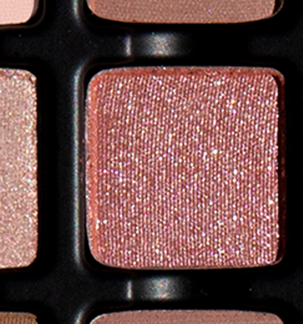

Use: Tap this luminous shade across the lid or onto the center of the eye to create a soft, iridescent wash of pink radiance. This shade is reminiscent of sun-ripened Provençal apricots glowing at a market stall in the south of France. Layers beautifully over matte, metallic, and satin tones to enhance dimension and reflectivity. Apply with a brush for a delicate sheen or with fingertips to intensify the duochromatic effect. Can be used with a mixing medium for an ultra-reflective appearance. Pairs perfectly with shades ‘Caramel Salé’ and ‘Bastia Rose’ for a sun-kissed apricot glow.

##### 色号 6：蜜渍杏桃 (Abricot Confit) —— 清透杏粉色，带细腻双偏光反射与闪亮叠擦质地，灵感来自边缘焦糖化的熟杏。
用途：可轻拍于眼皮或眼皮中央，营造柔和、虹彩般的粉色光泽。像南法市场里熟透的普罗旺斯杏子一样明亮。叠擦在哑光、金属和缎光色上能增强层次与反光。可用刷具获得细致光泽，或用指腹强化双偏光效果；搭配调和液可得到更强反射感。与 `Caramel Salé` 和 `Bastia Rose` 搭配，能做出日晒杏桃光感。

## Shade 7: Sieste Dorée — Light champagne-pink with a high-shine, metallic finish, reminiscent of the warm amber of a golden siesta sunlight pressing through closed shutters.
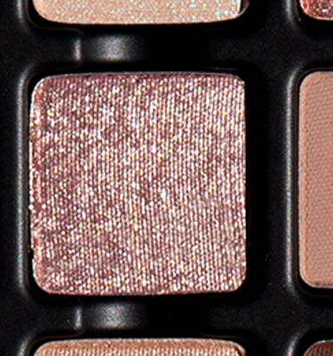

Use: This high-shine, light pink champagne shade can be used as an all-over base lid colour or layered over complementary tones for a refined wash of reflectivity. Combine with a mixing medium for an ultra-foiled effect. This shade can also be mixed into gloss to add a kiss of brilliance to any lip look. Wear with shades ‘Abricot Confit’ and ‘Bastia Rose’ for a soft, honeyed glow of a long afternoon.

##### 色号 7：金午憩 (Sieste Dorée) —— 浅香槟粉色，高光金属质地，像金色午憩时阳光穿过百叶窗时的暖琥珀色。
用途：可作全眼打底色，或叠加在互补色之上形成精致反光层。搭配调和液可获得更强的箔光效果。这一色号也可混入唇蜜，为任何唇妆增添一点闪耀。与 `Abricot Confit` 和 `Bastia Rose` 搭配，可带出悠长午后般的柔蜜光感。

## Shade 8: Sable Fin — Soft sandy taupe with a matte finish, reminiscent of the beaches of Saint-Tropez.
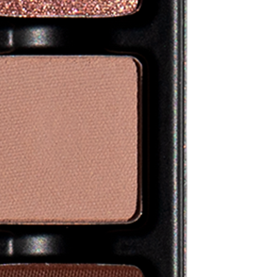

Use: Sweep this soft, sandy taupe shade through the crease to add gentle structure and dimension, or diffuse across the lid for a naturally sculpted wash of colour. Like fine sand at low tide, this elegant neutral is inspired by the warm beaches of the Côte d’Azur. Apply with a brush for your desired level of intensity. Pair with shades ‘Nougat Blanc’ and ‘Caramel Salé’ for a warm Riviera nude glow!

##### 色号 8：细沙 (Sable Fin) —— 柔和沙感灰褐色，哑光质地，像圣特罗佩海滩的细沙。
用途：可扫入眼窝增添轻柔结构与层次，也可铺满眼皮，营造自然雕塑感。像低潮时的细沙一样，这支优雅中性色灵感来自蔚蓝海岸温暖的海滩。可用刷具按需叠加显色度。与 `Nougat Blanc` 和 `Caramel Salé` 搭配，可营造温暖里维埃拉裸感光泽。

## Shade 9: Calanque — Midtone brown with a matte finish, echoing the depth and warmth of Mediterranean cliffside inlets.
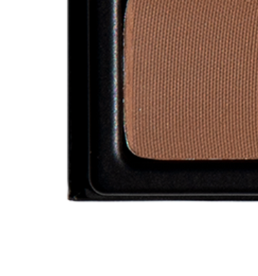

Use: Sweep this rich midtone brown through the crease to add depth and definition, or blend along the outer corner of the eye to softly sculpt and contour. This shade is inspired by the warm stone and shadowed cliffs of the Mediterranean calanques. Apply with a brush for your desired level of intensity. Pairs perfectly with shades ‘Sable Fin’ and ‘Nuit Tiède’ for a sculpted look with shades of stone and sand.

##### 色号 9：海湾岩壁 (Calanque) —— 中调棕色，哑光质地，呼应地中海海湾岩壁的深度与温暖。
用途：可扫入眼窝增加深度与轮廓，或沿眼尾晕染出柔和雕塑感。灵感来自地中海海蚀湾的暖岩与阴影峭壁。可用刷具按需叠加显色度。与 `Sable Fin` 和 `Nuit Tiède` 搭配，可形成石色与沙色交织的雕塑感妆容。

## Shade 10: Bastia Rose — Midtone mauve plum with a matte finish, inspired by sun-softened terracotta rose walls at golden hour in Bastia.
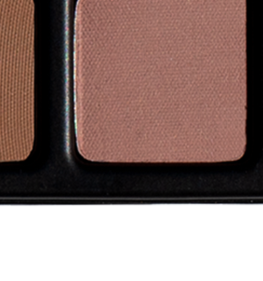

Use: This muted mauve plum shade can be used as an all-over lid colour, beneath complementary tones for increased depth and saturation, or as a transitional tone in the crease and socket. This shade is named for the port city where the light softens every colour it touches. Apply with a brush for your desired level of intensity. Pair with shades ‘Abricot Confit’ and ‘Sieste Dorée’ for a sun-warmed rose look.

##### 色号 10：巴斯蒂亚玫瑰 (Bastia Rose) —— 中调紫灰梅子色，哑光质地，灵感来自巴斯蒂亚金色时刻下被阳光柔化的陶土玫瑰墙。
用途：可作全眼铺色，或作为互补色下方的打底加深色，也可用于眼窝和轮廓位置作过渡。这个色号取名自那座港口城市，光线会柔化它触碰到的一切颜色。可用刷具按需叠加显色度。与 `Abricot Confit` 和 `Sieste Dorée` 搭配，可呈现日晒玫瑰感。

## Shade 11: Miel Sauvage — Warm amber gold with a luminous shimmer finish, inspired by the richness of wild Mediterranean honey.
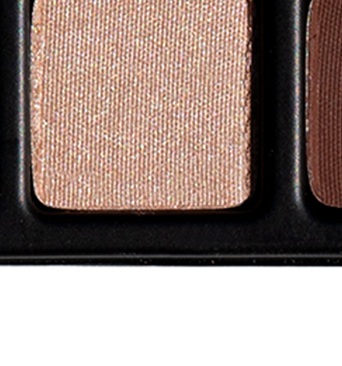

Use: Sweep this radiant amber-gold shade across the lid for a warm wash of shimmering light, or tap onto the center of the eye to enhance depth and dimension. This luminous shade is evocative of warm, ambered honey of lavender maquis and wild garrigue. Apply with a brush for a refined glow or with fingertips to intensify the reflective finish. Pair with shades ‘Nougat Blanc’ and ‘Soleil Doré’ for a sun-drenched, lit from within glow!

##### 色号 11：野花蜜金 (Miel Sauvage) —— 温暖琥珀金，明亮闪光质地，灵感来自野生地中海蜂蜜的丰厚感。
用途：可扫满眼皮形成温暖的闪光层，也可点在眼皮中央增强深度与立体。此色明亮而温润，让人联想到薰衣草灌木与野生灌丛中的暖琥珀蜂蜜。可用刷具打造精致光感，或用指腹强化反射效果。与 `Nougat Blanc` 和 `Soleil Doré` 搭配，可获得由内而外的日晒光泽。

## Shade 12: Nuit Tiède — Deep brown-red with a matte finish, reminiscent of the lingering warmth of a late summer night.
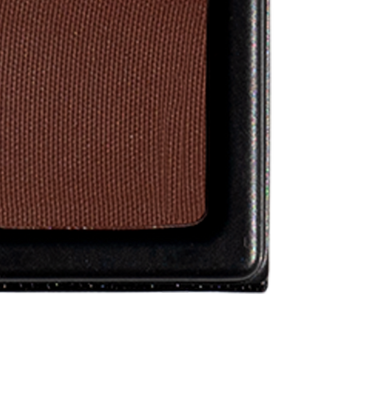

Use: Blend this deep brown-red shade along the outer corner of the eye to create rich depth and definition, or sweep through the crease to intensify dimension and sculpt the eye. Its velvety matte finish grounds luminous and metallic tones while adding warmth and contrast. This shade carries the heat of the day, when the air smells of jasmine and the sea, and the evening refuses to fade. Apply with a brush for your desired level of intensity. Pair with shades ‘Caramel Salé’ and ‘Cassis Ambré’ for a deep, sun-warmed bronze look.

##### 色号 12：温夜 (Nuit Tiède) —— 深棕红色，哑光质地，像盛夏夜晚余温的回荡。
用途：可沿眼尾晕染出浓郁深度与轮廓，或扫入眼窝增强层次并塑形。丝绒哑光质地能托住明亮和金属色，同时增加暖感与对比。这个色号带着白昼残留的热度，空气里仿佛有茉莉和海风的味道，夜色迟迟不肯褪去。可用刷具按需叠加显色度。与 `Caramel Salé` 和 `Cassis Ambré` 搭配，可完成深色、温暖的古铜妆效。