# Viseart 12色 中号 羊绒魅缎盘 Cashmerie Charmeuse Étendu
*发布：2023*

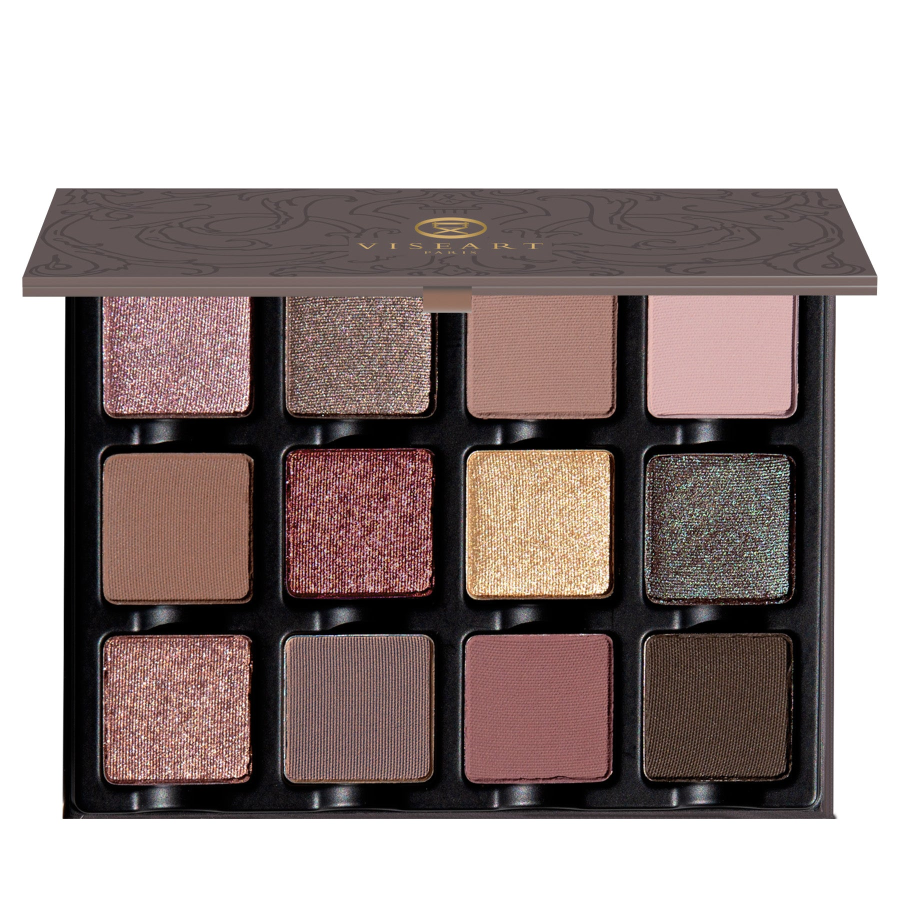

> 羊绒魅缎盘以羊绒与丝绸般的拥抱将你轻轻包裹。灵感源自华丽织物，以银白麂皮灰褐、糖渍紫李、辛香生姜无花果与牛轧糖甜香为叙事，唤起依偎在绯红炉火旁、沉浸于最柔软羊绒毯中的黄昏遐想，将永恒的优雅与静谧凝炼于一盘之中。

> *Cocoon yourself within the embrace of cashmere and silk with Cashmerie Charmeuse Étendu. Inspired by opulent woven fabrics, this palette evokes nuanced luxury with sublime silvery fawnlike taupes, sugared plums, spicy gingered figs, and nougat delights — conjuring reveries of eveningtide nestled by a smouldering crimson fire, snuggled in the softness of your favourite cashmere blanket.*

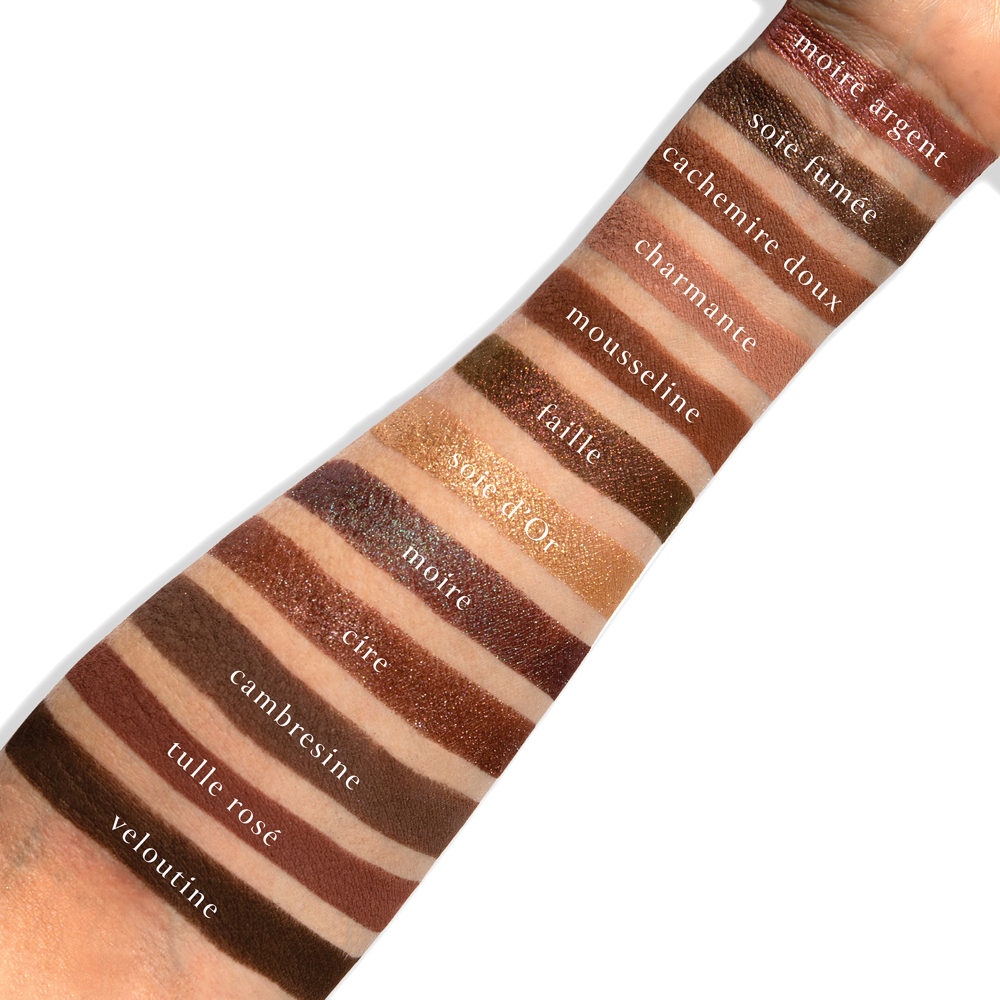
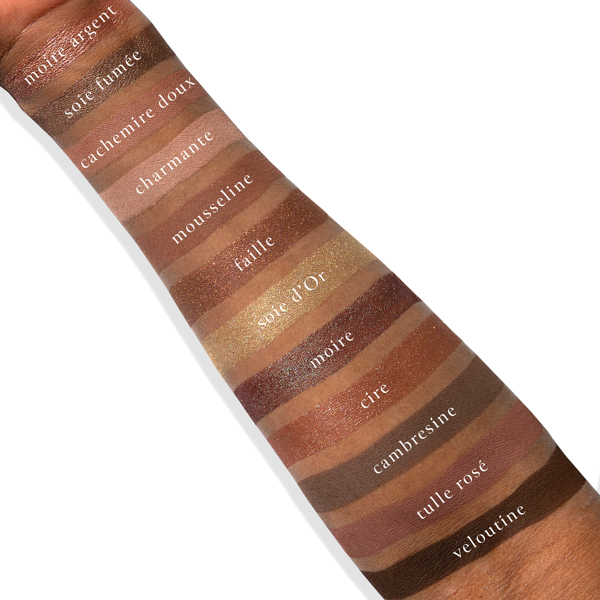

## Shade 1: Moire Argent — Lilac rose with a metallic finish.
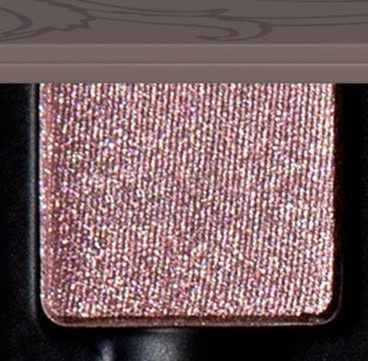

Use: This lilac rose shade can be used as an all over lid colour, in the inner corners of the eyes for light and dimension, or as a base tone beneath complementary tones for increased depth and saturation on all complexions. Pair with shades ‘Soie Fumée’ and ‘Cambresine’ for a soft, cool-toned smokey look. Apply with fingertips or a dense brush for your desired level of intensity or use with a mixing medium for a foiled effect.

##### 色号 1：银光云纹 (Moire Argent) —— 淡紫玫瑰色，金属光泽。
用途：可作全眼铺色、眼头提亮，或作为其他互补色下方的打底色，增强所有肤色的层次感与饱和度。与 `Soie Fumée`、`Cambresine` 搭配，可打造柔和偏冷调的烟熏效果。可用指腹或扎实眼影刷叠加至理想显色度，也可搭配调和液获得更强的金属箔感。

## Shade 2: Soie Fumée — Midtone smokey pewter thistle with a metallic finish.
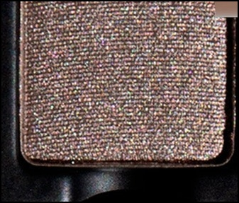

Use: This midtone shade can be used as an all over base colour, layered over complementary tones for a burst of high shine shimmer, or used as a liner for subtle definition. Pairs perfectly with shades ‘Cambresine’ and ‘Veloutine’ for a glimmering grey soft smokey eye! Apply with fingertips or a dense brush for your desired level of intensity or use with a mixing medium for a foiled effect.

##### 色号 2：烟熏缎灰 (Soie Fumée) —— 中调烟熏锡灰蓟紫色，金属光泽。
用途：可作大面积底色，叠加在互补色之上增添高亮闪泽，也可作为眼线色带来柔和轮廓。与 `Cambresine`、`Veloutine` 搭配，适合打造带灰调光泽的柔和烟熏眼妆。可用指腹或扎实眼影刷上色，也可搭配调和液营造更强烈的箔光效果。

## Shade 3: Cachemire Doux — Midtone mauve plum with a matte finish.
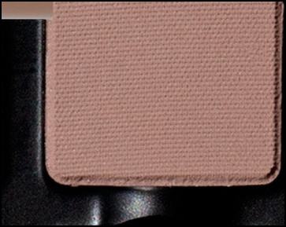

Use: This muted mauve plum shade can be used as an all over lid colour, beneath complementary tones for increased depth and saturation, or as a transitional tone in the crease and socket. Mix this hue with other matte shades to create 12 new shades. Pair with ‘Charmante’ and ‘Mousseline’ for a sophisticated mauve matte finish. Apply with fingertips or a dense brush for your desired level of intensity.

##### 色号 3：柔雾羊绒紫 (Cachemire Doux) —— 中调灰紫梅色，哑光质地。
用途：可作全眼铺色、互补色下方的打底加深色，或用于眼窝与轮廓位置作为过渡色。与盘中其他哑光色混合，可延展出更多层次变化。搭配 `Charmante` 与 `Mousseline`，可完成细腻高级的雾面紫调眼妆。可用指腹或扎实眼影刷叠加至理想显色度。

## Shade 4: Charmante — Light mauve hyacinth nude with a matte finish.
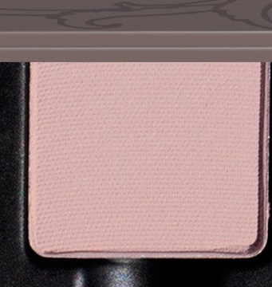

Use: This light nude shade can be used as an all over lid colour, in the inner corners of the eyes for light and dimension, in the brow bone for deeper skin tones, or as a base tone beneath complementary tones for increased depth and saturation on all complexions. Pair with shades ‘Cachemire Doux’ and ‘Cire’ for a sophisticated shimmery sheen! Apply with fingertips or a dense brush for your desired level of intensity.

##### 色号 4：迷人浅藕 (Charmante) —— 浅藕紫裸色，哑光质地。
用途：可作全眼铺色、眼头提亮，深肤色也可用于眉骨提亮；亦可作为互补色下方的打底色，增强整体层次与饱和度。与 `Cachemire Doux`、`Cire` 搭配，可呈现精致柔亮的细闪光泽效果。可用指腹或扎实眼影刷叠加至理想显色度。

## Shade 5: Mousseline — Burnt-plum with a matte finish.
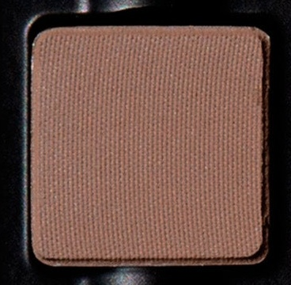

Use: This midtone shade can be used as an all over lid colour, as a transition shade to build out the crease and socket, as a soft liner, or as a base tone beneath complementary tones for increased depth and saturation on all complexions. Mix this hue with other matte shades to create 12 new shades. Pair with shades ‘Cachemire Doux’ and ‘Cire’ for a sophisticated shimmery sheen! Apply with fingertips or a dense brush for your desired level of intensity.

##### 色号 5：薄纱梅棕 (Mousseline) —— 焦梅子色，哑光质地。
用途：可作全眼铺色、眼窝过渡色、柔和眼线色，或作为互补色下方的打底加深色，增强整体层次与饱和度。与其他哑光色混合，可调出更多延伸色阶。搭配 `Cachemire Doux`、`Cire`，可打造带柔亮光泽的精致紫棕调眼妆。可用指腹或扎实眼影刷叠加至理想显色度。

## Shade 6: Faille — Metallic burgundy-brown with a gold, amethyst duochromatic flip
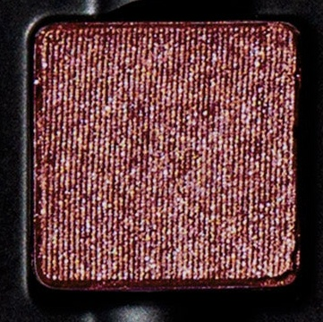

Use: This metallic duochromatic shade can be worn alone for a striking monochromatic look or layered on top of complementary tones for a high sheen shift of shimmering pigment. Can also be used as liner or in conjunction with a mixing medium for a foiled effect. Pair with shades ‘Charmante’ and ‘Moire’ for a duochromatic dose of dazzling dimension. Apply with a brush for your desired level of intensity.

##### 色号 6：缎纹酒棕 (Faille) —— 金属酒红棕，带金色与紫水晶色双偏光。
用途：可单独使用打造醒目的单色妆效，也可叠加在互补色之上，呈现高光泽偏光闪烁。也可用作眼线，或搭配调和液打造更强烈的金属箔感。与 `Charmante`、`Moire` 搭配，可强化层次丰富的双偏光效果。建议使用刷具按需叠加显色度。

## Shade 7: Soie d'Or — Pale antique bullion gold with a metallic finish.
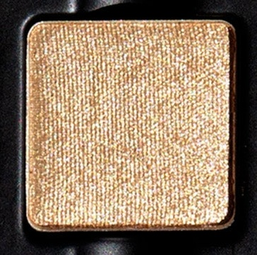

Use: This metallic shade can be worn as an all over lid colour, in the center of the lids for a burst of reflective shimmer, in the corner of the eyes as a highlight, or layered on top of complementary tones for a high sheen finish. Mix this shade with water for a wash of color or combine with a mixing medium for a foiled effect. Pair with shades ‘Charmante’ and ‘Moire’ for a luminous duochromatic effect. Use a brush to create exacting looks.

##### 色号 7：金缎流光 (Soie d'Or) —— 浅古董金色，金属光泽。
用途：可作全眼铺色、点缀眼皮中央增强反光，也可用于眼角提亮，或叠加在互补色之上提升整体光泽感。可与清水调和获得轻透染色感，或搭配调和液营造更明显的箔光效果。与 `Charmante`、`Moire` 搭配，可呈现明亮通透的双偏光妆效。适合用刷具精确上色。

## Shade 8: Moire — Tyrian peacock-red with a duochromatic finish.
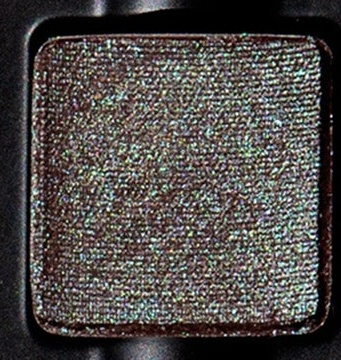

Use: This duochromatic shade can be worn alone for a striking monochromatic look or layered on top of complementary tones for a high sheen shift of shimmering pigment. Can also be used as liner or in conjunction with a mixing medium for a foiled effect. Pair with shades ‘Faille’ and ‘Moire’ for a duochromatic dose of dazzling dimension. Apply with fingertips or a dense brush for your desired level of intensity.

##### 色号 8：孔雀酒红 (Moire) —— 提尔紫孔雀红，双偏光质地。
用途：可单独使用打造强烈单色妆效，也可叠加在互补色之上，呈现高光泽偏光变化。也可用作眼线，或搭配调和液强化金属箔感。与 `Faille` 搭配尤其适合营造层次鲜明的双偏光效果。可用指腹或扎实眼影刷按需叠加显色度。

## Shade 9: Cire — Light bark lilac taupe with a metallic finish.
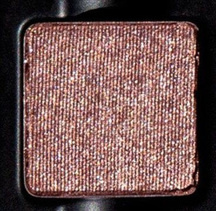

Use: This metallic shade can be worn as an all over lid colour, or layered on top of complementary tones for an everyday nude satin sheen finish. Mix this shade with water for a wash of colour or combine with a mixing medium for a foiled effect. Pair with shades ‘Cambresine’ and ‘Tulle Rosé’ for a nude rose eye look! Apply with fingertips or a dense brush for your desired level of intensity.

##### 色号 9：蜡灰藕棕 (Cire) —— 浅树皮灰藕棕色，金属光泽。
用途：可作全眼铺色，也可叠加在互补色之上，打造日常裸调缎光眼妆。可与清水调和呈现轻透染色感，或搭配调和液获得更明显的箔光效果。与 `Cambresine`、`Tulle Rosé` 搭配，可完成温柔裸玫瑰眼妆。可用指腹或扎实眼影刷按需叠加显色度。

## Shade 10: Cambresine — Midtone greige stone hue with a matte finish
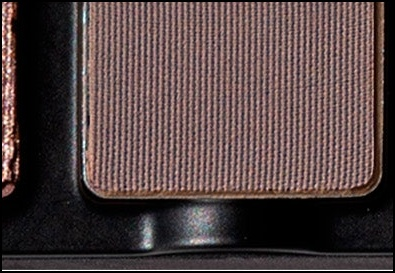

Use: This midtone shade can be used as an all over lid colour, as a transition shade to build out the crease and socket, as a soft liner, or as a base tone beneath complementary tones for increased depth and saturation. Can be used in brows. Mix this hue with other matte shades to create 12 new shades.Pairs perfectly with ‘Soie Fumée’ and ‘Veloutine’ for a shimmering smoked satin look. Apply with fingertips or a dense brush for your desired level of intensity.

##### 色号 10：灰石褶影 (Cambresine) —— 中调灰米石色，哑光质地。
用途：可作全眼铺色、眼窝过渡色、柔和眼线色，或作为互补色下方的打底加深色，增强层次与饱和度；也可用于眉部。与其他哑光色混合，可延展出更多色调变化。搭配 `Soie Fumée`、`Veloutine`，适合打造带缎光感的烟熏妆效。可用指腹或扎实眼影刷叠加至理想显色度。

## Shade 11: Tulle Rosé — Midtone heather-brown with a matte finish
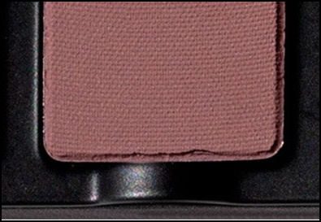

Use: This midtone shade can be used as an all over lid colour, as a transition shade to build out the crease and socket, as a soft liner, or as a base tone beneath complementary tones for increased depth and saturation. Mix this hue with other matte shades to create 12 new shades. Pairs perfectly with ‘Faille’ and ‘Veloutine’ for a shimmering for a luxurious merlot look! Apply with fingertips or a dense brush for your desired level of intensity.

##### 色号 11：玫瑰薄纱棕 (Tulle Rosé) —— 中调石楠棕色，哑光质地。
用途：可作全眼铺色、眼窝过渡色、柔和眼线色，或作为互补色下方的打底加深色，增强层次与饱和度。与其他哑光色混合，可延展出更多色调变化。搭配 `Faille`、`Veloutine`，可打造带闪耀光泽的醇厚梅洛酒红调眼妆。可用指腹或扎实眼影刷叠加至理想显色度。

## Shade 12: Veloutine — Espresso bitter brown with a matte finish
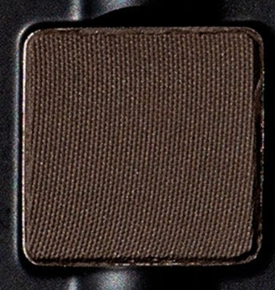

Use: This espresso bitter brown shade can be used to create depth and dimension in the crease, socket and lash line. Build up the colour in the outer corners of the eyes for a boldly pigmented finish or use a mixing medium and liner brush for a graphic finish. Pairs perfectly with ‘Faille’ and ‘Moire’ for a richly pigmented duochromatic look. Use a brush for your desired level of intensity.

##### 色号 12：丝绒浓咖 (Veloutine) —— 浓缩苦咖啡棕，哑光质地。
用途：适合用于加深眼窝、轮廓与睫毛根部，增强整体立体度与深邃感。可在眼尾逐步叠加，打造更浓郁饱和的显色效果；也可搭配调和液与眼线刷完成更利落的图形眼线。与 `Faille`、`Moire` 搭配，可塑造高显色的浓郁双偏光眼妆。建议使用刷具按需叠加显色度。
