# Viseart 12色 中号 羊绒盘 Cashmerie Etendu
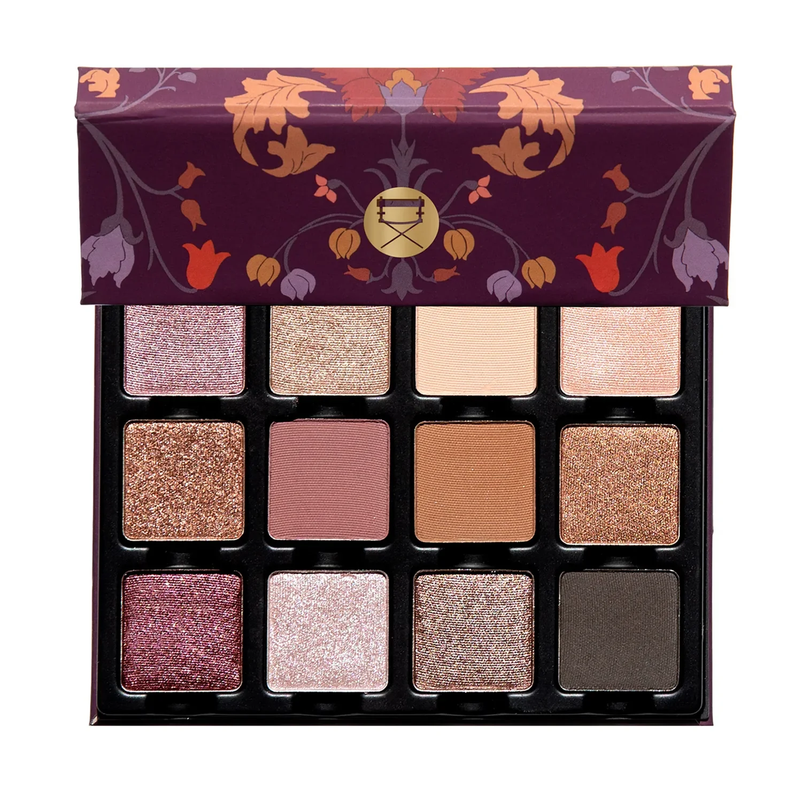

## Shade 1: Lilas Soyeux — Light mauve-pink with a metallic finish.
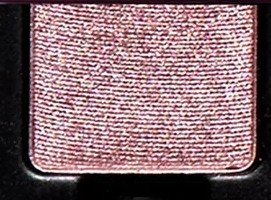

Use: This light mauve-pink shimmer can be used as an all-over lid colour, in the inner corners of the eyes for brightness and dimension, or as a base tone beneath complementary tones for increased depth and saturation on all complexions. Apply with fingertips or a dense brush for your desired level of intensity or use with a mixing medium for a foiled effect.

##### 色号 1：丝绒藕紫 (Lilas Soyeux) —— 浅藕紫色，金属光泽。
用途：可作全眼铺色、用于眼头增添亮感与立体度，或作为互补色下方的打底色，在所有肤色上增强层次与饱和度。可用指腹或扎实眼影刷叠加至理想显色度，也可搭配调和液获得更强烈的箔光效果。

## Shade 2: Or Rose — Warm rose gold with a metallic finish.
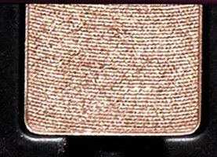

Use: This warm rose gold shimmer can be worn as an all-over lid colour, in the center of the lids for a burst of reflective shimmer, or layered on top of complementary tones for a high sheen finish. Mix this shade with water for a wash of colour or combine with a mixing medium for a foiled effect. Apply with fingertips or a dense brush for your desired level of intensity.

##### 色号 2：玫瑰金 (Or Rose) —— 暖调玫瑰金色，金属光泽。
用途：可作全眼铺色，或点在眼皮中央增强反光感；也可叠加在互补色之上提升整体光泽。可与清水调和获得轻透染色感，或搭配调和液营造更明显的箔光效果。可用指腹或扎实眼影刷按需叠加显色度。

## Shade 3: Crème Pâle — Light nude peach with a matte finish.
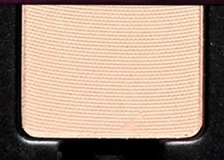

Use: This light nude peach shade can be used as an all-over lid base, in the inner corners and brow bone on all complexions, or as a base tone beneath complementary tones for increased depth and saturation. Mix this hue with other matte shades to create 12 new shades. Apply with fingertips or a dense brush for your desired level of intensity.

##### 色号 3：奶油裸色 (Crème Pâle) —— 极浅奶油裸色，哑光质地。
用途：可作全眼打底色，或在所有肤色上用于眼头和眉骨提亮；也可作为互补色下方的打底色，增强层次与饱和度。可与其他哑光色混合，延展出更多色调变化。可用指腹或扎实眼影刷叠加至理想显色度。

## Shade 4: Nacre Douce — Soft nude peach with a satin finish.
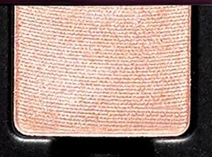

Use: This soft nude-peach satin shade can be used as an all-over lid colour, in the inner corners of the eyes for luminosity, or layered on top of complementary tones for a pearlescent second-skin finish. Apply with fingertips or a dense brush for your desired level of intensity or use with a mixing medium for a foiled effect.

##### 色号 4：桃肤珍珠 (Nacre Douce) —— 柔和桃肤裸色，缎光质地。
用途：可作全眼铺色，或在眼头提亮增添光泽；也可叠加在互补色之上，打造贝光裸肤感。可用指腹或扎实眼影刷叠加至理想显色度，也可搭配调和液获得更强烈的箔光效果。

## Shade 5: Ambre Brûlé — Rich warm copper with a metallic finish.
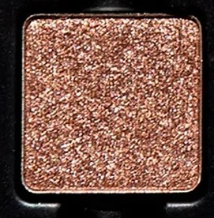

Use: This rich copper shade can be worn as an all-over lid colour, in the center of the lids for a burst of high shine, or layered over complementary tones for an incandescent effect. Use with a mixing medium for a foiled effect. Apply with fingertips or a dense brush for your desired level of intensity.

##### 色号 5：琥珀铜 (Ambre Brûlé) —— 浓郁暖铜色，金属光泽。
用途：可作全眼铺色，或点在眼皮中央爆发高亮光感；也可叠加在互补色之上，呈现炽热光泽效果。搭配调和液可获得箔光效果。可用指腹或扎实眼影刷叠加至理想显色度。

## Shade 6: Rose Cendrée — Dusty rose with a matte finish.
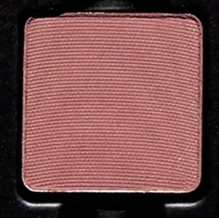

Use: This midtone dusty rose shade can be used as an all-over lid colour, as a transition shade to build out the crease and socket, as a soft liner, or as a base tone beneath complementary tones for increased depth and saturation on all complexions. Mix this hue with other matte shades to create 12 new shades. Apply with fingertips or a dense brush for your desired level of intensity.

##### 色号 6：雾玫瑰 (Rose Cendrée) —— 中调雾感玫瑰色，哑光质地。
用途：可作全眼铺色、眼窝与轮廓过渡色、柔和眼线色，或作为互补色下方的打底加深色，在所有肤色上增强层次与饱和度。可与其他哑光色混合，延展出更多色调变化。可用指腹或扎实眼影刷叠加至理想显色度。

## Shade 7: Cannelle — Warm caramel with a matte finish.
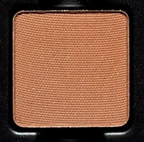

Use: This warm caramel shade can be used as an all-over lid colour, as a transition shade in the crease and socket, as a soft liner, or as a base tone beneath complementary tones for increased depth and saturation. Mix this hue with other matte shades to create 12 new shades. Apply with fingertips or a dense brush for your desired level of intensity.

##### 色号 7：肉桂棕 (Cannelle) —— 暖调焦糖棕，哑光质地。
用途：可作全眼铺色、眼窝过渡色、柔和眼线色，或作为互补色下方的打底加深色，增强层次与饱和度。可与其他哑光色混合，延展出更多色调变化。可用指腹或扎实眼影刷叠加至理想显色度。

## Shade 8: Cuivre Rose — Warm rose copper with a metallic finish.
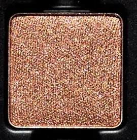

Use: This warm rose copper metallic shade can be worn as an all-over lid colour, layered over complementary tones for a warm sheen, or used as a liner for subtle definition. Apply with fingertips or a dense brush for your desired level of intensity or use with a mixing medium for a foiled effect.

##### 色号 8：玫瑰铜 (Cuivre Rose) —— 暖调玫瑰铜色，金属光泽。
用途：可作全眼铺色，或叠加在互补色之上增添暖色光泽；也可作为眼线色带出柔和轮廓。可用指腹或扎实眼影刷叠加至理想显色度，也可搭配调和液获得箔光效果。

## Shade 9: Cassis Éclatant — Deep rosy plum with a metallic finish.
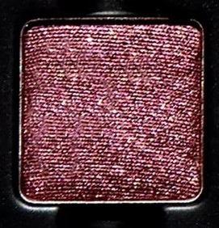

Use: This deep rosy plum metallic shade can be worn alone for a striking monochromatic look or layered on top of complementary tones for a high sheen shift of shimmering pigment. Can also be used as liner or in conjunction with a mixing medium for a foiled effect. Apply with fingertips or a dense brush for your desired level of intensity.

##### 色号 9：黑醋栗闪 (Cassis Éclatant) —— 浓郁玫瑰梅紫色，金属光泽。
用途：可单独使用打造醒目单色妆效，也可叠加在互补色之上，呈现高光泽闪烁变化。也可作眼线色使用，或搭配调和液打造金属箔感。可用指腹或扎实眼影刷按需叠加显色度。

## Shade 10: Givre Rosé — Pale rose shimmer with a metallic finish.
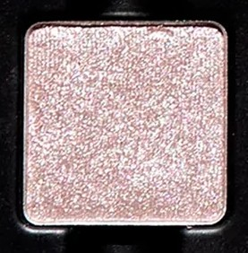

Use: This pale rose shimmer shade can be used as an all-over lid colour, in the inner corners of the eyes for a burst of luminosity, in the center of the eyelid for added brightness, or layered on top of complementary tones for a high sheen finish. Mix this shade with water for a wash of colour or combine with a mixing medium for a foiled effect. Apply with fingertips or a dense brush for your desired level of intensity.

##### 色号 10：玫瑰霜 (Givre Rosé) —— 极浅玫瑰珠光色，金属光泽。
用途：可作全眼铺色，或在眼头点亮、用于眼皮中央增强光感；也可叠加在互补色之上打造高亮光泽。可与清水调和获得轻透染色感，或搭配调和液获得箔光效果。可用指腹或扎实眼影刷按需叠加显色度。

## Shade 11: Bronze Soyeux — Warm rose bronze with a metallic finish.
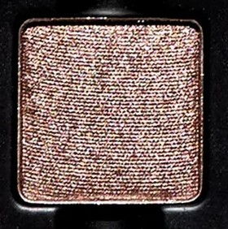

Use: This warm rose bronze metallic shade can be worn as an all-over lid colour, in the center of the lids for a burst of warm shimmer, or layered on top of complementary tones for a high sheen finish. Combine with a mixing medium for a foiled effect. Apply with fingertips or a dense brush for your desired level of intensity.

##### 色号 11：丝绒铜棕 (Bronze Soyeux) —— 暖调玫瑰青铜色，金属光泽。
用途：可作全眼铺色，或点在眼皮中央增强暖色光感；也可叠加在互补色之上提升整体光泽。搭配调和液可获得箔光效果。可用指腹或扎实眼影刷按需叠加显色度。

## Shade 12: Moka Profond — Deep espresso brown with a matte finish.
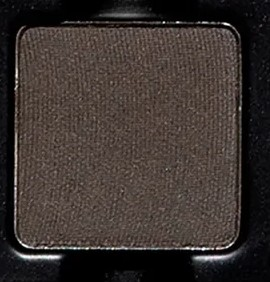

Use: This deep espresso brown shade can be used to create depth and dimension in the crease, socket and lash line. Build up the colour in the outer corners of the eyes for a boldly pigmented finish or use a mixing medium and liner brush for a graphic finish. Use a brush for your desired level of intensity.

##### 色号 12：浓缩咖棕 (Moka Profond) —— 深沉浓缩咖棕色，哑光质地。
用途：适合用于加深眼窝、轮廓与睫毛根部，增强整体立体度与深邃感。可在眼尾逐步叠加，打造更浓郁饱和的显色效果；也可搭配调和液与眼线刷完成更利落的图形眼线。建议使用刷具按需叠加显色度。
