# Viseart 12色 中号 玛黑绮彩盘 Le Marais Étendu
*发布：2022*

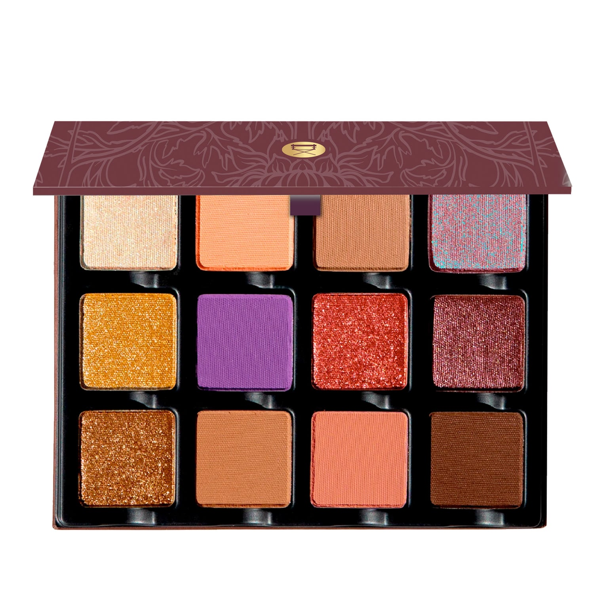

> 灵感源自巴黎玛黑区迷宫般的街巷，12 个丰盈色调——哑光、金属与双色幻彩——绘就温暖木质棕、浓郁酒红与闪亮铜金，折射出世代艺术家聚集的咖啡馆、工作室与隐秘角落，以珠宝般的流光与双色箔感画龙点睛。

> *A cornucopia of twelve lusciously rich hues in matte, metallic, and duochrome shimmer finishes, inspired by the maze of Le Marais in Paris. Warm woody browns, wine-rich mattes, and glinting golden coppers reflect the cafes, ateliers, and hidden nooks that artists have created for centuries — finished with sumptuous jeweled shimmers and a duochromatic foil.*

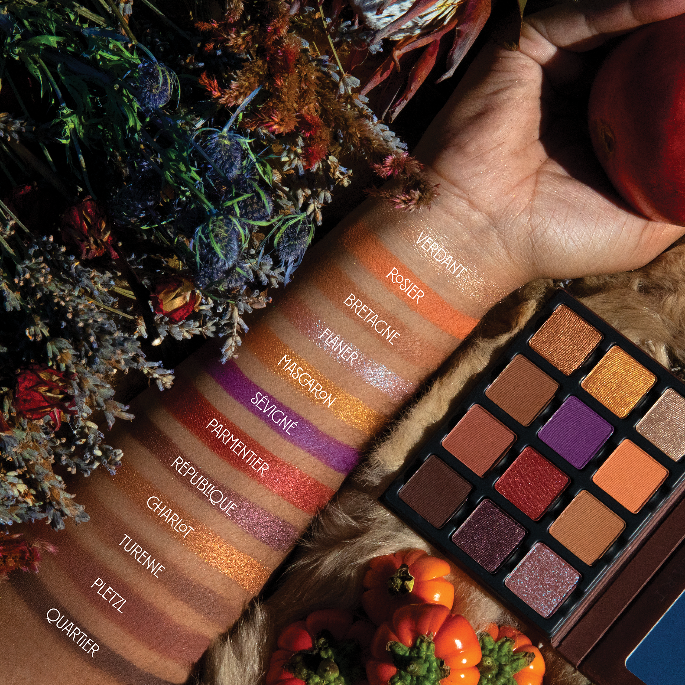

## Shade 1: Verdant — White gold with a shimmer finish
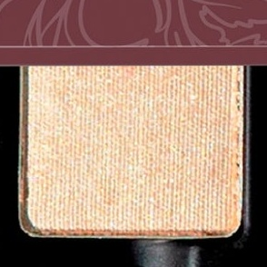

Use: This shade can be used as a highlighter in the inner corners of the eyes, on top of the cheekbones, and down the center of the nose.

##### 色号 1：苍翠金辉 (Verdant) —— 白金色，微光质地。
用途：可用于眼头提亮、颧骨提亮或鼻梁中线提亮。

## Shade 2: Rosier — Soft cantaloupe with a matte finish
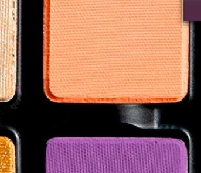

Use: This soft cantaloupe shade can be used as an all over base tone on light to medium complexions, an inner corner highlighter, or mixed with any of the other tones to brighten and lighten.

##### 色号 2：玫桃柔哑 (Rosier) —— 柔和哈密瓜橘色，哑光质地。
用途：可作浅至中等肤色的全眼打底色或眼头提亮，也可与盘内任何色调混合提亮调色。

## Shade 3: Bretagne — Warm camel brown with a matte finish
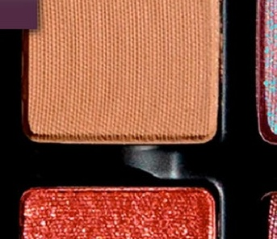

Use: This warm camel brown shade can be used as an all over lid color, soft contour shade, or along the lower lashline for depth and dimension.

##### 色号 3：布列塔尼暖褐 (Bretagne) —— 暖调驼棕色，哑光质地。
用途：可作全眼铺色或柔和轮廓色，也可沿下睫毛线晕染增添深度与层次。

## Shade 4: Flâner — Nude rose with a blue duochromatic finish
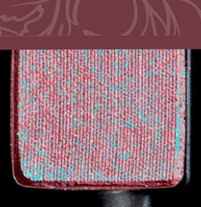

Use: This duochromatic shade can be used as an all over lid color, a reflective topper over any other shadow, as a highlighter in the center of the lid, or with foiled with a mixing medium for intense shine and luminosity.

##### 色号 4：漫步玫偏光 (Flâner) —— 裸玫瑰色，蓝调幻彩质地。
用途：可作全眼铺色，叠于任何眼影之上作反光叠色，或点于眼皮中央提亮；搭配调和液可获得强烈金属箔光感。

## Shade 5: Mascaron — Goldfinch with a metallic finish
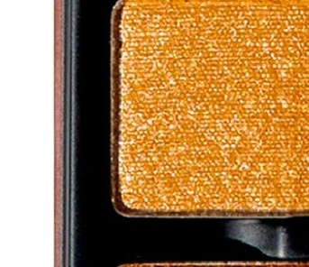

Use: This goldfinch shade can be used as an all over lid color, shimmer highlight color, pop of reflectivity in the center of the lid or with foiled with a mixing medium for intense shine and luminosity.

##### 色号 5：浮雕金雀 (Mascaron) —— 金雀黄色，金属质地。
用途：可作全眼铺色或提亮色，点于眼皮中央增添金属光泽；搭配调和液可获得金属箔光效果。

## Shade 6: Sévigné — Bright purple with a matte finish
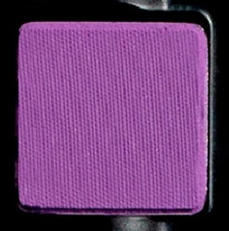

Use: This bright purple shade can be worn alone or paired with any of the other shades for a burst of color. Use as an avante-garde blush shade or blend with lighter matte shades to create a bespoke cheek color. *WARNING* - In the US, this shade contains pigments that the FDA has not approved for use in the eye area.

##### 色号 6：塞维涅紫 (Sévigné) —— 明亮紫色，哑光质地。
用途：可单独使用或与盘内其他色调搭配营造撞色效果。可作前卫腮红，或与浅色哑光混合调制专属颊色。提示：在美国，此色号含有 FDA 未批准用于眼部周围的色素。

## Shade 7: Parmentier — Poppy red with a shimmer finish
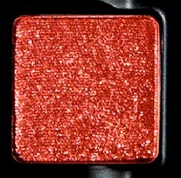

Use: This shimmery red shade can be used an an all over lid tone, as a transitional crease shade, or layered with any of the duochromatic colors in the palette with an extra pop.

##### 色号 7：帕芒蒂埃红 (Parmentier) —— 罂粟红色，微光质地。
用途：可作全眼铺色或眼窝过渡色，与盘内幻彩色叠搭可增添惊艳效果。

## Shade 8: République — Aubergine with a shimmer finish
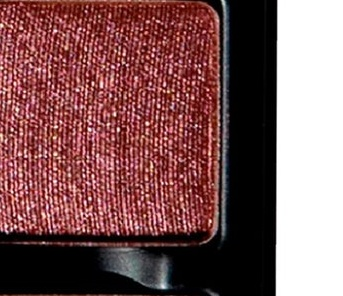

Use: This shimmer aubergine shade can be used all over the line, in the crease for depth and dimension, or along the lower lashline to add definition to the eyes.

##### 色号 8：共和广场茄紫 (République) —— 茄紫色，微光质地。
用途：可全眼铺色，用于眼窝增加深度与层次，或沿下睫毛线晕染增强眼妆轮廓。

## Shade 9: Charlot — Gold copper with a metallic finish
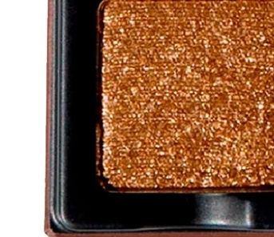

Use: This shimmery shade can be used all over the lids as an all over wash of color, foiled with a mixing medium, or as a highlighter.

##### 色号 9：夏洛铜金 (Charlot) —— 金铜色，金属质地。
用途：可全眼铺色，搭配调和液获得金属箔光感，或用作局部提亮。

## Shade 10: Turenne — Midtone brown with a matte finish
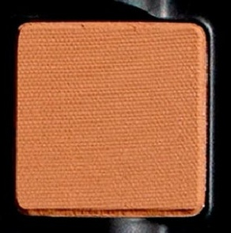

Use: This midtone brown shade can be used as an all over lid color, soft contour shade, or along the lower lashline for depth and dimension.

##### 色号 10：蒂雷纳中棕 (Turenne) —— 中调棕色，哑光质地。
用途：可作全眼铺色或柔和轮廓色，或沿下睫毛线晕染增添深度与层次。

## Shade 11: Pletzl — Muted rouge brown with a matte finish
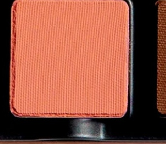

Use: This rouge brown can be used as an all over lid color, in the crease of the eyes as a transitional shade, or as a nude blush on all complexions.

##### 色号 11：普莱兹尔胭棕 (Pletzl) —— 柔和胭脂棕色，哑光质地。
用途：可作全眼铺色，用于眼窝作过渡色，或作裸调腮红，适合所有肤色。

## Shade 12: Quartier — Dark chocolate brown with a matte finish
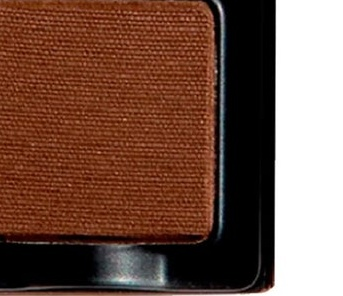

Use: This matte brown shade can be used to add depth and dimension to the outer corner of the eyes, as liner, or paired with any hue for a smokey look.

##### 色号 12：街区深巧棕 (Quartier) —— 深巧克力棕色，哑光质地。
用途：可用于眼尾加深轮廓，作眼线使用，或与任意色调搭配打造烟熏效果。
