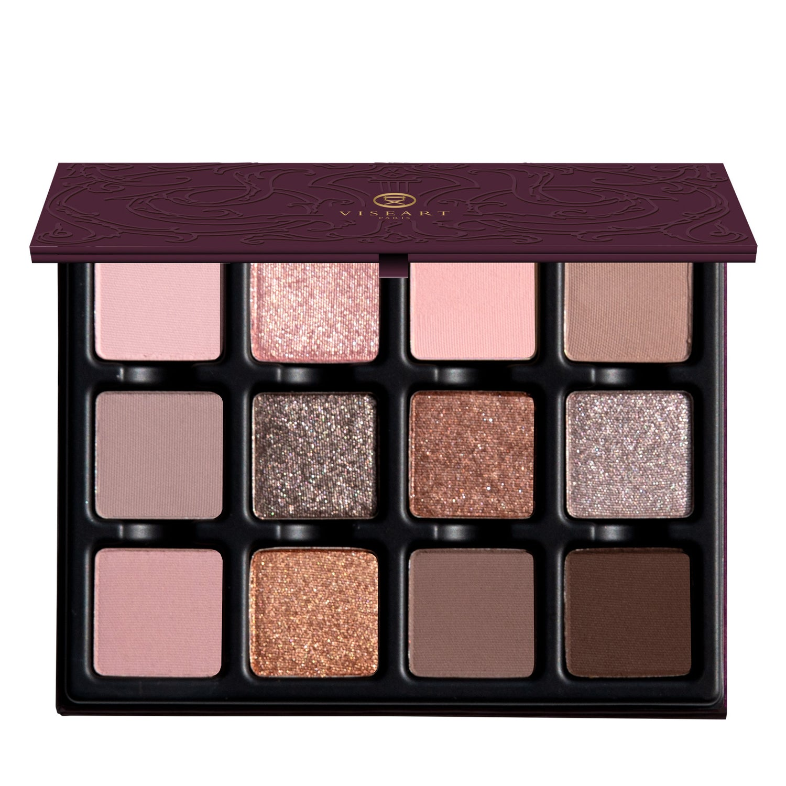

# Viseart 12色 中号 丁香流辉盘 Lilas Lumière Étendu

## Shade 1: Perle D'or — Light champagne blush pink with a matte finish.

Use: This light blush pink shade can be used as an all-over lid colour or as a base tone beneath complementary tones, it can be used to highlight the brow bone. It can be mixed with any of the other tones to brighten and lighten to create over 12 new hues. Apply with fingertips or a dense brush for your desired level of intensity.

##### 色号 1：珍珠蜜粉 (Perle D'or) —— 浅香槟腮红粉色，哑光质地。
用途：可作全眼铺色，或作为互补色下方的打底色，也可用于眉骨提亮。还能与盘中其他颜色混合，提亮并调浅，延展出 12 种以上新色。可用指腹或扎实刷具按需叠加显色度。

## Shade 2: Rosée — Light pink champagne with a high-shine, metallic finish.

Use: This high-shine, pink champagne shade can be used as an all-over base tone or layered over complementary tones for a refined wash of reflectivity. Combine with a mixing medium for an ultra-foiled effect. This shade can also be mixed into gloss to add a kiss of brilliance to any lip look.

##### 色号 2：玫露香槟 (Rosée) —— 浅粉香槟色，高闪金属质地。
用途：可作全眼打底色，或叠加在互补色之上，带出细腻反光层次。搭配调和液可获得更强烈的箔光效果，也可混入唇蜜，为唇妆增添一抹亮泽。

## Shade 3: Soft Pink — Soft light pink with a matte finish

Use: This soft light pink shade can be used as an all-over lid colour or as a base tone beneath complementary shades. It can also be used to highlight the brow bone and inner corners of the eyes. Additionally, it can be mixed with any of the other tones to brighten, lighten to create over 12 new hues.

##### 色号 3：柔粉 (Soft Pink) —— 柔和浅粉色，哑光质地。
用途：可作全眼铺色，或作为互补色下方的打底色。也可用于眉骨和眼头提亮。还能与盘中其他颜色混合，提亮并调浅，延展出 12 种以上新色。

## Shade 4: Isolde — Light stone-brown nude with a matte finish.

Use: This light stone-brown nude shade can be used as an all-over lid colour, as a transitional shade to build out the crease and socket, as a soft liner, or as a base tone beneath complementary tones for increased depth and saturation. Can also be used in brows on light complexions.

##### 色号 4：浅石裸棕 (Isolde) —— 浅石棕裸色，哑光质地。
用途：可作全眼铺色、眼窝过渡色、柔和眼线色，或作为互补色下方的打底色以增强深度与饱和度。浅肤色也可用于眉部修饰。

## Shade 5: Tiramisu — Light cool taupe with a matte finish.

Use: On light skin tones, this is a taupe, on darker skin tones, this is a grey. Use it on the lid or in the crease.

##### 色号 5：提拉米苏灰褐 (Tiramisu) —— 浅冷灰褐色，哑光质地。
用途：在浅肤色上呈现灰褐调，在深肤色上则更偏灰色。可用于眼皮主色或眼窝过渡色。

## Shade 6: Argenté — Silver with a shimmer finish.

Use: All over the lid for a flash of shine, or layer it over a matte color to intensify both. For maximum reflection, use a damp brush.

##### 色号 6：银霜 (Argenté) —— 银色，闪光质地。
用途：可全眼铺色，带来一抹闪耀光感，也可叠加在哑光色上，同时增强两者表现。想要最大反光效果，建议使用微湿刷具。

## Shade 7: Burlesque — Metallic satin caramel hue with a duochromatic finish.

Use: This metallic duochromatic shade can be used as an all-over lid color for all complexions or layer it over any of the matte shades as a topper. This shade can be lightened with any pale satin shimmer tones to create four new shades! All skin tones.

##### 色号 7：魅舞焦糖 (Burlesque) —— 焦糖金属缎光色，双偏光质地。
用途：可作全眼铺色，适合所有肤色，也可叠加在任一哑光色之上作为提亮层。还可与浅色缎光珠光混合，延展出更多新色变化。

## Shade 8: Fondant — Iced silver rose with a shimmer finish.

Use: Lid to lash base color, to brighten up the inner corner of the eye, and to highlight on the face - try using it on top of the cheekbone, down the nose, and along the jawline.

##### 色号 8：糖霜银玫 (Fondant) —— 冰银玫瑰色，闪光质地。
用途：可作从眼皮到睫毛根部的打底色，也适合提亮眼头和面部高点，可尝试用于颧骨、鼻梁和下颌线位置。

## Shade 9: Pompidou — Muted, cool-toned pink lilac with a matte finish.

Use: This shade can be used as an all-over lid tone. Mix with “Beaubourg” or “Archives” for increased depth and luminosity! Can also be worn as blush on light complexions! Mix with any shimmer for a new hue!

##### 色号 9：蓬皮杜丁香粉 (Pompidou) —— 柔雾冷丁香粉色，哑光质地。
用途：可作全眼铺色。与 `Beaubourg` 或 `Archives` 混合，可增强深度与光泽感；浅肤色也可作腮红使用；再与任意珠光色混合，还能延展出新的色调变化。

## Shade 10: Dulce — Warm, midtone burnished bronze with a shimmer finish.

Use: This midtone burnished bronze shade can be used as an all-over base colour, layered over complementary tones for additional warmth and dimension, or used as a liner for subtle definition. Can also be worn as a highlighter on medium to deep skin tones. Apply with a dense brush for your desired level of intensity. Use with the Viseart Seamless Eye Primer or other preferred mixing medium for a foiled effect.

##### 色号 10：焦糖古铜 (Dulce) —— 暖调中调抛光古铜色，闪光质地。
用途：可作全眼打底色，或叠加在互补色之上增加暖感与层次，也可作为眼线色带出柔和轮廓。中等至深肤色也可作高光使用。可用扎实刷具按需叠加显色度；搭配 Viseart Seamless Eye Primer 或其他调和液可获得箔光效果。

## Shade 11: Cambresine — Midtone greige stone hue with a matte finish

Use: This midtone shade can be used as an all-over lid colour, as a transition shade to build out the crease and socket, as a soft liner, or as a base tone beneath complementary tones for increased depth and saturation. Can be used in brows. Mix this hue with other matte shades to create 12 new shades. Apply with fingertips or a dense brush for your desired level of intensity.

##### 色号 11：灰石褐紫 (Cambresine) —— 中调灰米石色，哑光质地。
用途：可作全眼铺色、眼窝过渡色、柔和眼线色，或作为互补色下方的打底色以增强深度与饱和度。也可用于眉部修饰。与其他哑光色混合，可延展出 12 种新色。可用指腹或扎实刷具按需叠加显色度。

## Shade 12: Espresso — Bitter brown with a matte finish

Use: This espresso matte is used to create a deep, smokey eye all over the lid and as an eyeliner with a damp brush. Hue can be tapped with a brush in brows and muted down with other matte tones for darker to lighter brows, depending on skin tone. Can be layered with all shimmers for a multitude of different looks.

##### 色号 12：浓缩苦棕 (Espresso) —— 深苦棕色，哑光质地。
用途：适合全眼铺色打造深邃烟熏感，也可配合微湿刷具作为眼线色使用。也可轻拍于眉部，并与其他哑光色混合，调出适合不同肤色的深浅眉色；与所有珠光色叠搭也能延展出多种妆效。
