# Viseart 12色 中号 Aqua联名盘 Lisa Says Gah x Aqua Étendu
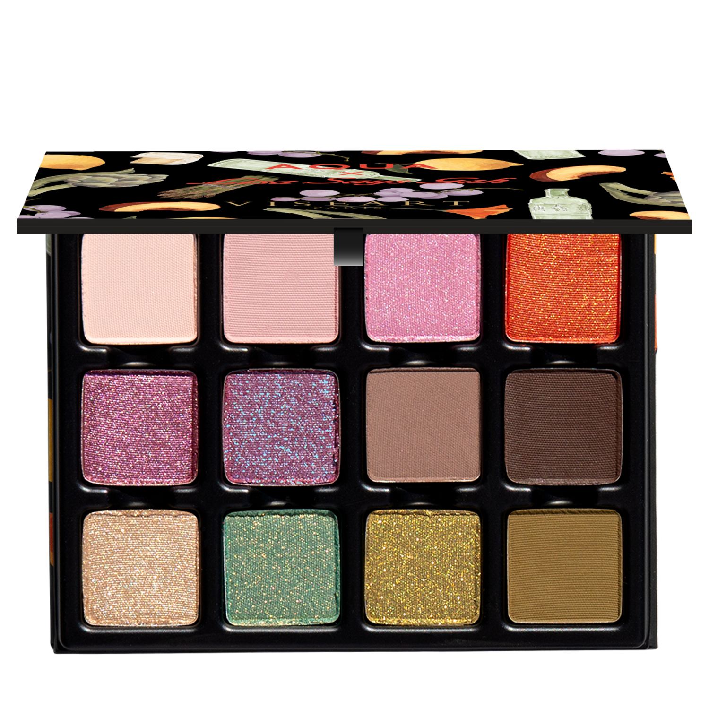

## Shade 1: Pale Crème-Pink — Pale, crème-pink with a matte finish.
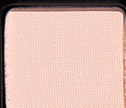

Use: This pale, créme-pink matte shade can be used as an all-over lid colour or as a base tone beneath complementary hues. It can also be used to highlight the brow bone and inner corners of the eyes, or as a transitional shade in the socket of the eye. Apply with a brush for your desired level of intensity.

##### 色号 1：Pale Crème-Pink (Pale Crème-Pink) —— Pale, crème-pink with a matte finish.
用途：This pale, créme-pink matte shade can be used as an all-over lid colour or as a base tone beneath complementary hues. It can also be used to highlight the brow bone and inner corners of the eyes, or as a transitional shade in the socket of the eye. Apply with a brush for your desired level of intensity.

## Shade 2: Muted Nude Rose — Muted, nude rose with a matte finish.
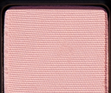

Use: This nude, light pink matte shade can be used as an all-over lid colour or as a base tone beneath complementary hues. It can also be used to highlight the brow bone and inner corners of the eyes, or as a transitional shade in the socket of the eye. Apply with a brush for your desired level of intensity.

##### 色号 2：Muted Nude Rose (Muted Nude Rose) —— Muted, nude rose with a matte finish.
用途：This nude, light pink matte shade can be used as an all-over lid colour or as a base tone beneath complementary hues. It can also be used to highlight the brow bone and inner corners of the eyes, or as a transitional shade in the socket of the eye. Apply with a brush for your desired level of intensity.

## Shade 3: Luminous Blush-Pink — Luminous, blush-pink with a satin finish.
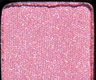

Use: This luminous, blush-pink shade can be used as an all-over lid colour or along the high points of the face as a highlighter on all complexions. For a brightening, eye-catching effect, apply to the inner corners of the eyes, or layer over complementary hues for extra dimension. Apply with a brush for your desired level of intensity. This shade can also be blended with gloss or balm for a dewy finish, and foiled with mixing medium for a high-shine effect.

##### 色号 3：Luminous Blush-Pink (Luminous Blush-Pink) —— Luminous, blush-pink with a satin finish.
用途：This luminous, blush-pink shade can be used as an all-over lid colour or along the high points of the face as a highlighter on all complexions. For a brightening, eye-catching effect, apply to the inner corners of the eyes, or layer over complementary hues for extra dimension. Apply with a brush for your desired level of intensity. This shade can also be blended with gloss or balm for a dewy finish, and foiled with mixing medium for a high-shine effect.

## Shade 4: Molten Poppy Red — Molten poppy red with a gilded, deep-orange duochromatic finish.
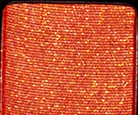

Use: This molten poppy red shade can be used as an all-over lid colour. Sweep across the lid for a sunlit pop, or layer over mattes for molten dimension. This statement shade can also be worn as a shimmering blush colour on all complexions. Apply with a brush for your desired level of intensity. Use with a mixing medium for a foiled effect.

##### 色号 4：Molten Poppy Red (Molten Poppy Red) —— Molten poppy red with a gilded, deep-orange duochromatic finish.
用途：This molten poppy red shade can be used as an all-over lid colour. Sweep across the lid for a sunlit pop, or layer over mattes for molten dimension. This statement shade can also be worn as a shimmering blush colour on all complexions. Apply with a brush for your desired level of intensity. Use with a mixing medium for a foiled effect.

## Shade 5: Velvet Roseberry — Velvet roseberry with a satin finish.
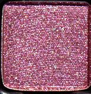

Use: This velvet roseberry shade can be used as an all-over lid colour, layered over complementary tones for depth and vibrancy, or foiled with a mixing medium for a reflective finish. Use as a soft liner or blend into gloss for a beautiful bespoke finish. Apply with a brush for your desired level of intensity. Use with a mixing medium for a foiled effect.

##### 色号 5：Velvet Roseberry (Velvet Roseberry) —— Velvet roseberry with a satin finish.
用途：This velvet roseberry shade can be used as an all-over lid colour, layered over complementary tones for depth and vibrancy, or foiled with a mixing medium for a reflective finish. Use as a soft liner or blend into gloss for a beautiful bespoke finish. Apply with a brush for your desired level of intensity. Use with a mixing medium for a foiled effect.

## Shade 6: Sensual Nude-Rose — Sensual nude-rose with blue-violet duochromatic flecks.
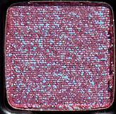

Use: This sensual nude-rose shade is a multidimensional color with a striking blue-violet duochromatic shift. Wear alone for a luminous sheen with a gorgeous shift, or layer over mattes to amplify dimension, depth, and reflectivity. Use with a mixing medium to achieve a foiled, mirror-like finish.

##### 色号 6：Sensual Nude-Rose (Sensual Nude-Rose) —— Sensual nude-rose with blue-violet duochromatic flecks.
用途：This sensual nude-rose shade is a multidimensional color with a striking blue-violet duochromatic shift. Wear alone for a luminous sheen with a gorgeous shift, or layer over mattes to amplify dimension, depth, and reflectivity. Use with a mixing medium to achieve a foiled, mirror-like finish.

## Shade 7: Midtone Cool Grey Taupe — Midtone cool grey taupe with a matte finish.
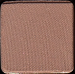

Use: Use this cool grey taupe shade as an all-over lid color on all complexions, in the crease as a transitional crease shade, or to build out depth and dimension in the outer corners of the eyes. Can be used as a soft eyeliner on all skin tones, in the brows and hairline, or as a subtle contour shade on light to medium complexions. Apply with a brush for your desired level of intensity.

##### 色号 7：Midtone Cool Grey Taupe (Midtone Cool Grey Taupe) —— 中调冷灰棕色，哑光质地。
用途：Use this cool grey taupe shade as an all-over lid color on all complexions, in the crease as a transitional crease shade, or to build out depth and dimension in the outer corners of the eyes. Can be used as a soft eyeliner on all skin tones, in the brows and hairline, or as a subtle contour shade on light to medium complexions. Apply with a brush for your desired level of intensity.

## Shade 8: Espresso-Bitter Brown — Espresso-bitter brown with a matte finish.
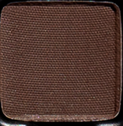

Use: This espresso-bitter brown shade can be used to create depth and dimension in the crease, socket, and lash line. Build up the colour in the outer corners of the eyes for a boldly pigmented finish, or use a mixing medium and liner brush for a graphic finish. Apply with a brush for your desired level of intensity. Pairs perfectly with

##### 色号 8：Espresso-Bitter Brown (Espresso-Bitter Brown) —— 浓缩苦咖棕，哑光质地。
用途：This espresso-bitter brown shade can be used to create depth and dimension in the crease, socket, and lash line. Build up the colour in the outer corners of the eyes for a boldly pigmented finish, or use a mixing medium and liner brush for a graphic finish. Apply with a brush for your desired level of intensity. Pairs perfectly with

## Shade 9: Soft Champagne Gold — Soft champagne gold with a crystalline satin finish.
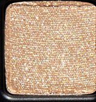

Use: This soft champagne gold shade brightens the lids with refined radiance. It can be used as a sheer all-over lid colour for soft dimension, or to highlight the inner corners and brow bone to illuminate and lift. Apply with a brush for your desired level of intensity. Pair with shades.

##### 色号 9：Soft Champagne Gold (Soft Champagne Gold) —— Soft champagne gold with a crystalline satin finish.
用途：This soft champagne gold shade brightens the lids with refined radiance. It can be used as a sheer all-over lid colour for soft dimension, or to highlight the inner corners and brow bone to illuminate and lift. Apply with a brush for your desired level of intensity. Pair with shades.

## Shade 10: Sea-Glass Green — Sea-glass green with a gold duochromatic finish.
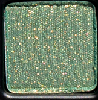

Use: This duochromatic, sea-glass green shade can be worn alone as an all-over lid colour, built up into the outer corners for added depth, or traced along the lash line as a vibrant liner. Apply with a brush for your desired level of intensity. Pair with shades.

##### 色号 10：Sea-Glass Green (Sea-Glass Green) —— Sea-glass green with a gold duochromatic finish.
用途：This duochromatic, sea-glass green shade can be worn alone as an all-over lid colour, built up into the outer corners for added depth, or traced along the lash line as a vibrant liner. Apply with a brush for your desired level of intensity. Pair with shades.

## Shade 11: Molten Green-Gold — Molten green-gold with a metallic finish.
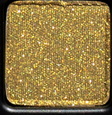

Use: This molten green-gold shade glides onto lids with liquid-metal luminosity. Wear alone for high-impact shine, layer over mattes for amplified dimension, or use as a bold accent in the inner corner or along the lash line. Apply with a brush for your desired level of intensity. Pair with shades.

##### 色号 11：Molten Green-Gold (Molten Green-Gold) —— Molten green-gold with a metallic finish.
用途：This molten green-gold shade glides onto lids with liquid-metal luminosity. Wear alone for high-impact shine, layer over mattes for amplified dimension, or use as a bold accent in the inner corner or along the lash line. Apply with a brush for your desired level of intensity. Pair with shades.

## Shade 12: Khaki Green — Khaki green with a matte finish.
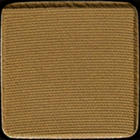

Use: This khaki green shade can be used as an all-over lid colour,--- to sculpt the crease, define the outer corner, or softly line the lash line for subtle, smoky dimension. Apply with a brush for your desired level of intensity. Pair with shades.

##### 色号 12：Khaki Green (Khaki Green) —— Khaki green with a matte finish.
用途：This khaki green shade can be used as an all-over lid colour,--- to sculpt the crease, define the outer corner, or softly line the lash line for subtle, smoky dimension. Apply with a brush for your desired level of intensity. Pair with shades.
