# Viseart 12色 中号 仲夏流辉盘 Midsommer Lumière Étendu
*发布：2025*

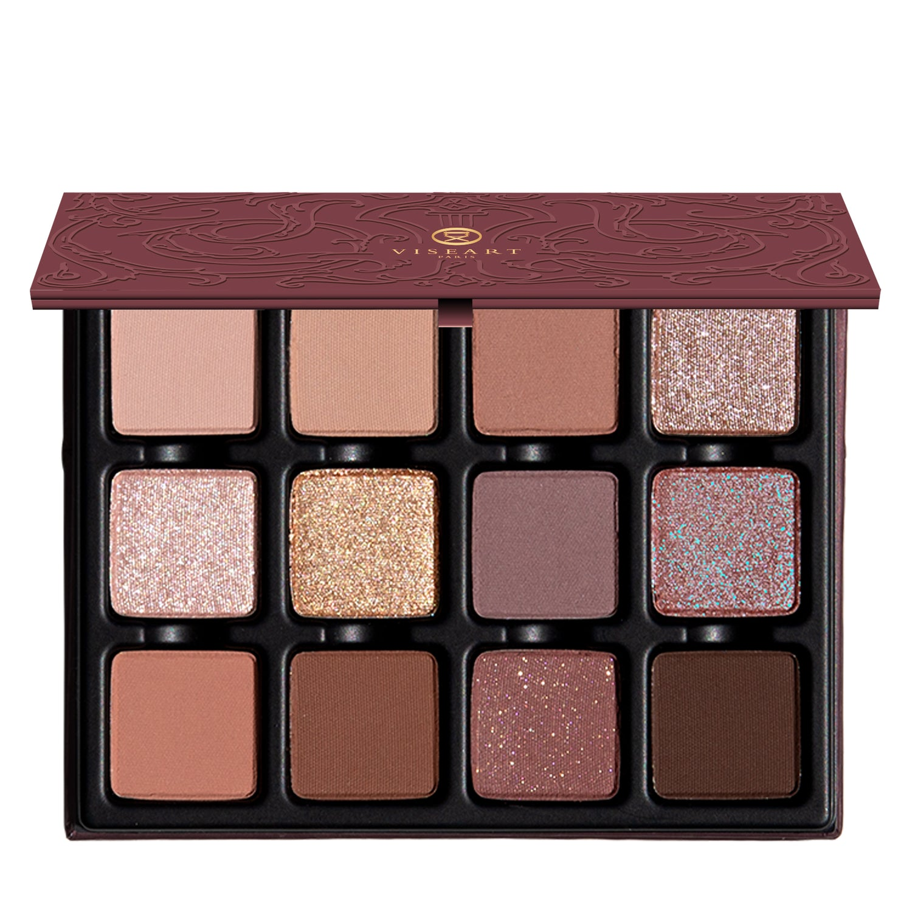

> 仲夏流辉盘如梦似幻地延续了经典原版的精髓，沉浸于暮色花开与仙灵嬉戏之间。12 个色调由黄昏与月光花瓣幻化而来——柔麂皮、玫瑰木与闪光薰衣草，点缀着带露珠般的双色魔药。

> *Midsommer Lumière Étendu beguiles as an ethereal extension of the beloved original palette, steeped in twilight bloom and faerie mischief. Twelve shades spun from dusk and moonlit petals — soft fawns, rosewood, and glistening lilac — with dew-kissed duochrome potions to seal the spell.*

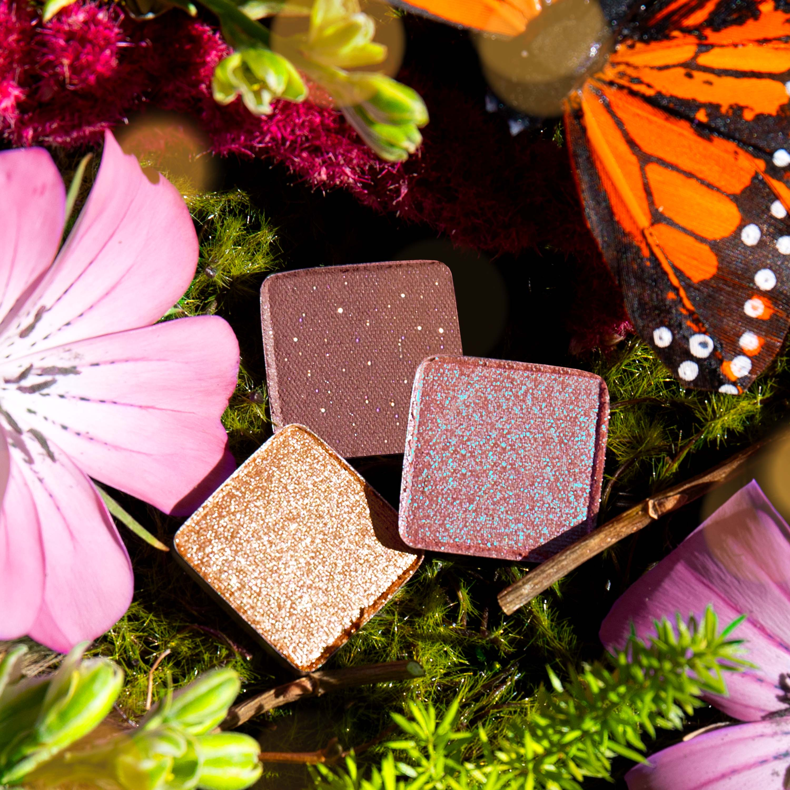
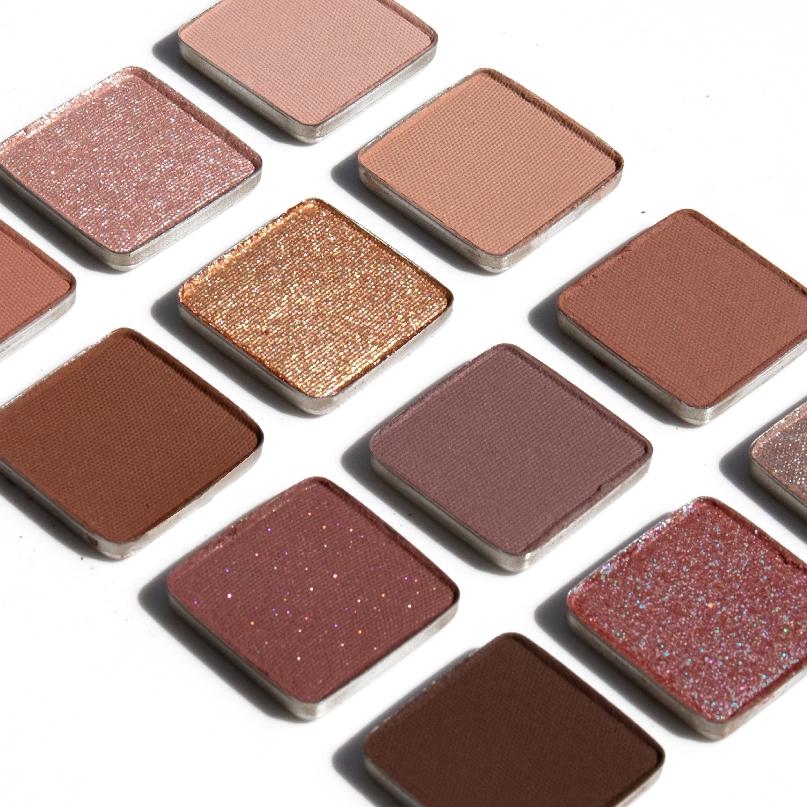

## Shade 1: Eglantine — Cool-toned light beige with a matte finish.
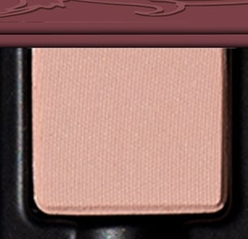

Use: This cool-toned light beige shade can be used as an all-over lid colour or as a base tone beneath complementary hues. It can also be used to highlight the brow bone and inner corners of the eyes or as a transitional shade in the socket of the eye. Use as a base tone beneath shades ‘Dewdrop’ and ‘Faerie’ for a luminous, shimmering glow. Apply with a brush for your desired level of intensity.

##### 色号 1：野蔷薇米杏 (Eglantine) —— 冷调浅米色，哑光质地。
用途：可作全眼铺色，或作为互补色下方的打底色；也可用于眉骨和眼头提亮，或作为眼窝过渡色。以它打底再叠加 `Dewdrop` 与 `Faerie`，可呈现明亮透光的微闪妆效。可用刷具按需叠加显色度。

## Shade 2: Mirth — Soft, mid-tone brown with a matte finish.
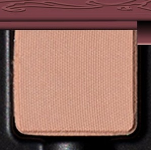

Use: This soft, mid-tone brown shade can be used as an all-over lid colour or as a base tone beneath complementary hues. It can also be used to highlight the brow bone and inner corners of the eyes, or as a transitional shade in the socket of the eye. Use as a base tone beneath shades ‘Faerie’ and ‘Perchance’ for a glistening, natural finish. Apply with a brush for your desired level of intensity.

##### 色号 2：欢愉柔棕 (Mirth) —— 柔和中调棕色，哑光质地。
用途：可作全眼铺色，或作为互补色下方的打底色；也可用于眉骨和眼头提亮，或作为眼窝过渡色。以它打底再叠加 `Faerie` 与 `Perchance`，可呈现自然透亮的微光妆感。可用刷具按需叠加显色度。

## Shade 3: Puck — Mid-tone nude rose-brown with a matte finish.
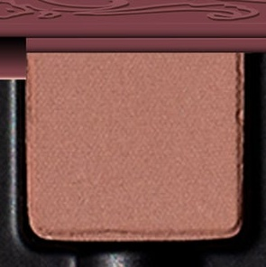

Use: This mid-tone matte rose-brown shade can be used as an all-over lid colour or as a base tone beneath complementary hues. It can also be used as a transitional shade to contour the socket to create depth and dimension. Additionally, this color can be used in the brows or as a contour on light to medium complexions.

##### 色号 3：玫瑰裸棕 (Puck) —— 中调裸玫瑰棕色，哑光质地。
用途：可作全眼铺色，或作为互补色下方的打底色；也可作为眼窝过渡色勾勒轮廓，增强深度与立体感。浅至中等肤色还可用于眉部或修容。

## Shade 4: Dewdrop — Champagne nude rosé with a shimmer finish.
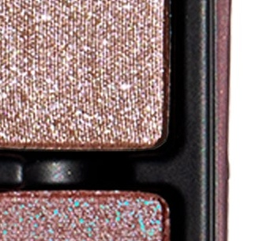

Use: This champagne rosé shade can be used as an all-over lid color or along the high points of the face as a highlighter on all complexions. Apply to the inner corners of the eyes for a or on top of complementary hues in the center of the lid for an eye-catching effect. Combine this shade with a mixing medium for a foiled effect. Apply with a brush for your desired level of intensity. Can also be used as a liner or mixed with gloss for a luminous finish.

##### 色号 4：露珠香槟 (Dewdrop) —— 香槟裸玫瑰色，闪光质地。
用途：可作全眼铺色，也可用于面部高点提亮，适合所有肤色。点在眼头，或叠在眼皮中央与互补色之上，都能带来更吸睛的光感。搭配调和液可获得箔光效果；也可作眼线，或混入唇蜜增添明亮釉泽。可用刷具按需叠加显色度。

## Shade 5: Faerie — Light champagne pink with a shimmer finish.
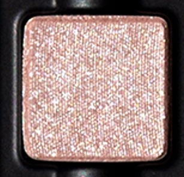

Use: This light champagne pink shade can be used as an all-over lid color or along the high points of the face as a highlighter on all complexions. For a brightening, eye-catching effect, apply to the inner corners of the eyes, or layer over complementary hues for extra dimension. Apply with a brush for your desired level of intensity. This shade can also be blended with gloss or balm for a dewy, multi-use glow.

##### 色号 5：仙灵香粉 (Faerie) —— 浅香槟粉色，闪光质地。
用途：可作全眼铺色，也可用于面部高点提亮，适合所有肤色。点在眼头或叠加在互补色之上，可增强明亮度与层次感。可用刷具按需叠加显色度；也可与唇蜜或润唇膏混合，呈现水润多用途光泽。

## Shade 6: Orbs — Second-skin nude topper with reflectivity.
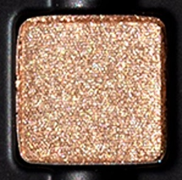

Use: This sheer, second-skin nude can be swept across the lids for a soft veil of light or layered over any shade in the palette to enhance luminosity. Use it to highlight the brow bone, inner corners of the eyes, cheekbones, or bridge of the nose for a subtle glow. For a radiant, multi-dimensional finish, layer over “Mirth” and “Perchance” to amplify their brilliance with a touch of shimmer. Apply with a brush for your desired level of intensity. Can also be used as a liner or mixed with gloss for a luminous finish.

##### 色号 6：星珠光纱 (Orbs) —— 贴肤裸色提亮叠擦色，带反光感。
用途：可轻扫全眼，带来柔和透光感，也可叠加在盘中任何颜色之上增强明亮度。还可用于眉骨、眼头、颧骨和鼻梁提亮，营造细腻光泽。叠在 `Mirth` 与 `Perchance` 之上，可进一步放大它们的闪耀层次。可用刷具按需叠加显色度；也可作眼线，或混入唇蜜增添亮泽。

## Shade 7: Titania — Muted purple-grey with a matte finish.
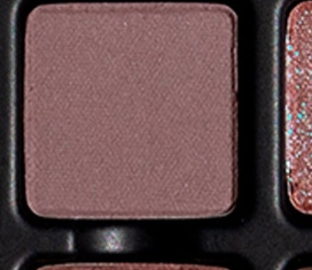

Use: This muted purple-grey matte shade can be used as an all-over lid colour, in the crease to contour and create dimension, or as a liner for a soft, diffused effect on all complexions.

##### 色号 7：仙后雾紫 (Titania) —— 柔雾紫灰色，哑光质地。
用途：可作全眼铺色，也可用于眼窝塑形、增强立体感，或作为柔雾眼线色，适合所有肤色。

## Shade 8: Changeling — Nude rose with a blue duochrome finish.
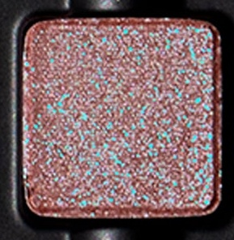

Use: This nude rose duochromatic shade can be worn alone for a wash of brillant reflectivity or layer over complementary tones to accentuate its pearlescent dimension. For a high-shine, foiled effect, pair with a mixing medium. Apply with a brush for your desired level of intensity. Pair with “Faerie” and “Titania” for an ethereal eye look that glimmers with luminosity.

##### 色号 8：幻形玫偏光 (Changeling) —— 裸玫瑰色，带蓝调双偏光质地。
用途：可单独使用，呈现明亮偏光；也可叠加在互补色上，强化珠光层次。搭配调和液可获得更强烈的箔光效果。可用刷具按需叠加显色度。与 `Faerie` 和 `Titania` 搭配，可完成空灵发光的眼妆效果。

## Shade 9: Cupidon — Light pink-brown with a matte finish.
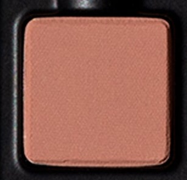

Use: This light pink-brown matte shade can be used as an all-over lid colour or as a base tone beneath complementary hues. It can also be used as a transitional shade to contour the socket to create depth and dimension. Pair with shimmering toppers like “Dewdrop” or deeper mattes such as “Perchance” to create seamless, softly sculpted eye looks.

##### 色号 9：丘比特粉棕 (Cupidon) —— 浅粉棕色，哑光质地。
用途：可作全眼铺色，或作为互补色下方的打底色；也可用于眼窝过渡，勾勒更柔和的深度与轮廓。搭配 `Dewdrop` 这类珠光提亮色，或 `Perchance` 这类更深哑光色，可完成自然衔接的雕塑感眼妆。

## Shade 10: Perchance — Medium brown with a matte finish.
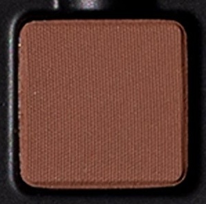

Use: This medium brown shade can be used as an all-over lid colour, as a transitional shade to build out the crease and socket, as a soft liner, or as a base tone beneath complementary tones for increased depth and saturation. Can also be used in brows on medium to deep complexions. Apply with a brush for your desired level of intensity.

##### 色号 10：遐想中棕 (Perchance) —— 中调棕色，哑光质地。
用途：可作全眼铺色、眼窝过渡色、柔和眼线色，或作为互补色下方的打底色以增强深度与饱和度。中等至深肤色也可用于眉部修饰。可用刷具按需叠加显色度。

## Shade 11: Potion — Muted burgundy with gold-pink reflectivity.
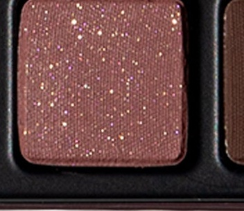

Use: Use this muted reflective burgundy tone as an all-over lid colour, layered overtop complementary shades, or on its own for a natural, softly shimmering effect on all complexions. This hue can be used in the crease to define the socket, as a liner, or paired with other shades to build depth and create a smouldering, multidimensional eye look.

##### 色号 11：魔药酒莓 (Potion) —— 柔雾酒红色，带金粉反光。
用途：可作全眼铺色，叠加在互补色之上，或单独使用，呈现自然柔闪效果，适合所有肤色。也可用于眼窝加深、作为眼线色，或与其他色号搭配，打造带层次感的微熏妆效。

## Shade 12: Hawthorne — Cool-toned brown with a matte finish.
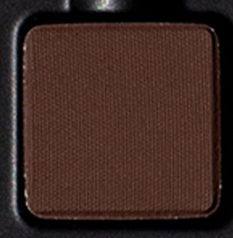

Use: This cool-toned brown shade can be used to create depth and dimension in the crease, socket, and lash line. Build up the colour in the outer corners of the eyes for a boldly pigmented finish or use a mixing medium and liner brush for a graphic finish. Pairs perfectly with ‘Potion’ and ‘Changeling’ for a richly pigmented duochromatic look. Use a brush for your desired level of intensity.

##### 色号 12：山楂冷棕 (Hawthorne) —— 冷调棕色，哑光质地。
用途：适合用于眼窝、轮廓与睫毛根部加深，增强深邃度与立体感。可在眼尾逐步叠加，打造高显色效果；也可搭配调和液和眼线刷完成更利落的图形眼线。与 `Potion` 和 `Changeling` 搭配，可呈现高显色的双偏光层次妆效。可用刷具按需叠加显色度。
