# Viseart 12色 中号 狐魅暖棕盘 Minxette Étendu
*发布：2021*

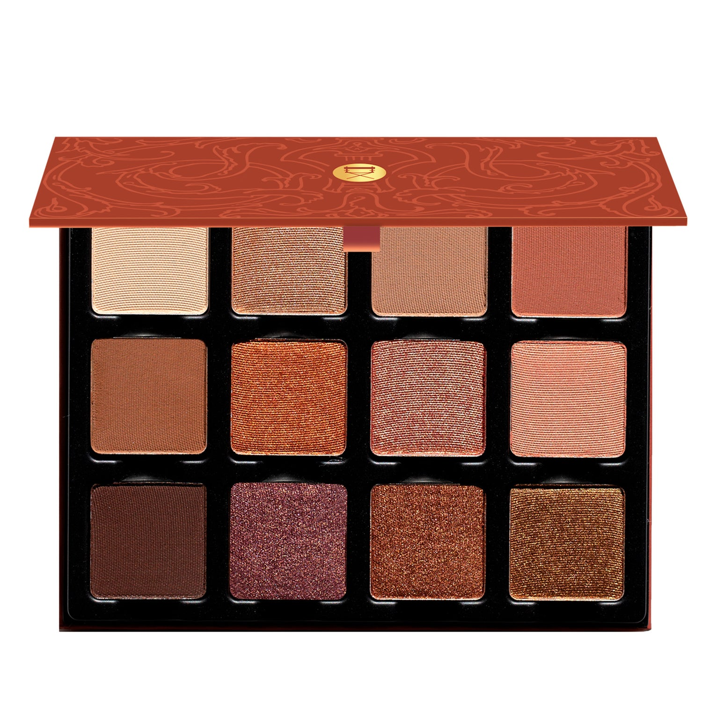

> 狐魅暖棕盘化身妩媚的诱惑者，以不费力的魅力吸引目光。暖调中深哑光、灼热闪泽与动感双色幻彩构成丰富的色调阵营，捕捉深秋绚烂，从慵懒白日一路摇曳至燃烧余晖的迷人傍晚。

> *Meet Minxette — the sumptuous seductress! Featuring an extensive range of warm mid-tone mattes, sizzling shimmers, and dynamic duochromes, this foxy palette captures the resplendence of late autumn, sashaying her way towards winter and sassing throughout daytime meetings into glorious simmering sunsets.*

## Shade 1: Pêche II — Lightest beige with peach undertone in a matte finish.
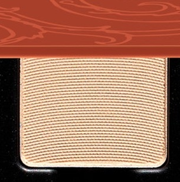

Use: All over lid shade for all skin tones, use as a highlight to lighten under the brow.

##### 色号 1：蜜桃米杏 (Pêche II) —— 最浅米杏色，带蜜桃底调，哑光质地。
用途：适合所有肤色作全眼铺色，也可用于眉骨下方提亮，令眼妆更显干净柔和。

## Shade 2: Suede — Warm champagne with a metallic satin finish.
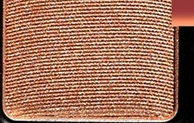

Use: All over satin lid shade for all skin tones. Use it as a highlight in the center of the eyelid bringing focus to your eye-color, and to brighten the eyes. Tap on as a highlighter for cheeks and to add satin finish to your blush. Also use as a highlight under the brow.

##### 色号 2：麂皮香槟 (Suede) —— 温暖香槟色，金属缎光质地。
用途：适合所有肤色作全眼缎光铺色；点在眼皮中央可聚焦眼神、提亮双眼，也可轻拍在双颊作高光，或叠加在腮红上增加细腻缎光感，同时适合作眉骨提亮。

## Shade 3: Savarin — Creamy neutral warm, light mid-tone with a matte finish.
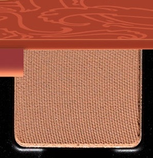

Use: All over lid shade for all skin tones, use as a crease colour, and in brows. Shade can be used as a contour for cheeks.

##### 色号 3：萨瓦兰奶棕 (Savarin) —— 奶油感中性暖棕，中浅调，哑光质地。
用途：可作全眼铺色、眼窝过渡色或眉色，也可作为双颊自然修容，适合打造柔和暖调轮廓。

## Shade 4: Cognac — Terracotta nude with a matte finish.
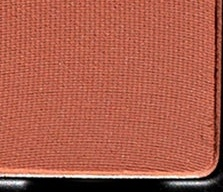

Use: All over lid shade for all skin tones, use as a crease colour, also can be added to other shades to create blush and bronzer tones for light to medium toned skin.

##### 色号 4：干邑陶棕 (Cognac) —— 赤陶裸棕色，哑光质地。
用途：适合所有肤色作全眼铺色或眼窝加深，也可与其他颜色混合，调出浅至中等肤色适用的腮红或暖调修容色。

## Shade 5: Sable — Milk chocolate brown with a matte finish.
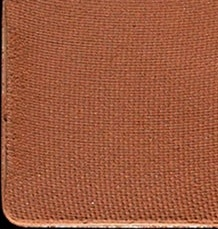

Use: All over lid tone for a smokey chocolate eye, use as a base tone for deeper skin, a crease colour and can be used in brows. Use this shade as an eyeliner. Mix with other tones to create a contour tone for cheeks for mid-deep to olive warm complexions.

##### 色号 5：暖貂巧棕 (Sable) —— 牛奶巧克力棕色，哑光质地。
用途：可作全眼铺色，打造巧克力烟熏感；深肤色可作基础底色，也适合用于眼窝、眉部和眼线。与其他颜色混合后，还可为中深至暖橄榄肤色调出自然修容色。

## Shade 6: Ember — Bright orange copper with a satin metallic duochrome finish.
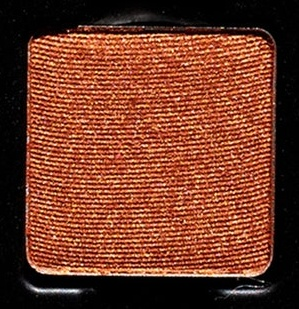

Use: Use this tone as a lay-over tone over matte shades to bring brightness, use as an all over tone- can also be paired with the two lighter satins as a bronzer for light to medium skin and to highlight deeper skin.

##### 色号 6：余烬铜橘 (Ember) —— 明亮橘铜色，带缎面金属偏光。
用途：适合叠加在哑光色上提升亮度，也可单独全眼铺陈；与盘中两块浅色缎光搭配，可为浅至中等肤色作暖调 bronzer，也能为深肤色带来提亮光泽。

## Shade 7: Apricot — Golden apricot with a satin metallic duochrome shimmer finish.
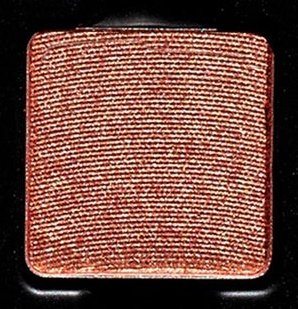

Use: Versatile tone that can be used as an all over lid colour, a highlight on eyes and cheeks! Mix this tone over the lighter shades for a simple, peachy-cream look, mix with the midtone mattes to create a sexy, liquid-satin glowing shade!

##### 色号 7：杏金微光 (Apricot) —— 金杏色，缎面金属偏光微闪质地。
用途：这是一支非常百搭的亮色，可作全眼铺色，也可用于眼部和双颊提亮。叠加在浅色上能呈现轻甜奶杏妆效，与中调哑光色组合则会更显液态缎光般的暖调光泽。

## Shade 8: Roseus — Soft peach-pink with a matte satin finish.
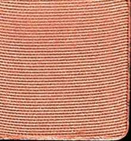

Use: Use as an all over lid shade, also can be used as blush for light to medium-toned skin. *WARNING* - In the US, this shade contains pigments that the FDA has not approved for use in the eye area.

##### 色号 8：柔雾桃粉 (Roseus) —— 柔和桃粉色，雾面缎光质地。
用途：可作全眼铺色，也适合浅至中等肤色作腮红使用。提示：在美国法规下，此色含有未获 FDA 批准用于眼周的色料。

## Shade 9: Chocolat II — Rich chocolate brown with a matte finish.
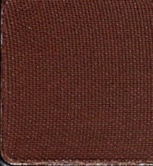

Use: Create a dark brown smokey eye, use as eyeliner with a wet brush, add dimension to corners of eyes. This tone can be used in brows and mixed into other mattes to create contour for deeper skin tones.

##### 色号 9：黑巧深棕 (Chocolat II) —— 浓郁巧克力深棕色，哑光质地。
用途：适合打造深棕烟熏眼妆；湿用可作眼线，放在眼尾也能增加层次与深邃感。还可用于眉部，并与其他哑光色混合，为深肤色调出修容色。

## Shade 10: Mahogany — Deep plum with a satin metallic finish.
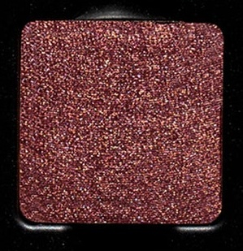

Use: Use for an aubergine smokey eye, and as eyeliner. Can also be used as a mix in for highlighting deeper skin.

##### 色号 10：桃心木紫棕 (Mahogany) —— 深李子紫棕色，缎面金属质地。
用途：适合打造茄紫调烟熏眼妆，也可作眼线色使用；与其他颜色调和后，还能为深肤色带来更有层次的提亮效果。

## Shade 11: Cointreau — Warm copper with a satin metallic finish.
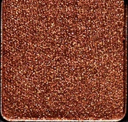

Use: Use as an all over eyeshadow tone, add to the matte tones to create a copper smokey eye. Also can be used as a highlight for deeper skin tones.

##### 色号 11：君度铜金 (Cointreau) —— 温暖铜金色，缎面金属质地。
用途：可作全眼主色，也可叠加在哑光色上，打造带铜光感的烟熏眼妆；深肤色还可将它用作提亮色。

## Shade 12: Ode to Hannah — Antiqued gold with a satin metallic shimmer finish.
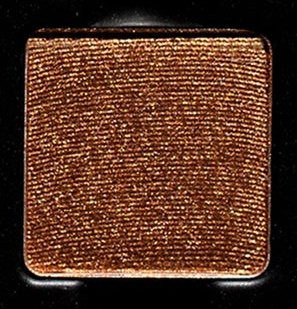

Use: Use as an all over shade, mix with the lighter peach and champagne shades to create a muted daytime glowing look, use the brown eyeliner tone to create dimension and depth, or mix with the deeper brown mattes to create a glimmering smokey chocolate gold eye look.

##### 色号 12：汉娜古金 (Ode to Hannah) —— 仿古金色，缎面金属微闪质地。
用途：可全眼铺陈，也可与浅蜜桃色和香槟色混合，打造柔和日间光泽感；搭配棕色眼线位可增加层次与深度，与更深的棕色哑光色组合则能呈现闪耀的巧克力金烟熏妆。
