# Viseart 12色 中号 睡莲秘境盘 Nymphaía Étendu
*发布：2026*

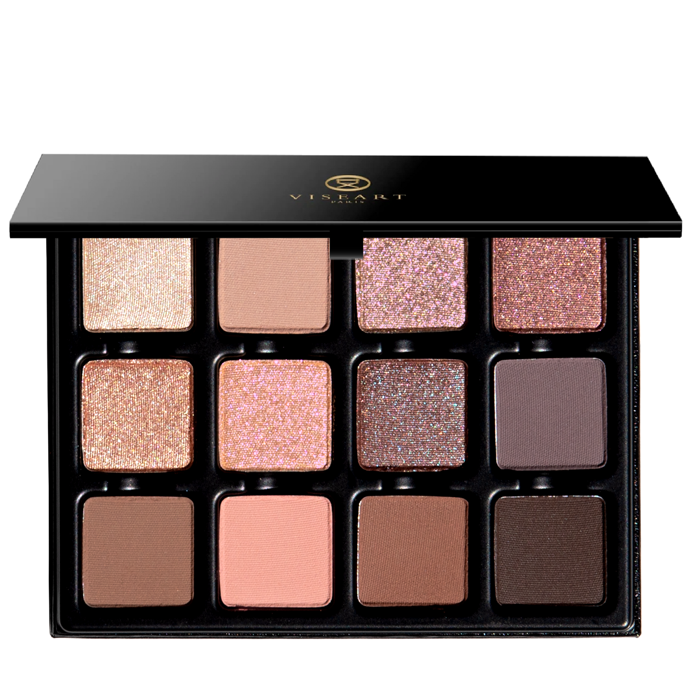

> 裸色？当然。纯真？绝非如此。睡莲秘境盘从裸肤渐变至花瓣灰粉，从月光藕紫延伸至幽深棕影。浓郁哑光、第二皮肤般的裸感色与炼金般的流光，语气轻柔，内心狂野，从不只是中性色。

> *Nude? Naturellement! Innocent? Hardly. Nymphaía Étendu slips from bare skin to dusty petal, moonlit mauve to shadowed brown. Potent mattes, second-skin neutrals, and alchemical shimmers — softly spoken, wildly awake, never simply neutral.*

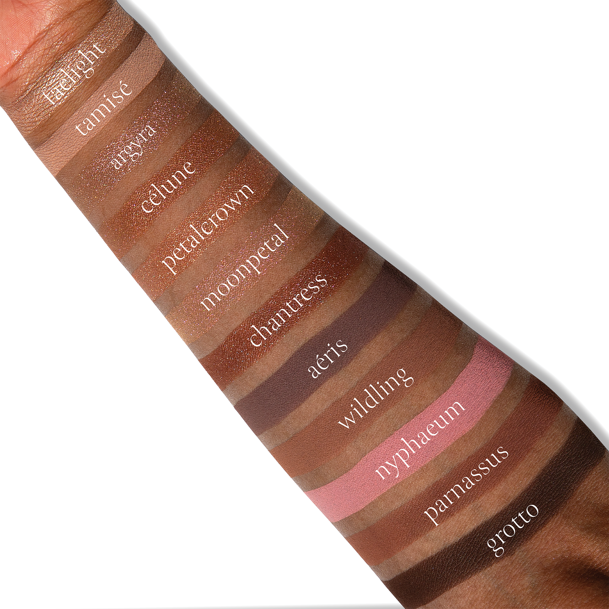

## Shade 1: Faelight — Ivory-champagne peach with a sparkling metallic finish.
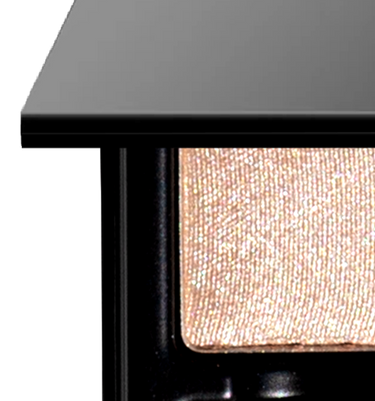

Use: Sweep this ivory-champagne shade across the lid for a veil of crystalline radiance, or tap onto the inner corners and center of the eye to catch and reflect the light. Its delicate luminosity evokes the first glimmer of faerie light dancing across the surface of a hidden pool. Apply with a brush for a diffused shimmer or fingertips for intensified reflectivity. Can be used with a mixing medium for an ultra-reflective finish. Pair with shades ‘Tamisé’ and ‘Aéris’ for an ethereal, softly sculpted look awash in otherworldly light.

##### 色号 1：仙辉香槟 (Faelight) —— 象牙香槟蜜桃色，闪耀金属质地。
用途：将这抹象牙香槟色轻扫于眼皮，营造晶莹柔光薄纱；也可点在眼头与眼皮中央，捕捉并反射光线。它细腻的亮泽像隐秘池面上跃动的第一缕仙光。用刷具可呈现轻透闪耀感，用指腹则能加强反光强度；搭配调和液可获得更高反射度。与 ‘Tamisé’ 和 ‘Aéris’ 组合，可塑造被异界微光浸润的空灵柔雕眼妆。

## Shade 2: Tamisé — Mid-tone beige-pink with a matte finish.
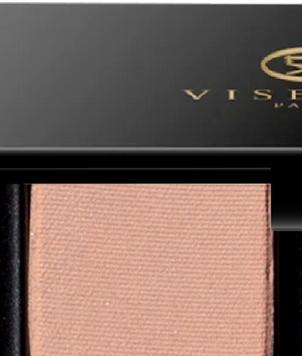

Use: Sweep this delicate beige-pink shade across the lid as a softly diffused base, or blend through the crease as a transitional hue to create subtle depth and structure. Quiet and atmospheric, Tamisé lends the eye the softened quality of light passing through foliage at the edge of a secluded garden. Apply with a brush for your desired level of intensity. Pair with shades ‘Faelight’ and ‘Chantress’ for a diaphanous taupe look suspended between light and shadow.

##### 色号 2：柔纱米粉 (Tamisé) —— 中调米粉色，哑光质地。
用途：将这抹细腻的米粉色扫于眼皮，可作柔雾打底；晕染在眼窝则能作为过渡色，带来含蓄的层次与结构感。安静而富有氛围的 Tamisé，如同僻静花园边缘穿过枝叶的柔和光线，为眼妆添上一层轻雾感。可用刷具按需叠加显色。与 ‘Faelight’ 和 ‘Chantress’ 搭配，可呈现游走于明暗之间的轻透灰褐妆效。

## Shade 3: Argyra — Nude plum-rose quartz with silver, pink, and gold duochromatic flecks.
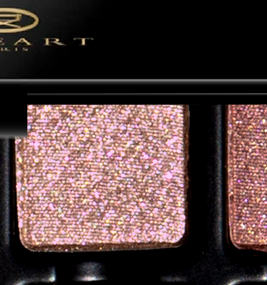

Use: This nude rose quartz shade can be used as an all-over lid colour, placed at the center of the lid for a touch of luminosity, or worn in the inner corners of the eyes for a kiss of brightness. For a high-shine, foiled effect, use with a mixing medium or add to gloss for a dewy, glistening finish. Wear with shades ‘Tamisé’ and ‘Moonpetal’ for petalsoft, opalescent sheen.

##### 色号 3：银玫石英 (Argyra) —— 裸梅玫瑰石英色，带银、粉、金双偏光闪片。
用途：这抹裸玫瑰石英色可作全眼铺色，也可点在眼皮中央增强亮泽，或用于眼头带来一抹灵动提亮。若想获得高闪箔光效果，可搭配调和液使用，或混入唇蜜，呈现水润闪烁质感。与 ‘Tamisé’ 和 ‘Moonpetal’ 组合，可打造花瓣般柔软、带欧泊光泽的眼妆。

## Shade 4: Célune — Nude tea-rose blush with a duochromatic finish.
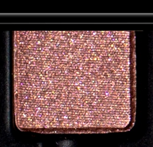

Use: Sweep this tea-rose blush shade across the lid for a wash of softly shifting colour, or tap onto the center and inner corners of the eye to enhance dimension and light. Apply with a brush for a diffused veil of radiance or fingertips to intensify the reflective finish. Can be layered over matte, satin, or metallic shades to lend an iridescent, dimensional effect. Pair with shades ‘Moonpetal’ and ‘Aéris’ for a softly spectral look of blushed petals, cool mist, and moonlight.

##### 色号 4：月玫流辉 (Célune) —— 裸调茶玫瑰腮红色，双偏光质地。
用途：将这抹茶玫瑰腮红色铺于眼皮，可呈现柔和流转的色泽；点在眼皮中央与眼头，则能增强立体感与光线感。用刷具可打造轻透柔光薄纱，用指腹则能加强反射效果。可叠加于哑光、缎光或金属色之上，赋予虹彩般的层次变化。与 ‘Moonpetal’ 和 ‘Aéris’ 搭配，可营造带有花瓣红晕、冷雾与月光气息的朦胧灵气眼妆。

## Shade 5: Petalcrown — Antique rose-gold with a shimmering metallic finish
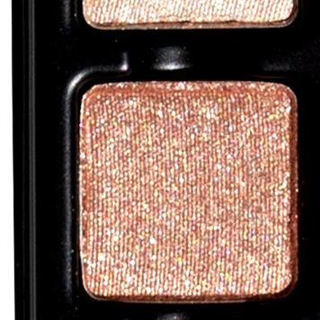

Use: Sweep this antique rose-gold shade across the lid for a warm veil of shimmering colour, or tap onto the center of the eye to illuminate and enhance dimension. Apply with a brush for a diffused effect or tap on the lid with fingertips for stronger reflectivity. Can be used with a mixing medium for a high-shine finish. Pair with shades ‘Nymphaeum’ and ‘Moonpetal’ for a romantic rose petal look with softly burnished depth.

##### 色号 5：花冠玫金 (Petalcrown) —— 复古玫瑰金色，闪耀金属质地。
用途：将这抹复古玫瑰金色扫于眼皮，可铺出温暖闪耀的柔光色幕；点在眼皮中央则能提亮并加强层次。用刷具可呈现轻柔晕染感，用指腹轻拍则能增强反光。搭配调和液可获得更高闪度。与 ‘Nymphaeum’ 和 ‘Moonpetal’ 组合，可塑造带柔和鎏金深度的浪漫玫瑰花瓣眼妆。

## Shade 6: Moonpetal — Second-skin nude with duochromatic pink, lilac and gilded reflective particles.
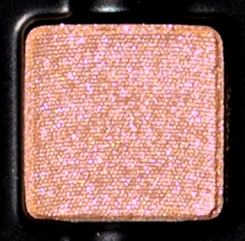

Use: Sweep this nude duochromatic shade across the lid for a wash of shifting radiance, or tap onto the center of the eye to reveal its opalescent, dimensional, gilded reflects. Like moonlight moving across a dew-soaked petal, the colour transforms with every change in light while its sheer nude base melts effortlessly into the skin. Apply with a brush for your desired level of intensity. Pair with shades ‘Argyra’ and ‘Chantress’ for a moonlit, rose gold look.

##### 色号 6：月瓣柔辉 (Moonpetal) —— 贴肤裸色基底，带粉色、丁香色与鎏金反光颗粒，双偏光质地。
用途：将这抹裸色双偏光扫于眼皮，可带来流转变幻的柔亮光泽；点在眼皮中央，则能展现它如欧泊般多维的鎏金反光。就像月光掠过覆着露水的花瓣，光线每次变化都会让它显出不同面貌，而轻透的裸色基底又能自然融入肤色。可用刷具按需叠加显色。与 ‘Argyra’ 和 ‘Chantress’ 搭配，可呈现月光下的玫瑰金妆效。

## Shade 7: Chantress — Nude mauve with blue duochromatic flecks.
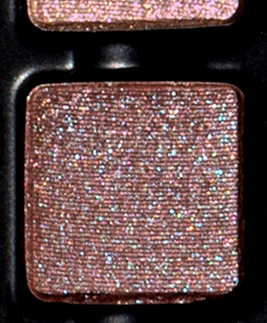

Use: Sweep this nude-mauve shade across the lid for a velvety wash of reflective colour or blend through the crease and outer corner to add dusky definition. Apply with a brush for your desired level of intensity. Pair with shades ‘Faelight’ and ‘Aéris’ for a tantalizing, taupe-plum eye that moves between shadow and light.

##### 色号 7：吟咒裸紫 (Chantress) —— 裸紫红色，带蓝色双偏光闪片。
用途：将这抹裸豆沙紫色铺于眼皮，可呈现丝绒般的反光色泽；晕染于眼窝与眼尾，则能添上朦胧而深邃的轮廓。可用刷具按需叠加显色。与 ‘Faelight’ 和 ‘Aéris’ 组合，可打造游走于光影之间、迷人的灰褐梅子色眼妆。

## Shade 8: Aéris — Mid-tone greige-purple with a matte finish.
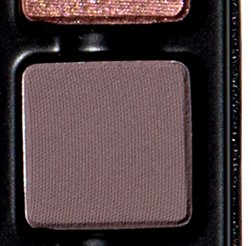

Use: This mid-tone, matte, greige shade can be used as an all-over lid colour, a transitional shade to build out the crease and socket, a soft liner, or as a base tone beneath complementary tones. Apply with a brush for your desired level of intensity. Blend with shades ‘Chantress’ and ‘Grotto’ for spectral, smoke-softened eyes in shades of mist, dew, and twilight.

##### 色号 8：空灵灰紫 (Aéris) —— 中调灰米紫色，哑光质地。
用途：这抹中调哑光灰米色可作全眼铺色、眼窝过渡色、柔和眼线色，也可作为互补色下方的底色。可用刷具按需叠加显色。与 ‘Chantress’ 和 ‘Grotto’ 晕染搭配，可塑造如薄雾、露水与暮色交织的烟柔灵气眼妆。

## Shade 9: Wildling — Earthy fawn-brown with a matte finish.
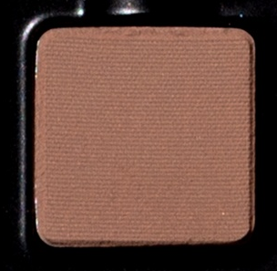

Use: Sweep this earthy fawn-brown shade through the crease to add natural warmth and dimension, or diffuse across the lid for a softly weathered wash of colour. Wildling brings an untamed, earthen element to Nymphaia, grounding its luminous petals and moonlit metallics in soil, bark, and root. Apply with a brush for your desired level of intensity. Pair with shades ‘Petalcrown’ and ‘Nymphaeum’ for a warm, neutral look touched with faded floral colour.

##### 色号 9：野灵褐棕 (Wildling) —— 大地小鹿棕色，哑光质地。
用途：将这抹大地小鹿棕色扫入眼窝，可增添自然暖意与立体感；大面积晕染于眼皮，则能带来柔和风化感的色幕。Wildling 为 Nymphaia 注入未经驯化的土壤气息，让盘中的花瓣亮泽与月光金属色落回泥土、树皮与根系的深处。可用刷具按需叠加显色。与 ‘Petalcrown’ 和 ‘Nymphaeum’ 搭配，可呈现一抹沾染褪色花影的暖调中性色眼妆。

## Shade 10: Nymphaeum — Muted waterlily pink with a matte finish.
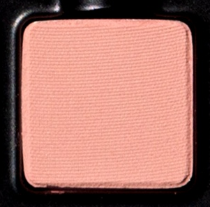

Use: Sweep this delicate waterlily pink across the lid for a soft flush of petal colour, or diffuse through the crease for rosy dimension. Romantic yet slightly wild, Nymphaeum captures the faded beauty of flowers blooming among ancient stone and still water. Apply with a brush for your desired level of intensity. Pair with shades ‘Moonpetal’ and ‘Parnassus’ for an enchanted floral eye in shades of waterlily pink, soft earth, and shimmering light.

##### 色号 10：睡莲柔粉 (Nymphaeum) —— 柔雾睡莲粉色，哑光质地。
用途：将这抹细腻的睡莲粉色铺于眼皮，可晕出柔和花瓣红晕；扫入眼窝，则能带来带玫调的立体层次。浪漫却略带野性，Nymphaeum 像是古老石壁与静水之间悄然盛放的花朵，呈现微微褪色却更动人的美感。可用刷具按需叠加显色。与 ‘Moonpetal’ 和 ‘Parnassus’ 搭配，可打造睡莲粉、柔土色与闪烁微光交织的梦幻花境眼妆。

## Shade 11: Parnassus — Muted rose-brown with a matte finish.
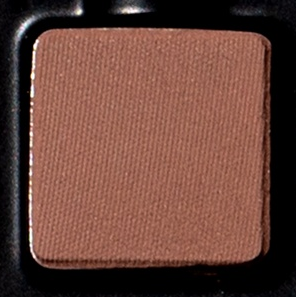

Use: Sweep this earthen rose-brown shade across the lid for a warm, muted wash of colour, or blend through the crease and outer corner to sculpt and deepen the eye. Its balance of rose and earth creates a natural bridge between Nymphaia’s floral tones and shadowed neutrals. Apply with a brush for your desired level of intensity. Pair with shades ‘Nymphaeum’ and ‘Petalcrown’ for a romantic, antiqued rose look.

##### 色号 11：帕纳苏斯玫棕 (Parnassus) —— 柔雾玫瑰棕色，哑光质地。
用途：将这抹大地玫瑰棕色扫于眼皮，可铺出温暖而柔和的色雾；晕染于眼窝和眼尾，则能雕塑眼型并加深轮廓。它在玫瑰调与土色之间取得平衡，自然衔接 Nymphaia 盘中的花卉色彩与阴影中性色。可用刷具按需叠加显色。与 ‘Nymphaeum’ 和 ‘Petalcrown’ 组合，可呈现浪漫的复古玫瑰妆效。

## Shade 12: Grotto — Espresso-bitter brown with a matte finish.
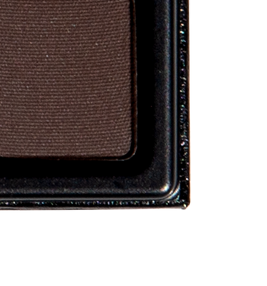

Use: Blend this espresso-bitter brown shade along the outer corner of the eye to create rich depth and definition, or sweep through the crease and along the lash line for a softly smoked effect. Grotto anchors the palette’s diaphanous pinks, silvery taupes, and luminous metallics with the mysterious depth of wet stone and still water. Apply with a brush for your desired level of intensity. Use with a dampened liner brush or mixing medium for increased saturation and precision. Pair with shades ‘Argyra’ and ‘Aéris’ for a cool, moonlit smoky eye that recalls silver light slipping into the depths of a hidden grotto.

##### 色号 12：幽窟深棕 (Grotto) —— 浓缩苦咖棕，哑光质地。
用途：将这抹浓缩苦棕色晕染于眼尾，可营造浓郁深度与清晰轮廓；扫入眼窝并贴近睫毛根部，则能带来柔和烟熏感。Grotto 以湿石与静水般神秘幽深的基调，稳稳托住盘中轻透粉色、银灰褐色与发光金属色。可用刷具按需叠加显色；若想提升饱和度与描画精度，可搭配微湿眼线刷或调和液使用。与 ‘Argyra’ 和 ‘Aéris’ 搭配，可打造仿佛银光滑入隐秘洞窟深处的冷调月光烟熏眼妆。
