# Viseart 12色 中号 巴黎星夜盘 Paris Nuit Étoilée Étendu
*发布：2025*

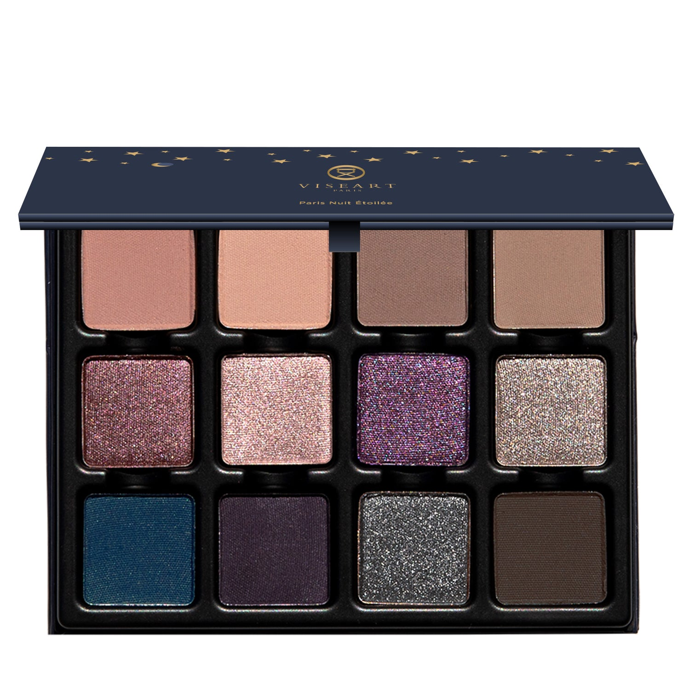

> 星光与暗影在巴黎夜晚相遇——这是我们为烟熏眼妆倾力写就的诗章。从星光细如游丝到浓烈的全蚀深邃，十二色在黑曜、黑莓、锡灰与墨色间雕塑、闪耀、余烬燃烧，以月辉微闪与午夜哑光，在夜幕降临时绽放。

> *Starlight and shadow meet in the Parisian night with Paris Nuit Étendu, our masterful smokey eye opus. From sheer tendrils of starlight to the full eclipse of intensity, twelve shades sculpt, shimmer, and smoulder in obsidian, blackberry, pewter, and ink, with moonlit shimmers and midnight mattes for nightfall.*

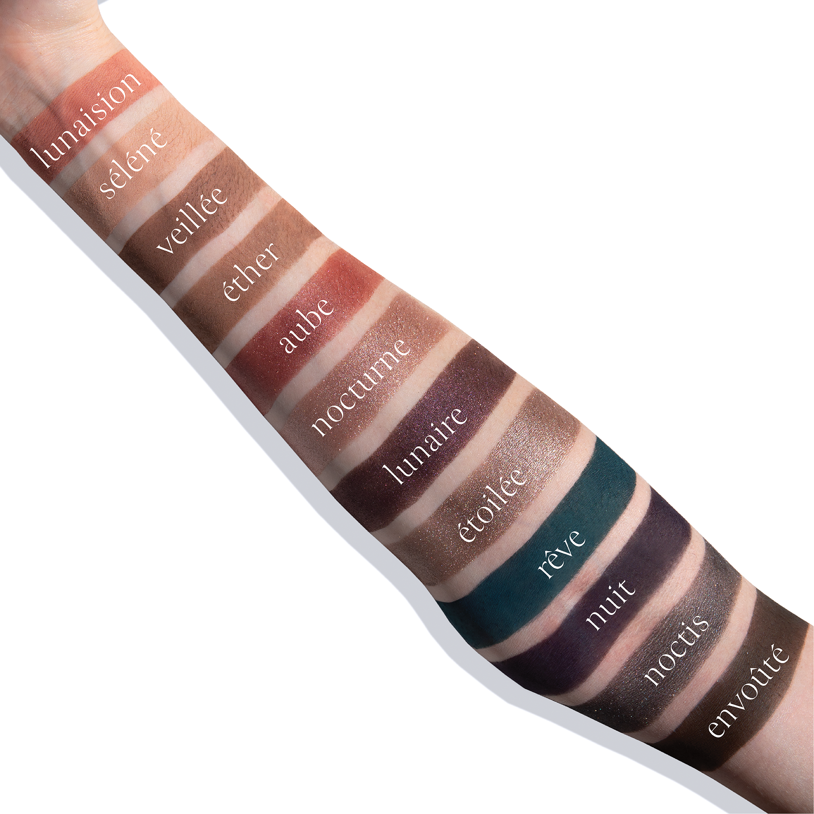
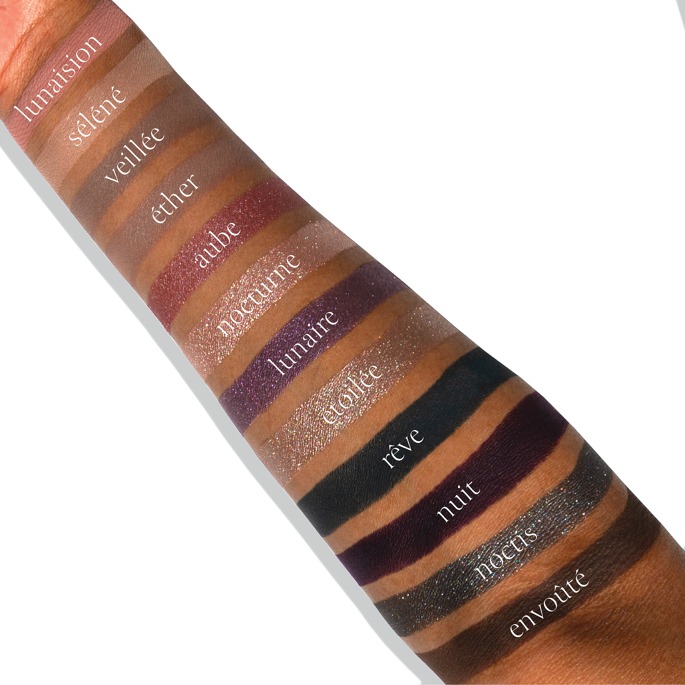

## Shade 1: Lunaision — Muted dusty mauve with a matte finish.
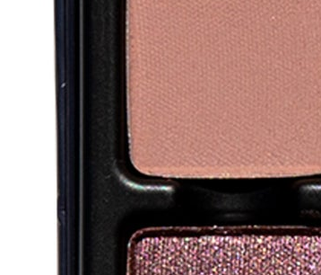

Use: Use this dusty mauve shade as an all-over lid color on all complexions, in the crease and outer corners of the eyes as a transitional mid-tone hue, or a neutral base beneath complementary tones. Can also be used as a blush tone on light to medium complexions. Apply with a brush for your desired level of intensity. Pair with shades ‘Aube’ and ‘Nocturne’ for a rose-toned reverie.

##### 色号 1：月雾 (Lunaision) —— 柔雾灰豆沙色，哑光质地。
用途：可作全眼铺色，用于眼窝与眼尾作为中间过渡色，或作为互补色下方的中性色打底；浅至中等肤色也可作腮红。可用刷具按需叠加显色度。与 `Aube` 和 `Nocturne` 搭配，可呈现柔雾玫瑰调妆感。

## Shade 2: Séléné — Cool, light beige with a matte finish.
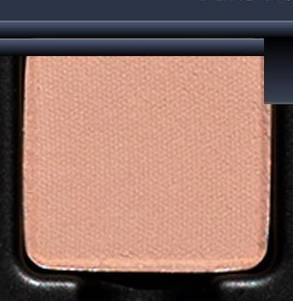

Use: Use this cool light beige tone as an all-over lid color on all complexions, in the crease and outer corners of the eyes as a transitional mid-tone hue, or a neutral base beneath complementary tones. Apply with a brush for your desired level of intensity. Wear with shades ‘Veillée’ and ‘Nocturne’ for a soft-sculpted, naturally defined look.

##### 色号 2：月神 (Séléné) —— 冷调浅米色，哑光质地。
用途：可作全眼铺色，用于眼窝与眼尾作为过渡中间色，或作为互补色下方的中性色打底。可用刷具按需叠加显色度。与 `Veillée` 和 `Nocturne` 搭配，可打造柔和自然的轮廓眼妆。

## Shade 3: Veillée — Midtone cool grey taupe with a matte finish.
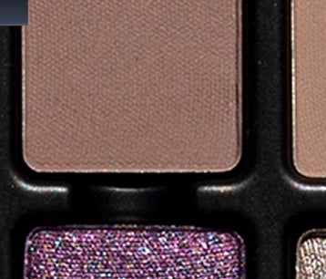

Use: Use this cool grey taupe shade as an all-over lid color on all complexions, in the crease as a transitional crease shade, or to build out depth and dimension in the outer corners of the eyes. Can be used as a soft eyeliner on all skin tones, in the brows and hairline, or as a subtle contour shade on light to medium complexions. Apply with a brush for your desired level of intensity. Wear as a base tone beneath shades ‘Étoilée’ and ‘Envoûté’ for smoldering depth and drama.

##### 色号 3：守夜灰棕 (Veillée) —— 中调冷灰棕色，哑光质地。
用途：可作全眼铺色、眼窝过渡色，或用于眼尾叠出深度与立体感。适合所有肤色作柔和眼线，也可用于眉部、发际线；浅至中等肤色还可作自然修容。可用刷具按需叠加显色度。叠在 `Étoilée` 和 `Envoûté` 下方，可强化深邃烟熏感。

## Shade 4: Éther — Midtone neutral beige with a matte finish.
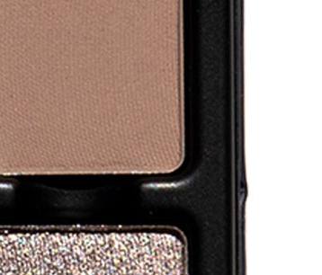

Use: Use this midtone neutral beige shade as an all-over lid color on all complexions, in the crease and outer corners of the eyes as a transitional crease shade, or to build out depth and dimension in the outer corners of the eyes. Can be used in the brows, hairline, or as a contour shade on light to medium complexions. Apply with a brush for your desired level of intensity. Pairs perfectly with shades ‘Séléné’ and ‘Étoilée’ for a seamless, effortlessly elevated eye look.

##### 色号 4：以太米杏 (Éther) —— 中调中性米色，哑光质地。
用途：可作全眼铺色，用于眼窝与眼尾作为过渡色，或叠出柔和层次。也可用于眉部、发际线，浅至中等肤色还可作修容。可用刷具按需叠加显色度。与 `Séléné` 和 `Étoilée` 搭配，可完成自然衔接的精致眼妆。

## Shade 5: Aube — Burgundy rose with a satin shimmer finish.
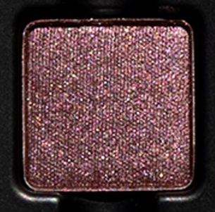

Use: Wear this burgundy rose shade alone for a striking monochromatic glow, or layer over deeper tones for a veil of rose-lit shimmer. Can also be used as liner or worn as a shimmering blush on medium to deep complexions. Apply with a brush for your desired level of intensity. Blend with shades ‘Éther’ and ‘Nocturne’ to sculpt a multi-dimensional, rich, and rosy look.

##### 色号 5：晨曦玫瑰 (Aube) —— 酒红玫瑰色，缎闪质地。
用途：可单独使用打造吸睛单色光泽，也可叠加在深色之上，罩出玫瑰微闪层次。中等至深肤色可作微闪腮红，也可作眼线色。可用刷具按需叠加显色度。与 `Éther` 和 `Nocturne` 搭配，可塑造浓郁立体的玫瑰调妆感。

## Shade 6: Nocturne — Champagne rose with a metallic finish.
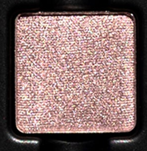

Use: Wear this champagne rose shade as an all-over lid color on all complexions or layered over complementary tones for a refined wash of reflectivity. Can also be used as a highlighter in the center of the lids or to brighten the inner corners of the eyes. Use this shade with a mixing medium for a foiled effect. Apply with a brush for your desired level of intensity. Pair with shades ‘Séléné’ and ‘Nuit’ for a blackberry-mauve look kissed by twilight’s final glow.

##### 色号 6：夜曲 (Nocturne) —— 香槟玫瑰色，金属光泽。
用途：可作全眼铺色，或叠加在互补色之上，带出细腻反光层次；也可点在眼皮中央或眼头提亮。搭配调和液可获得箔光效果。可用刷具按需叠加显色度。与 `Séléné` 和 `Nuit` 搭配，可呈现暮光亲吻般的黑莓豆沙妆感。

## Shade 7: Lunaire — Deep violet with a duochromatic finish.
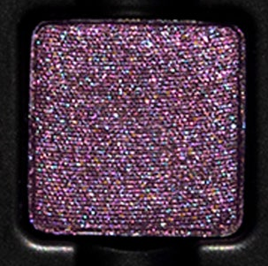

Use: Use this violet duochromatic shade as an all-over lid colour, layered over complementary tones for a high-impact reflective finish, or blended with deeper shades to create a sultry, smoldering effect. Can be used as a liner or with a mixing medium for a foiled appearance. Apply with a brush for your desired level of intensity. Blend with ‘Éther’ and ‘Nuit’ for a multi-chrome, smoked blackberry look with a prismatic shift.

##### 色号 7：月辉紫 (Lunaire) —— 深紫色，双偏光质地。
用途：可作全眼铺色，或叠加在互补色上，打造高冲击反光效果；与深色晕染则能呈现魅惑烟熏感。可作眼线色，也可搭配调和液获得箔光质感。可用刷具按需叠加显色度。与 `Éther` 和 `Nuit` 搭配，可做出带棱彩偏光的黑莓烟熏妆效。

## Shade 8: Étoilée — Deep gunmetal brown with a satin metallic finish.
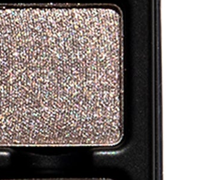

Use: This deep gunmetal brown shade can be used as an all-over lid colour, layered over complementary tones for a reflective finish, or blended with deeper shades to create a smokey, seductive effect. Use this shade with a mixing medium for a foiled appearance. Apply with a brush for your desired level of intensity. Pair with shades “Éther” and “Envoûté” for a soft smokescape in twilight taupe.

##### 色号 8：星夜枪灰 (Étoilée) —— 深枪灰棕色，缎金属质地。
用途：可作全眼铺色，或叠加在互补色之上加强反光，也可与更深色晕染出深邃烟熏效果。搭配调和液可获得箔光质感。可用刷具按需叠加显色度。与 `Éther` 和 `Envoûté` 搭配，可呈现暮色灰棕调的柔烟妆感。

## Shade 9: Rêve — Steel French blue with a matte finish.
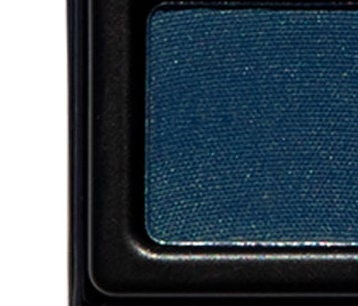

Use: Use this matte steel blue as an all-over lid color, as a richly saturated base beneath complementary tones, or to define the outer corners of the eyes for a cool-toned smokey look. Can also be worn as a bold, graphic liner. Apply with a brush for your desired level of intensity. Pair with shades ‘Séléné’ and ‘Noctis’ for a luminous look evocative of a midnight lagoon.

##### 色号 9：幻梦钢蓝 (Rêve) —— 钢感法式蓝，哑光质地。
用途：可作全眼铺色，或作为互补色下方的高饱和打底色，也可用于眼尾勾勒冷调烟熏轮廓。也适合画出利落图形眼线。可用刷具按需叠加显色度。与 `Séléné` 和 `Noctis` 搭配，可呈现午夜泻湖般的冷光妆感。

## Shade 10: Nuit — Smoked blackberry with a matte finish.
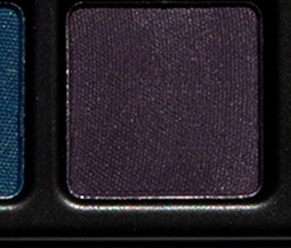

Use: Use this smoked blackberry as an all-over lid, as a richly saturated base beneath complementary tones, or to define the outer corners of the eyes for a cool-toned smokey look. Can also be worn as a bold, graphic liner. Apply with a brush for your desired level of intensity. Layer with shades ‘Nocturne’ and “Lunaire”’ for a violet veil of shimmer, smoke, and celestial elegance.

##### 色号 10：夜幕黑莓 (Nuit) —— 烟熏黑莓色，哑光质地。
用途：可作全眼铺色，或作为互补色下方的高饱和打底色，也可用于眼尾勾勒冷调烟熏层次。也适合画出利落图形眼线。可用刷具按需叠加显色度。叠加 `Nocturne` 和 `Lunaire`，可营造紫调微闪与烟雾交织的星夜妆感。

## Shade 11: Noctis — Deep grey with a crystalline metallic finish.
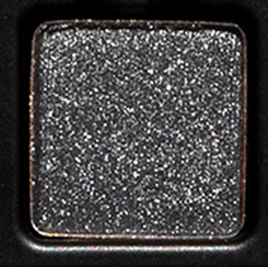

Use: Use this deep grey metallic shade as an all-over lid color, layered over complementary tones for dimensional depth, or in the outer corners of the eyes to line and define. Can also be used with a mixing medium for a foiled effect. Apply with a brush for your desired level of intensity. Layer over shade ‘Veillée’ and blend with shade ‘Envoûté’ to create a steel-toned smokey eye with dramatic depth.

##### 色号 11：暗夜银灰 (Noctis) —— 深灰色，晶亮金属质地。
用途：可作全眼铺色，或叠加在互补色之上增强立体深度，也可用于眼尾与睫毛根部勾勒轮廓。搭配调和液可获得箔光效果。可用刷具按需叠加显色度。叠在 `Veillée` 上并与 `Envoûté` 晕染，可做出钢感烟熏妆效。

## Shade 12: Envoûté — Deep espresso brown with a matte finish.
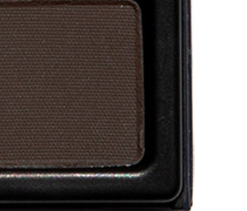

Use: Use this deep espresso brown shade as an all-over lid color for all complexions, a transitional crease shade, or to build out depth and dimension in the outer corners of the eyes. This shade can be used to create a deep smokey eye all over the lid, as eyeliner, or to fill in brows and hairlines on complementary hair tones. Can be layered with mattes and shimmers for a multitude of different looks. Apply with a brush for your desired level of intensity. Pair with shades ‘Rêve’ and ‘Noctis’ for a cool-toned, gunmetal gaze where steel meets shadow.

##### 色号 12：迷魅浓咖 (Envoûté) —— 深浓缩咖棕色，哑光质地。
用途：可作全眼铺色、眼窝过渡色，或用于眼尾加深立体感。也适合铺满眼皮打造深烟熏效果，或作眼线、眉部与发际线修饰。可与哑光和珠光色叠搭，延展出多种妆效。可用刷具按需叠加显色度。与 `Rêve` 和 `Noctis` 搭配，可完成冷调枪灰感的深邃眼妆。
