# Viseart 12色 中号 巴黎绮梦盘 Paris Rêveries Étendu
*发布：2024*

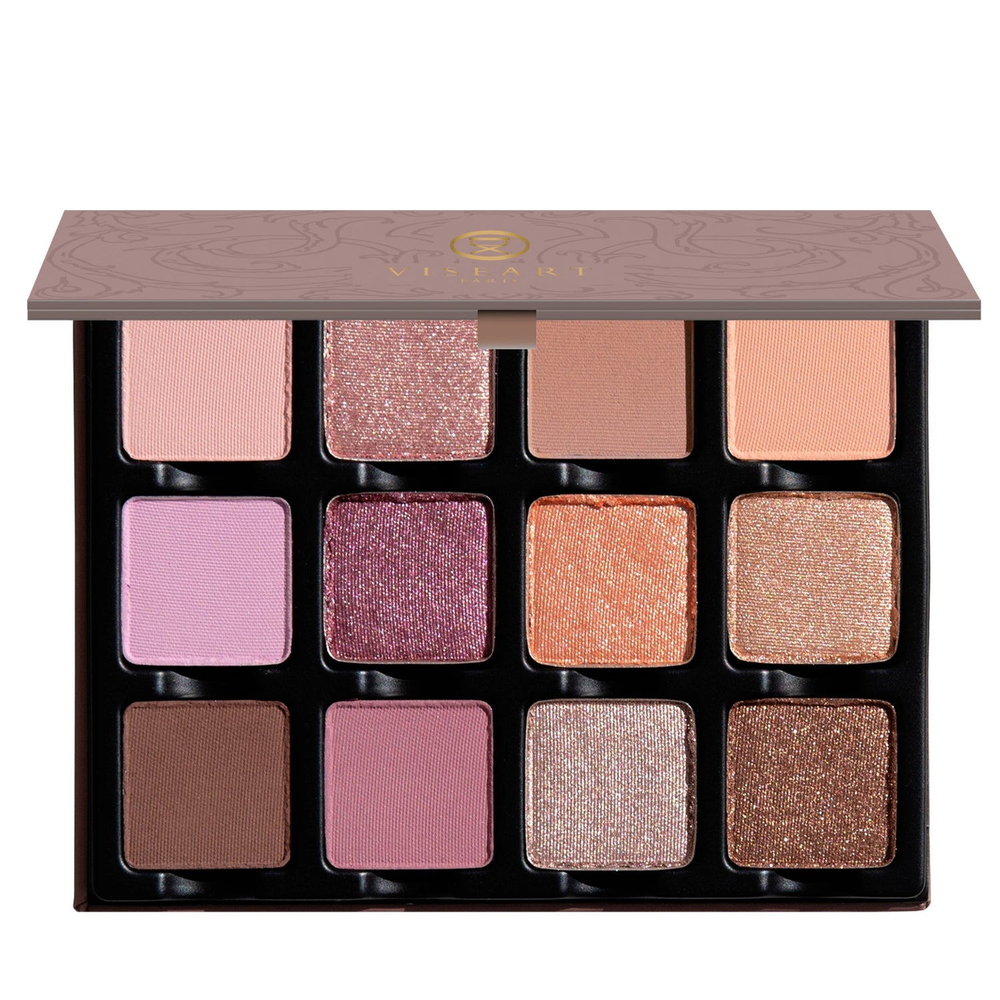

> 以巴黎晴日悠闲漫步于秘密花园为灵感，这款浪漫的"绮梦"眼影盘如偶遇的甜蜜，以收敛克制的色调挑动芳心，兼具天穹般的柔美与女神光泽的盈盈闪耀。

> *Inspired by dreams of idyllic Parisian days wandering through secret gardens, our romantic 'Reveries' palette is serendipitously sweet with provocatively pared-back hues, with celestial softness and glistening, goddess-worthy grace.*

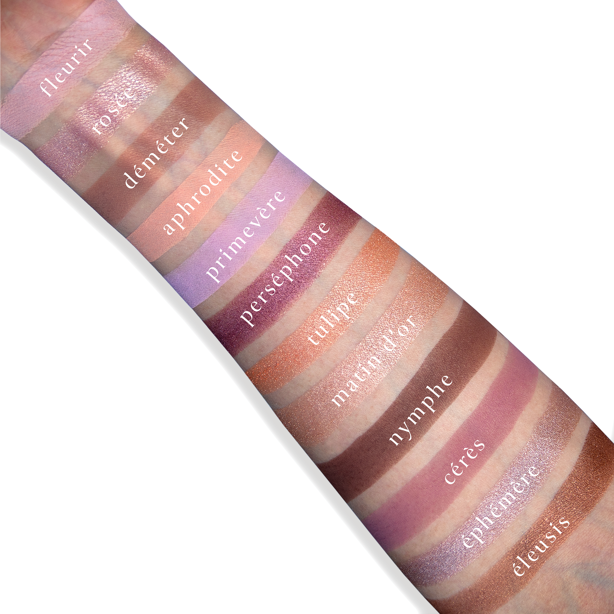
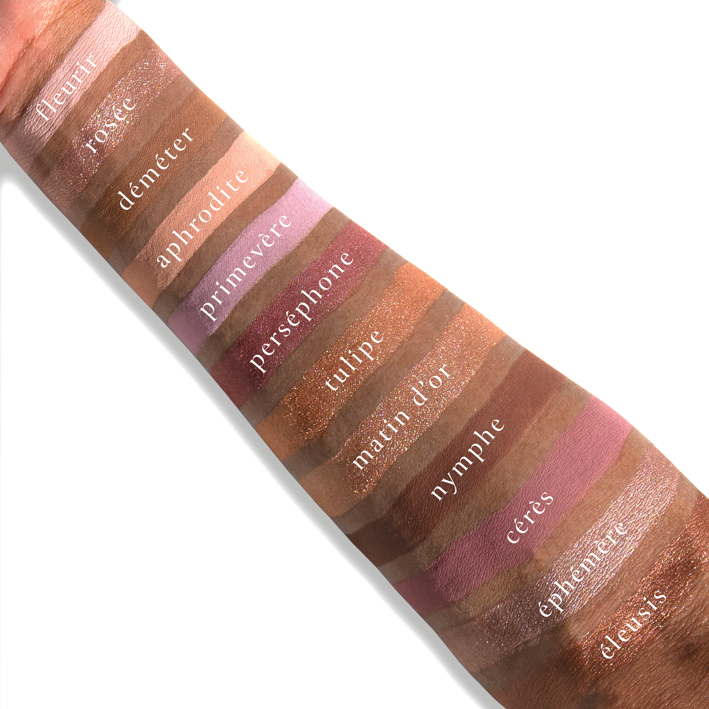

## Shade 1: Fleurir — Nude light pink with a matte finish.
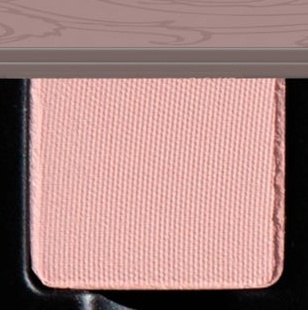

Use: This nude light pink shade can be used as an all-over lid colour or as a base tone beneath complementary shades. It can also be used to highlight the brow bone and inner corners of the eyes. Additionally, it can be mixed with any of the other tones to brighten, lighten to create over 12 new hues. Pair with shades ‘Rosée’ and ‘Perséphone’ for a soft and shimmering romantic rose look. Apply with a brush for your desired level of intensity.

##### 色号 1：花绽柔粉 (Fleurir) —— 裸调浅粉色，哑光质地。
用途：这抹裸调浅粉色可作全眼铺色，或作为互补色下方的打底色，也可用于眉骨和眼头提亮。还能与盘中其他色调混合，提亮并调浅，延展出 12 种以上新色。与 ‘Rosée’ 和 ‘Perséphone’ 搭配，可呈现柔和微闪的浪漫玫瑰眼妆。可用刷具按需叠加显色度。

## Shade 2: Rosée — Light pink champagne with a high-shine, metallic finish.
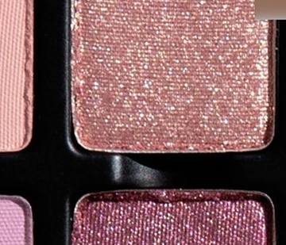

Use: This high-shine, pink champagne shade can be used as an all-over base tone or layered over complementary tones for a refined wash of reflectivity. Combine with a mixing medium for an ultra-foiled effect. This shade can also be mixed into gloss to add a kiss of brilliance to any lip look. Blend with shades ‘Fleurir’ and ‘Éphémère’ for a nude, sophisticated, sunlit shine. Apply with fingertips or a dense brush for your desired level of intensity.

##### 色号 2：玫露香槟 (Rosée) —— 浅粉香槟色，高闪金属质地。
用途：这抹高闪粉香槟色可作全眼打底色，或叠加在互补色之上，带出细腻反光层次。搭配调和液可获得更强烈的箔光效果，也可混入唇蜜，为唇妆增添一抹亮泽。与 ‘Fleurir’ 和 ‘Éphémère’ 搭配，可呈现裸调、精致、仿佛沐浴日光的光泽感。可用指腹或扎实刷具按需叠加显色度。

## Shade 3: Déméter — Midtone cool-toned taupe fawn brown with a matte finish.
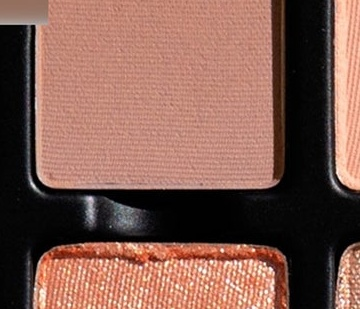

Use: This mid-tone, cool taupe shade can be used as an all-over lid colour, or as a base tone for light, medium, and deep skin tones. Use as a transitional shade to build soft depth and dimension or as an adjuster mixed with other shades to create depth. Pair with shades ‘Fleurir’ and ‘Nymphe’ for an all-matte, coquettish, chocolatey-neutral eye look. Apply with a brush for your desired level of intensity.

##### 色号 3：德墨忒耳灰褐 (Déméter) —— 中调冷灰褐小鹿棕色，哑光质地。
用途：这抹中调冷灰褐色可作全眼铺色，也适合作为浅、中、深肤色的打底色。可用作过渡色，叠出柔和深度与层次，也可与其他颜色混合充当调节色，增强整体深邃感。与 ‘Fleurir’ 和 ‘Nymphe’ 搭配，可呈现全哑光、俏皮又带巧克力中性色调的眼妆。可用刷具按需叠加显色度。

## Shade 4: Aphrodite — Light fresh cantaloupe with a matte finish.
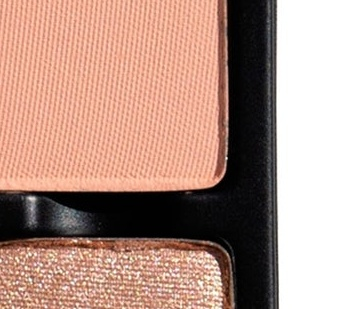

Use: This light, fresh cantaloupe color can be used as an all-over lid colour or as a base tone beneath complementary shades. It can also be used to highlight the brow bone and inner corners of the eyes, or as a transitional shade in the socket of the eye. Can also be used as a blush shade on light complexions. Use as a base tone beneath shades ‘Tulipe’ and ‘Matin D'or’ for the perfect pearlized peachy look. Apply with fingertips or a dense brush for your desired level of intensity.

##### 色号 4：阿佛洛狄忒蜜橘 (Aphrodite) —— 浅清甜哈密瓜橘色，哑光质地。
用途：这抹清新的浅哈密瓜橘色可作全眼铺色，或作为互补色下方的打底色。也可用于眉骨和眼头提亮，或作为眼窝过渡色；浅肤色还可作腮红使用。以它打底再叠加 ‘Tulipe’ 和 ‘Matin D'or’，可打造恰到好处的珍珠蜜桃眼妆。可用指腹或扎实刷具按需叠加显色度。

## Shade 5: Primevère — Light pastel lilac with a matte finish.
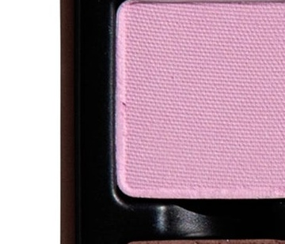

Use: This light pastel lilac can be used as an all-over lid colour, in the inner corners and under the brow bone as a highlighter, as a transitional crease colour, or layered beneath complementary hues. Can also be used as a blush shade on light complexions. Pair with shades ‘Perséphone’ and ‘Cérès’ for a ravishing, regal, rosy look. Apply with a brush for your desired level of intensity.

##### 色号 5：报春花淡紫 (Primevère) —— 浅粉彩丁香紫色，哑光质地。
用途：这抹浅粉彩丁香紫可作全眼铺色，也可用于眼头和眉骨下方提亮，充当眼窝过渡色，或叠在互补色下方打底。浅肤色还可作腮红使用。与 ‘Perséphone’ 和 ‘Cérès’ 搭配，可呈现迷人又带贵气的玫瑰色眼妆。可用刷具按需叠加显色度。

## Shade 6: Perséphone — Metallic roseberry with a satin finish.
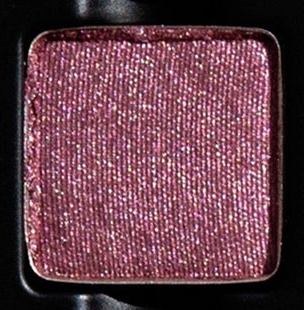

Use: This metallic rose-berry shade can be used as an all-over lid colour, layered over complementary tones for depth and vibrancy, or foiled with a mixing medium for a reflective finish. Can also be worn as a liner or mixed into a complementary gloss. Layer over ‘Cérès’ and blend with ‘Rosée’ for a blissfully blushed berry finish. Apply with fingertips or a dense brush for your desired level of intensity.

##### 色号 6：珀耳塞福涅玫莓 (Perséphone) —— 金属玫莓色，缎光质地。
用途：这抹金属玫莓色可作全眼铺色，叠加在互补色之上可增加深度与鲜活感，也可搭配调和液打造高反射箔光效果。还可作眼线色，或混入相配唇蜜中使用。叠在 ‘Cérès’ 之上并与 ‘Rosée’ 晕染，可呈现愉悦柔红的莓果光泽妆效。可用指腹或扎实刷具按需叠加显色度。

## Shade 7: Tulipe — Light white-peach with a metallic shimmer finish.
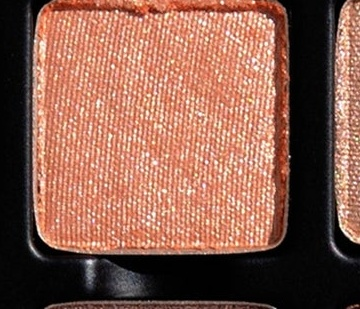

Use: This light white-peach shimmer shade can be used as an all-over lid colour, in the inner corners of the eyes and under the brow bone as a highlighter, or layered over complementary hues for a luminous finish. Can also be worn as highlighter on the high points of the face on medium to deep skin tones. Mix with your favourite gloss or combine with a mixing medium for a high shine foiled effect. Wear overtop of ‘Aphrodite’ for a pop of brilliance, or blended with ‘Matin D'or’ for an alluring apricot eye look. Apply with fingertips or a dense brush for your desired level of intensity.

##### 色号 7：郁金白桃 (Tulipe) —— 浅白桃色，金属闪光质地。
用途：这抹浅白桃色闪光可作全眼铺色，也可用于眼头与眉骨下方提亮，或叠加在互补色之上，带来明亮光泽感。中等至深肤色也可将它作面部高光使用。可混入喜爱的唇蜜，或搭配调和液获得高闪箔光效果。叠在 ‘Aphrodite’ 之上能点亮整体妆感，与 ‘Matin D'or’ 晕染则可呈现迷人的杏桃眼妆。可用指腹或扎实刷具按需叠加显色度。

## Shade 8: Matin D'or — Champagne nude peach with a metallic finish.
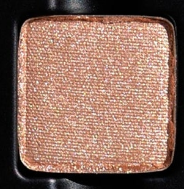

Use: This champagne nude peach shade can be used as an all-over lid colour, in the inner corners of the eyes for light and dimension, or to highlight the brow bone, cheekbones, or high points of the face for a luxurious luminous second skin effect. Wear alone or apply overtop any other shades to brighten, lighten, and create over twelve new hues. Can also be mixed into gloss to add a kiss of brilliance to any lip look. Pair with shades ‘Éphémère’ and ‘Éleusis’ for an effortless, elevated, everyday eye look! Apply with a dense brush for your desired level of intensity. Use with the Viseart Seamless Eye Primer or other preferred mixing medium for a foiled effect.

##### 色号 8：晨光金桃 (Matin D'or) —— 香槟裸桃色，金属质地。
用途：这抹香槟裸桃色可作全眼铺色，也可用于眼头提亮增添立体感，或提亮眉骨、颧骨和面部高点，营造奢润贴肤光泽。既可单独使用，也可叠加在盘中其他颜色之上，提亮、调浅并延展出 12 种以上新色。还可混入唇蜜，为唇妆添上一抹亮泽。与 ‘Éphémère’ 和 ‘Éleusis’ 搭配，可轻松完成更精致的日常眼妆。可用扎实刷具按需叠加显色度；搭配 Viseart Seamless Eye Primer 或其他调和液可获得箔光效果。

## Shade 9: Nymphe — Mid-tone tawny chocolate brown with a matte finish.
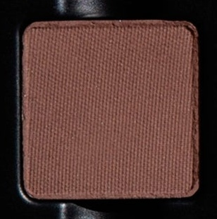

Use: This mid-tone chocolate brown shade can be used to create depth and dimension in the crease, socket, and lash line. Build up the colour in the outer corners of the eyes for a boldly pigmented finish or use a mixing medium and liner brush for a graphic finish. Pairs perfectly with ‘Déméter’ and ‘Éleusis’ for creamy, chocolatey colour. Use a brush for your desired level of intensity.

##### 色号 9：宁芙巧棕 (Nymphe) —— 中调黄褐巧克力棕色，哑光质地。
用途：这抹中调巧克力棕色适合用于眼窝、轮廓与睫毛根部加深，增强深邃度与立体感。可在眼尾逐步叠加，做出高显色效果；也可搭配调和液和眼线刷完成更利落的图形眼线。与 ‘Déméter’ 和 ‘Éleusis’ 搭配，可呈现柔滑浓郁的巧克力色调。可用刷具按需叠加显色度。

## Shade 10: Cérès — Dusty pink-plum with a matte finish.
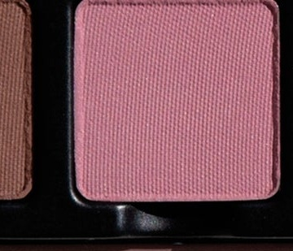

Use: This dusty pink-plum shade can be used as an all-over lid colour, as a transition shade to build out the crease and socket, as a soft liner, or as a base tone beneath complementary tones for increased depth and saturation. Mix this hue with the other matte shades to create 12 new shades. Pairs perfectly with ‘Primevère’ and ‘Perséphone’ for a delightfully, dusky, rose eye! Apply with a brush for your desired level of intensity.

##### 色号 10：刻瑞斯粉李 (Cérès) —— 灰雾粉李色，哑光质地。
用途：这抹灰雾粉李色可作全眼铺色、眼窝过渡色、柔和眼线色，或作为互补色下方的打底色以增强深度与饱和度。与盘中其他哑光色混合，还可延展出 12 种新色。与 ‘Primevère’ 和 ‘Perséphone’ 搭配，可呈现带暮色感的玫瑰眼妆。可用刷具按需叠加显色度。

## Shade 11: Éphémère — Cool-toned silver rose mauve taupe with a metallic finish.
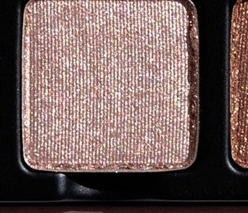

Use: This cool-toned silver-taupe shade can be used as an all-over lid colour, layered over complementary tones for an ultra-reflective, radiant finish, or used as a liner for subtle definition along the lash line. Pairs perfectly with shades ‘Fleurir’ and ‘Rosée’ for a wash of transfixing tantalizing taupe! Apply with fingertips or a dense brush for your desired level of intensity or use with a mixing medium for a foiled effect.

##### 色号 11：流光灰玫 (Éphémère) —— 冷调银玫豆沙灰褐色，金属质地。
用途：这抹冷调银灰褐色可作全眼铺色，叠加在互补色之上可带来高反射的明亮光泽，也可作为眼线色，沿睫毛根部勾勒细致轮廓。与 ‘Fleurir’ 和 ‘Rosée’ 搭配，可呈现迷人的灰褐微光妆感。可用指腹或扎实刷具按需叠加显色度；搭配调和液可获得更强烈的箔光效果。

## Shade 12: Éleusis — Bright mid-tone warm bronzed copper brown with a metallic finish.
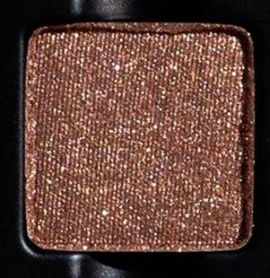

Use: This mid-tone warm copper shade can be used as an all-over lid colour, in the crease and socket for buildable dimension, or overtop of any of the shades in the palette for a multifaceted finish. Can also be worn along the lash line as a subtle liner. Use with the Viseart Seamless Eye Primer or your preferred mixing medium for a foiled effect. Pair with shades ‘Déméter’ and ‘Aphrodite’ for a fresh, twinkling taupe eye look! Apply with fingertips or a dense brush for your desired level of intensity.

##### 色号 12：厄琉息斯暖铜 (Éleusis) —— 明亮中调暖古铜铜棕色，金属质地。
用途：这抹中调暖铜色可作全眼铺色，也可用于眼窝与轮廓位置逐步叠出层次，或叠加在盘中任意颜色之上，营造多面反光效果。还可沿睫毛根部作柔和眼线色。搭配 Viseart Seamless Eye Primer 或其他喜欢的调和液，可获得更强烈的箔光效果。与 ‘Déméter’ 和 ‘Aphrodite’ 搭配，可呈现清新闪烁的灰褐眼妆。可用指腹或扎实刷具按需叠加显色度。
