# Viseart 12色 中号 蜜甜果仁糖盘 Praline Dulce Étendu
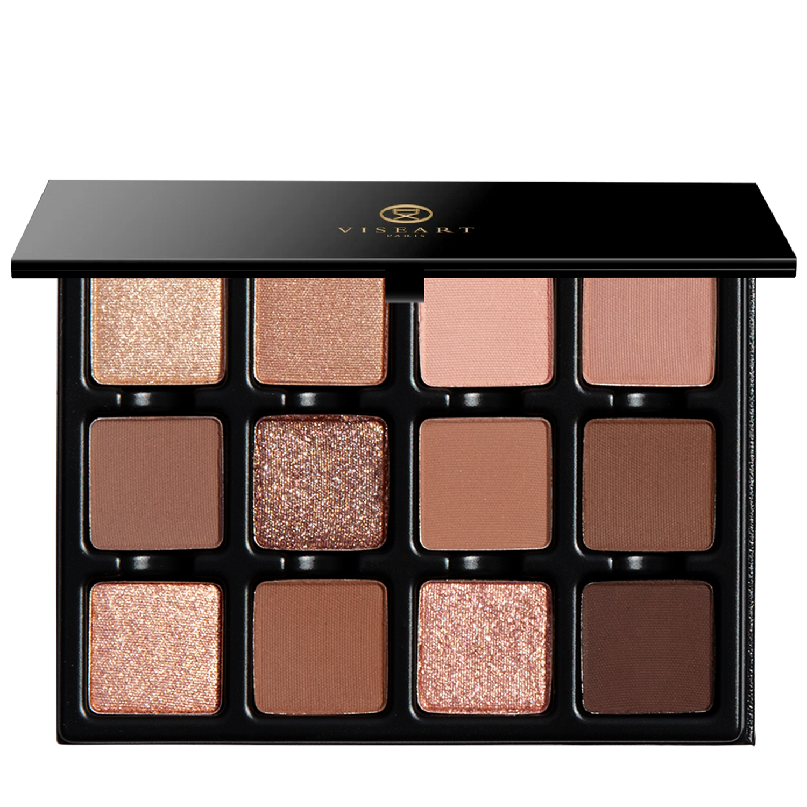

## Shade 1: Dulce d'Or — Frosted gold champagne with a shimmer finish
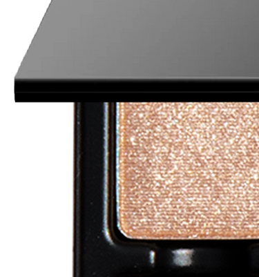

Use: Use this frosted gold champagne shade as an all-over lid colour on all complexions. It can also be worn as a highlighter beneath the brow bone, in the inner corners of the eyes, or on top of the cupid's bow. Additionally, this shade can be foiled with a mixing medium for a reflective sheen. Apply with a brush for your desired level of intensity.

##### 色号 1：甜金香槟辉 (Dulce d'Or) —— 霜金香槟色，微光质地。
用途：可作全眼铺色，适合所有肤色。也可用作眉骨提亮、眼头提亮或唇峰提亮；搭配调和液可获得强烈反光光泽感。

## Shade 2: Lait de Miel — Warm champagne with a satin finish
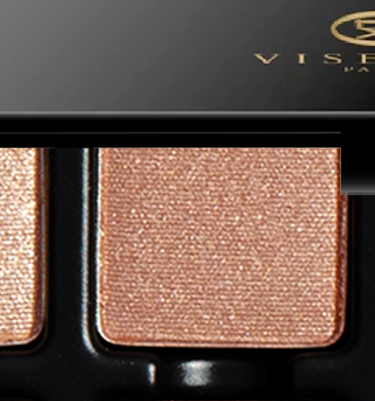

Use: Use this warm champagne shade as an all-over lid color on every complexion, or tap onto the center of the eyelid to catch the light and instantly brighten the eyes. Sweep beneath the brow for a soft highlight, or apply to the high points of the cheeks for a luminous satin finish. Apply with a brush to build to your desired level of intensity.

##### 色号 2：蜂蜜奶光 (Lait de Miel) —— 暖调香槟色，绸缎质地。
用途：可作全眼铺色，或点于眼皮中央捕捉光线立刻提亮双眼；扫于眉骨柔和提亮，或点于颧骨高处获得光泽绸缎感。

## Shade 3: Lait Sucré — Cool-toned toasted meringue beige with a matte finish
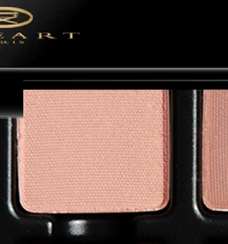

Use: Use this light cool beige tone as an all-over lid color on all complexions, in the crease and outer corners of the eyes as a transitional mid-tone hue, or a neutral base tone beneath complementary tones. Apply with a brush for your desired level of intensity.

##### 色号 3：甜蛋白米褐 (Lait Sucré) —— 冷调烤蛋白米褐色，哑光质地。
用途：可作全眼铺色或中性打底色，适合所有肤色；用于眼窝及眼尾作中调过渡色，或作互补色下方的打底层。

## Shade 4: Tarte Tatin — Medium camel brown with a matte finish
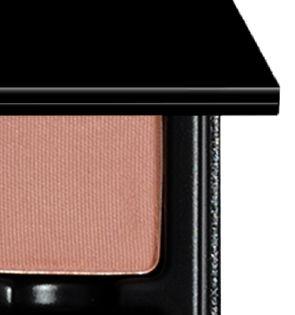

Use: Use this medium camel brown to softly sculpt and define the eyes. Sweep through the crease to add natural warmth and dimension, blend across the lid for an effortless wash of earthy color, or deepen along the lash line for soft definition. Apply with a brush for your desired level of intensity.

##### 色号 4：翻转苹果塔 (Tarte Tatin) —— 中调驼棕色，哑光质地。
用途：可轻柔塑形描绘眼妆轮廓；扫于眼窝增添自然暖度与层次，铺于眼皮打造大地色日常妆感，或沿睫毛线加深勾勒轮廓。

## Shade 5: Frangipane — Medium latte-brown with a matte finish
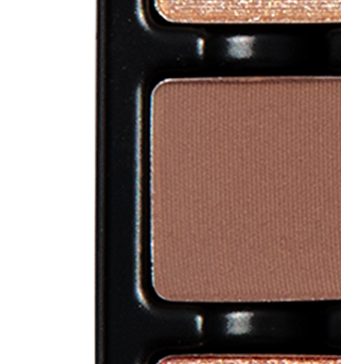

Use: Use this medium latte-brown shade as an all-over lid colour on all complexions, or concentrate it in the crease and outer corners of the eyes as a transitional tone. It can also be used as a base tone for medium to deep complexions or to fill in brows for light and medium-toned complexions. Apply with a brush for your desired level of intensity.

##### 色号 5：杏仁奶油棕 (Frangipane) —— 中调拿铁棕色，哑光质地。
用途：可作全眼铺色，或集中于眼窝和眼尾作过渡色；也可作中至深肤色的打底色，或为浅至中等发色填眉。

## Shade 6: Délice — Toasted almond bronze with a shimmer finish
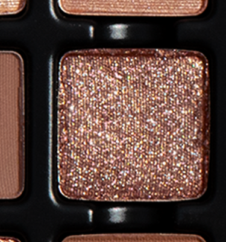

Use: Use this toasted almond bronze as an all-over lid color, blend into the outer corners for shimmering depth and definition, or sweep along the lash line for a smoldering bronze liner on every complexion. Pair with a mixing medium to amplify its reflectivity and create a high-shine, foiled effect. Apply with a brush to build to your desired level of intensity.

##### 色号 6：烤杏仁铜辉 (Délice) —— 烤杏仁铜色，微光质地。
用途：可全眼铺色，晕染至眼尾增添闪耀深度，或沿睫毛线扫出浓情铜调眼线；搭配调和液可放大反光感，获得高闪箔光效果。

## Shade 7: Confiture — Molten caramel taupe brown with a matte finish
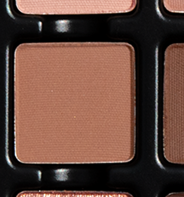

Use: Use this caramel taupe brown shade as an all-over lid colour on all complexions, in the crease and outer corners of the eyes as a transitional tone, or as a base tone with complementary hues. This shade can also be used in brows or as a contour on light to medium complexions. Apply with a brush for your desired level of intensity.

##### 色号 7：熔糖焦糖褐 (Confiture) —— 熔融焦糖灰褐色，哑光质地。
用途：可作全眼铺色，用于眼窝和眼尾作过渡色，或作互补色打底；也可勾眉，或用作浅至中等肤色的修容色。

## Shade 8: Feuilleté — Warm dark brown with a matte finish
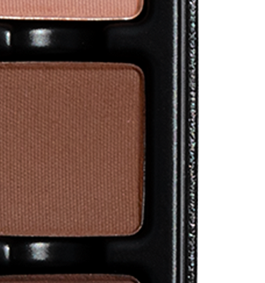

Use: Use this warm dark brown as an all-over lid color on every complexion, or blend through the crease and outer corners to build depth and dimension. Use as a liner for soft, smoky definition, or to fill in brows on complementary medium to deep hair tones. Apply with a brush to build to your desired level of intensity.

##### 色号 8：酥皮深棕 (Feuilleté) —— 暖调深棕色，哑光质地。
用途：可全眼铺色，晕染眼窝和眼尾加深层次；作眼线打造柔和烟熏轮廓，或为中至深发色填眉。

## Shade 9: Orbs — Second-skin nude topper with reflectivity
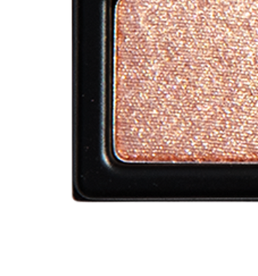

Use: Sweep this sheer, second-skin nude across the lids for a soft veil of light, or layer over any shade in the palette to enhance luminosity and dimension. Use it to highlight the brow bone, inner corners, cheekbones, or bridge of the nose for a subtle, skin-like glow. Apply with a brush to build to your desired intensity, use as a luminous liner, or mix with gloss for a light-catching finish.

##### 色号 9：星珠光纱 (Orbs) —— 贴肤裸色，叠光反射质地。
用途：轻扫于眼皮打造柔光薄纱感，或叠于盘内任何颜色之上提升光泽与层次；用于眉骨、眼头、颧骨或鼻梁提亮，获得自然肌肤感微光；可作发光眼线，或与唇彩混合捕捉光线。

## Shade 10: Amandine — Medium warm taupe brown with a matte finish
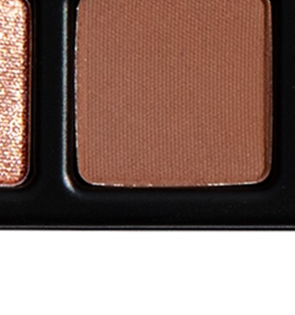

Use: Use this medium warm taupe brown as an all-over lid colour on all complexions or in the crease and outer corners of the eyes to build depth and dimension. This shade can also be used as a liner, to fill in brows for medium to deep hair tones, or as a bronzer on medium to deep skin tones. Apply with a brush for your desired level of intensity.

##### 色号 10：杏仁暖灰褐 (Amandine) —— 中调暖灰褐色，哑光质地。
用途：可全眼铺色，或用于眼窝和眼尾加深层次；也可作眼线，为中至深发色填眉，或作中至深肤色的晒感修容色。

## Shade 11: Amberine — Brûléed sugar amber with a shimmer finish
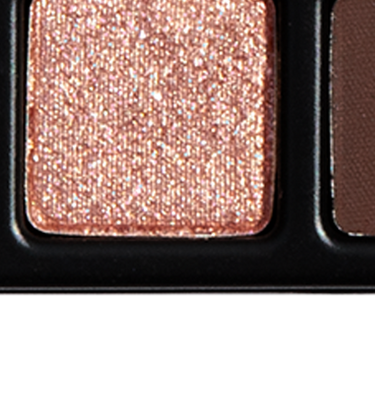

Use: Use this brûléed sugar amber shade as an all-over lid color on every complexion, or tap onto the inner corners and center of the lid for a twinkling, sugar-dusted effect. Layer over matte shades to add warmth and luminosity, or pair with a mixing medium for a high-shine, light-catching finish. Apply with a brush to build to your desired intensity.

##### 色号 11：炙烤琥珀糖 (Amberine) —— 炙烤焦糖琥珀色，微光质地。
用途：可全眼铺色，或点于眼头和眼皮中央打造闪耀糖霜效果；叠于哑光色之上增添暖意与光泽，或搭配调和液获得高闪捕光效果。

## Shade 12: Cocoa — Espresso brown with a matte finish
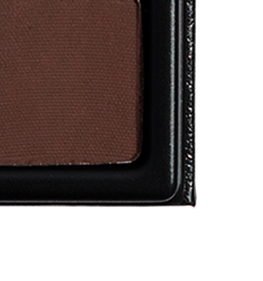

Use: Use this deep espresso brown as an all-over lid color, a rich crease shade, or to build depth and dimension at the outer corners of the eyes. Blend across the lids for a deep smoky eye, use as eyeliner for rich definition, or fill in brows and hairlines on complementary hair tones. Layer with mattes and shimmers to create added depth and dimension, and apply with a brush to build to your desired intensity.

##### 色号 12：可可浓咖棕 (Cocoa) —— 浓缩咖啡棕色，哑光质地。
用途：可全眼铺色，用作浓郁眼窝色，或于眼尾加深轮廓；打造深邃烟熏妆，或作眼线勾勒浓郁轮廓，也可为匹配发色填眉；与哑光色和微光色叠搭可丰富层次感。
