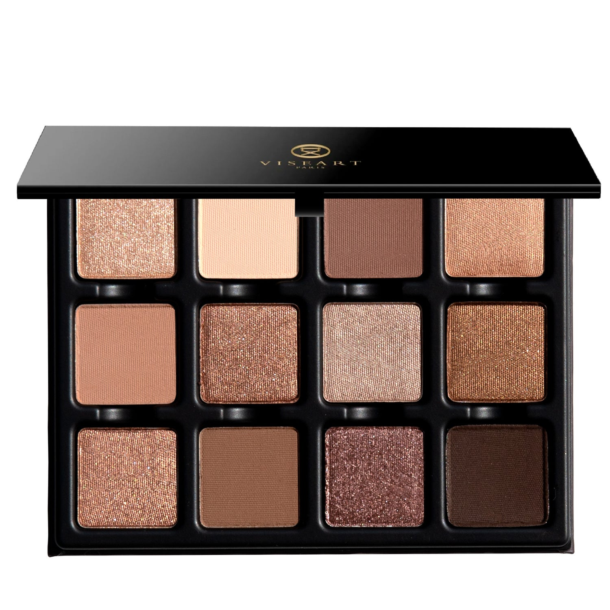
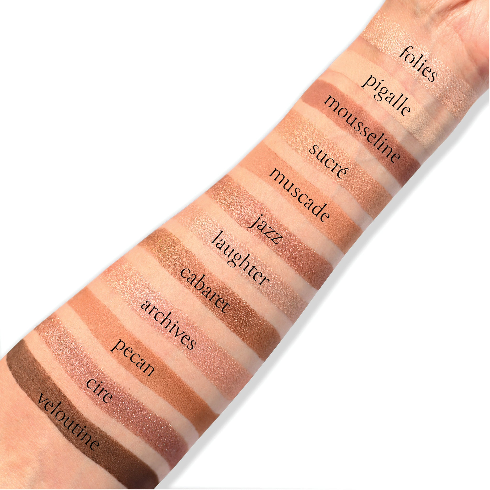

# Viseart 12色 中号 果仁糖盘 Praline Étendu
*发布：2025*

> 温暖如梦，果仁糖盘以蜂蜜铜褐、摩卡与熔融焦糖漾出柔光——如肌肤贴覆白麻，如果仁糖在唇间融化。光不是追逐，而是细细品味，在阴影与阳光间徐徐流淌，是一场被阳光温吻的慵懒沉醉。

> *A reverie of warmth, Praline Étendu glows with bronzed honey, mocha, and molten caramel—like golden skin against white linen, like praline melting on the tongue. Light isn't chased, but savored, slipping between shadow and sun in a slow, gilded embrace. A palette kissed with effortless, sun-warmed indulgence.*

## Shade 1: Folies — Light gold with a metallic finish.

Use: Apply a sweep of this hue with a brush or finger for a sexy 'wet skin' effect or pair with any of the other shades in the palette for a glamorous golden finish. Can also be foiled or worn as a highlighter on all complexions.

##### 色号 1：幻金 (Folies) —— 浅金色，金属质地。
用途：可用刷具或指腹扫在眼皮上，打造带光泽的湿润妆感；也可与盘中其他色号搭配，呈现华丽金光效果。还可搭配调和液增强箔光感，或作为适合所有肤色的高光使用。

## Shade 2: Pigalle — Pale vanilla-peach with a matte finish.

Use: Use this warm cream shade all over as a base tone on light to medium skin tones. Can be used to brighten the inner corners of the eyes on all complexions. Can also be used to set under-eye concealer on light to medium complexions.

##### 色号 2：香草蜜桃 (Pigalle) —— 浅香草蜜桃色，哑光质地。
用途：浅至中等肤色可作全眼打底色；所有肤色都可用于眼头提亮。浅至中等肤色也可用于定妆眼下遮瑕。

## Shade 3: Mousseline — Burnt-plum with a matte finish.

Use: This midtone shade can be used as an all over lid colour, as a transition shade to build out the crease and socket, as a soft liner, or as a base tone beneath complementary tones for increased depth and saturation on all complexions. Mix this hue with other matte shades to create 12 new shades. Apply with fingertips or a dense brush for your desired level of intensity.

##### 色号 3：焦梅绒 (Mousseline) —— 焦梅子色，哑光质地。
用途：可作全眼铺色、眼窝过渡色、柔和眼线色，或作为互补色下方的打底色，以增强深度与饱和度，适合所有肤色。与其他哑光色混合，可延展出 12 种新色。可用指腹或扎实刷具按需叠加显色度。

## Shade 4: Sucré — Warm brown with a shimmer finish.

Use: Use this to brighten the lid or inner corner, or use a damp brush to intensify the metallic tone. This can be used as a highlighter as well for a golden glow.

##### 色号 4：糖晶棕 (Sucré) —— 暖棕色，闪光质地。
用途：可用于提亮眼皮或眼头；搭配微湿刷具可增强金属光泽。也可作为高光，带出金色光感。

## Shade 5: Muscade — A nutmeg brown with a matte finish

Use: All over solid tone for all skin types. Base tone, as well as midtone for eyeshadow depth and dimension. Also can be used in brows, and as a contour.

##### 色号 5：肉豆蔻棕 (Muscade) —— 肉豆蔻棕色，哑光质地。
用途：适合所有肤色大面积铺色；既可作打底色，也可作为增强眼影深度与立体感的中间色调；同时也可用于眉部与修容。

## Shade 6: Jazz — Light rose gold with a duochromatic finish.

Use: This rose gold duochromatic hue is used as an all-over lid tone. It can also be mixed with other matte and shimmer hues to create more defined, richly toned shades and used with lighter metallic tones to create a duochromatic look. Use a mixing medium to foil this hue for ultimate shine, or create a mix of hues- can also be used with a damp brush all over lid, or as an eyeliner.

##### 色号 6：爵士玫金 (Jazz) —— 浅玫瑰金色，双偏光质地。
用途：可作全眼铺色，也可与其他哑光或珠光色混合，调出更浓郁、更有层次的色调；与更浅的金属色搭配，还能做出双偏光效果。搭配调和液可获得更强烈的箔光感，也可用微湿刷具全眼上色或当眼线使用。

## Shade 7: Laughter — Nude beige satin metallic with a shimmer finish.

Use: This satin shade can be used as an all-over lid tone, as a highlight in the inner corner of the eyes, on the brow bone, and on top of any cream eyeliner, or conversely use a wet brush, or mixing medium to intensify the tone for high definition shine. All skin tones.

##### 色号 7：裸香槟 (Laughter) —— 裸米色缎金属光，闪光质地。
用途：可作全眼铺色，也可用于眼头、眉骨提亮，或叠加在膏状眼线之上。使用微湿刷具或调和液可增强光泽与显色，适合所有肤色。

## Shade 8: Cabaret — Golden bronze with a metallic finish.

Use: Use this golden bronze hue as an all-over lid color on all complexions or tap onto the center of the lid for an eye-catching finish. Can be foiled or worn as liner.

##### 色号 8：歌舞铜金 (Cabaret) —— 金古铜色，金属质地。
用途：可作全眼铺色，适合所有肤色；也可点在眼皮中央，打造吸睛亮点。可搭配调和液做出箔光效果，也可作为眼线色。

## Shade 9: Archives — Nude champagne with a metallic satin finish.

Use: This shade can be used as a wash of color all over the lid, layered over your favorite matte shades- can be used in the inner corners for a pop of luminosity, in the center of the eyelid to accentuate the glow or as a highlighter on tops of the cheekbones, add to the cupids bow and into any lipgloss to add a pearl! Additionally, foil this shade for all day wear with a mixing medium or damp brush to intensify the hue.

##### 色号 9：古典香槟 (Archives) —— 裸香槟色，金属缎光质地。
用途：可全眼铺色，或叠加在喜欢的哑光色上；也适合用于眼头提亮、点亮眼皮中央，或作为颧骨高光，还可点在唇峰，甚至混入唇蜜增添珍珠光泽。搭配调和液或微湿刷具可增强显色并获得更持久的箔光效果。

## Shade 10: Pecan — Sienna brown with a matte finish.

Use: Can be blended all over the lid or in the crease. Smudge it over a darker pencil for a soft smokey eye, or push it into the lash line for subtle definition.

##### 色号 10：山核桃棕 (Pecan) —— 赭石棕色，哑光质地。
用途：可用于全眼铺色或眼窝过渡。叠在更深色眼线笔上可做出柔和烟熏感，也可压在睫毛根部带出细致轮廓。

## Shade 11: Cire — Light bark lilac taupe with a metallic finish.

Use: This metallic shade can be worn as an all over lid colour, or layered on top of complementary tones for an everyday nude satin sheen finish. Mix this shade with water for a wash of colour or combine with a mixing medium for a foiled effect. Apply with fingertips or a dense brush for your desired level of intensity.

##### 色号 11：蜡灰丁香 (Cire) —— 浅树皮丁香灰褐色，金属质地。
用途：可作全眼铺色，也可叠加在互补色之上，打造适合日常的裸感缎光效果。与水混合可获得轻透染色感，搭配调和液则可做出箔光效果。可用指腹或扎实刷具按需叠加显色度。

## Shade 12: Veloutine — Espresso bitter brown with a matte finish

Use: This espresso bitter brown shade can be used to create depth and dimension in the crease, socket and lash line. Build up the colour in the outer corners of the eyes for a boldly pigmented finish or use a mixing medium and liner brush for a graphic finish. Use a brush for your desired level of intensity.

##### 色号 12：丝绒浓咖 (Veloutine) —— 浓缩苦棕色，哑光质地。
用途：适合用于眼窝、轮廓和睫毛根部加深，增强深邃度与立体感。可在眼尾逐步叠加，打造高显色效果；也可搭配调和液和眼线刷完成更利落的图形眼线。可用刷具按需叠加显色度。
