# Viseart 12色 中号 灵蛇秘符盘 Serpentine Étendu
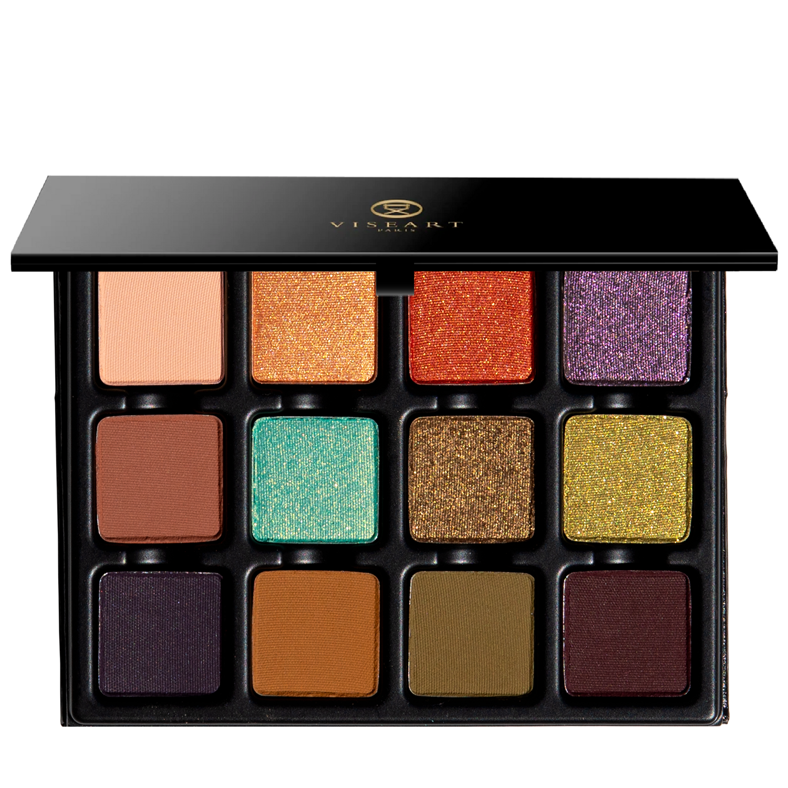

## Shade 1: Relic — Beige taupe with a matte finish.
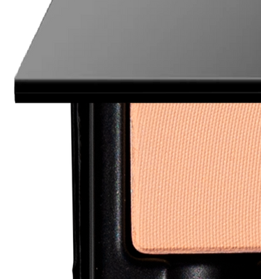

Use: This beige taupe shade recalls the softened gleam of a timeworn artifact and can be used as an all-over lid colour or as a base tone beneath complementary hues. It can also be used to highlight the brow bone and inner corners of the eyes, or as a transitional shade in the socket of the eye. Apply with a brush for your desired level of intensity. Pair with shades ‘Effigy’ and ‘Reliquary’ for a nude gilded look evocative of unearthed treasures.

##### 色号 1：遗珍灰褐 (Relic) —— 米灰褐色，哑光质地。
用途：这抹米灰褐色让人联想到岁月打磨过的古器柔光，可作全眼铺色，也可作为互补色下方的打底色。也适合用于眉骨和眼头提亮，或作为眼窝过渡色。可用刷具按需叠加显色度。与 ‘Effigy’ 和 ‘Reliquary’ 搭配，可呈现宛如出土珍藏般的裸调鎏金妆效。

## Shade 2: Aureate — Gilded, warm antiqued copper with a metallic finish.
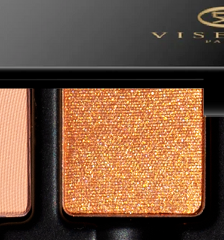

Use: Sweep this gilded copper shade across the lid for a rich wash of metallic luminosity, or tap onto the center of the eye to enhance dimension and light. Its burnished finish recalls ancient molten gold, polished smooth by centuries of touch. Apply with a brush for your desired level of intensity or with fingertips to amplify the metallic effect. Can be foiled with a mixing medium for an ultra-reflective sheen. Pair with shades ‘Effigy’ and ‘Patina’ for a gilded gleam.

##### 色号 2：鎏金古铜 (Aureate) —— 鎏金暖调复古铜色，金属质地。
用途：将这抹鎏金铜色扫于眼皮，可铺出浓郁的金属光泽；点在眼皮中央，则能增强立体感与光线感。它抛光后的表面仿佛古老熔金，被岁月与触碰反复磨亮。可用刷具按需叠加显色度，也可用指腹加强金属反射效果；搭配调和液还能获得更高闪的箔光感。与 ‘Effigy’ 和 ‘Patina’ 搭配，可呈现耀眼的鎏金光泽。

## Shade 3: Invocation — Burnished poppy-orange with a metallic finish.
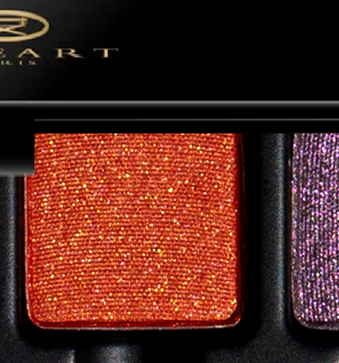

Use: Sweep this burnished copper shade across the lid for smoldering warmth, or tap onto the center and outer lid to create rich, metallic dimension. Glowing like embers, this shade brings heat and transformation to any eye look. Apply with a brush for your desired level of intensity. Can be used with a mixing medium for an ultra-reflective finish. Pair with shades ‘Aureate’ and ‘Sigil’ for a ritualistic wash of copper and plum.

##### 色号 3：咒引铜橘 (Invocation) —— 抛光罂粟橘色，金属质地。
用途：将这抹抛光铜橘色扫于眼皮，可带来炽热暖意；点在眼皮中央与外侧，则能叠出浓郁金属层次。它像余烬般发光，为任何眼妆注入热度与变化。可用刷具按需叠加显色度，搭配调和液可获得更高反射的闪耀效果。与 ‘Aureate’ 和 ‘Sigil’ 搭配，可呈现带有仪式感的铜橘与李子色妆效。

## Shade 4: Noctis — Smoky amethyst-pewter with a shimmer finish.
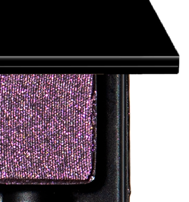

Use: Sweep this smoky amethyst-pewter shade across the lid for a mysterious wash of metallic colour, or tap onto the center of the eye for a light catching effect. Its shifting finish evokes moonlight reflected across darkened metal. Apply with a brush for a diffused effect or with fingertips to enhance its reflective sheen. Can be used with a mixing medium for a high-shine finish. Pair with shades ‘Aegis’ and ‘Sigil’ for a smoky, nocturnal look of deep plum and shimmering violet.

##### 色号 4：暗夜银灰 (Noctis) —— 烟熏紫晶锡灰色，闪光质地。
用途：将这抹烟熏紫晶锡灰色铺于眼皮，可呈现神秘金属光泽；点在眼皮中央，则能制造吸光聚焦效果。它流转的光感仿佛月光掠过暗色金属表面。可用刷具打造柔雾效果，也可用指腹加强反射光泽；搭配调和液可获得更高闪的光感。与 ‘Aegis’ 和 ‘Sigil’ 搭配，可营造深李子色与紫光微闪交织的夜幕烟熏妆。

## Shade 5: Effigy — Earthen terracotta brown with a matte finish.
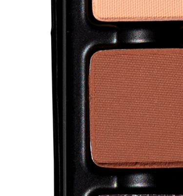

Use: Sweep this warm terracotta shade across the lid or through the crease to create earthy warmth and sculpted dimension. Its muted, clay-like tone is inspired by ancient forms shaped from pigment and earth. Apply with a brush for your desired level of intensity. Layer beneath metallic and shimmering shades to enhance their warmth and saturation. Pair with shades ‘Invocation’ and ‘Reliquary’ for a richly burnished look of terracotta, copper and antiqued bronze.

##### 色号 5：土俑陶棕 (Effigy) —— 大地陶土棕色，哑光质地。
用途：将这抹暖陶土色扫于眼皮或眼窝，可带来大地暖意与雕塑般的立体感。它柔和如陶土的色调，灵感来自以矿物颜料与泥土塑成的古老器物。可用刷具按需叠加显色度。叠在金属与闪光色下方，可进一步增强暖感与饱和度。与 ‘Invocation’ 和 ‘Reliquary’ 搭配，可呈现陶土、铜光与复古古铜交织的浓郁妆效。

## Shade 6: Verdigris — Spectral teal with a golden duochromatic finish.
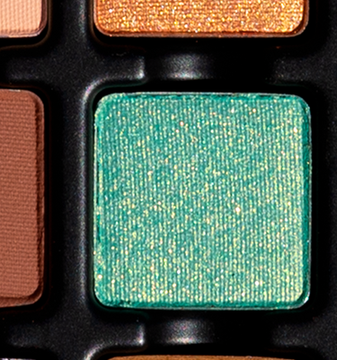

Use: Sweep this spectral teal shade across the lid for a wash of colour, or tap onto the center of the eye for dimensional light. Apply with a brush for your desired level of intensity or with fingertips to intensify its metallic finish. Pair with shades ‘Reliquary’ and ‘Basilisk’ for a sea-washed patinated look, shimmering like ancient bronze reclaimed by the earth.

##### 色号 6：铜锈幽青 (Verdigris) —— 幽灵蓝绿色，带金色双偏光质地。
用途：将这抹幽灵蓝绿色扫于眼皮，可铺出冷冽变幻的色泽；点在眼皮中央，则能增强立体光感。可用刷具按需叠加显色度，也可用指腹加强其金属质感。与 ‘Reliquary’ 和 ‘Basilisk’ 搭配，可营造如海水冲刷过的铜锈妆效，闪耀得像被大地重新吞没又显露的古老青铜。

## Shade 7: Reliquary — Antiqued olive-bronze with a shimmer finish.
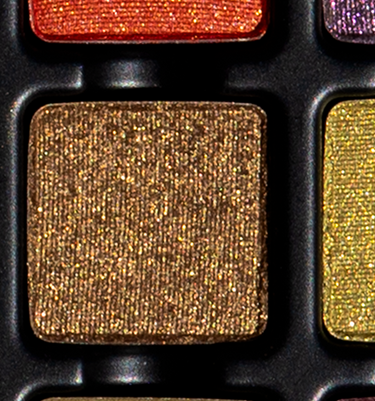

Use: Use this antiqued olive-bronze shade as an all-over lid colour, layered over complementary hues, or in the center of the lid and corners of the eyes for a gilded, sea-glint effect. Apply with a brush for your desired level of intensity. Use with a mixing medium for a foiled effect. Wear with shades ‘Viridian’ and ‘Basilisk’ for a hypnotic blend of gold, bronze, and mossy green.

##### 色号 7：圣匣橄榄铜 (Reliquary) —— 复古橄榄古铜色，闪光质地。
用途：这抹复古橄榄古铜色可作全眼铺色，叠加在互补色之上，或用于眼皮中央与眼角，打造带海光感的鎏金闪烁。可用刷具按需叠加显色度；搭配调和液可获得箔光效果。与 ‘Viridian’ 和 ‘Basilisk’ 搭配，可调出金色、古铜与苔绿色交织的迷幻色泽。

## Shade 8: Viridian — Venomous chartreuse with a shimmering metallic finish.
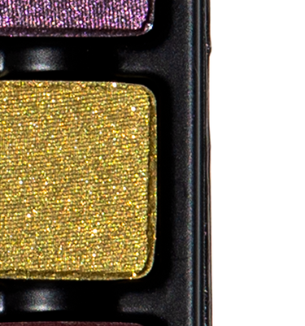

Use: Sweep this vivid chartreuse shade across the lid for an electric wash of green-gold radiance, tap onto the center for a dramatic finish, or wear as a liner along the lashline. Apply with a brush for a diffused look or with fingertips to intensify its reflective finish. Pair with shades ‘Basilisk’ and ‘Sigil’ for a striking serpentine sheen of acid green and smokey plum.

##### 色号 8：蛇毒黄绿 (Viridian) —— 毒感黄绿色，闪耀金属质地。
用途：将这抹鲜亮黄绿色扫于眼皮，可带来电光般的绿金光泽；点在眼皮中央可强化戏剧感，也可沿睫毛根部作眼线使用。用刷具可打造柔和晕染感，用指腹则能增强反射效果。与 ‘Basilisk’ 和 ‘Sigil’ 搭配，可呈现酸绿与烟熏李子色交织的灵蛇光泽。

## Shade 9: Aegis — Aubergine with a matte finish.
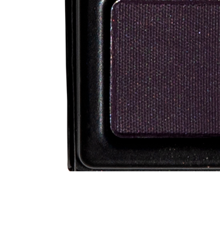

Use: Blend this deep aubergine shade along the lash line and outer corner of the eye to create dramatic depth and definition, or sweep through the crease to intensify and sculpt. Apply with a brush for your desired level of intensity. Pair with shades ‘Noctis’ and ‘Sigil’ for a sinuous sweep of mulberry mist and violet smoke.

##### 色号 9：神盾茄紫 (Aegis) —— 茄紫色，哑光质地。
用途：将这抹深茄紫色晕染在睫毛根部和眼尾，可营造戏剧化深度与清晰轮廓；扫入眼窝则能进一步加深并雕塑眼型。可用刷具按需叠加显色度。与 ‘Noctis’ 和 ‘Sigil’ 搭配，可呈现桑莓雾影与紫烟流动交织的妆效。

## Shade 10: Patina — Antiqued ochre with a matte finish.
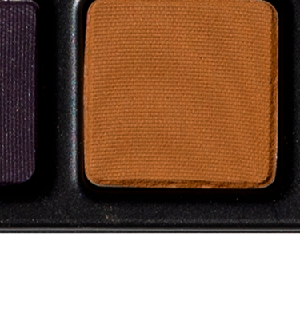

Use: Sweep this antique ochre shade across the lid or through the crease to add dimension, or layer beneath complementary shades. This unusual matte bridges the palette’s earthen browns, burnished metals and serpentine greens. Apply with a brush for your desired level of intensity. Pair with shades ‘Basilisk’ and ‘Reliquary’ for an antiqued finish reminiscent of metalwork entwined with moss.

##### 色号 10：铜苔赭黄 (Patina) —— 复古赭黄色，哑光质地。
用途：将这抹复古赭黄色扫于眼皮或眼窝，可增添层次感，也可叠在互补色下方打底。这块别致的哑光色连接了整盘中的大地棕、抛光金属与灵蛇绿调。可用刷具按需叠加显色度。与 ‘Basilisk’ 和 ‘Reliquary’ 搭配，可呈现如苔藓缠绕金属器物般的复古质感。

## Shade 11: Basilisk — Patinated olive with a matte finish.
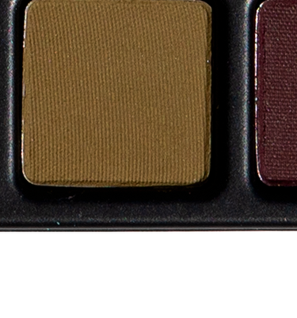

Use: Sweep this olive shade across the lid or through the crease for a softly diffused wash of colour, or layer beneath metallic greens and bronzes to enhance their depth and saturation. Its earthy green tone recalls moss, mineral pigment and the muted scales of an ancient serpent. Apply with a brush for your desired level of intensity. Pair with shades ‘Aureate’ and ‘Patina’ for a verdant veil of moss, ochre, and molten copper.

##### 色号 11：蛇蜥橄榄 (Basilisk) —— 铜锈橄榄色，哑光质地。
用途：将这抹橄榄绿色扫于眼皮或眼窝，可铺出柔和晕染的色幕；叠在金属绿与古铜色下方，则能增强深度与饱和度。它的大地绿调让人联想到苔藓、矿物颜料，以及古蛇低调却危险的鳞片。可用刷具按需叠加显色度。与 ‘Aureate’ 和 ‘Patina’ 搭配，可呈现苔绿、赭黄与熔铜交织的葱郁色幕。

## Shade 12: Sigil — Muted mulberry with a matte finish.
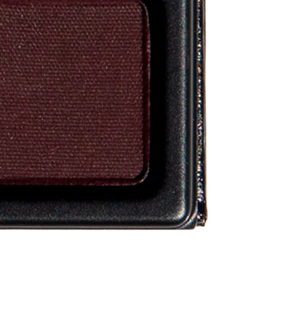

Use: Blend this muted mulberry shade along the outer corner and lash line to create depth and definition, or sweep through the crease to sculpt and intensify the eye. Apply with a brush for your desired level of intensity. Pair with shades ‘Invocation’ and ‘Noctis’ for an otherworldly eye of embered copper, dark plum and spectral violet.

##### 色号 12：秘符桑莓 (Sigil) —— 柔雾桑莓色，哑光质地。
用途：将这抹柔雾桑莓色晕染在眼尾与睫毛根部，可增强深度与轮廓；扫入眼窝则能进一步塑形并强化眼神。可用刷具按需叠加显色度。与 ‘Invocation’ 和 ‘Noctis’ 搭配，可呈现余烬铜光、深李子色与幽紫微光交织的异界感眼妆。
