# Viseart 12色 中号 海妖绮梦盘 Sireneuse Etendu
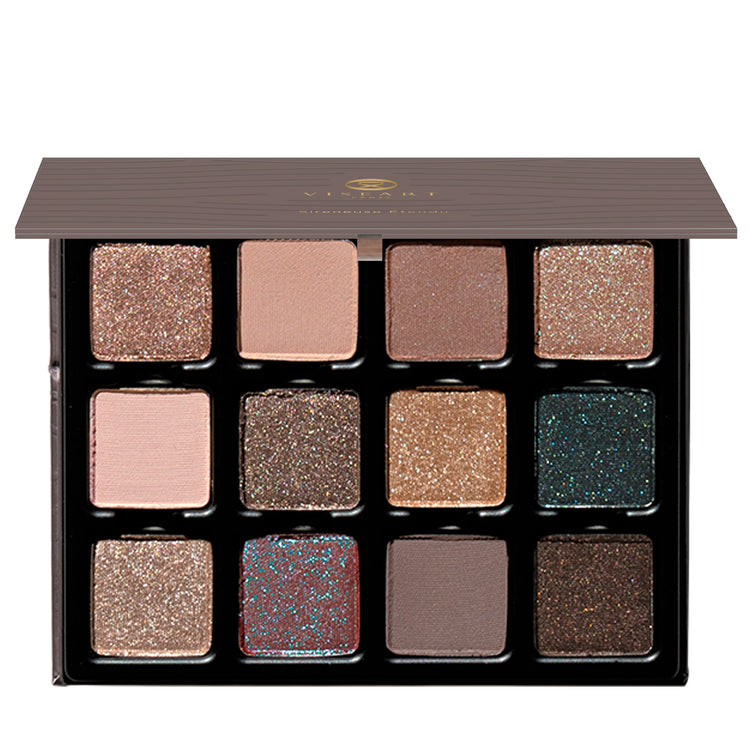

> 提示：本页切片来自官网开盖图 `id`，并非独立的带描述色板图 `icons`。
> 第一排色块可能会受到盖子边缘轻微遮挡；如果后续拿到带描述色板图，应优先用 `icons` 重新切图。

## Shade 1: Sylph — Champagne rose with a metallic finish.
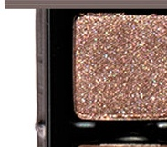

Use: This metallic champagne rose shade can be worn as an all-over lid colour or layered over complementary tones for an elevated everyday look. Use this shade with a mixing medium for a wash of colour or a foiled, high-shine effect. Pair with shades ‘Serenade’ and ‘Triton’ for a shimmering second-skin sheen! Apply with fingertips or a dense brush for your desired level of intensity.

##### 色号 1：海雾银玫 (Sylph) —— 香槟玫瑰色，金属光泽。
用途：可作全眼铺色，或叠加在互补色之上，打造更精致的日常妆感。搭配调和液可获得轻透染色感或更强烈的金属箔光效果。与 `Serenade`、`Triton` 搭配，可呈现闪耀贴肤的光泽感。可用指腹或扎实眼影刷按需叠加显色度。

## Shade 2: Serenade — Soft, mid-tone neutral pink with a matte finish.
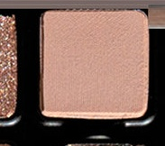

Use: This soft, mid-tone shade can be used as an all-over lid colour or as a base tone beneath complementary hues. It can also be used to highlight the brow bone and inner corners of the eyes, or as a transitional shade in the socket of the eye. Use as a base tone beneath shades ‘Murmur’ and ‘Mélusine’ for a glistening, natural finish. Apply with a brush for your desired level of intensity.

##### 色号 2：轻吟粉 (Serenade) —— 柔和中调中性粉色，哑光质地。
用途：可作全眼铺色或作为互补色下方的打底色。也可用于眉骨和眼头提亮，或作为眼窝位置的过渡色。搭配 `Murmur` 与 `Mélusine` 作打底，可完成自然通透的微光妆感。可用刷具按需叠加显色度。

## Shade 3: Murmure — Mid-tone nude rose with a matte finish.
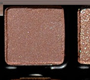

Use: This mid-tone nude rose shade can be used as an all-over lid colour, beneath complementary tones for increased depth and saturation, or as a transitional tone in the crease and socket. Mix this hue with other matte shades to create 12 new colours. Can also be worn as a blush on light to medium complexions. Pair with ‘Sylph’ and ‘Mélusine’ for a soft and shimmering romantic nude rose look. Apply with a brush for your desired level of intensity.

##### 色号 3：低语玫瑰 (Murmure) —— 中调裸玫瑰色，哑光质地。
用途：可作全眼铺色、作为互补色下方的打底加深色，或用于眼窝和轮廓位置做过渡。与其他哑光色混合，可调出 12 种新色。浅至中等肤色也可当腮红使用。搭配 `Sylph` 与 `Mélusine`，可完成柔和微闪的浪漫裸玫瑰妆感。可用刷具按需叠加显色度。

## Shade 4: Mélusine — Midtone sandy nude with blue-green duochromatic flecks.
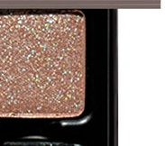

Use: This duochromatic sandy nude shade can be worn as an all-over lid colour or layered over complementary tones for an unexpected duochromatic shine. Use this shade with a mixing medium for a wash of colour or a foiled, high-shine effect. Pair with shades ‘Oceanic’ and ‘Glinting’ for an alluring aquatic finish! Apply with fingertips or a dense brush for your desired level of intensity.

##### 色号 4：美露曦涟 (Mélusine) —— 中调沙感裸色，带蓝绿双偏光闪片。
用途：可作全眼铺色，或叠加在互补色之上，呈现意想不到的双偏光闪耀。搭配调和液可获得轻透染色感或更强烈的箔光效果。与 `Oceanic`、`Glinting` 搭配，可完成迷人的水感妆效。可用指腹或扎实眼影刷按需叠加显色度。

## Shade 5: Ethos — Light, muted neutral pink-peach with a matte finish
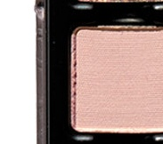

Use: This light, muted neutral pink-peach shade can be used as an all-over lid colour or as a base tone beneath complementary hues. It can also be used to highlight the brow bone and inner corners of the eyes or as a transitional shade in the socket of the eye. Use as a base tone beneath shades Sylph’ and ‘Glinting’ for a luminous, shimmering glow. Apply with a brush for your desired level of intensity.

##### 色号 5：气韵粉桃 (Ethos) —— 浅柔和中性粉桃色，哑光质地。
用途：可作全眼铺色，或作为互补色下方的打底色。也可用于眉骨和眼头提亮，或作为眼窝位置的过渡色。搭配 `Sylph` 与 `Glinting` 作打底，可呈现明亮通透的微闪光泽。可用刷具按需叠加显色度。

## Shade 6: Luminary — Nude quartz with a metallic finish.
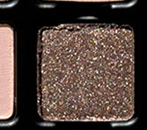

Use: This nude quartz metallic shade can be used as an all-over base colour, layered over complementary tones for a burst of high shine shimmer, or used as a liner for smokey, subtle definition. Pairs perfectly with shades ‘Glinting’ and ‘Brine’ for a glimmering grey soft smokey eye! Apply with fingertips or a dense brush for your desired level of intensity or use with a mixing medium for a foiled effect.

##### 色号 6：流光贝金 (Luminary) —— 裸色石英光感，金属质地。
用途：可作全眼打底色，叠加在互补色之上增强高光闪泽，也可作为眼线带出柔和精致轮廓。与 `Glinting`、`Brine` 搭配，适合打造带灰调光泽的柔雾烟熏眼妆。可用指腹或扎实眼影刷上色，也可搭配调和液营造更强烈的箔光效果。

## Shade 7: Triton — Second-skin nude, topper with silver duochromatic flecks.
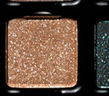

Use: This second-skin nude topper can be worn as an all-over lid colour for a natural veil of luminosity or over any shade in the palette for a radiant wash of reflectivity. It can also be used to highlight the brow bone, inner corners of the eyes, cheekbones, and the bridge of the nose. Pairs perfectly over top of “Serenade”, “Murmure” and “Ethos” for a burst of shimmering brilliance.

##### 色号 7：特里同 (Triton) —— 贴肤裸色叠擦色，带银色双偏光闪片。
用途：可作全眼铺色，营造自然通透的贴肤光泽，也可叠加在盘中任何颜色之上，增强反光感。还可用于眉骨、眼头、颧骨和鼻梁提亮。叠加在 `Serenade`、`Murmure`、`Ethos` 上，能带出更明亮的闪耀感。

## Shade 8: Oceanic — Rich navy blue-green with blue duochromatic flecks.
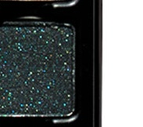

Use: This rich navy blue-green shade can be worn alone for a striking monochromatic look or layered on top of complementary tones for a high-shine shift of shimmering pigment. Can also be used to build out the outer crease of the eye, as a liner, or in conjunction with a mixing medium for a foiled effect. Pair with shades ‘Mélusine’ and ‘Glinting’ for a tidal wave of prismatic pigment. Apply with fingertips or a dense brush for your desired level of intensity.

##### 色号 8：海潮蓝绿 (Oceanic) —— 浓郁海军蓝绿色，带蓝色双偏光闪片。
用途：可单独使用打造强烈的单色妆效，也可叠加在互补色之上，呈现高光泽偏光变化。也可用于加深眼尾眼窝、作为眼线，或搭配调和液打造金属箔感。与 `Mélusine`、`Glinting` 搭配，可完成如潮汐般的棱彩妆效。可用指腹或扎实眼影刷按需叠加显色度。

## Shade 9: Glinting — Nude silver with a metallic finish.
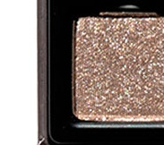

Use: This nude silver metallic shade can be used as an all-over base colour, layered over complementary tones for a burst of high shine shimmer, or used as a liner for luminous definition. Pair perfectly with shades ‘Siren’ and ‘Abyss’ for oceanic, crystalline candescence. Apply with fingertips or a dense brush for your desired level of intensity or use with a mixing medium for a foiled effect.

##### 色号 9：闪银光 (Glinting) —— 裸银色，金属光泽。
用途：可作全眼打底色，叠加在互补色之上增强高亮闪泽，也可作为眼线带出清透轮廓。与 `Siren`、`Abyss` 搭配，适合打造海洋感、晶莹感的妆效。可用指腹或扎实眼影刷上色，也可搭配调和液营造更强烈的箔光效果。

## Shade 10: Siren — Violet-blue with turquoise duochromatic flecks.
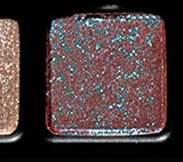

Use: This bright viloet-blue duochromatic shade can be used as an all-over lid color or layered on top of complementary tones for a high-shine sheen. Up the ante by mixing this shade with a mixing medium for an ultra-saturated foiled flip! Apply with fingertips or a dense brush for your desired level of intensity. Can also be used as liner. Pair with shades ‘Oceanic’ and ‘Mélusine’ for hypnotic tides of luminosity!

##### 色号 10：海妖紫蓝 (Siren) —— 紫蓝色，带绿松石双偏光闪片。
用途：可作全眼铺色，或叠加在互补色之上，呈现高光泽的偏光亮感。搭配调和液可强化饱和度，做出更强烈的金属箔光变化。也可用作眼线。与 `Oceanic`、`Mélusine` 搭配，可营造迷人的海潮光感。可用指腹或扎实眼影刷按需叠加显色度。

## Shade 11: Abyss — Mid-tone greige-purple with a matte finish.
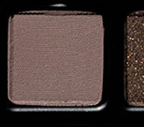

Use: This mid-tone shade can be used as an all-over lid colour, as a transitional shade to build out the crease and socket, as a soft liner, or as a base tone beneath complementary tones for increased depth and saturation. Mix this hue with any of the other matte shades to create 12 new hues. Pairs perfectly with ‘Luminary’ and ‘Brine’ to channel the lure of the deep sea. Apply with a brush for your desired level of intensity.

##### 色号 11：深渊灰紫 (Abyss) —— 中调灰米紫色，哑光质地。
用途：可作全眼铺色、眼窝过渡色、柔和眼线色，或作为互补色下方的打底加深色，增强层次与饱和度。与盘中其他哑光色混合，可延展出更多色调。搭配 `Luminary`、`Brine`，能呼应深海般的神秘气息。可用刷具按需叠加显色度。

## Shade 12: Brine — Bitter brown-quartz with copper reflectivity and a metallic finish.
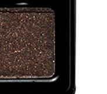

Use: This bitter brown-quartz metallic shade can be used to create depth and dimension in the crease, socket, and lash line. Build up the colour in the outer corners of the eyes for a boldly pigmented finish or use a mixing medium and liner brush for a graphic finish. Pairs perfectly with ‘Abyss’ and ‘Luminary’ for a richly pigmented smokey siren sheen. Use with a brush to achieve your desired level of intensity.

##### 色号 12：盐海棕 (Brine) —— 苦棕石英色，带铜色反光，金属质地。
用途：可用于加深眼窝、轮廓和睫毛根部，增强整体立体度与深邃感。可在眼尾逐步叠加，打造更浓郁饱和的显色效果；也可搭配调和液和眼线刷完成更利落的图形眼线。与 `Abyss`、`Luminary` 搭配，可塑造高显色的浓郁海妖烟熏光泽。建议使用刷具按需叠加显色度。
