# Viseart 12色 中号 海妖夜曲盘 Sireneuse Nocturne Etendu
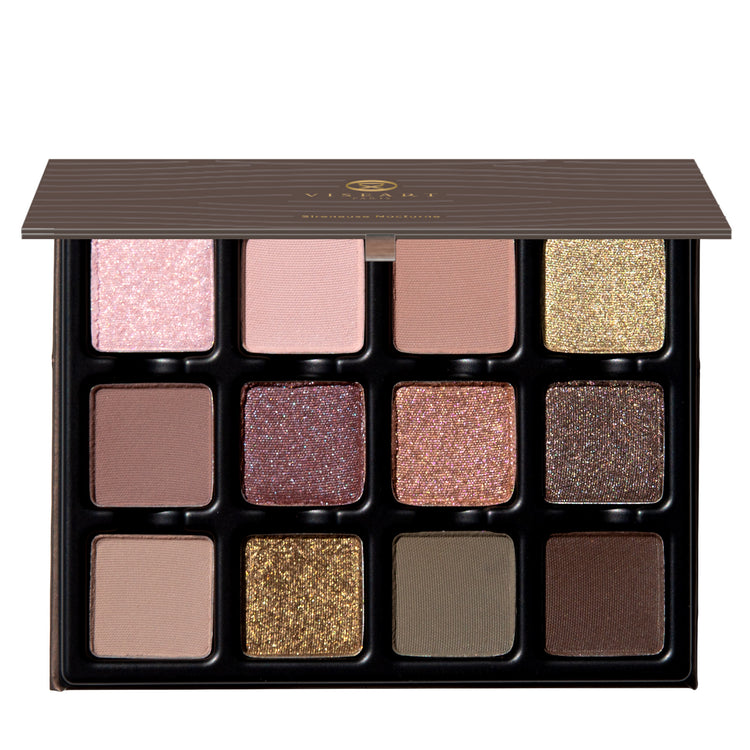

> 提示：本页切片来自官网开盖图 `id`，并非独立的带描述色板图 `icons`。
> 第一排色块可能会受到盖子边缘轻微遮挡；如果后续拿到带描述色板图，应优先用 `icons` 重新切图。

## Shade 1: Voile — Iced silver rosé with a shimmer finish.
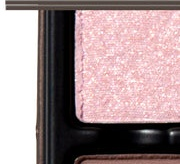

Use: This iced silver rosé shade can be used as an all-over lid color or along the high points of the face as a highlighter on all complexions. For a brightening, eye-catching effect, apply to the inner corners of the eyes, or layer over complementary hues for extra dimension. Apply with a brush for your desired level of intensity. This shade can also be blended with gloss or balm for a dewy, multi-use glow. Pair with shades ‘Harpia’ and ‘Echo’ for a tide-swept nude wash of creamy oyster and pearl.

##### 色号 1：Voile (Voile) —— 冰银玫瑰色，闪光质地。
用途：可作全眼铺色，也可用于面部高点提亮，适合所有肤色。想要更明亮吸睛的效果，可用于眼头，或叠加在互补色上增强层次。可用刷具按需叠加显色度。也可与唇蜜或润唇膏混合，做出水润、多用途的光泽感。与 `Harpia`、`Echo` 搭配，可呈现被潮汐洗过般的奶感牡蛎与珍珠裸色妆效。

## Shade 2: Harpia — Cool-toned light beige with a matte finish.
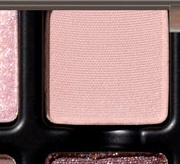

Use: This cool-toned light beige shade can be used as an all-over lid colour or as a base tone beneath complementary hues. It can also be used to highlight the brow bone and inner corners of the eyes, or as a transitional shade in the socket of the eye. Apply with a brush for your desired level of intensity. Use as a base tone beneath shades ‘Lûlène ’ and ’Tritonia’ for a burnished rose look steeped in tidal shimmer.

##### 色号 2：Harpia (Harpia) —— 冷调浅米色，哑光质地。
用途：可作全眼铺色，或作为互补色下方的打底色。也可用于眉骨和眼头提亮，或作为眼窝位置的过渡色。可用刷具按需叠加显色度。与 `Lûlène`、`Tritonia` 叠擦，可打造带潮汐微光的焦玫瑰妆效。

## Shade 3: Lûlène — Mid-tone clay rose with a matte finish.
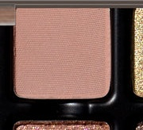

Use: This mid-tone clay rose shade can be used as an all-over lid colour, beneath complementary tones for increased depth and saturation, or as a transitional tone in the crease and socket. Apply with a brush for your desired level of intensity. Pair with ‘Echo’ and ‘Tritonia’ for an iridescent tide of muted mauve and soft sand.

##### 色号 3：Lûlène (Lûlène) —— 中调陶土玫瑰色，哑光质地。
用途：可作全眼铺色，或作为互补色下方的打底加深色，也可用于眼窝和轮廓位置做过渡。可用刷具按需叠加显色度。搭配 `Echo` 与 `Tritonia`，可呈现带虹彩感的柔雾豆沙与细沙调妆感。

## Shade 4: Cyrene — Patinaed silver-green with a metallic finish.
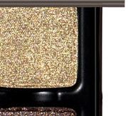

Use: Use this patinaed silver-green shade as an all-over lid colour, layered over complementary hues, or in the center of the lid and corners of the eyes for an icy green gleam. Use with a mixing medium for a foiled effect. Apply with a brush for your desired level of intensity. Wear with shades ‘Voile’ and ‘Lûlène’ for a sea-lit cascade of crystalline shimmer.

##### 色号 4：Cyrene (Cyrene) —— 铜锈银绿色，金属质地。
用途：可作全眼铺色，叠加在互补色之上，或用于眼皮中央和眼角，营造冰感绿光。搭配调和液可获得更强烈的箔光效果。可用刷具按需叠加显色度。与 `Voile`、`Lûlène` 搭配，可呈现海光照亮般的晶莹闪泽。

## Shade 5: Echo — Mid-tone, chestnut-blushed brown with a matte finish.
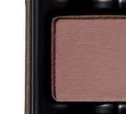

Use: Use this mid-tone, chestnut-blushed brown shade as an all-over lid colour on all complexions, in the crease as a transitional shade, or to build out depth and dimension in the outer corners of the eyes. Can be used as a soft eyeliner on all skin tones, in the brows and hairline, or as a subtle contour shade on light to medium complexions. Apply with a brush for your desired level of intensity. Blend with shades ‘Harpia’ and ‘Tideborn’ for a tide-washed trio of shell, sand, and stone.

##### 色号 5：Echo (Echo) —— 中调栗棕色，带红晕，哑光质地。
用途：可作全眼铺色，适合所有肤色；也可用于眼窝作过渡色，或在眼尾叠加出深度与立体感。适合所有肤色当柔和眼线，也可用于眉部和发际线；浅至中等肤色还可作为自然修容。可用刷具按需叠加显色度。与 `Harpia`、`Tideborn` 搭配，可组成贝壳、细沙与礁石般的潮汐三重奏。

## Shade 6: Empyrée — Nude mauve with blue duochromatic flecks.
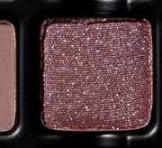

Use: This nude rose duochromatic shade can be worn alone for a wash of brilliant reflectivity or layered over complementary tones to accentuate its duochromatic dimension. For a high-shine, foiled effect, use with a mixing medium. It can also be mixed with a nude gloss for a wet, prismatic look. Apply with a brush for your desired level of intensity. Pair with “Echo” and “Ciel Figé” for a moonlit mutichrome look that shimmers like the midnight sea.

##### 色号 6：Empyrée (Empyrée) —— 裸紫红色，带蓝色双偏光闪片。
用途：可单独使用，呈现明亮反光感；也可叠加在互补色之上，强化双偏光层次。搭配调和液可做出更强烈的箔光效果，也可与裸色唇蜜混合，营造湿润棱彩感。可用刷具按需叠加显色度。与 `Echo`、`Ciel Figé` 搭配，可做出月光下般的多变光泽。

## Shade 7: Tritonia — Corraline-blushed sienna with a duochromatic finish.
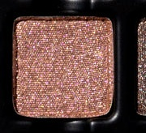

Use: Use this coralline-blushed sienna shade as an all-over lid color, in the center of the lid for spell-binding luminosity, or over top similar shades for an incandescent sheen. Use with a mixing medium for a foiled effect. Apply with a brush for your desired level of intensity. Blend with shade ‘Voile’ and ‘Harpia’ for a nude moonlit pool of prismatic perfection.

##### 色号 7：Tritonia (Tritonia) —— 珊瑚红晕赭色，双偏光质地。
用途：可作全眼铺色，或用于眼皮中央打造吸睛光感，也可叠加在相近色之上做出炽亮光泽。搭配调和液可获得箔光效果。可用刷具按需叠加显色度。与 `Voile`、`Harpia` 搭配，可做出如月光映照的裸色棱彩光池。

## Shade 8: Ciel Figé — Basalt silver brown with a duochromatic finish.
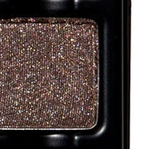

Use: Use this duochromatic basalt silver brown shade as an all-over lid colour for sea-glass finish, or layered over complementary tones for a wet, tide-lit pop. Use with a mixing medium for a foiled effect. Apply with a brush for your desired level of intensity. Wear with shades ‘Tritonia’ and ‘Empyrée’ for an opaline finish that glints like starlight on water.

##### 色号 8：Ciel Figé (Ciel Figé) —— 玄武岩银棕色，双偏光质地。
用途：可作全眼铺色，呈现海玻璃般的质感；也可叠加在互补色之上，做出湿润、被潮汐照亮的亮点。搭配调和液可获得箔光效果。可用刷具按需叠加显色度。与 `Tritonia`、`Empyrée` 搭配，可完成如水面星光般闪烁的蛋白石光泽。

## Shade 9: Tideborn — Light, cool-toned nude slate with a matte finish.
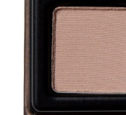

Use: This light, cool-toned nude slate shade can be used as an all-over lid colour, a transitional shade to build out the crease and socket, a soft liner, or as a base tone beneath complementary shades for increased depth and saturation. Apply with a brush for your desired level of intensity.

##### 色号 9：Tideborn (Tideborn) —— 浅冷调裸灰蓝石色，哑光质地。
用途：可作全眼铺色、眼窝过渡色、柔和眼线，或作为互补色下方的打底色，增强深度与饱和度。可用刷具按需叠加显色度。

## Shade 10: Seirēn — Antiqued gold-green with a shimmer finish.
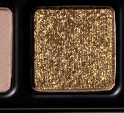

Use: Use this antiqued gold-green as an all-over lid colour, layered over complementary hues, or in the center of the lid and corners of the eyes for a gilded, sea-glint effect. Apply with a brush for your desired level of intensity. Use with a mixing medium for a foiled effect. Wear with shades ‘Tideborn’ and ‘Nautilus’ for a tide-forged blend of kelp, stone, and bronze.

##### 色号 10：Seirēn (Seirēn) —— 古金绿，闪光质地。
用途：可作全眼铺色，叠加在互补色之上，或用于眼皮中央和眼角，打造带金属感的海光效果。可用刷具按需叠加显色度。搭配调和液可做出箔光妆效。与 `Tideborn`、`Nautilus` 搭配，可调出海藻、石色与青铜感交织的潮汐色调。

## Shade 11: Nautilus — Muted kelp green with a matte finish.
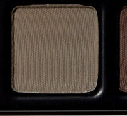

Use: Use this muted kelp green shade as an all-over lid colour, in the sockets and corners of the eyes for depth and definition, or along the lash line as an eyeliner. Apply with a brush for your desired level of intensity. Blend with shades ‘Cyrene’ and ‘Seirēn’ for a sea-tossed surge of moss, gilt, and tidal frost.

##### 色号 11：Nautilus (Nautilus) —— 柔和海带绿，哑光质地。
用途：可作全眼铺色，也可用于眼窝和眼角加深轮廓，或沿睫毛根部当眼线使用。可用刷具按需叠加显色度。与 `Cyrene`、`Seirēn` 搭配，可调出海浪翻涌般的苔绿、金属与潮霜感。

## Shade 12: Brindelle — Espresso-bitter brown with a matte finish.
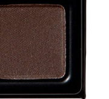

Use: This espresso-bitter brown shade can be used to create depth and dimension in the crease, socket, and lash line. Build up the colour in the outer corners of the eyes for a boldly pigmented finish, or use a mixing medium and liner brush for a graphic finish. Apply with a brush for your desired level of intensity. Pairs perfectly with ‘Ciel Figé’ and ‘Nautilus’ for a tide-washed sheen of kelp green and earthen brown.

##### 色号 12：Brindelle (Brindelle) —— 浓缩苦咖棕，哑光质地。
用途：适合用于眼窝、轮廓和睫毛根部加深，增强深邃度与立体感。可在眼尾逐步叠加，做出高饱和显色；也可搭配调和液和眼线刷完成更利落的图形眼线。可用刷具按需叠加显色度。与 `Ciel Figé`、`Nautilus` 搭配，可做出海带绿与大地棕交织的潮痕光泽。
