# Viseart 12色 中号 索莱依海滩盘 Soleil La Plage Etendu
*发布：2021*

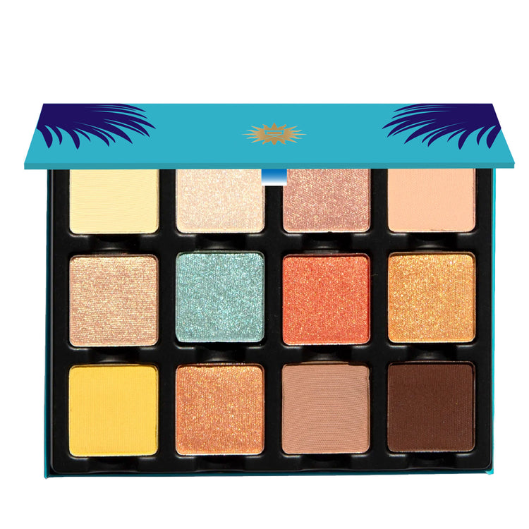

> 随我们扬帆驶向梦幻的索莱依海滩——一套柔沙色系中点缀着晶莹剔透质感的别致系列。带着闲适的姿态与赤足的追寻，索莱依海滩盘是出自 Anastasia 遐思中的海滨白日梦。

> *Come set sail with us to our dreamy Soleil La Plage, a chic collection of soft sandy hues with pops of crystalline finishes. With a laidback disposition and barefoot pursuits Soleil La Plage Étendu is a beachy daydream from Anastasia's reveries.*

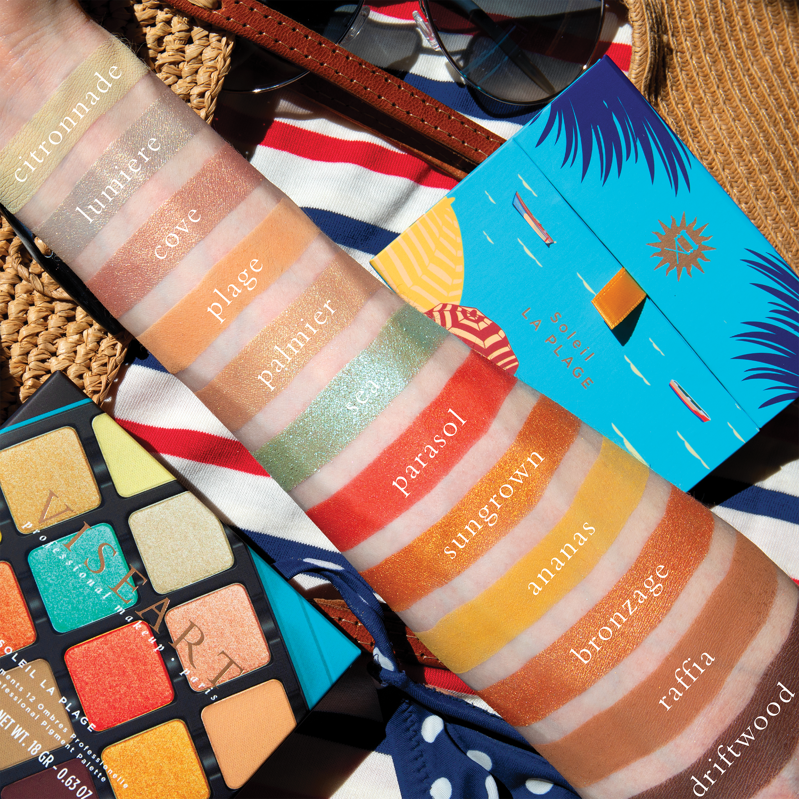
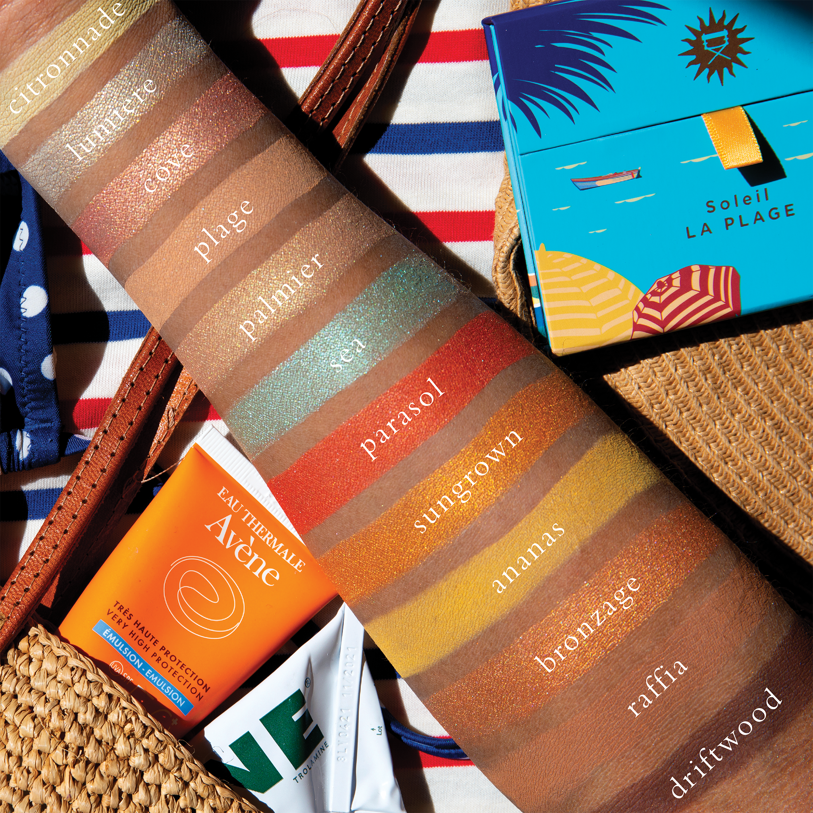

## Shade 1: Sunbeam — Soft, pale yellow with a luminous finish.
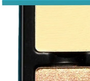

Use: This pale yellow shade can be used as an all-over lid colour or as a base beneath complementary hues. It can also be used to highlight the inner corners and brow bone. Pair with shades 'Peach Shimmer' and 'Golden Sand' for a soft, glowing look. Apply with a brush for your desired level of intensity.

##### 色号 1：阳光金 (Sunbeam) —— 柔和淡黄色，明亮质地。
用途：可作全眼铺色或作为互补色下方的打底色。也可用于眼头和眉骨提亮。搭配"蜜桃闪"与"金沙"，可完成柔和发光的妆感。可用刷具按需叠加显色度。

## Shade 2: Peach Shimmer — Warm peachy-rose with a shimmering finish.
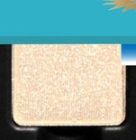

Use: This warm peachy-rose shade can be worn as an all-over lid colour or layered over complementary tones for a luminous glow. Use with a mixing medium for a wash of colour or a foiled, high-shine effect. Pairs beautifully with shades 'Coral Breeze' and 'Sand' for a romantic, sun-kissed look. Apply with fingertips or a dense brush for your desired level of intensity.

##### 色号 2：蜜桃闪 (Peach Shimmer) —— 暖调桃玫色，闪烁质地。
用途：可作全眼铺色，或叠加在互补色之上，呈现明亮光泽感。搭配调和液可获得轻透染色感或更强烈的箔光效果。与"珊瑚微风"、"沙色"搭配，可完成浪漫日晒妆感。可用指腹或扎实眼影刷按需叠加显色度。

## Shade 3: Golden Coral — Warm coral with golden shimmer and metallic finish.
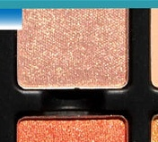

Use: This warm coral shade with golden shimmer can be used as an all-over lid colour or layered for increased depth and intensity. Mix with other warm shades to create custom blends. Can also be used as a blush on light to medium complexions. Pair with 'Coral Breeze' and 'Ocean Breeze' for a vibrant beach-inspired look. Apply with a brush or fingertips for your desired level of intensity.

##### 色号 3：金珊瑚 (Golden Coral) —— 暖调珊瑚色，金色闪片，金属质地。
用途：可作全眼铺色，或叠加增加深度和显色度。与其他暖色混合，可调出自定义的混合色。浅至中等肤色也可当腮红使用。搭配"珊瑚微风"与"海洋微风"，可完成活力海滩妆感。可用刷具或指腹按需叠加显色度。

## Shade 4: Sand — Soft, warm peachy-nude with a satin finish.
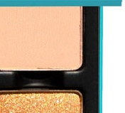

Use: This soft, warm peachy-nude shade can be used as an all-over lid colour or as a base tone beneath complementary hues. It can also be used to highlight the brow bone and inner corners, or as a transitional shade in the crease. Use as a base beneath shades 'Golden Coral' and 'Coral Breeze' for a natural, sun-kissed finish. Apply with a brush for your desired level of intensity.

##### 色号 4：沙色 (Sand) —— 柔和暖调桃裸色，缎面质地。
用途：可作全眼铺色或作为互补色下方的打底色。也可用于眉骨和眼头提亮，或作为眼窝位置的过渡色。搭配"金珊瑚"与"珊瑚微风"作打底，可呈现自然日晒的妆感。可用刷具按需叠加显色度。

## Shade 5: Golden Sand — Luminous golden-yellow with a shimmering finish.
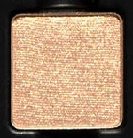

Use: This luminous golden-yellow shade can be worn as an all-over lid colour or layered over complementary tones for a burst of warmth and shine. Use with a mixing medium for a wash of colour or a foiled effect. Pair with shades 'Sunbeam' and 'Ocean Breeze' for a radiant, tropical glow. Apply with fingertips or a dense brush for your desired level of intensity.

##### 色号 5：金沙 (Golden Sand) —— 明亮金黄色，闪烁质地。
用途：可作全眼铺色，或叠加在互补色之上，增加温暖和光泽感。搭配调和液可获得轻透染色感或箔光效果。与"阳光金"、"海洋微风"搭配，可完成灿烂热带妆感。可用指腹或扎实眼影刷按需叠加显色度。

## Shade 6: Ocean Breeze — Soft turquoise with a shimmering, crystalline finish.
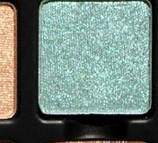

Use: This soft turquoise shade with crystalline shimmer can be used as an accent colour or layered for a striking duochromatic effect. The shimmering finish makes it perfect for a foiled application. Pair with shades 'Peach Shimmer' and 'Coral Breeze' for an unexpected yet harmonious contrast. Apply with fingertips or a dense brush for your desired level of intensity.

##### 色号 6：海洋微风 (Ocean Breeze) —— 柔和绿松石色，闪烁结晶质地。
用途：可作为点缀色使用，或叠加营造引人瞩目的双偏光效果。闪烁质地适合箔光上色。与"蜜桃闪"、"珊瑚微风"搭配，可完成意想不到的和谐对比妆感。可用指腹或扎实眼影刷按需叠加显色度。

## Shade 7: Coral Breeze — Vibrant coral with warm shimmer and metallic finish.
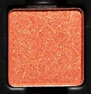

Use: This vibrant coral shade with warm shimmer can be worn as an all-over lid colour or as a bold accent colour. The metallic finish makes it perfect for layering or a statement eye. Pair with shades 'Golden Sand' and 'Ocean Breeze' for a tropical, vibrant look. Apply with a brush or fingertips for your desired level of intensity.

##### 色号 7：珊瑚微风 (Coral Breeze) —— 活力珊瑚色，暖调闪片，金属质地。
用途：可作全眼铺色或作为大胆的点缀色。金属质地适合叠加或打造大胆眼妆。与"金沙"、"海洋微风"搭配，可完成热带活力妆感。可用刷具或指腹按需叠加显色度。

## Shade 8: Warm Glow — Golden-orange with a luminous, shimmering finish.
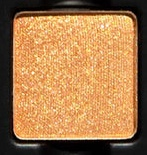

Use: This golden-orange shade with luminous shimmer can be used as an all-over lid colour or layered for warmth and depth. Mix with other warm shades to create custom blends. Can also be used as a blush on light to medium complexions. Pair with 'Coral Breeze' and 'Golden Coral' for a warm, sun-kissed aesthetic. Apply with a brush or fingertips for your desired level of intensity.

##### 色号 8：温暖光芒 (Warm Glow) —— 金橙色，明亮闪烁质地。
用途：可作全眼铺色，或叠加增加温暖感和深度。与其他暖色混合可调出自定义的混合色。浅至中等肤色也可当腮红使用。与"珊瑚微风"、"金珊瑚"搭配，可完成温暖日晒妆感。可用刷具或指腹按需叠加显色度。

## Shade 9: Bright Yellow — Pure, vibrant yellow with a luminous matte finish.
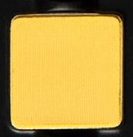

Use: This bright, vibrant yellow shade can be used as an accent colour or for creative, artistic eye looks. It can also be mixed with other shades to create custom colours. The matte finish allows for blending versatility. Use with a mixing medium for intensified colour payoff. Pair with neutral shades for a pop of colour. Apply with a brush for your desired level of intensity.

##### 色号 9：亮黄 (Bright Yellow) —— 纯正活力黄色，明亮哑光质地。
用途：可作为点缀色或创意艺术妆感。也可与其他色彩混合调出自定义颜色。哑光质地易于混合。搭配调和液可增强显色度。与中性色搭配可凸显色彩。可用刷具按需叠加显色度。

## Shade 10: Peachy Coral — Warm, mid-tone peachy-coral with a shimmering finish.
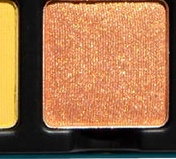

Use: This warm, mid-tone peachy-coral shade can be used as an all-over lid colour or as a base tone beneath complementary hues. It can also be used as a transitional shade in the crease and socket. Mix with other warm shades for custom blends. Can also be worn as a blush on light to medium complexions. Pair with 'Sunbeam' and 'Ocean Breeze' for a balanced look. Apply with a brush for your desired level of intensity.

##### 色号 10：蜜桃珊瑚 (Peachy Coral) —— 暖调中调桃珊瑚色，闪烁质地。
用途：可作全眼铺色或作为互补色下方的打底色。也可作为眼窝和轮廓位置做过渡。与其他暖色混合，可调出自定义的混合色。浅至中等肤色也可当腮红使用。搭配"阳光金"与"海洋微风"，可完成平衡妆感。可用刷具按需叠加显色度。

## Shade 11: Warm Taupe — Warm, mid-tone peachy-taupe with a satin matte finish.
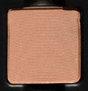

Use: This warm, mid-tone peachy-taupe shade can be used as an all-over lid colour or as a base tone. It can also be used to highlight the brow bone and inner corners, or as a transitional shade in the crease and socket. Mix with other shades to create custom colours. The satin matte finish is versatile for blending. Pair with 'Peachy Coral' and 'Warm Brown' for a sophisticated look. Apply with a brush for your desired level of intensity.

##### 色号 11：暖调灰褐 (Warm Taupe) —— 暖调中调桃灰褐色，缎面哑光质地。
用途：可作全眼铺色或作为打底色。也可用于眉骨和眼头提亮，或作为眼窝和轮廓位置的过渡色。与其他色彩混合可调出自定义颜色。缎面哑光质地易于混合。与"蜜桃珊瑚"、"深褐"搭配，可完成精致妆感。可用刷具按需叠加显色度。

## Shade 12: Warm Brown — Deep, warm brown with a matte finish.
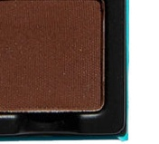

Use: This deep, warm brown shade can be used to define the crease and socket of the eye, create depth, or as an outer corner accent. It works beautifully as a liner for smokey looks or subtle definition. Mix with other warm shades to deepen or add warmth to the entire look. Pair with lighter warm shades for a dimensional, warm-toned eye. Apply with a brush for your desired level of intensity or use with a mixing medium for a foiled effect.

##### 色号 12：深褐 (Warm Brown) —— 深暖调棕色，哑光质地。
用途：可用于定义眼窝和轮廓，打造深度感，或作为眼尾点缀。适合打造烟熏妆或精致眼线。与其他暖色混合可深化或增加整体妆感的温暖度。与浅暖色搭配，可完成立体暖调眼妆。可用刷具按需叠加显色度或搭配调和液营造箔光效果。
