# Viseart 12色 中号 紫罗兰流辉盘 Violette Lumière Étendu
*发布：2026*

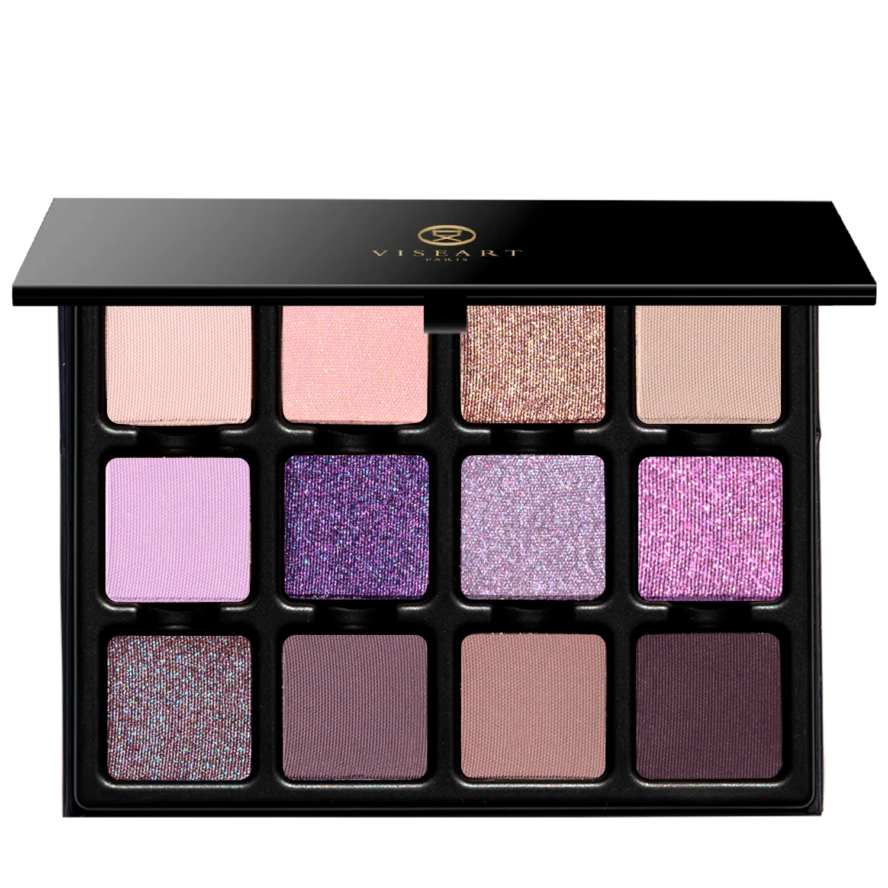

> 紫罗兰流辉盘是 Viseart Paris 献给紫罗兰时刻的颂歌。在午后最后一抹金色余晖与月亮初升的片刻之间，天空悄然蜕变——十二色以冷调粉、双偏光缎、棱彩幻色与天鹅绒哑光，捕捉那道转瞬即逝的紫光。

> *Violette Lumière Étendu is Viseart Paris's ode to the violet hour. Between the last golden shimmer of afternoon and the first slip of the moon, the sky transforms across twelve shades spanning cool-toned pinks, duochromatic satins, prismatic toppers, and velvety soft mattes.*

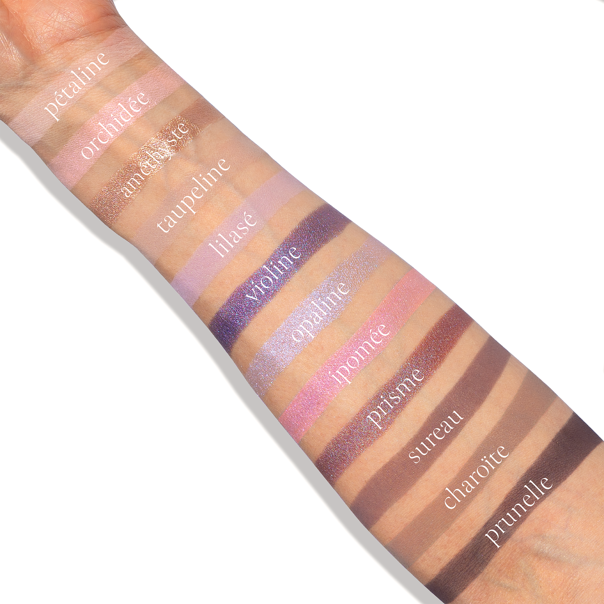
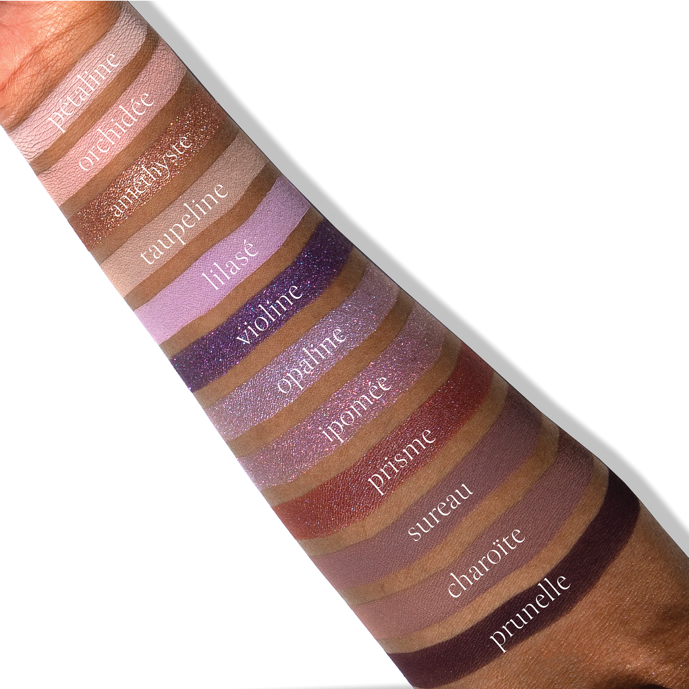

## Shade 1: Pétaline — Light, cool-toned nude pink with a matte finish.
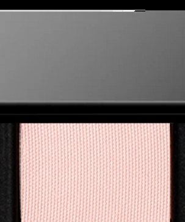

Use: Sweep across the lid for a delicate wash of colour, blend through the crease as a transitional tone, or use as a brightening base. Apply with a brush for your desired intensity. Pair with ‘Orchidée’ and ‘Opaline’ for a romantic wash of prismatic pink luminosity.

##### 色号 1：花瓣粉 (Pétaline) —— 浅冷调裸粉色，哑光质地。
用途：可作全眼轻扫铺色、眼窝过渡色，或作为提亮打底色。可用刷具按需叠加显色度。与 `Orchidée` 和 `Opaline` 搭配，可呈现浪漫的棱彩粉光感。

## Shade 2: Orchidée — Light petal pink with delicate magenta reflects and a satin finish.
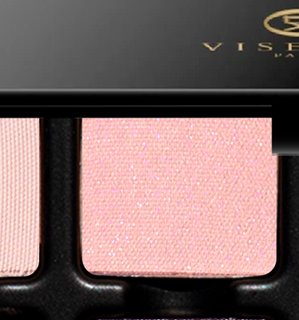

Use: Sweep across the lid for a radiant wash of colour or tap onto the centre of the lid to brighten and enhance dimension. Doubles as a highlight for inner corners or beneath the brow bone. Wear with ‘Pétaline‘ and ‘Améthyste‘ for a petal-soft whisper of rose satin.

##### 色号 2：兰瓣粉 (Orchidée) —— 浅花瓣粉色，带细腻洋红反光，缎光质地。
用途：可全眼铺色，或点在眼皮中央提亮并增强立体感；也可用于眼头或眉骨提亮。与 `Pétaline` 和 `Améthyste` 搭配，可呈现花瓣般柔和的玫瑰缎光妆效。

## Shade 3: Améthyste — Bronzed taupe shimmer with warm dimensional depth.
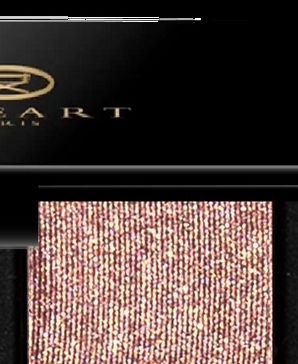

Use: Sweep across the lid for soft warmth and dimension, or blend onto the outer lid to sculpt and define. Use with a mixing medium for a foiled effect. Pairs with ‘Taupeline‘ and ‘Charoïte‘ for a sculptural balance of bronze and stone.

##### 色号 3：紫晶古铜 (Améthyste) —— 古铜灰褐闪色，带暖调立体深度。
用途：可全眼铺色，带出柔和暖感与层次，也可晕染在眼尾塑造立体轮廓。搭配调和液可获得箔光效果。与 `Taupeline` 和 `Charoïte` 搭配，可呈现古铜与石灰调平衡的雕塑感妆效。

## Shade 4: Taupeline — Light, cool-toned taupe grey with a matte finish.
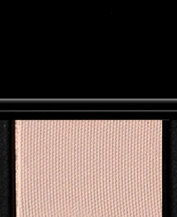

Use: Blend through the crease to create natural shadow and dimension, or diffuse along the outer lid to ground lighter tones. Wear with Pétaline and Charoïte for subtle structure in a softly balanced matte trio.

##### 色号 4：灰褐雾影 (Taupeline) —— 浅冷调灰褐灰色，哑光质地。
用途：可晕染在眼窝打造自然阴影与立体感，也可铺在眼尾压住浅色，使配色更稳。与 `Pétaline` 和 `Charoïte` 搭配，可完成柔和平衡的哑光三色层次。

## Shade 5: Lilasé — Muted, cool-toned lilac with a matte finish.
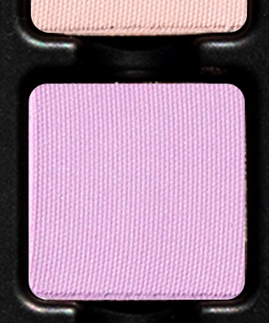

Use: Use as an all-over lid colour on all complexions or as a base beneath complementary shades. Blend with ‘Opaline‘ and ‘Prisme‘ for a luminous bouquet of lilac light.

##### 色号 5：丁香雾紫 (Lilasé) —— 柔雾冷丁香紫色，哑光质地。
用途：可作全眼铺色，适合所有肤色，也可作为互补色下方的打底色。与 `Opaline` 和 `Prisme` 搭配，可呈现明亮的丁香花束般光感。

## Shade 6: Violine — Deep violet with an orchid-blue duochromatic shift and satin finish.
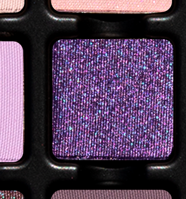

Use: Sweep across the lid for rich dimension, or press along the outer lid and lash line to deepen and define the eye. Use with a mixing medium for a foiled effect. Blend with ‘Ipomée‘ and ‘Prisme‘ for a highly-pigmented purple prismatic pairing.

##### 色号 6：紫罗兰调 (Violine) —— 深紫色，带兰蓝偏光变化，缎光质地。
用途：可全眼铺色打造浓郁层次，也可压在眼尾和睫毛根部加深轮廓。搭配调和液可获得箔光效果。与 `Ipomée` 和 `Prisme` 搭配，可呈现高显色的紫调棱彩妆效。

## Shade 7: Opaline — Sheer, high-shine topper with a blue-magenta duochromatic shift.
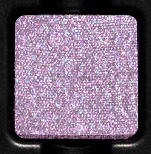

Use: Tap over matte or satin shades to create a dimensional prismatic finish. Apply with a fingertip for maximum shine or sweep lightly with a brush for a soft, diffused effect. Use with a mixing medium for a foiled finish. Pair with ‘Améthyste‘ and ‘Prisme‘ for refined reflective depth.

##### 色号 7：欧泊偏光 (Opaline) —— 轻透高闪叠擦色，带蓝洋红双偏光变化。
用途：可叠擦在哑光或缎光色之上，营造立体棱彩效果。用指腹可获得更强闪泽，刷具轻扫则更柔和雾化。搭配调和液可获得箔光妆效。与 `Améthyste` 和 `Prisme` 搭配，可带出细腻的反光深度。

## Shade 8: Ipomée — Radiant pink-violet duochrome with prismatic flecks of blue, magenta, and ruby.
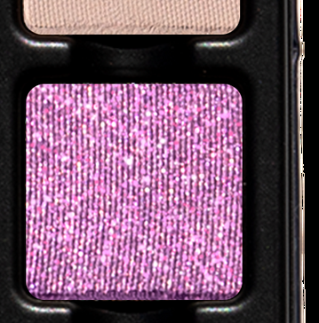

Use: Sweep all over the lid for a vibrant flash of reflective colour, or tap onto the centre to amplify dimension and sparkle. Use with a mixing medium for a foiled finish. Wear with ‘Pétaline‘ and ‘Orchidée‘ for a soft bloom of shimmering pinks.

##### 色号 8：牵牛花紫 (Ipomée) —— 明亮粉紫双偏光色，带蓝色、洋红与红宝石色棱彩闪片。
用途：可全眼铺色，呈现鲜明反光色彩，也可点在眼皮中央增强层次与闪耀感。搭配调和液可获得箔光妆效。与 `Pétaline` 和 `Orchidée` 搭配，可做出柔和盛放的粉紫微闪妆感。

## Shade 9: Prisme — Nude rose-mauve with blue reflectivity and a satin finish.
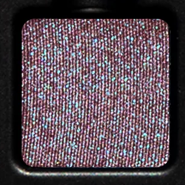

Use: Sweep across the lid for a softly reflective finish, or blend and build through the crease and lash line for shimmering depth. Use with a mixing medium for a foiled finish. Pairs with ‘Sureau‘ and ‘Charoïte‘ for a softly smouldering kiss of shimmer and shadow.

##### 色号 9：棱镜玫瑰 (Prisme) —— 裸玫瑰豆沙色，带蓝调反光，缎光质地。
用途：可全眼铺色，呈现柔和反光，也可叠加在眼窝和睫毛根部营造闪耀深度。搭配调和液可获得箔光妆效。与 `Sureau` 和 `Charoïte` 搭配，可呈现柔雾微熏的光影层次。

## Shade 10: Sureau — Cool-toned smoky lilac grey with a matte finish.
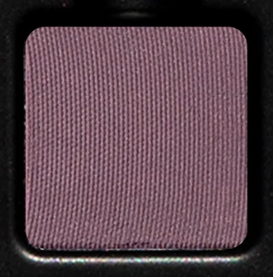

Use: Use as an all-over base, to sculpt the crease and outer corners, or as a softly diffused liner. Layer beneath reflective shades to deepen and intensify a smoky look. Blend with ‘Violine‘ and ‘Prunelle‘ for a sultry smoked violet.

##### 色号 10：接骨木雾紫 (Sureau) —— 冷调烟熏丁香灰色，哑光质地。
用途：可作全眼打底色、眼窝与眼尾塑形色，或作为柔雾眼线色。叠在反光色下方可加深并强化烟熏效果。与 `Violine` 和 `Prunelle` 搭配，可呈现魅惑烟熏紫妆感。

## Shade 11: Charoïte — Cool-toned stone nude with a matte finish.
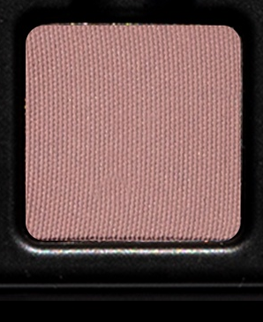

Use: Define the crease, deepen the outer corners, or softly contour the eye for natural-looking depth. Blend with ‘Prisme‘ and ‘Prunelle‘ for a softly shadowed mauve-plum eye.

##### 色号 11：查罗石裸灰 (Charoïte) —— 冷调石感裸色，哑光质地。
用途：可用于勾勒眼窝、加深眼尾，或柔和修饰眼部轮廓，打造自然深度。与 `Prisme` 和 `Prunelle` 搭配，可呈现柔雾阴影感的豆沙李子妆效。

## Shade 12: Prunelle — Deep elderberry purple-brown with a matte finish.
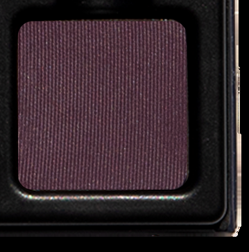

Use: Sweep across the lid for dramatic depth, blend into the crease and outer corners to sculpt dimension, or use as a softly diffused liner. Can also be worn as a contour on deeper complexions. Wear with ‘Violine‘ and ‘Opaline‘ for plum-lit shimmer and shadow.

##### 色号 12：野李深莓 (Prunelle) —— 深接骨木莓紫棕色，哑光质地。
用途：可全眼铺色打造戏剧化深度，也可晕染在眼窝与眼尾塑造立体层次，或作为柔雾眼线色。深肤色也可作修容。与 `Violine` 和 `Opaline` 搭配，可呈现李子色微光与阴影交织的妆效。
