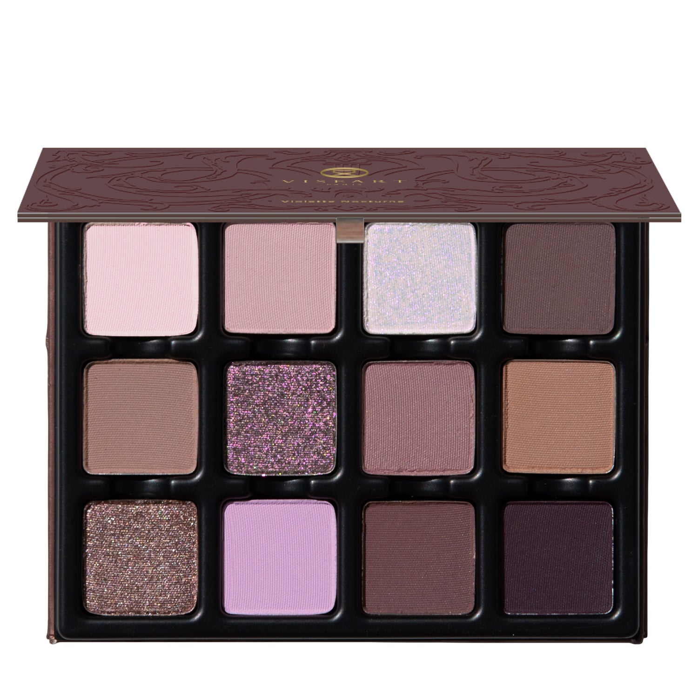
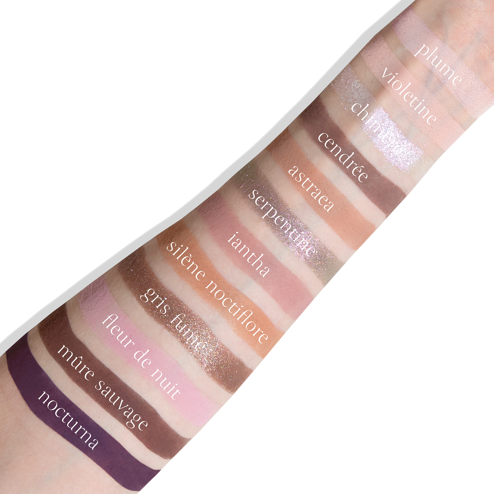
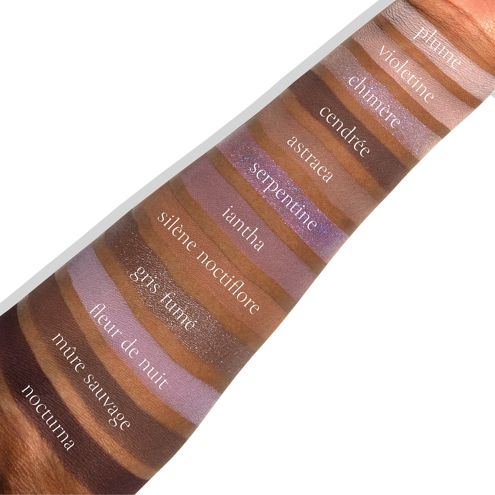

# Viseart 12色 中号 紫罗兰夜曲盘 Violette Nocturne Étendu
*发布：2025*

> 灵感源自巴黎冬至前夕，紫罗兰夜曲盘召唤月吻的李紫、墨染的桑葚与绸缎般的灰紫藕荷——以烟云、暗影与神话的姿态，娓娓道出冬夜的深邃韵致。

> *Inspired by Paris on the cusp of winter, Violette Nocturne Étendu summons moon-kissed plums, noir-stained mulberries, and silken mauves, wrapped in smoke, shadow, and myth.*

## Shade 1: Plume — Light, cool-toned nude pink with a matte finish.

Use: Use this light, cool-toned nude pink as an all-over lid colour on all complexions, in the crease of the eyes as a transitional hue, or as a light base beneath complementary tones. Apply with a brush for your desired level of intensity. Pair with shades ‘Violetine’ and ‘Chimère’ for a crystalline kiss of twilight radiance.

##### 色号 1：羽雾粉 (Plume) —— 浅冷调裸粉色，哑光质地。
用途：可作全眼铺色、眼窝过渡色，或作为互补色下方的浅色打底。可用刷具按需叠加显色度。与 `Violetine` 和 `Chimère` 搭配，可呈现暮光亲吻般的晶透微光。

## Shade 2: Violetine — Light blush pink with a matte finish.

Use: This light, blush matte pink shade can be used as an all-over lid colour, a base tone beneath complementary tones, or to highlight the brow bone. Apply with a brush for your desired level of intensity. Pair with shades ‘Iantha’ and ‘Fleur de Nuit’ for a softly smoked veil of ash and umber.

##### 色号 2：紫绒粉 (Violetine) —— 浅腮红粉色，哑光质地。
用途：可作全眼铺色、互补色下方的打底色，或用于眉骨提亮。可用刷具按需叠加显色度。与 `Iantha` 和 `Fleur de Nuit` 搭配，可呈现柔和烟雾感的灰紫棕妆效。

## Shade 3: Chimère — White purple-pink with a duochromatic finish.

Use: Use this white, purple-pink duochromatic shade as a luminous lid topper, radiant inner-corner accent, highlight on the high points of the face, or a light-catching gleam at the center of the eye. Use this shade with a mixing medium for a foiled effect, as a liner, or with a swirl of gloss for the perfect pearlized sheen. Apply with a brush for your desired level of intensity. Pair with shades ‘Serpentine’ and ‘Gris Fumé’ for an amethyst prism of shifting luminosity.

##### 色号 3：幻魅偏光 (Chimère) —— 白调紫粉色，双偏光质地。
用途：可作眼皮提亮叠擦色、眼头点亮色、面部高光，或点在眼皮中央增强聚光感。搭配调和液可获得箔光效果，也可作眼线，或混入唇蜜做出珍珠般光泽。可用刷具按需叠加显色度。与 `Serpentine` 和 `Gris Fumé` 搭配，可呈现紫水晶棱镜般的变幻光感。

## Shade 4: Cendrée — Mid-tone greige-purple with a matte finish.

Use: This mid-tone, matte, greige shade can be used as an all-over lid colour, a transitional shade to build out the crease and socket, a soft liner, or as a base tone beneath complementary tones. Apply with a brush for your desired level of intensity. Blend with shades ‘Iantha’ and ‘Gris Fumé’ for a grungy, greige haze of violet ash.

##### 色号 4：烟灰紫褐 (Cendrée) —— 中调灰米紫色，哑光质地。
用途：可作全眼铺色、眼窝过渡色、柔和眼线色，或作为互补色下方的打底色。可用刷具按需叠加显色度。与 `Iantha` 和 `Gris Fumé` 搭配，可做出带紫灰调的颓感烟雾妆。

## Shade 5: Astraea — Cool mid-tone taupe brown with a matte finish.

Use: Use this cool, mid-tone taupe brown as an all-over lid colour on all complexions, blend through the crease as a seamless transition, or deepen at the outer corners to sculpt depth and dimension. It can also be used in the brows, hairline, or as a contour shade on light to medium complexions. Apply with a brush for your desired level of intensity. Blend with shades ‘Silène Noctiflore’ and ‘Mûre Sauvage’ for a smoldering plume of midnight plum.

##### 色号 5：星辉灰棕 (Astraea) —— 冷调中灰棕色，哑光质地。
用途：可作全眼铺色，在眼窝自然晕染作过渡色，或叠加在眼尾加强深度与立体感。也可用于眉部、发际线，浅至中等肤色还可作修容。可用刷具按需叠加显色度。与 `Silène Noctiflore` 和 `Mûre Sauvage` 搭配，可呈现午夜李子色般的深邃烟熏感。

## Shade 6: Serpentine — Light purple with flecks of silver, lilac, pink, and green with a duochromatic finish.

Use: Use this light purple duochromatic shade as an all-over lid colour on all complexions, layered over complementary shades as a reflective topper, as a radiant inner-corner accent, or for a radiant highlight in the center of the eye. Use this shade with a mixing medium for a foiled effect, as a liner, or with a swirl of gloss for a prismatic, opalescent finish. Apply with a brush for your desired level of intensity. Pair with shades ‘Chimère’ and ‘Nocturna’ for a high-contrast duochromatic play of shadow and light.

##### 色号 6：灵蛇幻紫 (Serpentine) —— 浅紫色，带银色、淡紫、粉色与绿色闪片，双偏光质地。
用途：可作全眼铺色，或叠加在互补色之上作为反光提亮层，也可用于眼头或眼皮中央增强光感。搭配调和液可获得箔光效果，也可作眼线，或混入唇蜜营造棱彩蛋白石光泽。可用刷具按需叠加显色度。与 `Chimère` 和 `Nocturna` 搭配，可呈现高对比的明暗偏光效果。

## Shade 7: Iantha — Mid-tone dusty cool-toned purple with a matte finish.

Use: Use this mid-tone dusty cool-toned purple as an all-over lid colour on all complexions, as a transitional shade in the crease of the sockets, or beneath complementary tones to amplify color intensity. Apply with a brush for your desired level of intensity. Blend with shades ‘Fleur de Nuit’ and ‘Mûre Sauvage’ for a velvet veil of aubergine allure.

##### 色号 7：鸢尾雾紫 (Iantha) —— 中调灰雾冷紫色，哑光质地。
用途：可作全眼铺色、眼窝过渡色，或作为互补色下方的打底色以增强显色。可用刷具按需叠加显色度。与 `Fleur de Nuit` 和 `Mûre Sauvage` 搭配，可营造带天鹅绒质感的茄紫妆效。

## Shade 8: Silène Noctiflore — Mid-tone taupe brown with a matte finish.

Use: Use this midtone taupe brown shade as an all-over lid color on all complexions, in the crease and outer corners of the eyes as a transitional shade, or to build depth and dimension in the outer corners of the eyes. It can also be used in the brows, hairline, or as a contour shade on light to medium complexions. Apply with a brush for your desired level of intensity. Combine with shades ‘Astraea’ and ‘Mûre Sauvage’ for a shadowed shroud of violet umber.

##### 色号 8：夜绽灰棕 (Silène Noctiflore) —— 中调灰棕色，哑光质地。
用途：可作全眼铺色、眼窝与眼尾的过渡色，或用于叠出深度与立体感。也可用于眉部、发际线，浅至中等肤色还可作修容。可用刷具按需叠加显色度。与 `Astraea` 和 `Mûre Sauvage` 搭配，可呈现紫棕阴影般的深沉层次。

## Shade 9: Gris Fumé — Smoked taupe-brown purple with a silver shimmer finish.

Use: Use this shimmering taupe-brown purple as an all-over lid colour on all complexions, layered over complementary tones for dimensional depth, or in the outer corners of the eyes to line and define. Can also be used with a mixing medium for a foiled effect. Apply with a brush for your desired level of intensity. Layer over shade ‘Cendrée’ and blend with shade ‘Nocturna’ for a shimmering veil of obsidian smoke.

##### 色号 9：烟熏灰紫 (Gris Fumé) —— 烟熏灰棕紫色，银闪质地。
用途：可作全眼铺色，或叠加在互补色之上增强立体深度，也可用于眼尾与睫毛根部勾勒轮廓。搭配调和液可获得箔光效果。可用刷具按需叠加显色度。叠在 `Cendrée` 上并与 `Nocturna` 晕染，可做出黑曜烟雾般的闪耀层次。

## Shade 10: Fleur de Nuit — Light muted lavender with a matte finish.

Use: Use this light, muted lavender shade as an all-over lid colour on all complexions or as a base colour beneath complementary shades. Apply with a brush for your desired level of intensity.

##### 色号 10：夜之花 (Fleur de Nuit) —— 浅柔雾薰衣草色，哑光质地。
用途：可作全眼铺色，或作为互补色下方的打底色。可用刷具按需叠加显色度。

## Shade 11: Mûre Sauvage — Mid-tone, cool-toned cacao taupe with a matte finish.

Use: This mid-tone, cool-toned cacao taupe shade can be used as an all-over lid colour, to build depth and dimension in the outer corners of the eyes, or as a liner to add definition to the lash line. Apply with a brush for your desired level of intensity. Pair with shades ‘Cendrée’ and ‘Nocturna‘ to create a smokescape of sultry depth.

##### 色号 11：野黑莓 (Mûre Sauvage) —— 中调冷可可灰棕色，哑光质地。
用途：可作全眼铺色，用于眼尾加深立体感，或作眼线色勾勒睫毛根部。可用刷具按需叠加显色度。与 `Cendrée` 和 `Nocturna` 搭配，可营造深邃魅惑的烟熏妆感。

## Shade 12: Nocturna — Deep elderberry purple brown with a matte finish.

Use: Use this deep elderberry matte as an all-over lid colour for dramatic depth, as a base tone to accentuate lighter hues, or to create dimension in the socket and outer corners of the eyes. It can also be used as a liner or worn as a contour color on deep complexions. Wear with shades ‘Serpentine’ and ‘Mûre Sauvage’ for a chiaroscuro of plum-lit shimmer and shadow.

##### 色号 12：夜莓深紫 (Nocturna) —— 深接骨木莓紫棕色，哑光质地。
用途：可作全眼铺色打造戏剧化深度，也可作为打底色衬托浅色，或用于眼窝与眼尾塑造立体层次。也可作眼线色，深肤色还可作修容。与 `Serpentine` 和 `Mûre Sauvage` 搭配，可呈现李子色微光与阴影交织的明暗妆效。
