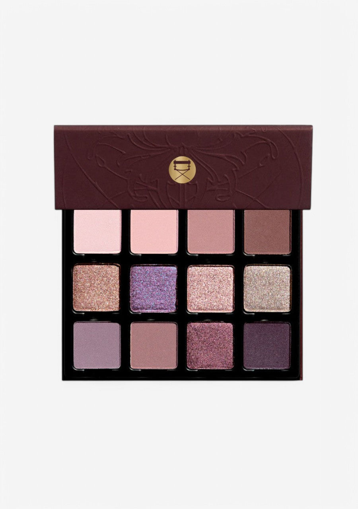
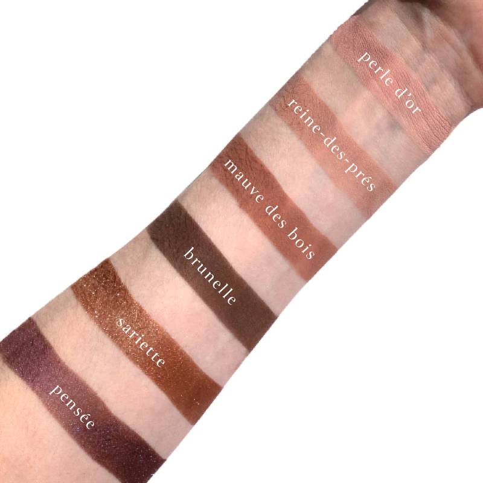
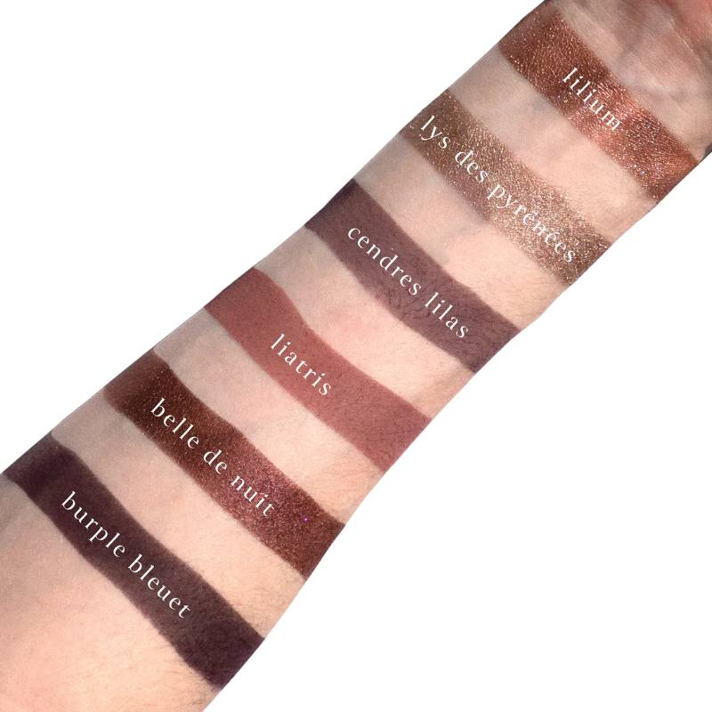
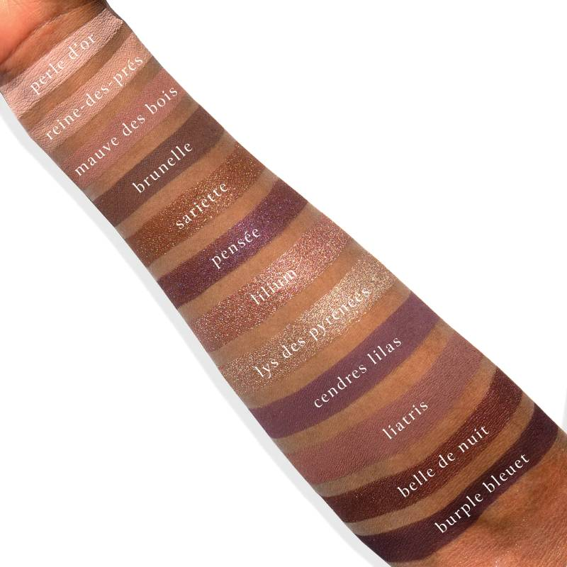
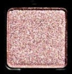
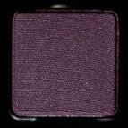

# Viseart 12色 中号 紫罗兰暮光盘 Violette Vespertine Étendu
*发布：2023*

> 紫罗兰暮光盘是 Viseart Paris 献给黄昏那道转瞬即逝的紫光的礼赞。十二个色号，从温润的珍珠玫瑰、朦胧的森林薰衣草，到深邃的月桂紫铜与李暮蓝黑——在一片月色梦境中，烘托出暮色将至、夜幕微开的迷人瞬间。

> *Violette Vespertine Étendu is Viseart Paris's tribute to that fleeting violet light of dusk. Twelve shades move from warm pearl roses and hazy forest mauves to deep amber coppers and moonlit plums — conjuring the glamorous, liminal moment when evening descends.*

## Shade 1: Perle d'Or — Warm, rosy pearl with a soft golden shimmer and satin finish.

Use: Sweep across the lid for a luminous, skin-like glow, or tap onto the inner corner and brow bone for a radiant highlight. Blend with 'Reine-des-Prés' and 'Lilium' for a delicate, warm-pearl shimmer look.

##### 色号 1：金珍珠 (Perle d'Or) —— 暖调玫瑰珍珠色，带细腻金光，缎光质地。
用途：可全眼铺色，营造莹润肌感光泽，或点在眼头与眉骨作提亮。与 `Reine-des-Prés` 和 `Lilium` 搭配，可呈现细腻暖调珠光妆感。

## Shade 2: Reine-des-Prés — Soft, warm-toned nude pink with a matte finish.

Use: Use as an all-over lid colour on all complexions, blend through the crease as a seamless transitional shade, or apply as a brightening base beneath complementary tones. Pair with 'Perle d'Or' and 'Mauve des Bois' for a natural, rosy-nude eye.

##### 色号 2：草原皇后 (Reine-des-Prés) —— 柔和暖调裸粉色，哑光质地。
用途：可作全眼铺色、眼窝自然过渡色，或作为互补色下方的提亮打底色。与 `Perle d'Or` 和 `Mauve des Bois` 搭配，可呈现自然裸玫瑰妆效。

## Shade 3: Mauve des Bois — Dusty, cool-toned rose mauve with a matte finish.

Use: Blend through the crease to create natural shadow and dimension, or sweep across the lid as a soft all-over shade. Diffuse along the outer corners to frame the eye. Wear with 'Reine-des-Prés' and 'Cendres Lilas' for a hazy, forest-toned eye.

##### 色号 3：林间豆沙 (Mauve des Bois) —— 灰雾冷调玫瑰豆沙色，哑光质地。
用途：可晕染于眼窝打造自然阴影与层次，或全眼轻扫作柔和铺色；也可淡化于眼尾为眼部塑形。与 `Reine-des-Prés` 和 `Cendres Lilas` 搭配，可呈现朦胧森林调妆效。

## Shade 4: Brunelle — Deep, warm-toned mauve brown with a matte finish.

Use: Deepen the crease and outer corners to add structure and shadow, or apply softly at the lower lash line for definition. Blend with 'Mauve des Bois' and 'Liatris' for a warm, earthy depth.

##### 色号 4：棕玫红 (Brunelle) —— 深暖调豆沙棕色，哑光质地。
用途：可叠加于眼窝和眼尾增强轮廓感与阴影，或轻涂于下睫毛根部作轮廓线。与 `Mauve des Bois` 和 `Liatris` 搭配，可带出暖调大地深度。

## Shade 5: Sariette — Warm copper-bronze with a metallic shimmer finish.

Use: Sweep across the lid for a glowing copper warmth, or tap onto the centre to amplify dimension and sparkle. Use with a mixing medium for a foiled effect. Pairs with 'Perle d'Or' and 'Belle de Nuit' for a sunset-to-dusk shimmer transition.

##### 色号 5：山香铜光 (Sariette) —— 暖调铜褐色，金属感闪光质地。
用途：可全眼铺色带出温暖铜光，或点在眼皮中央增强立体感与闪耀感。搭配调和液可获得箔光效果。与 `Perle d'Or` 和 `Belle de Nuit` 搭配，可呈现从暖日落到入夜的渐层闪色妆效。

## Shade 6: Pensée — Deep plum-violet duochrome with blue-violet shift and a satin finish.

Use: Sweep across the lid for a rich duochromatic depth, or press onto the outer lid and lower lash line to deepen and define. Use with a mixing medium for a foiled effect. Blend with 'Cendres Lilas' and 'Burple Bleuet' for a sultry, multi-dimensional violet eye.

##### 色号 6：三色堇偏光 (Pensée) —— 深李紫双偏光色，带蓝紫变化，缎光质地。
用途：可全眼铺色呈现浓郁多维偏光深度，或压在眼尾和下睫毛根部加深轮廓。搭配调和液可获得箔光效果。与 `Cendres Lilas` 和 `Burple Bleuet` 搭配，可呈现魅惑多维紫调妆效。

## Shade 7: Lilium — Warm rose-copper shimmer with a metallic finish.

Use: Sweep across the lid for a warm, dimensional shimmer, or layer over matte shades to add reflective luminosity. Use with a mixing medium for a foiled effect. Wear with 'Perle d'Or' and 'Lys des Pyrénées' for a luminous rosy-gold pairing.

##### 色号 7：玫瑰铜百合 (Lilium) —— 暖调玫瑰铜色，金属感闪光质地。
用途：可全眼铺色带出温暖立体闪色，或叠在哑光色之上增加反光层次。搭配调和液可获得箔光效果。与 `Perle d'Or` 和 `Lys des Pyrénées` 搭配，可呈现莹润玫瑰金妆感。

## Shade 8: Lys des Pyrénées — Soft champagne gold with a shimmer finish.

Use: Tap onto the centre of the lid or inner corner for a brightening highlight, or sweep lightly across the brow bone. Layer over matte shades for soft luminosity. Pair with 'Sariette' and 'Belle de Nuit' for a moonlit champagne-and-plum contrast.

##### 色号 8：比利牛斯百合 (Lys des Pyrénées) —— 柔和香槟金色，亮片闪光质地。
用途：可点在眼皮中央或眼头作提亮，或轻扫于眉骨；也可叠在哑光色之上增加柔和光感。与 `Sariette` 和 `Belle de Nuit` 搭配，可带出月光下香槟与李紫的鲜明对比妆效。

## Shade 9: Cendres Lilas — Muted, cool-toned lilac with a matte finish.

Use: Use as an all-over lid colour or blend through the crease as a hazy transitional shade. Layer beneath reflective shades to deepen and add smoky dimension. Pair with 'Mauve des Bois' and 'Pensée' for a softly smoked lilac-violet look.

##### 色号 9：丁香灰烬 (Cendres Lilas) —— 柔雾冷调丁香紫色，哑光质地。
用途：可作全眼铺色，或晕染于眼窝作朦胧过渡色；也可铺在反光色下方加深并增添烟熏感。与 `Mauve des Bois` 和 `Pensée` 搭配，可呈现柔和烟熏丁香紫妆效。

## Shade 10: Liatris — Warm, mid-tone mauve-taupe with a matte finish.

Use: Blend through the crease and outer corners to add warmth and sculpt depth, or use as a versatile crease transition on all complexions. Can also be used at the brows or hairline on light to medium complexions. Pair with 'Brunelle' and 'Cendres Lilas' for a warm-cool balanced eye.

##### 色号 10：火炬花豆沙 (Liatris) —— 暖调中灰褐豆沙色，哑光质地。
用途：可晕染于眼窝和眼尾增添暖感与立体轮廓，或在所有肤色中作百搭眼窝过渡色；浅至中等肤色还可用于眉部或发际线。与 `Brunelle` 和 `Cendres Lilas` 搭配，可打出暖冷调平衡的眼妆。

## Shade 11: Belle de Nuit — Violet-pink shimmer with prismatic flecks and a metallic finish.

Use: Sweep across the lid for vibrant reflective colour, or tap onto the centre of the eye to intensify dimension. Use with a mixing medium for a foiled effect. Wear with 'Pensée' and 'Lys des Pyrénées' for a deep, moonlit prismatic pairing.

##### 色号 11：夜美人 (Belle de Nuit) —— 紫粉闪色，带棱彩闪片，金属感质地。
用途：可全眼铺色呈现鲜明反光色彩，或点在眼皮中央增强立体感。搭配调和液可获得箔光效果。与 `Pensée` 和 `Lys des Pyrénées` 搭配，可呈现深邃月光下的棱彩妆效。

## Shade 12: Burple Bleuet — Deep blue-plum with a matte finish.

Use: Use to smoke out the outer corners and lower lash line for dramatic depth, or layer beneath shimmer shades to anchor and intensify. Blend with 'Pensée' and 'Belle de Nuit' for a deep, violet-night smoky eye.

##### 色号 12：矢车菊深紫 (Burple Bleuet) —— 深蓝紫色，哑光质地。
用途：可用于烟熏外眼角与下睫毛根部，打造深邃戏剧感，或叠在闪色之下压住并强化颜色。与 `Pensée` 和 `Belle de Nuit` 搭配，可做出深邃紫夜烟熏妆效。
