# VisePro™ 12色 中号 巴黎哑光盘 Paris Mattes Étendu
*发布：2025*

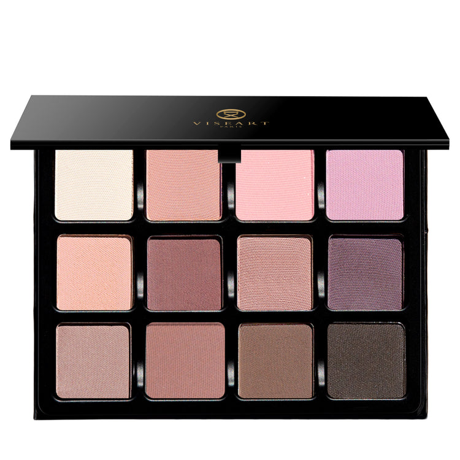

> VisePRO™ 巴黎哑光盘——璀璨的序章！以巴黎芭蕾艺术为灵感，旋入柔美浪漫的色调，每一抹颜色如舞者般无缝流动，带来令人沉醉的精彩演绎。

> *Paris Mattes Étendu by VisePRO™—our prelude to splendor! Pirouette into soft romantic hues inspired by the artistry of Parisian ballet, each shade moves seamlessly with captivating performance.*

## Shade 1: Pointe — Pale mocha with a soft matte finish.
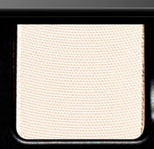

Use: This pale mocha shade works beautifully as an all-over lid colour, base tone, or inner corner highlight. Its soft finish creates a subtle, elegant look. Layer with deeper shades for added dimension or wear alone for a minimalist aesthetic. Perfect for mature eyes or those seeking understated sophistication.

##### 色号 1：尖端点 (Pointe) —— 淡雾黑麦色，柔和哑光质地。
用途：可作全眼铺色、打底色或眼头提亮。柔和质地营造精致优雅的妆感。与深色叠加可增加立体感，或单独使用呈现极简美学。适合成熟肤质或追求低调雅致妆容的使用者。

## Shade 2: Tulle — Delicate peach pink with a matte finish.
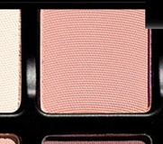

Use: This delicate peach pink shade is ideal as a transitional shade, mid-tone base, or blush application on the lids. Its airy quality adds lightness to any eye look. Pair with warmer mattes for a romantic daytime look or build depth by layering with neutral tones.

##### 色号 2：薄纱粉 (Tulle) —— 轻柔桃粉色，哑光质地。
用途：可作过渡色、中调打底或眼部腮红。轻盈质感为眼妆增添通透感。搭配暖调哑光色可完成浪漫日妆，或与中性色叠加打造深度感。

## Shade 3: Pirouette — Creamy beige with a subtle pink undertone and matte finish.
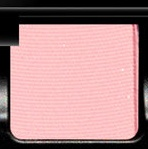

Use: This creamy beige shade is versatile for all over base application, transitional placement, or brow bone highlight. Its gentle pink undertone adds warmth without overwhelming. Layer under more saturated shades or wear alone for a neutral, polished look.

##### 色号 3：旋转转体 (Pirouette) —— 奶油米色，微粉色调，哑光质地。
用途：可作全眼打底、过渡或眉骨提亮。温和粉调增添温度而不失和谐。在饱和色下叠加或单独使用都能呈现中性精致的妆感。

## Shade 4: Plié — Muted mauve with a sophisticated matte finish.
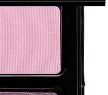

Use: This muted mauve shade brings timeless sophistication to any look. Use as a crease shade for definition or as a mid-tone to add complexity. Its cool undertones work beautifully in neutral-based looks and provide subtle warmth when layered with peachy shades.

##### 色号 4：屈膝动作 (Plié) —— 柔和紫灰色，优雅哑光质地。
用途：为任何眼妆增添永恒优雅感。可用作眼窝定义色或中调增加复杂度。冷调特性完美融入中性妆感，与桃色叠加时提供微妙温度。

## Shade 5: Tendu — Deep espresso brown with a rich matte finish.
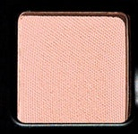

Use: This deep espresso brown is perfect for defining the crease, socket, and outer corners. Its rich intensity creates dramatic depth and dimension. Use as a liner alternative or layer sparingly over lighter shades for a smokey effect. Essential for adding contour and definition.

##### 色号 5：伸展延伸 (Tendu) —— 深浓咖啡色，丰富哑光质地。
用途：完美用于眼窝、轮廓和眼尾定义。丰富的饱和度营造戏剧性深度感。可作眼线替代品或轻轻叠加在浅色上打造烟熏效果。打造轮廓和定义的必备色。

## Shade 6: Arabesque — Warm taupe with a creamy matte finish.
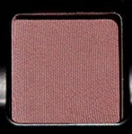

Use: This warm taupe shade serves as an excellent transitional colour and base tone. Its creamy texture blends seamlessly with both warm and cool tones. Ideal for creating soft, blended looks or layering beneath darker shades for a cohesive eye.

##### 色号 6：阿拉贝斯克 (Arabesque) —— 暖调灰褐色，绵柔哑光质地。
用途：作为出色的过渡色和打底色。绵柔质地与暖色和冷色都能无缝融合。适合打造柔和混合妆感或在深色下叠加实现和谐眼妆。

## Shade 7: Assemblé — Warm medium brown with a matte finish.
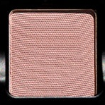

Use: This warm medium brown shade adds depth without heaviness. Perfect for blending and building definition gradually. Use in the crease or outer corner for dimension, or layer with lighter shades for a built-up, dimensional look without appearing harsh.

##### 色号 7：集合跳跃 (Assemblé) —— 暖调中棕色，哑光质地。
用途：增加深度而不显沉闷。完美用于混合和逐步建立定义。可用于眼窝或眼尾增加立体感，或与浅色叠加打造立体妆感而不显生硬。

## Shade 8: Relevé — Soft warm beige with a matte finish.
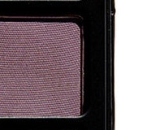

Use: This soft warm beige is versatile for all-over lid application or as a secondary base tone beneath other shades. Its neutral warmth complements most skin tones and creates a clean canvas for other eyeshadow placement. Excellent for everyday wearability.

##### 色号 8：半尖起身 (Relevé) —— 柔和暖米色，哑光质地。
用途：多功能用于全眼铺色或作为其他色彩的次打底。中性温暖适合大多数肤色，为后续色彩打造干净基础。极适合日常佩戴。

## Shade 9: Bourrée — Light pink-taupe with a subtle matte finish.
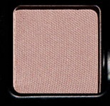

Use: This light pink-taupe shade is perfect for highlighting the inner corner and brow bone. Its subtle hue adds dimension without drawing too much attention. Layer under mid-tones for a soft, romantic aesthetic or use alone for a barely-there flush of colour.

##### 色号 9：布瑞舞 (Bourrée) —— 浅粉灰褐色，温和哑光质地。
用途：完美用于眼头和眉骨提亮。微妙色调增加维度而不过于突出。在中调下叠加呈现柔和浪漫美学，或单独使用获得若隐若现的色彩感。

## Shade 10: Attitude — Dusty rose with a matte finish.
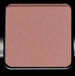

Use: This dusty rose shade adds a touch of colour while maintaining a soft, romantic aesthetic. Use as a mid-tone or blending shade for a cohesive look. Works beautifully as a transitional shade between lighter and darker tones, or layered for a more pigmented application.

##### 色号 10：姿态步 (Attitude) —— 灰调玫瑰色，哑光质地。
用途：增添色彩感同时保持柔和浪漫的美学。用作中调或混合色营造和谐妆感。作为浅色和深色之间的完美过渡，或叠加获得更高的色彩饱和度。

## Shade 11: Échappé — Muted warm coral with a matte finish.
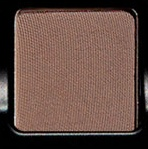

Use: This muted warm coral brings subtle warmth to the eye. Use in the crease or as a secondary accent colour for dimension. Its balanced saturation prevents overpowering while still adding interest to neutral-based looks. Pairs beautifully with earth tones.

##### 色号 11：脱步 (Échappé) —— 柔和暖珊瑚色，哑光质地。
用途：为眼妆增添微妙温暖感。用于眼窝或作为次要点缀色增加维度。平衡的饱和度避免过度而保留趣味性，完美配衬地球色调。

## Shade 12: Balancé — Deep burgundy-brown with a rich matte finish.
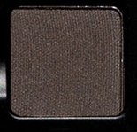

Use: This deep burgundy-brown shade is ideal for creating dramatic depth and intensity in the outer corner or crease. Its warm undertones distinguish it from cooler browns, making it perfect for sunset-inspired or smokey looks. Use sparingly for impact or layer for enhanced dimension.

##### 色号 12：摇晃步 (Balancé) —— 深酒红棕色，丰富哑光质地。
用途：完美用于眼尾或眼窝营造戏剧性深度。暖调特性使其区别于冷调棕色，适合日落或烟熏妆感。轻轻使用呈现冲击力或叠加增强维度感。
