# Viseart 15色 中号 结构塑眉塑影修容盘 15-Pan Structure Brow, Shadow, Hairline & Contour Palette
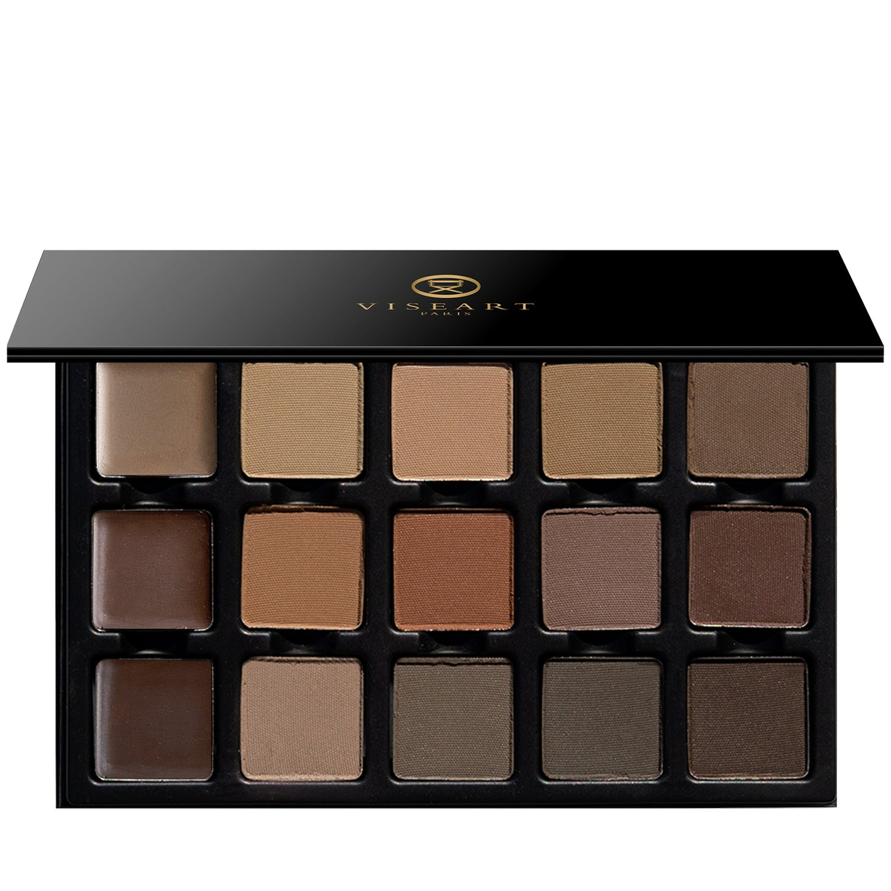

> 提示：本页切片来自官网开盖图 `id`，并非独立的带描述色板图 `icons`。
> 第一排色块可能会受到盖子边缘轻微遮挡；如果后续拿到带描述色板图，应优先用 `icons` 重新切图。

## Shade 1: Neutral Light Wax — Neutral Light wax for light blonde to light brunette hair
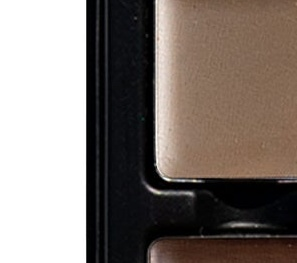

Use: This nourishing wax pomade can be worn alone to lock hair into place for long-wearing hold. For a more defined brow, layer each pomade over a complimentary powder to imbue the brow with subtle color and create pigmented, buildable intensity for a sculpted look that stays all day. Suitable for light blonde to light brunette hair.

##### 色号 1：浅中性塑眉蜡 (Neutral Light Wax) —— 适合浅金发到浅棕发的浅中性色塑眉蜡。
用途：这款滋养型眉蜡膏可单独使用，帮助毛流定型并提供持久支撑。想让眉形更利落时，可将眉蜡叠加在相配的粉状色之上，为眉毛增添柔和色感，并逐步叠出更清晰立体的塑形效果，整日保持整洁。适合浅金发到浅棕发。

## Shade 2: Light Ash — Light ash with a green undertone
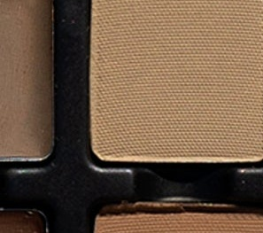

Use: To apply, use short, feathery strokes with an angled brush to outline, define, and fill in sparse areas, gradually building coverage as desired. Suitable for light blonde to light brunette hair with an ashy undertone. Can also be used to enhance the hairline, or as eyeshadow.

##### 色号 2：浅灰调棕 (Light Ash) —— 浅灰调棕色，带绿色底调。
用途：建议使用斜角刷，以短而轻的羽毛状笔触勾勒眉形、填补空隙，并按需要逐步叠加显色度。适合带灰调的浅金发到浅棕发。也可用于修饰发际线，或作眼影使用。

## Shade 3: Light Taupe — Light taupe with a neutral undertone
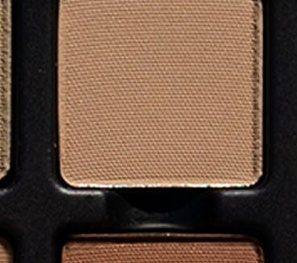

Use: To apply, use short, feathery strokes with an angled brush to outline, define, and fill in sparse areas, gradually building coverage as desired. Suitable for light blonde to light brunette hair with a neutral undertone. Can also be used to enhance the hairline, or as eyeshadow.

##### 色号 3：浅灰褐 (Light Taupe) —— 浅灰褐色，带中性底调。
用途：建议使用斜角刷，以短而轻的羽毛状笔触勾勒眉形、填补空隙，并按需要逐步叠加显色度。适合带中性底调的浅金发到浅棕发。也可用于修饰发际线，或作眼影使用。

## Shade 4: Neutral Ash — Neutral Ash with a green undertone
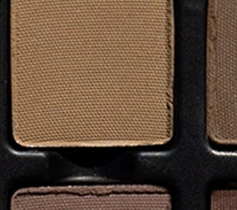

Use: To apply, use short, feathery strokes with an angled brush to outline, define, and fill in sparse areas, gradually building coverage as desired. Suitable for light to medium brunette hair with an ashy undertone. Can also be used to enhance the hairline, or as eyeshadow.

##### 色号 4：中性灰棕 (Neutral Ash) —— 中性灰棕色，带绿色底调。
用途：建议使用斜角刷，以短而轻的羽毛状笔触勾勒眉形、填补空隙，并按需要逐步叠加显色度。适合带灰调的浅棕到中棕发色。也可用于修饰发际线，或作眼影使用。

## Shade 5: Neutral Smoke — Medium ash with a neutral undertone.
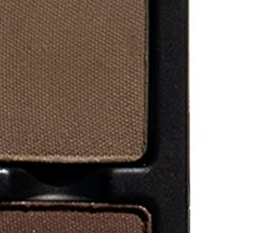

Use: To apply, use short, feathery strokes with an angled brush to outline, define, and fill in sparse areas, gradually building coverage as desired. Suitable for medium brunette hair with an ashy undertone. Can also be used to enhance the hairline, or as eyeshadow.

##### 色号 5：中性烟灰棕 (Neutral Smoke) —— 中调灰棕色，带中性底调。
用途：建议使用斜角刷，以短而轻的羽毛状笔触勾勒眉形、填补空隙，并按需要逐步叠加显色度。适合带灰调的中棕发色。也可用于修饰发际线，或作眼影使用。

## Shade 6: Neutral Medium Wax — Neutral Medium wax for blonde to brunette
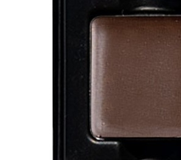

Use: This nourishing wax pomade can be worn alone to lock hair into place for long-wearing hold. For a more defined brow, layer each pomade over a complimentary powder to imbue the brow with subtle color and create pigmented, buildable intensity for a sculpted look that stays all day. Suitable for blonde to medium brunette hair.

##### 色号 6：中性中调塑眉蜡 (Neutral Medium Wax) —— 适合金发到棕发的中性色中调塑眉蜡。
用途：这款滋养型眉蜡膏可单独使用，帮助毛流定型并提供持久支撑。想让眉形更利落时，可将眉蜡叠加在相配的粉状色之上，为眉毛增添柔和色感，并逐步叠出更清晰立体的塑形效果，整日保持整洁。适合金发到中棕发。

## Shade 7: Light Auburn — Light Auburn taupe with a muted red undertone
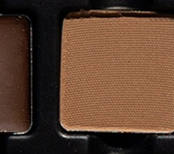

Use: To apply, use short, feathery strokes with an angled brush to outline, define, and fill in sparse areas, gradually building coverage as desired. Suitable for light auburn hair with a soft red undertone. Can also be used to enhance the hairline, or as eyeshadow.

##### 色号 7：浅赤褐 (Light Auburn) —— 浅赤褐灰褐色，带柔和红调底色。
用途：建议使用斜角刷，以短而轻的羽毛状笔触勾勒眉形、填补空隙，并按需要逐步叠加显色度。适合带柔和红调的浅赤褐发色。也可用于修饰发际线，或作眼影使用。

## Shade 8: Medium Auburn — Medium Auburn with a red undertone
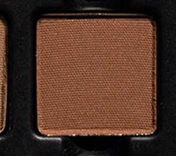

Use: To apply, use short, feathery strokes with an angled brush to outline, define, and fill in sparse areas, gradually building coverage as desired. Suitable for medium brunette hair with an auburn undertone. Can also be used to enhance the hairline, or as eyeshadow.

##### 色号 8：中赤褐 (Medium Auburn) —— 中赤褐色，带红调底色。
用途：建议使用斜角刷，以短而轻的羽毛状笔触勾勒眉形、填补空隙，并按需要逐步叠加显色度。适合带赤褐调的中棕发色。也可用于修饰发际线，或作眼影使用。

## Shade 9: Neutral Mink — Neutral mink with a touch of green and auburn.
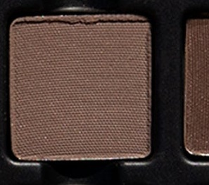

Use: To apply, use short, feathery strokes with an angled brush to outline, define, and fill in sparse areas, gradually building coverage as desired. Suitable for medium brunette hair with a greenish auburn undertone. Can also be used to enhance the hairline, or as eyeshadow.

##### 色号 9：中性貂棕 (Neutral Mink) —— 中性貂棕色，带一丝绿色与赤褐调。
用途：建议使用斜角刷，以短而轻的羽毛状笔触勾勒眉形、填补空隙，并按需要逐步叠加显色度。适合带绿感赤褐底调的中棕发色。也可用于修饰发际线，或作眼影使用。

## Shade 10: Mink Brunette — Neutral medium brown with a hint of aubergine
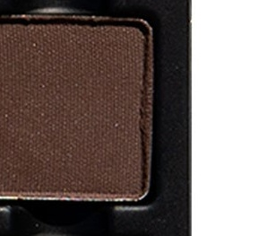

Use: To apply, use short, feathery strokes with an angled brush to outline, define, and fill in sparse areas, gradually building coverage as desired. Suitable for copper brunette hair with a soft aubergine undertone. Can also be used to enhance the hairline, or as eyeshadow.

##### 色号 10：貂棕深褐 (Mink Brunette) —— 中性中棕色，带一丝茄紫底调。
用途：建议使用斜角刷，以短而轻的羽毛状笔触勾勒眉形、填补空隙，并按需要逐步叠加显色度。适合带柔和茄紫底调的铜棕发色。也可用于修饰发际线，或作眼影使用。

## Shade 11: Neutral Dark Ash Wax — Blonde to deep tones.
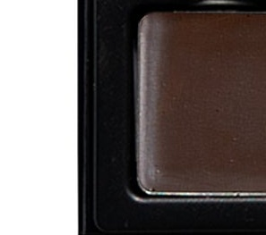

Use: This nourishing wax pomade can be worn alone to lock hair into place for long-wearing hold. For a more defined brow, layer each pomade over a complimentary powder to imbue the brow with subtle color and create pigmented, buildable intensity for a sculpted look that stays all day. Suitable for medium brunette to dark hair.

##### 色号 11：深中性灰调塑眉蜡 (Neutral Dark Ash Wax) —— 适合金发到深色发色。
用途：这款滋养型眉蜡膏可单独使用，帮助毛流定型并提供持久支撑。想让眉形更利落时，可将眉蜡叠加在相配的粉状色之上，为眉毛增添柔和色感，并逐步叠出更清晰立体的塑形效果，整日保持整洁。适合中棕发到深色发。

## Shade 12: Platinum — Light charcoal with a cool undertone.
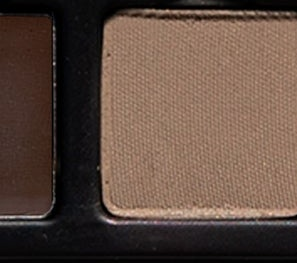

Use: To apply, use short, feathery strokes with an angled brush to outline, define, and fill in sparse areas, gradually building coverage as desired. Suitable for light ash brown hair with a cool undertone. Can also be used to enhance the hairline, or as eyeshadow.

##### 色号 12：铂灰 (Platinum) —— 浅炭灰色，带冷调底色。
用途：建议使用斜角刷，以短而轻的羽毛状笔触勾勒眉形、填补空隙，并按需要逐步叠加显色度。适合带冷调底色的浅灰棕发色。也可用于修饰发际线，或作眼影使用。

## Shade 13: Sterling — Neutral medium charcoal grey ash.
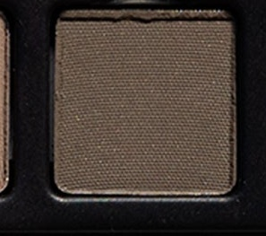

Use: To apply, use short, feathery strokes with an angled brush to outline, define, and fill in sparse areas, gradually building coverage as desired. Suitable for medium ash brown hair with a cool undertone. Can also be used to enhance the hairline, or as eyeshadow.

##### 色号 13：纯银灰 (Sterling) —— 中性中调炭灰灰棕色。
用途：建议使用斜角刷，以短而轻的羽毛状笔触勾勒眉形、填补空隙，并按需要逐步叠加显色度。适合带冷调底色的中灰棕发色。也可用于修饰发际线，或作眼影使用。

## Shade 14: Dark Ash — Mid-toned charcoal grey with a cool undertone.
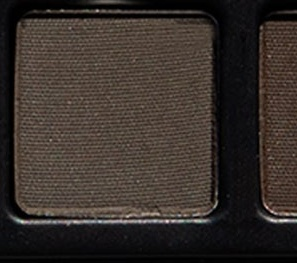

Use: To apply, use short, feathery strokes with an angled brush to outline, define, and fill in sparse areas, gradually building coverage as desired. Suitable for medium charcoal grey hair with a cool undertone. Can also be used to enhance the hairline, or as eyeshadow.

##### 色号 14：深灰调棕 (Dark Ash) —— 中调炭灰色，带冷调底色。
用途：建议使用斜角刷，以短而轻的羽毛状笔触勾勒眉形、填补空隙，并按需要逐步叠加显色度。适合带冷调底色的中炭灰发色。也可用于修饰发际线，或作眼影使用。

## Shade 15: Graphite — Deep ash with a slight aubergine undertone.
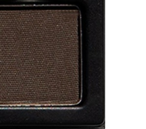

Use: To apply, use short, feathery strokes with an angled brush to outline, define, and fill in sparse areas, gradually building coverage as desired. Suitable for dark, ashy hair with a soft aubergine undertone. Can also be used to enhance the hairline, or as eyeshadow.

##### 色号 15：石墨灰 (Graphite) —— 深灰调色，带轻微茄紫底调。
用途：建议使用斜角刷，以短而轻的羽毛状笔触勾勒眉形、填补空隙，并按需要逐步叠加显色度。适合带柔和茄紫底调的深灰发色。也可用于修饰发际线，或作眼影使用。
