# Viseart 35色 中号 哑大盘 GRANDE PRO 1X
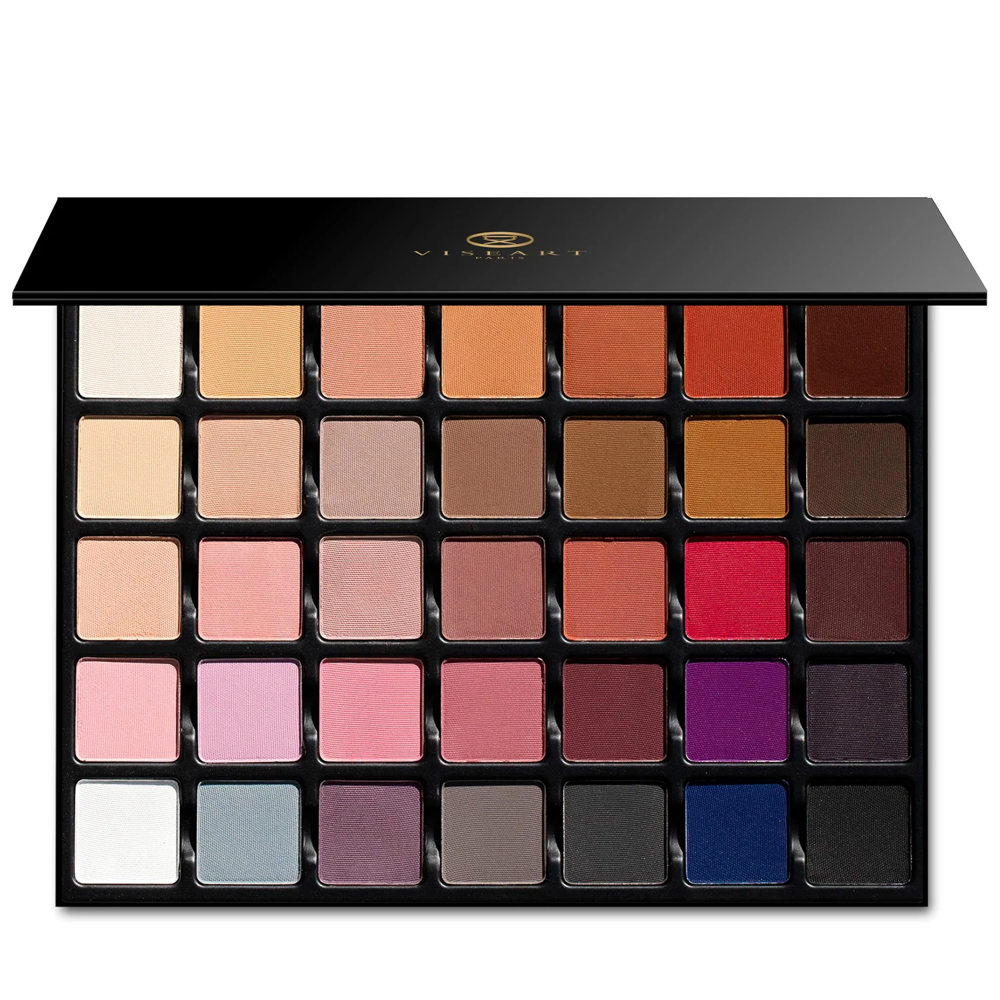

## Shade 1: Eggshell - White with a whisper of peach
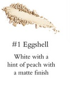

Use: All-over base for light to medium skin tones, or a soft brightener on deeper skin. Great for inner-corner and brow-bone highlight, and for mixing to lighten other shades.

##### 色号 1：蛋壳白 (Eggshell) —— 带一丝蜜桃调的白色，哑光质地。
用途：适合浅至中等肤色全眼打底，深肤色可作柔和提亮；可用于眼头、眉骨高光，也可与其他颜色混合提亮。

## Shade 2: Apricot Nude - Pale apricot with a kiss of warmth
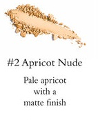

Use: Soft all-over lid shade for light to medium complexions, or a pale apricot accent on deeper skin. Works well as a brightening transition tone.

##### 色号 2：杏裸色 (Apricot Nude) —— 带暖调的浅杏色，哑光质地。
用途：适合浅至中等肤色大面积铺色，深肤色可作浅杏点缀；也可作为提亮型过渡色。

## Shade 3: Cafe Creme - Terracotta nude, deliciously creamy
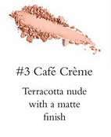

Use: Versatile nude for all complexions. Use all over lid, in the crease as transition, or as a soft highlight on medium to deep skin.

##### 色号 3：奶咖裸色 (Cafe Creme) —— 陶土裸色，哑光质地。
用途：适合所有肤色；可全眼铺色、眼窝过渡，或用于中深肤色的柔和提亮。

## Shade 4: Milk Caramel - Pale camel, an elegant neutral
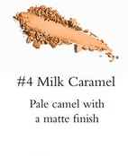

Use: Everyday neutral for lid and crease on all skin tones. Excellent as a clean transition color.

##### 色号 4：牛奶焦糖 (Milk Caramel) —— 浅骆驼焦糖调中性色，哑光质地。
用途：适合作为日常眼皮与眼窝主色，也很适合做干净的过渡层。

## Shade 5: Nude Caramel - Warm medium tan, vibrantly versatile
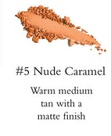

Use: Warm medium base shade for all complexions. Use all over lid or in crease for warmth and depth.

##### 色号 5：裸焦糖 (Nude Caramel) —— 暖调中等棕褐色，哑光质地。
用途：适合所有肤色做暖调打底；可用于全眼铺色或眼窝加深。

## Shade 6: Pumpkin - Burnt orange pigment to turn up the heat
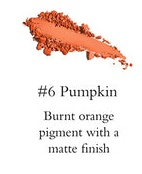

Use: Bold all-over lid shade for all complexions. Also useful as a tone modifier, color corrector, blush for medium to deep skin, or mixed into cream/lip products.

##### 色号 6：南瓜橘 (Pumpkin) —— 焦橘色调，哑光质地。
用途：可全眼铺色；也可作为调色增强色、校色、或中深肤色腮红，还可与唇/霜状产品混合定制色调。

## Shade 7: Chocolate - Deep chocolate red, alluringly smokey
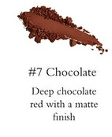

Use: Perfect for smokey looks on all skin tones. Can be used as liner and for brunettes' brows/hairline fill.

##### 色号 7：巧克力棕红 (Chocolate) —— 深巧克力红棕，哑光质地。
用途：适合打造烟熏层次；可作眼线，也可用于深发色人群的眉部或发际线填充。

## Shade 8: Vanilla - Pale peach vanilla, serene and pairing-friendly
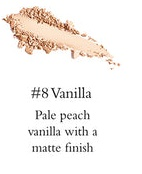

Use: Light base shade or subtle highlight for light to medium skin. Ideal for inner corner, brow bone, and for mixing to brighten other tones.

##### 色号 8：香草桃色 (Vanilla) —— 浅桃香草调，哑光质地。
用途：可作浅色打底或柔和高光，适合眼头与眉骨提亮；也可与其他色混合提亮。

## Shade 9: Creme - Light beige-pink, delicate and tender
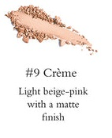

Use: All-over lid shade for all complexions. Works as subtle contour on light to medium skin, or base on medium to deep skin.

##### 色号 9：奶霜米粉 (Creme) —— 浅米粉色，哑光质地。
用途：适合全眼铺色；浅中肤色可作轻修容，中深肤色可作打底。

## Shade 10: Dove - Cool-toned light taupe to buff and blend
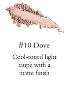

Use: Cool transition shade for all skin tones. Great for blending crease edges and building understated contour.

##### 色号 10：鸽灰褐 (Dove) —— 冷调浅灰褐，哑光质地。
用途：适合作为冷调过渡与晕染边界色，也可用于低饱和轮廓塑形。

## Shade 11: Bis - Muted beige taupe for elegant structure
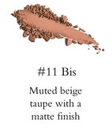

Use: All-over neutral, crease transition, or soft depth builder at outer corners. Also works as gentle liner/contour and brow filler.

##### 色号 11：米灰褐 (Bis) —— 低饱和米灰褐，哑光质地。
用途：可全眼铺色、眼窝过渡、眼尾加深；也可作柔和眼线、修容及眉部填充。

## Shade 12: Milk Chocolate - Warm chocolate, utterly irresistible
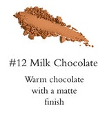

Use: Mid-to-deep warm brown for lid, crease, outer corner depth, or soft liner. Also useful for brows and hairline correction.

##### 色号 12：奶巧克力棕 (Milk Chocolate) —— 暖巧克力棕，哑光质地。
用途：适合眼皮/眼窝铺色与眼尾加深，也可作柔和眼线，并可用于眉部与发际线修饰。

## Shade 13: Mustard - Dirty ochre yellow, flavor-rich
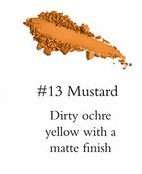

Use: Transitional warm yellow-ochre for all complexions. Can be mixed with other shades to shift undertones and increase warmth.

##### 色号 13：芥末黄赭 (Mustard) —— 低饱和黄赭色，哑光质地。
用途：可作暖调过渡色；与其他色混合可改变底调并增强暖感。

## Shade 14: Espresso - Bitter brown, smokey-eye foundation
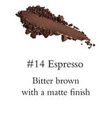

Use: Deep brown base for smokey eyes, outer-corner depth, and liner. Also ideal for brunette to dark-hair brow/hairline definition.

##### 色号 14：浓缩咖啡棕 (Espresso) —— 深苦棕色，哑光质地。
用途：适合烟熏打底、眼尾加深与眼线，也适合深发色人群的眉部/发际线塑形。

## Shade 15: Letterbox - Light creamy beige with pink undertone
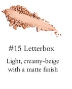

Use: All-over base on all complexions, especially for soft pastel looks. Also works as inner-corner and brow-bone highlight.

##### 色号 15：信纸米粉 (Letterbox) —— 带粉底调的浅奶油米色，哑光质地。
用途：适合全眼打底，尤其适合粉彩妆方向；也可用于眼头与眉骨提亮。

## Shade 16: Piglet - Nude pink for a ballet-soft look
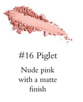

Use: Base pink for lid or highlight on all skin tones. Can double as soft blush on light to medium complexions.

##### 色号 16：裸粉色 (Piglet) —— 柔和裸粉，哑光质地。
用途：可作眼部打底或提亮；浅中肤色也可作自然腮红。

## Shade 17: Heather - Buff nude with a hint of lavender
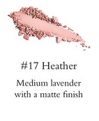

Use: Cool-leaning nude for all-over lid, base, or transition. Also wearable as soft contour/blush on light to medium skin.

##### 色号 17：石楠紫裸色 (Heather) —— 带淡薰衣草调的裸色，哑光质地。
用途：可用于全眼铺色、打底或过渡；浅中肤色可作柔和修容或腮红。

## Shade 18: Dusty Mauve - Soft cool dusty mauve
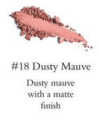

Use: All-over lid shade, base, or transition for all complexions. Can also be worn as a soft blush tone.

##### 色号 18：灰调藕紫 (Dusty Mauve) —— 柔和冷调灰紫，哑光质地。
用途：适合全眼铺色、打底与过渡；也可作柔和腮红。

## Shade 19: Blush - Muted terracotta mauve
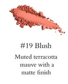

Use: Everyday rose-mauve for lid or crease transition. Also flattering as blush across skin tones.

##### 色号 19：玫土腮红色 (Blush) —— 低饱和陶土玫紫调，哑光质地。
用途：适合眼部日常铺色与过渡，也可作为腮红使用。

## Shade 20: Red Coral - Red with a hint of pink
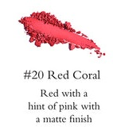

Use: Bright accent for editorial looks, blush use, or tone-modifying mixes.
*WARNING* - In the US, this shade contains pigments that the FDA has not approved for use in the eye area.

##### 色号 20：红珊瑚 (Red Coral) —— 带粉调的红色，哑光质地。
用途：适合高饱和创意妆、腮红与调色增强。
*提示*：在美国法规下，此色含有未获 FDA 批准用于眼周的色料。

## Shade 21: Blackened Honey - Purple-brown berry depth
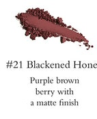

Use: Deep dramatic accent for eye depth, deep-skin blush effects, or moody mixed tones.
*WARNING* - In the US, this shade contains pigments that the FDA has not approved for use in the eye area.

##### 色号 21：焦蜜莓棕 (Blackened Honey) —— 偏紫棕莓果调深色，哑光质地。
用途：适合加深眼妆戏剧感，也可作深肤色腮红或混色增深。
*提示*：在美国法规下，此色含有未获 FDA 批准用于眼周的色料。

## Shade 22: Ballet Pink - Soft poised pink
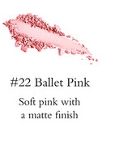

Use: All-over pink base, highlight, or blush for light to medium skin. Mixes beautifully to create lighter custom tones.

##### 色号 22：芭蕾粉 (Ballet Pink) —— 柔和粉色，哑光质地。
用途：可作粉调打底、提亮或浅中肤色腮红；与其他色混合可定制更浅层次。

## Shade 23: Liaison - Soft light pink-purple
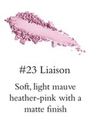

Use: Delicate lilac-pink all over lid or as a brightening base. Also works as blush for pink-purple lovers.

##### 色号 23：淡紫粉 (Liaison) —— 柔和浅粉紫，哑光质地。
用途：适合全眼铺色或提亮打底；偏爱粉紫调时也可作腮红。

## Shade 24: Cotton Candy - Romantic candy pink
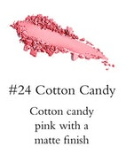

Use: Vibrant pink for lid, base, or pops of brightness. Also flattering as blush on all complexions.

##### 色号 24：棉花糖粉 (Cotton Candy) —— 甜感粉色，哑光质地。
用途：适合做亮眼点缀、全眼铺色或打底，也可作腮红。

## Shade 25: Framboise - Soft dusty rose
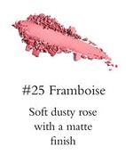

Use: Midtone rose for lively all-over color, outer-corner depth in pink looks, or blush across skin tones.

##### 色号 25：覆盆子玫瑰 (Framboise) —— 柔雾玫瑰色，哑光质地。
用途：适合全眼上色、粉调眼妆眼尾加深，也可作腮红。

## Shade 26: Blackberry - Purple with a hint of red
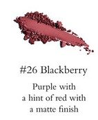

Use: Dramatic berry-depth shade for all-over intensity or focused crease/outer-corner smokey definition. Also usable as eyeliner.

##### 色号 26：黑莓紫红 (Blackberry) —— 带红调的深紫色，哑光质地。
用途：适合打造深邃莓果烟熏感，可全眼铺色或局部加深，也可作眼线。

## Shade 27: Bougainvillea - Bright fuchsia purple-pink
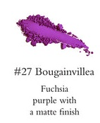

Use: High-impact accent for dramatic/editorial looks, deep-skin blush effects, and undertone-shifting mixes.
*WARNING* - In the US, this shade contains pigments that the FDA has not approved for use in the eye area.

##### 色号 27：三角梅紫粉 (Bougainvillea) —— 高饱和洋红紫粉，哑光质地。
用途：适合高冲击创意妆、深肤色腮红与调色增强。
*提示*：在美国法规下，此色含有未获 FDA 批准用于眼周的色料。

## Shade 28: Blackcurrant - Blackened purple violet
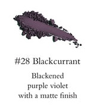

Use: Deep violet for smokey intensity, crease/outer-corner depth, liner use, or rich-skin contour accents.

##### 色号 28：黑加仑紫 (Blackcurrant) —— 偏黑的紫罗兰色，哑光质地。
用途：适合烟熏加深、眼尾/眼窝塑形、眼线，也可作深肤色轮廓强调。

## Shade 29: Blanc White - Pure white for pastel mixing
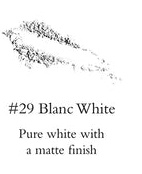

Use: Professional mixer shade for pastelizing other colors. Also usable as all-over base, underlayer, or cream/lip/blush tone adjuster.

##### 色号 29：纯白 (Blanc White) —— 纯白色，哑光质地。
用途：专业调色提亮色，可将其他颜色调成粉彩；也可作全眼打底、打底层或霜状产品调色。

## Shade 30: Tiffany Blue - Pale dusty blue
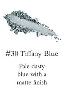

Use: Soft cool blue for all-over lid color, creative base, or targeted bright pops.

##### 色号 30：蒂芙尼蓝 (Tiffany Blue) —— 浅灰尘感蓝色，哑光质地。
用途：适合冷调全眼铺色、创意打底，或局部亮色点缀。

## Shade 31: Thistle - Dusty purple-grey twilight tone
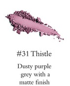

Use: Cool muted tone for all-over lid, transition in crease, soft outer-corner depth, or subtle eyeliner.

##### 色号 31：蓟紫灰 (Thistle) —— 灰调紫灰色，哑光质地。
用途：适合全眼铺色、眼窝过渡、眼尾柔和加深，也可作低饱和眼线。

## Shade 32: Souris Grey - Deep grey
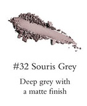

Use: Core smoky grey for all-over cool depth, crease transition, outer-corner structure, and smokey-eye base.

##### 色号 32：鼠尾灰 (Souris Grey) —— 深灰色，哑光质地。
用途：适合冷调烟熏主色、过渡与眼尾结构塑形，也可作为烟熏打底。

## Shade 33: Charcoal Grey - Blackened grey
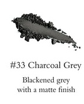

Use: Near-charcoal deepening shade for dramatic outer corners, liner effects, and high-contrast smokey looks.

##### 色号 33：木炭灰 (Charcoal Grey) —— 近黑深灰色，哑光质地。
用途：适合眼尾重度加深、眼线替代与高对比烟熏妆。

## Shade 34: Cobalt Blue - Bright blue
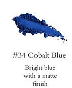

Use: Vivid cobalt for statement color placement, graphic liner, and saturated cool-tone accents.

##### 色号 34：钴蓝 (Cobalt Blue) —— 高饱和亮蓝色，哑光质地。
用途：适合主色强调、图形眼线和高饱和冷调点缀。

## Shade 35: Carbon Black - Natural black
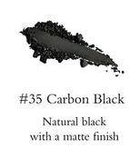

Use: Essential matte black for maximum depth, liner work, and mixing to darken any other shade.

##### 色号 35：碳黑 (Carbon Black) —— 自然黑色，哑光质地。
用途：可用于极致加深、眼线，以及与其他颜色混合压深明度。
