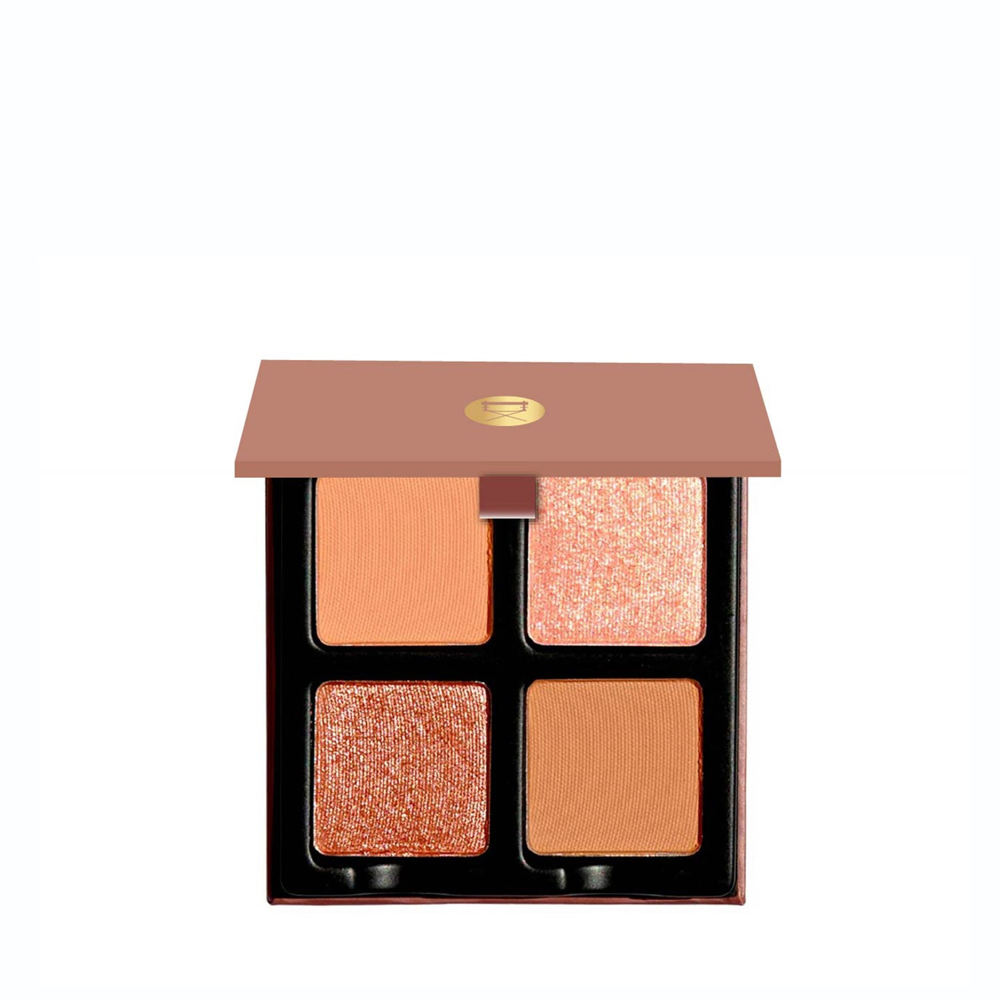
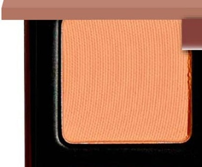
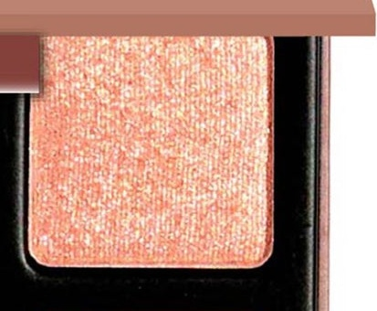
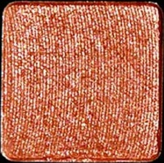
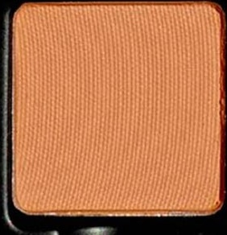

# Viseart 4色 中号 艾米丽盘 Petits Fours Amélie

## Shade 1: Picasso — Warm toned medium brown with a matte finish.

Use: This shade can be used as an all over lid or base tone on all complexions. Use it to create soft definition in the crease of the eye or layer with ‘Marais’ for added definition.

##### 色号 1：毕加索棕 (Picasso) —— 暖调中棕色，哑光质地。
用途：这支颜色可作全眼铺色或打底色，适合所有肤色。可用于眼窝位置打造柔和轮廓，也可与 `Marais` 叠搭，进一步增强层次感。

## Shade 2: Carnavalet — Soft warm peach with a metallic shimmer finish.

Use: This soft peach shade can be used as an all over lid color, in the inner corners for a pop of luminosity, in the center of the eyelid to accentuate the glow or as a highlighter on tops of the cheekbones, the cupids bow and into any lipgloss to add a pearl! Additionally, foil this shade for all day wear with a mixing medium or damp brush to intensify the hue.

##### 色号 2：卡纳瓦莱桃金 (Carnavalet) —— 柔和暖桃色，金属闪光质地。
用途：这支柔和桃色可作全眼铺色，也可用于眼头提亮、点在眼皮中央增强光泽，或作为颧骨、唇峰高光，甚至混入唇蜜增添珍珠感。搭配调和液或微湿刷具可增强显色并获得更持久的箔光效果。

## Shade 3: Fontaines — Rose gold mid-tone with a metallic finish.

Use: This rose gold shade can be used as an all over lid color, in the center of the eyelid to accentuate the glow or as a highlighter on tops of the cheekbones, the cupids bow and into any lipgloss to add a pearl! Additionally, foil this shade for all day wear with a mixing medium or damp brush to intensify the hue.

##### 色号 3：喷泉玫金 (Fontaines) —— 中调玫瑰金色，金属质地。
用途：这支玫瑰金色可作全眼铺色，也可点在眼皮中央增强光泽，或作为颧骨、唇峰高光，甚至混入唇蜜增添珍珠感。搭配调和液或微湿刷具可增强显色并获得更持久的箔光效果。

## Shade 4: Marais — Medium neutral-toned brown with a matte finish.

Use: This shade can be used as an all over lid shade, in the outer corners of the eyes to add soft definition, as a contour, or in the brows for light to medium complexions.

##### 色号 4：玛黑棕 (Marais) —— 中调中性棕色，哑光质地。
用途：这支颜色可作全眼铺色，也可用于眼尾增加柔和轮廓，作为修容色，或在浅至中等肤色上作眉色使用。
