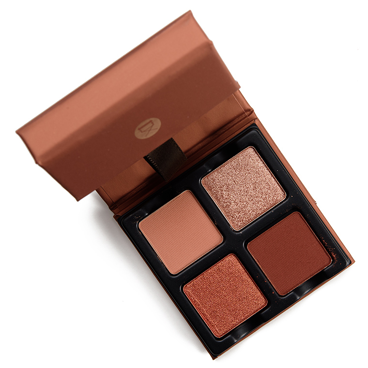
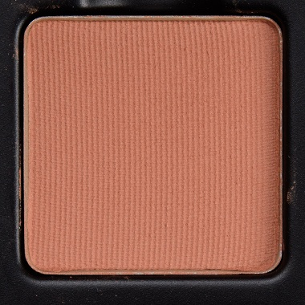
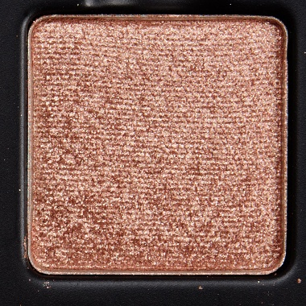
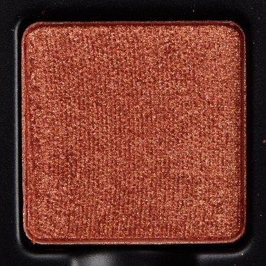
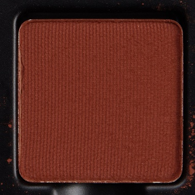

# Viseart 4色 中号 巧克力盘 Petits Fours Chocolat
*发布：2020*

## Shade 1: Café Crème — Warm café crème nude with a matte finish.

Use: This shade can be used as an all over base tone for all complexions, in the crease for lighter skin tones, or blended with 'Ganache' to soften its depth. Mix with 'Orange Sanguine' to warm up any eye look.

##### 色号 1：咖啡奶油裸色 (Café Crème) —— 暖调咖啡奶油裸色，哑光质地。
用途：可作全眼打底铺色，适合所有肤色；在浅肤色上也可用于眼窝过渡；与 `Ganache` 混合可柔化深度，与 `Orange Sanguine` 叠搭可提升整体暖调。

## Shade 2: Pêches — Soft rose peach with a shimmer finish.

Use: This tone can be used as an all over wash of sheer shimmer for all complexions or concentrated on the inner corner and center of the lid for a luminous focal point. Can also be used as a highlighter on the brow bone and tops of the cheekbones.

##### 色号 2：蜜桃玫金 (Pêches) —— 柔和玫瑰桃金色，闪光质地。
用途：可作全眼轻薄闪感铺色，适合所有肤色；也可集中点在眼头与眼皮中央，打造光泽焦点。同样适合作眉骨和颧骨提亮使用。

## Shade 3: Orange Sanguine — Rich blood orange with a metallic shimmer finish.

Use: This bold shade can be worn on the lid for vibrant metallic color, layered over 'Café Crème' for a warm copper eye, or foiled with a mixing medium or damp brush to intensify the hue.

##### 色号 3：血橙铜色 (Orange Sanguine) —— 浓郁血橙色，金属闪光质地。
用途：可直接铺于全眼，呈现高饱和金属质感；叠在 `Café Crème` 上可打造暖调铜色妆效；搭配调和液或微湿刷具湿敷可进一步强化显色力。

## Shade 4: Ganache — Deep warm chocolate brown with a matte finish.

Use: This shade can be used to add depth and definition in the crease and outer corners of the eyes, as a soft liner, or as an all over lid tone for deeper skin tones.

##### 色号 4：甘纳许深棕 (Ganache) —— 深暖巧克力棕色，哑光质地。
用途：可在眼窝与眼尾叠加，增强轮廓与深度；也可用作柔和眼线色，或作为深肤色的全眼铺色。
