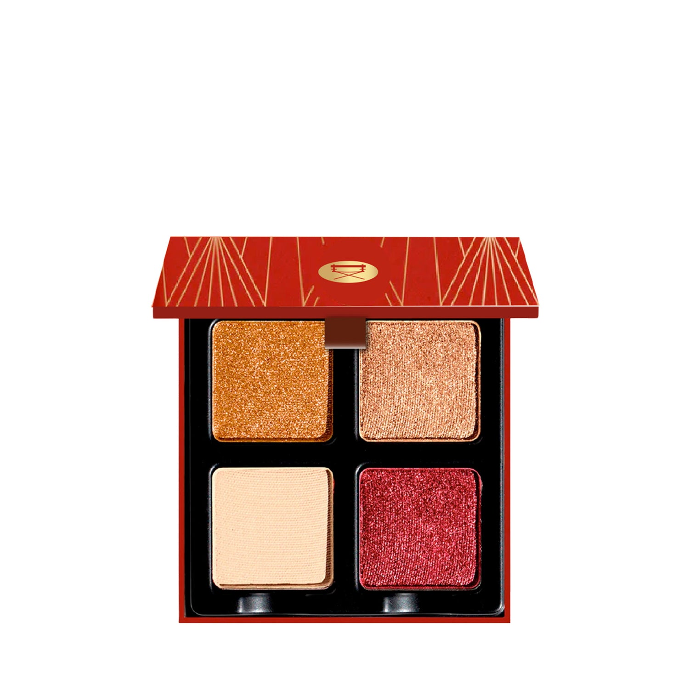
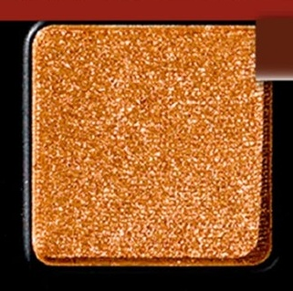
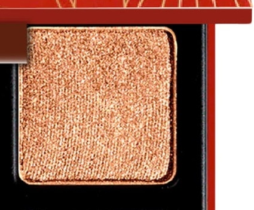
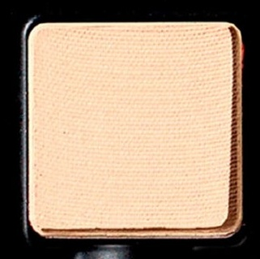
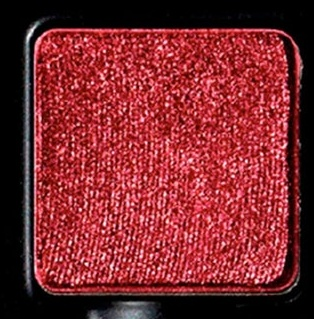

# Viseart 4色 中号 石榴石盘 Petits Fours Garnet
*发布：~2020年代*

> 铜光与古铜金在肌肤上燃起暖意，如巴黎夜场舞台的灼热华彩。石榴石盘以铜金、金铜与浓郁酒红勃艮第金属色为主角，配以柔和的香草哑光，是一支专为温暖烟熏妆而生的深邃四色组合。

> *Garnet ignites the skin in burnished copper, golden bronze, and rich burgundy metallic, balanced by a soft vanilla matte — a palette born for warm, sultry smoky looks inspired by the radiant glow of Parisian stages.*

## Shade 1: Vedette — Copper with a metallic finish.

Use: Use this metallic copper as an all-over lid color or layered over your favorite matte or shimmer shades for additional intensity. Tap onto the center of the lid for a pop of color. Can be foiled or worn as liner. Try pairing with shade 'Cabaret' for a warm, smokey finish.

##### 色号 1：主秀铜光 (Vedette) —— 铜金色，金属质地。
用途：可作全眼铺色，也可叠加在喜爱的哑光或珠光色之上增强强度。点在眼皮中央可带来更鲜明的亮点；可搭配调和液做出箔光效果，也可作为眼线色。与 `Cabaret` 搭配，可完成温暖的烟熏妆效。

## Shade 2: Cabaret — Golden bronze with a metallic finish.

Use: Use this golden bronze hue as an all-over lid color on all complexions or tap onto the center of the lid for an eye-catching finish. Can be foiled or worn as liner.

##### 色号 2：歌舞铜金 (Cabaret) —— 金铜古铜色，金属质地。
用途：可作全眼铺色，适合所有肤色；也可点在眼皮中央，打造吸睛亮点。可搭配调和液做出箔光效果，也可作为眼线色。

## Shade 3: Pigalle — Pale vanilla-peach with a matte finish.

Use: Use this warm cream shade all over as a base tone on light to medium skin tones. Can be used to brighten the inner corners of the eyes on all complexions. Can also be used to set under-eye concealer on light to medium complexions.

##### 色号 3：香草蜜桃 (Pigalle) —— 浅香草蜜桃色，哑光质地。
用途：浅至中等肤色可作全眼打底色；所有肤色都可用于眼头提亮。浅至中等肤色也可用于定妆眼下遮瑕。

## Shade 4: Cordial — Rich burgundy with a metallic finish.

Use: Use this rich metallic burgundy as an all-over lid color or concentrate the shade in the outer corners of the eyes for a warm smoky finish. Can be foiled or worn as liner.

##### 色号 4：酒心勃艮第 (Cordial) —— 浓郁勃艮第酒红色，金属质地。
用途：可作全眼铺色，也可集中在眼尾位置，打造温暖的烟熏妆效。可搭配调和液做出箔光效果，也可作为眼线色。
