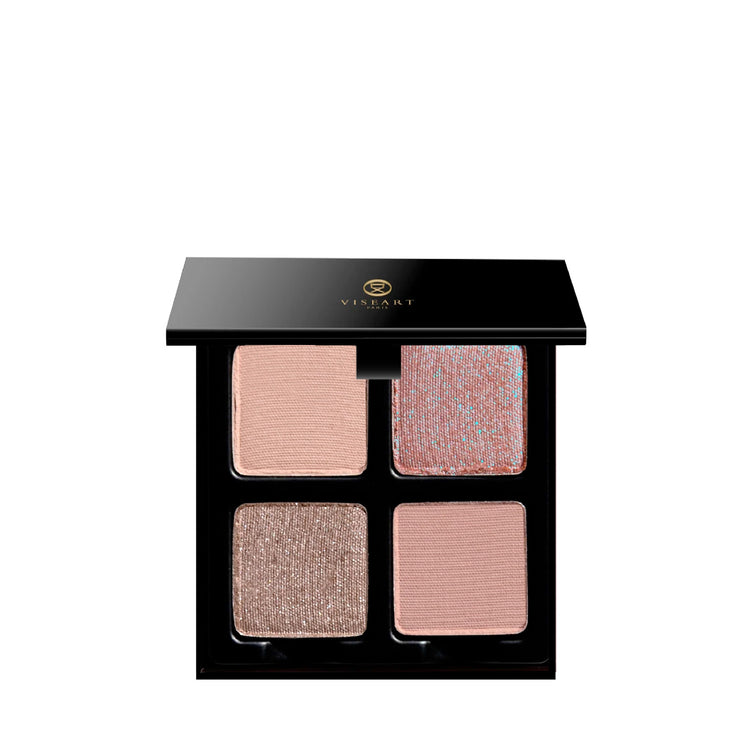
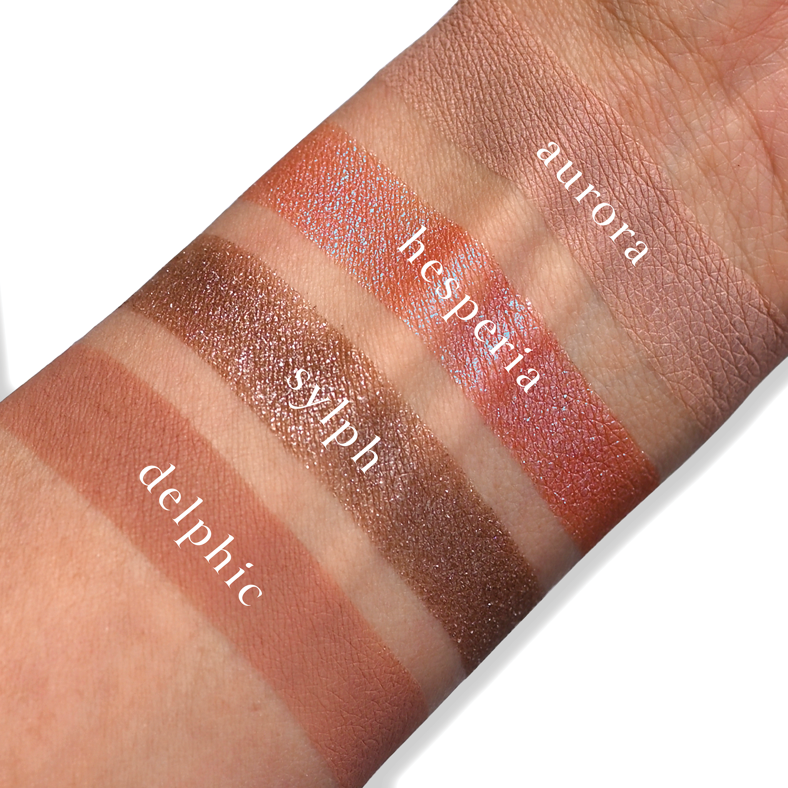
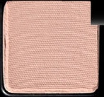
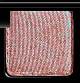
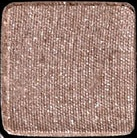
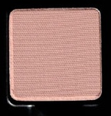

# Viseart 4色 中号 赫斯珀里得斯盘 Petits Fours Hesperides
*发布：2024*

> 以黄昏橘园之光为引，赫斯珀里得斯系列汇聚柔雾裸色与精致双偏光，让光影在眼间如诗般流转。晨曦裸玫、暮光偏色、冷灰金属与烟粉哑光，四支色调低调而富有微光之韵。

> *Inspired by the luminous twilight of the garden of Hesperides, this refined quartet weaves soft matte nudes with shimmering duochromatic tones for a quietly radiant, effortlessly sophisticated eye look.*

## Shade 1: Aurora — Light mauve nude with a matte finish.

Use: This light mauve nude shade can be used as an all-over lid colour, in the inner corners of the eyes for light and dimension, to highlight under the brow bone on medium to deep complexions, or as a base tone beneath complementary tones for increased depth and saturation on all complexions. Pair with shades ‘Hesperia’ and ‘Delphic’ for a sophisticated nude rosy glow! Apply with fingertips or a buffing brush for your desired level of intensity.

##### 色号 1：晨曦裸玫 (Aurora) —— 浅柔雾感玫瑰裸色，哑光质地。
用途：可作全眼铺色，也可点亮眼头；中深肤色还能用于眉骨提亮，或作为打底与其他颜色叠加，增强显色与层次。与 Hesperia、Delphic 搭配，可打造精致柔玫眼妆。可用指腹或晕染刷上色，按需叠加浓淡。

## Shade 2: Hesperia — Nude rose with a duochromatic-blue finish.

Use: Wear this duochromatic nude blue-rose shade all over eyes for a quick and easy elegant eye look, as a topper over any shades in the palette, or on the high points of the face as an avant-garde highlighter. Combine with a mixing medium for a high-shine foiled effect. Layer over ‘Aurora’ for the perfect prismatic pop or pair with ‘Delphic’ to amp up the nude rose intensity. Apply with fingertips or a dense brush for your desired level of intensity.

##### 色号 2：暮光玫瑰 (Hesperia) —— 裸玫瑰色，带蓝调偏光。
用途：可单独全眼铺陈，快速完成精致眼妆；也可叠加在盘中任意颜色上提亮，或点在面部高点作个性高光。搭配混合液可呈现高闪箔光效果；叠擦 Aurora 更显通透，搭配 Delphic 可加强裸玫瑰氛围。建议用指腹或密实刷上色。

## Shade 3: Sylph — Nude cool-toned taupe with a metallic finish

Use: This cool-toned nude taupe shade can be used as an all-over lid colour, in the crease and socket for buildable dimension, or overtop of complementary matte tones for a multifaceted shimmering second skin finish. Combine with a mixing medium for a foiled effect. Pair with shades ‘Aurora’ and ‘Delphic’ for a radiant reflective eye look. Apply with fingertips or a dense brush for your desired level of intensity.

##### 色号 3：仙灵银褐 (Sylph) —— 冷调裸灰褐色，金属质地。
用途：可作全眼主色，或用于眼窝、眼褶加深轮廓；叠加在哑光色上可呈现多维闪耀光泽。搭配混合液可加强金属箔感；与 Aurora、Delphic 组合能打造通透反光的冷调眼妆。建议用指腹或密实刷上色。

## Shade 4: Delphic — Midtone dusty rose-taupe with a matte finish.

Use: This midtone, dusty rose-taupe shade can be used as an all-over lid colour or as a base tone for all complexions. It can also be used as a transitional shade to build soft depth and dimension in the sockets and lashline. Blend with the other shades in the palette to lighten or add depth to the eye, creating over 4 new hues. Wear beneath shade ‘Hesperia’ for an effortless cool-toned, neutral base, or pair with shades ‘Aurora’ and ‘Sylph’ for a soft, elevated look. Apply with fingertips or a buffing brush for your desired level of intensity.

##### 色号 4：尘玫瑰褐 (Delphic) —— 中调灰粉玫瑰褐色，哑光质地。
用途：可作全眼铺色或各类肤色的基础底色，也可作为过渡色叠加在眼窝与睫毛根部，柔和塑造深邃度。与盘中其他颜色混合还能拓展更多层次；打底后叠加 Hesperia 可呈现冷调裸感光泽，与 Aurora、Sylph 搭配则更显柔雾高级。可用指腹或晕染刷上色。
