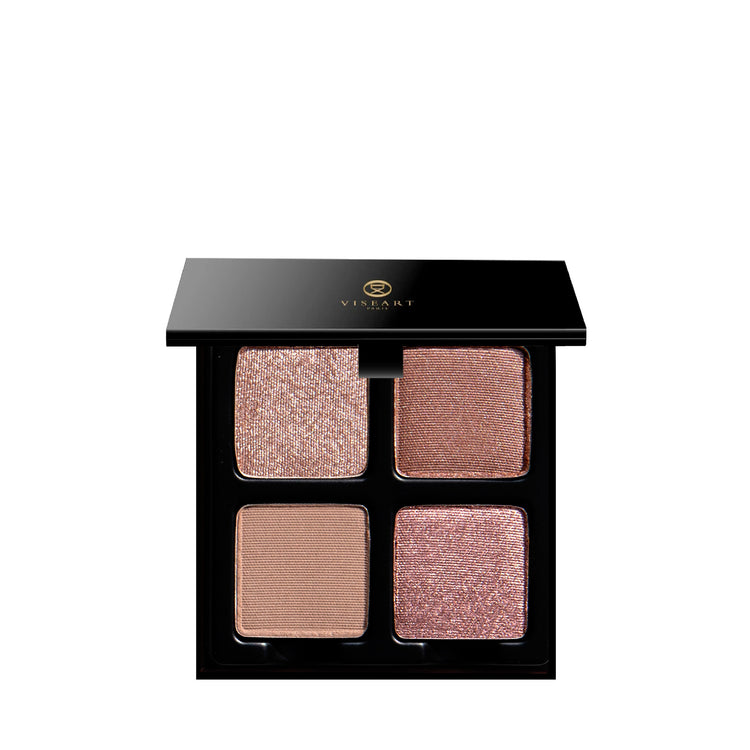
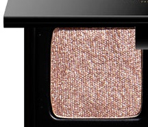
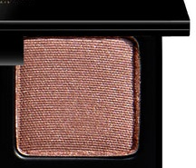
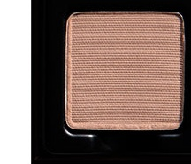
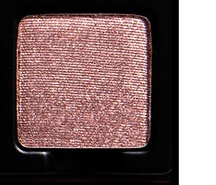

# Viseart 4色 中号 伊索德盘 Petits Fours Isolde

## Shade 1: Elixir — Light crystalline bright taupe with a metallic finish.

Use: This light crystalline shade can be used as an all-over lid colour, in the inner corners of the eyes for light and dimension, as a topper over complementary hues, or as a highlighter on light to medium complexions. Can also be mixed with gloss for a kiss of reflectivity! Wear overtop of ‘Isolde’ for a gorgeous glittery glow or with ‘Isolde’ and ‘Lueur’ for the perfect prismatic pop! Mix this shade with a mixing medium for a high-shine foiled effect. Apply with fingertips or a dense brush for your desired level of intensity.

##### 色号 1：灵药晶辉 (Elixir) —— 明亮浅灰褐晶光色，金属质地。
用途：可作全眼铺色，也可点亮眼头，或叠加在互补色之上增加层次；浅至中等肤色还能将它用作高光。也可混入唇蜜，增添细闪反光感。叠加在 Isolde 上可呈现华丽闪耀的光泽，与 Isolde、Lueur 搭配则能带出通透灵动的棱镜光感。搭配调和液可获得更强烈的金属箔光效果，建议用指腹或密实刷具上色。

## Shade 2: Roseate — Light rosy nude brown with a satin shimmer finish.

Use: This light rosy nude shadow can be used all over the lid or to subtlety build depth in the outer corners and sockets of the eyes on all complexions. Mix this shade with a mixing medium for a high-shine foiled effect. Wear over ‘Isolde’ for the perfect wearable nude look, or pair with ‘Isolde’ and ‘Lueur’ for a radiant flush of delicate color. Apply with fingertips or a dense brush for your desired level of intensity.

##### 色号 2：玫瑰裸纱 (Roseate) —— 浅玫瑰裸棕色，缎光微闪质地。
用途：可全眼铺陈，也可在眼尾与眼窝轻柔叠加，营造自然层次，适合各种肤色。搭配调和液可增强高闪箔光感；叠加在 Isolde 上能完成耐看的日常裸妆，与 Isolde、Lueur 组合则更显细腻柔和的玫瑰光泽。建议用指腹或密实刷具按需上色。

## Shade 3: Isolde — Light stone-brown nude with a matte finish

Use: This light stone-brown nude shade can be used as an all-over lid colour, as a transitional shade to build out the crease and socket, as a soft liner, or as a base tone beneath complementary tones for increased depth and saturation. Can also be used in brows on light complexions. Mix this hue with other shades in the palette to create 4 new tones. Pairs perfectly with ‘Roseate’ and ‘Lueur’ for a splendorous satin look. Apply with fingertips or a buffing brush for your desired level of intensity.

##### 色号 3：浅石裸棕 (Isolde) —— 浅石棕裸色，哑光质地。
用途：可作全眼铺色、眼窝过渡色、柔和眼线色，或作为互补色下方的打底色，增强深度与显色。浅肤色也可将它用于眉部。与盘中其他颜色混合还能延展出更多层次；搭配 Roseate 与 Lueur，可打造细腻高级的缎光裸眼妆。可用指腹或晕染刷按需叠加。

## Shade 4: Lueur — Soft rose gold with a shimmer finish.

Use: This soft rose-gold shade can be used as an all-over lid colour, in the inner corners of the eyes for light and dimension on medium-deep complexions, as a topper over complementary hues, or in the center of the lid for a beautiful halo effect. Pair with shades ‘Roseate’ and ‘Isolde’ for a harmonious haute couture look. Mix this shade with a mixing medium for a high-shine foiled effect. Apply with fingertips or a dense brush for your desired level of intensity.

##### 色号 4：柔光玫瑰金 (Lueur) —— 柔和玫瑰金色，闪光质地。
用途：可作全眼主色；中深肤色也可将它点在眼头作提亮，或叠加在互补色之上增强光泽；点缀在眼皮中央还能营造柔和 halo 效果。与 Roseate、Isolde 搭配，可完成和谐精致的高定感玫瑰裸妆。搭配调和液可加强高闪箔光，建议用指腹或密实刷具上色。
