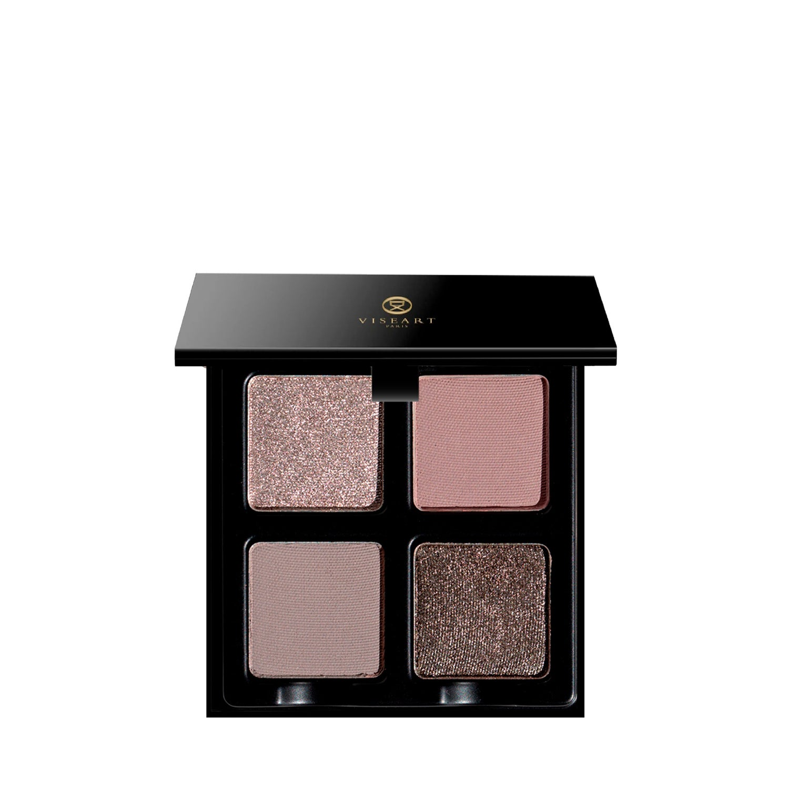

# Viseart 4色 中号 丁香盘 Petits Fours Lilas

## Shade 1: Fondant — Iced silver rose with a shimmer finish.

Use: Lid to lash base color, to brighten up the inner corner of the eye, and to highlight on the face - try using it on top of the cheekbone, down the nose, and along the jawline.

##### 色号 1：糖霜银玫 (Fondant) —— 冰银玫瑰色，闪光质地。
用途：可作从眼皮到睫毛根部的打底色，也适合提亮眼头和面部高点，可尝试用于颧骨、鼻梁和下颌线位置。

## Shade 2: Lilas — Light muted mauve with a matte finish.

Use: Base tone for all over eyelids, in the crease or blend out as a blush!

##### 色号 2：丁香雾紫 (Lilas) —— 柔和偏灰的浅锦葵紫，哑光质地。
用途：适合作为全眼底色、眼窝过渡色，也可以轻柔晕染作腮红。

## Shade 3: Tiramisu — Light cool taupe with a matte.

Use: On light skin tones, this is a taupe, on darker skin tones, this is a grey. Use it on the lid or in the crease.

##### 色号 3：提拉米苏灰褐 (Tiramisu) —— Light cool taupe with a matte.
用途：在浅肤色上呈现灰褐调，在深肤色上则更偏灰色。可用于眼皮主色或眼窝过渡色。

## Shade 4: Argentée — Silver with a shimmer finish.

Use: All over the lid for a flash of shine, or layer it over a matte color to intensify both. For maximum reflection, use a damp brush.

##### 色号 4：银霜 (Argentée) —— 银色，闪光质地。
用途：可全眼铺色，带来一抹闪耀光感，也可叠加在哑光色上，同时增强两者表现。想要最大反光效果，建议使用微湿刷具。
