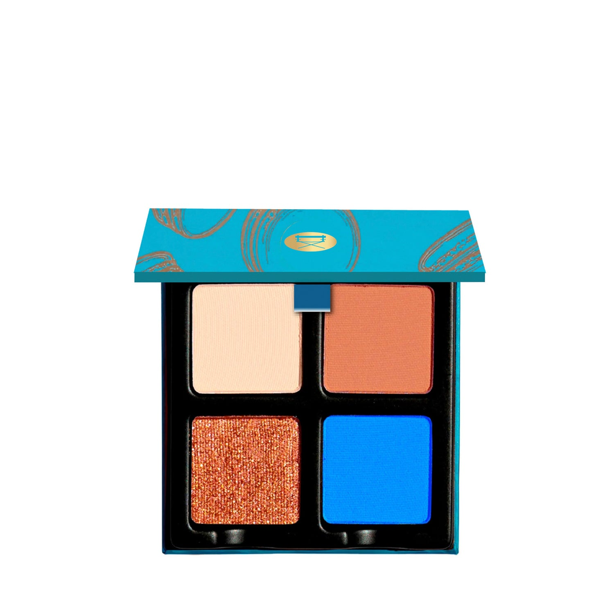
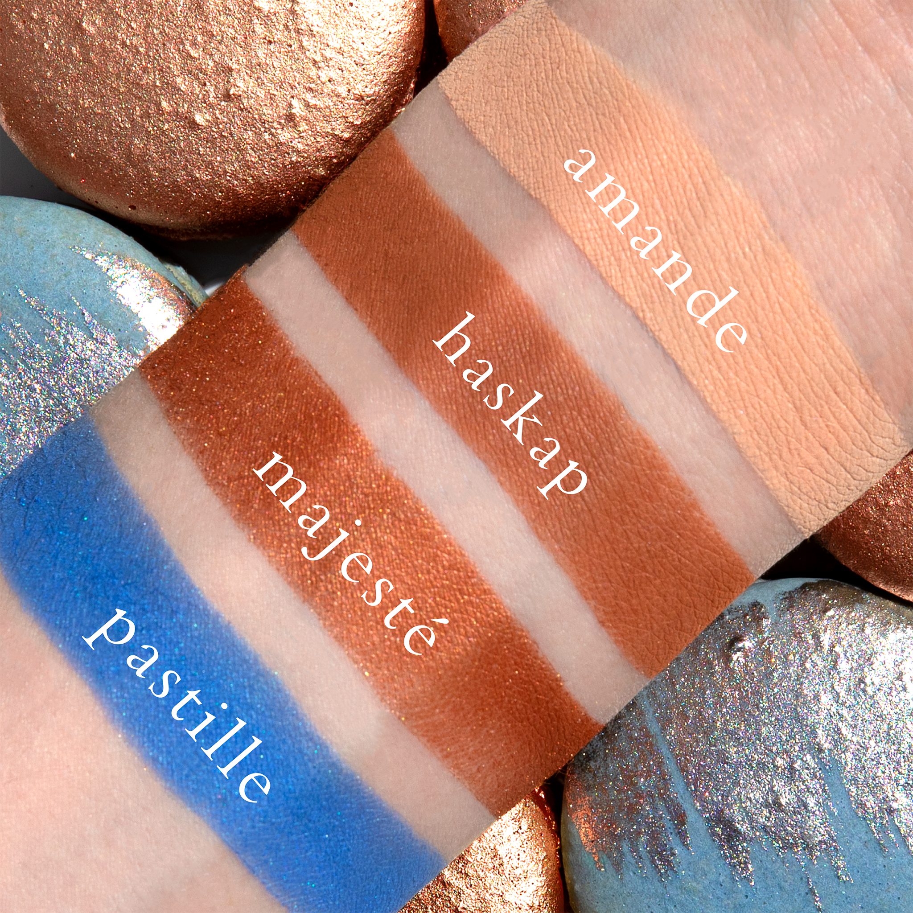
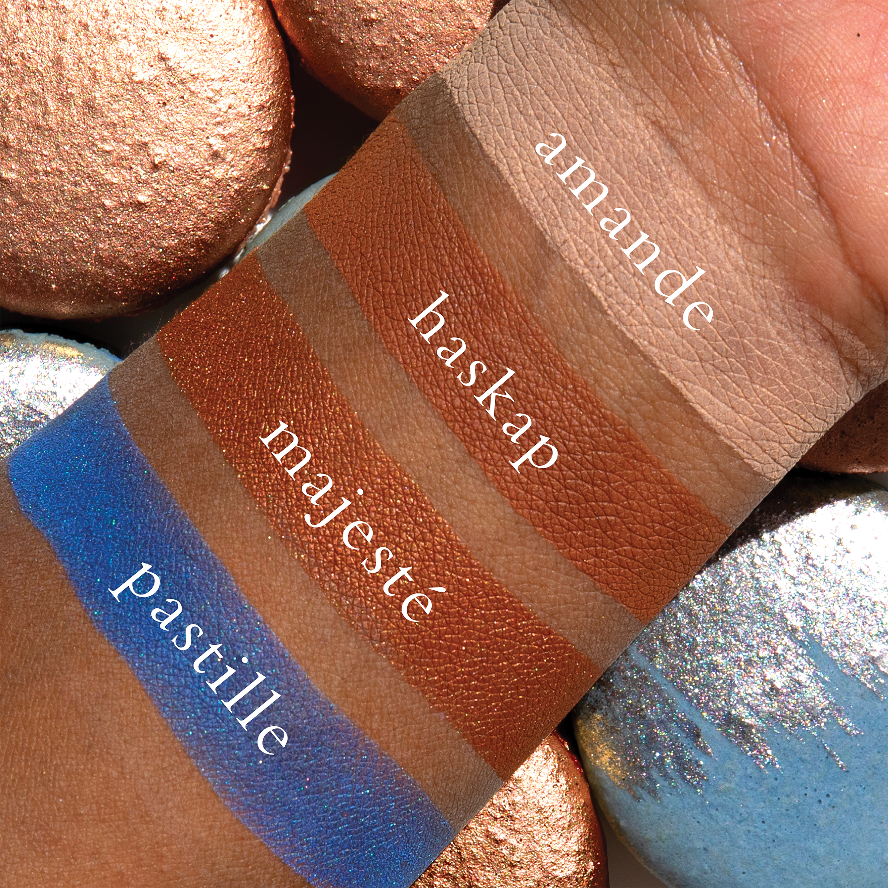
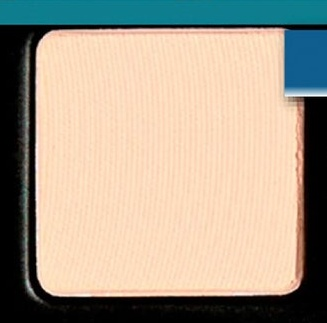
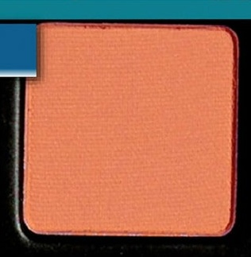
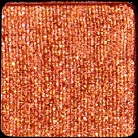
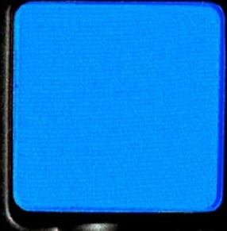

# Viseart 4色 中号 糖片盘 Petits Fours Pastille
*发布：2022*

> 糖片盘以清甜的奶杏哑光与暖棕打底，配以焦糖铜光的细腻闪耀，再以一抹宝蓝点睛。如精致法式糖果般层次分明，恰到好处的色彩惊喜让日常眼妆多了一份意想不到的轻盈活泼。

> *Pastille layers a soft cream matte and warm clay with burnished caramel shimmer and a bold cobalt accent — a palette as charming and playful as a box of fine French confections.*

## Shade 1: Amande — Soft cream beige with a matte finish.

Use: Sweep over the lid to brighten and even the base, or use on the brow bone and inner corner for a clean lift.

##### 色号 1：杏仁奶霜 (Amande) —— 柔和奶油米色，哑光质地。
用途：适合大面积铺满眼皮提亮并统一底色，也可用于眉骨和眼头，带来干净清透的提亮效果。

## Shade 2: Haskap — Warm clay brown with a matte finish.

Use: Blend through the crease or along the outer corner to add warmth and structure to the eye look.

##### 色号 2：哈斯卡普暖棕 (Haskap) —— 偏暖陶土棕色，哑光质地。
用途：适合晕染在眼窝和眼尾，加深轮廓并为整体眼妆注入温度。

## Shade 3: Majeste — Burnished caramel copper with a shimmer finish.

Use: Press onto the center of the lid for a molten shine, or layer over matte tones to build a richer metallic effect.

##### 色号 3：焦糖华彩 (Majeste) —— 烧金焦糖铜色，闪耀质地。
用途：适合点压在眼皮中央制造融金般光泽，也可叠加在哑光色上增强金属感与层次。

## Shade 4: Pastille — Vivid cobalt blue with a matte finish.

Use: Smudge along the lash line, pack onto the outer corner, or use as a bold accent for graphic color placement.

##### 色号 4：糖片钴蓝 (Pastille) —— 鲜明钴蓝色，哑光质地。
用途：可沿睫毛根部晕染、压在眼尾加深，也适合做图形化跳色点缀，强化整体个性。
