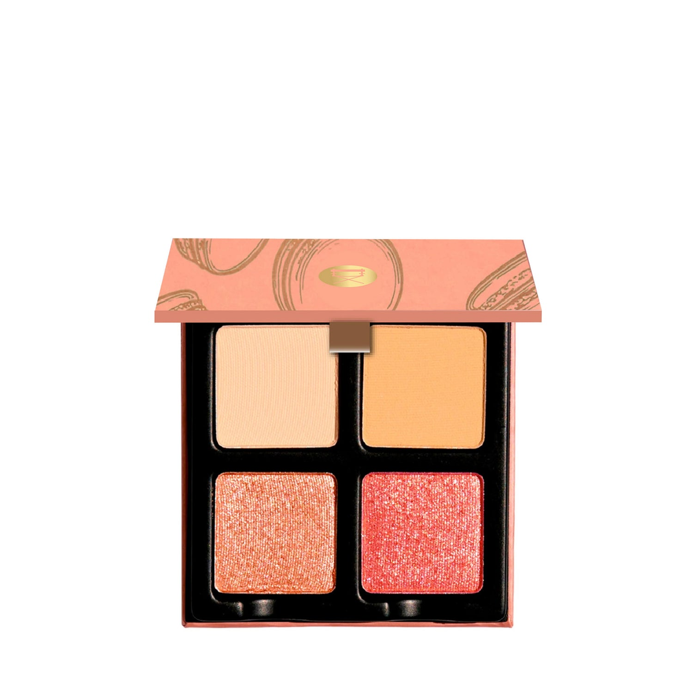
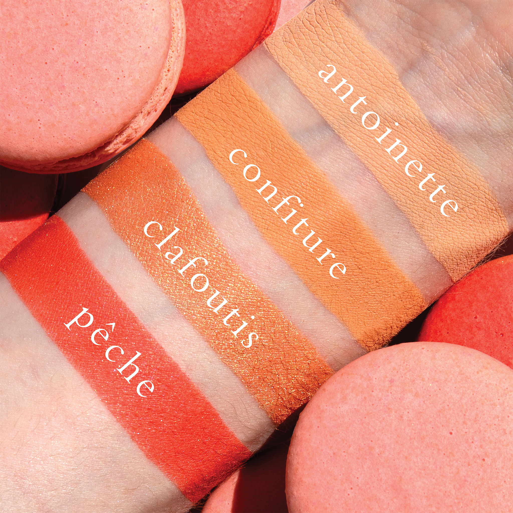
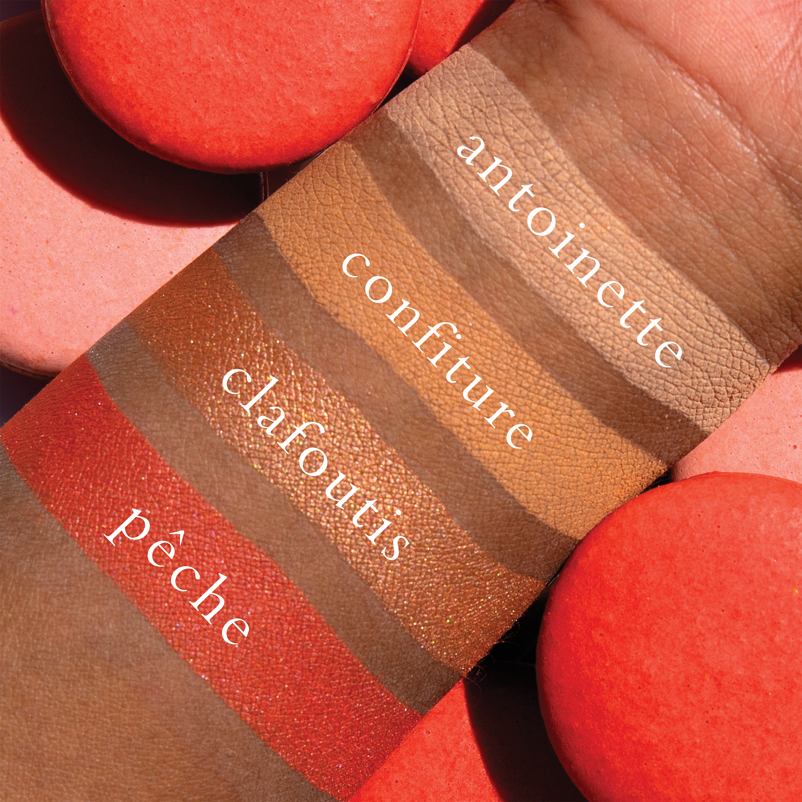
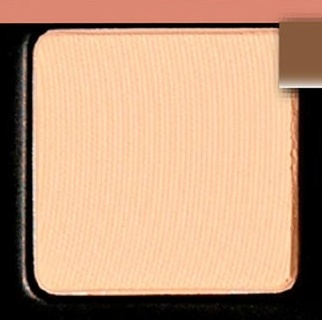
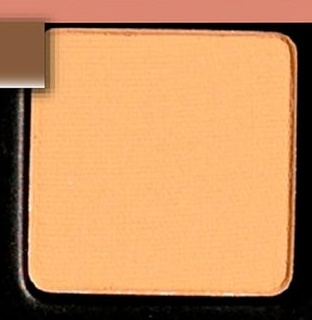
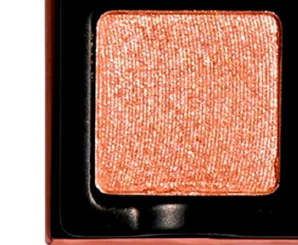
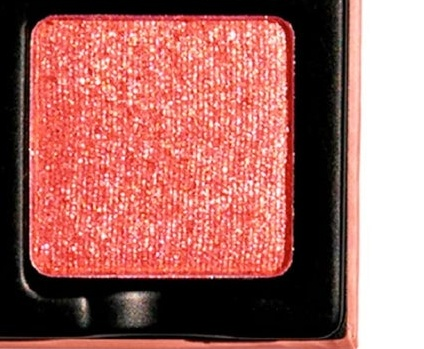

# Viseart 4色 中号 蜜桃盘 Petits Fours Pêche
*发布：2022*

> 蜜桃盘以最甜软的哑光奶霜与裸蜜桃相互交融，再由香槟蜜桃与糖光蜜桃珠光托出丰盈与明亮。每一笔仿佛咬下一口成熟水蜜桃，鲜嫩、甜蜜，散发着不可抵挡的阳光气息。

> *Pêche is a tempting gourmand delight — pairing the softest cream and peachy mattes with sugar-spun champagne and candied peach sparkles for a look of ripe peachy bliss that's as irresistible as it is wearable.*

## Shade 1: Antoinette — Soft cream with a matte finish

Use: All over base tone for all skin types. For deep skin, use as highlight on brow bone. Mix this tone into the other matte shades to create a multitude of sorbet type shades.

##### 色号 1：安托瓦内特奶霜 (Antoinette) —— 柔和奶霜色，哑光质地。
用途：适合所有肤色作全眼打底；深肤色也可用于眉骨提亮。还可与其他哑光色混合，调出多种轻甜柔雾的雪葩色调。

## Shade 2: Confiture — Nude peach with a matte finish

Use: Base tone for all skin types, can be used as a highlighter for deeper tones or a midtone for the lightest complexions. This super versatile color can be mixed with of the other tones to add depth and brightness..

##### 色号 2：蜜桃果酱 (Confiture) —— 裸蜜桃色，哑光质地。
用途：适合所有肤色作底色；深肤色可作提亮色，极浅肤色也可作中间过渡色。这一色非常百搭，可与盘中其他颜色混合，增加深度与明亮感。

## Shade 3: Clafoutis — Bright champagne peach with a shimmer finish

Use: This tone can be used as an all over wash of nude shimmer for all complexions, can also be worn as a cheek and brow bone highlighter.

##### 色号 3：法式水果塔 (Clafoutis) —— 明亮香槟蜜桃色，闪光质地。
用途：适合所有肤色作全眼裸闪铺色，也可用作面部与眉骨提亮。

## Shade 4: Pêche — Glistening candied peach with a shimmer finish

Use: This shade can be worn alone or as a topper over matte hues to add brightness and luminousity! *WARNING* - In the US, this shade contains pigments that the FDA has not approved for use in the eye area.

##### 色号 4：蜜桃糖釉 (Pêche) —— 闪耀糖渍蜜桃色，闪光质地。
用途：可单独使用，或叠加在哑光色上增强明亮度与光泽感。提示：在美国法规下，此色含有未获 FDA 批准用于眼周的色料。
