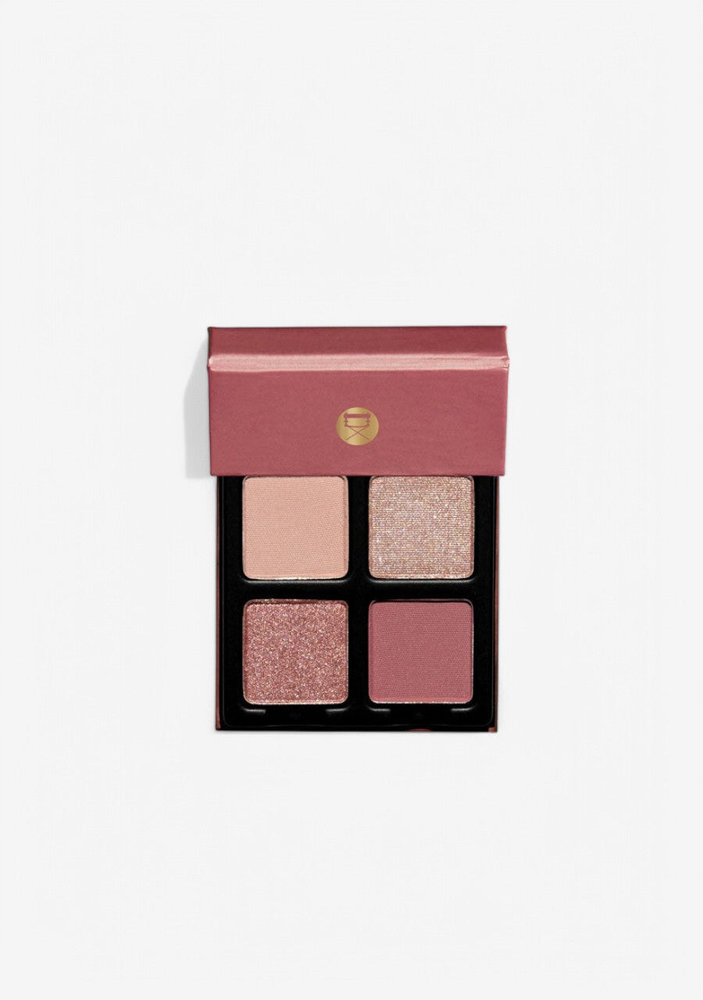
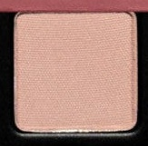
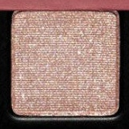
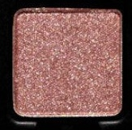
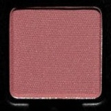

# Viseart 4色 中号 玫瑰莲盘 Petits Fours Roséa Lotus

> 这个夏天，Viseart Paris 邀你踮起脚尖，穿过一座繁花静谧的秘密花园，走向那片荷叶摇曳的幽静池塘。莲花系列以自然界中莲的纯洁、宁静与高贵为灵感，呈现超凡脱俗的色彩享受。沉静缎光玫瑰、轻柔花朵粉与一抹流沙珠光，共同构成这一份属于夏日的感官盛宴。

> *This summer, Viseart Paris invites you to tiptoe through a peaceful garden filled with enchanted abundance and ethereal calm, all the way to a blooming pond. Inspired by the purity, serenity, and nobility of the lotus in nature, Roséa Lotus presents a graceful allure of serene satin pink, delicate blossom pink, and shimmering sand-colored pearls.*

## Shade 1: Pressed Rose — Serene satin rose with a matte finish.

Use: This shade can be used as an all over base tone for all complexions or in the crease for lighter skin tones. Mix with 'Rose Nectar' for a deeper rose look, or blend with 'Spring Twilight' to add a luminous edge.

##### 色号 1：静谧玫粉 (Pressed Rose) —— 沉静缎光玫瑰色，哑光质地。
用途：可作全眼打底铺色，适合所有肤色；在浅肤色上也可用于眼窝过渡。与 `Rose Nectar` 叠搭可加深玫瑰感，与 `Spring Twilight` 融合则增添一丝光亮边缘。

## Shade 2: Spring Twilight — Shimmering sand pearl with a shimmer finish.

Use: This tone can be used as an all over wash of luminous shimmer for all complexions, or concentrated on the center of the lid and inner corner for a focal glow. Can also be used as a brow bone and cheekbone highlighter.

##### 色号 2：春暮流沙 (Spring Twilight) —— 流沙香槟珠光色，闪光质地。
用途：可作全眼轻薄珠光铺色，适合所有肤色；也可集中点在眼皮中央与眼头，打造光泽焦点。同样适合作眉骨和颧骨提亮使用。

## Shade 3: Blooming Lotus — Blushing rose gold with a metallic shimmer finish.

Use: This shade can be worn as an all over lid color for a bold metallic statement, layered over 'Pressed Rose' for added dimension, or foiled with a mixing medium or damp brush to intensify the hue.

##### 色号 3：盛放玫金 (Blooming Lotus) —— 娇嫩玫瑰金色，金属闪光质地。
用途：可直接作全眼铺色，呈现大胆金属感；叠加在 `Pressed Rose` 上可增添层次；搭配调和液或微湿刷具湿敷可进一步强化显色力。

## Shade 4: Rose Nectar — Deep muted rose with a matte finish.

Use: This shade can be used in the crease and outer corners of the eyes to add definition and depth. Can also be worn as an all over lid tone on deeper complexions or used as a soft liner.

##### 色号 4：玫蜜深棕 (Rose Nectar) —— 深邃哑光玫瑰色，哑光质地。
用途：可在眼窝与眼尾叠加轮廓感与深度；深肤色也可作全眼铺色；还可作为柔和眼线色使用。
