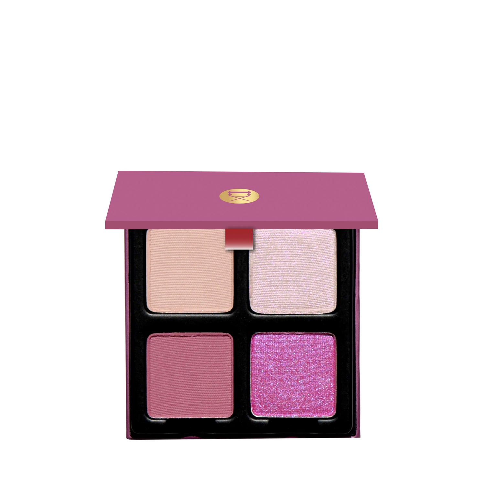
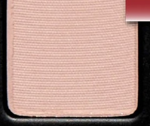
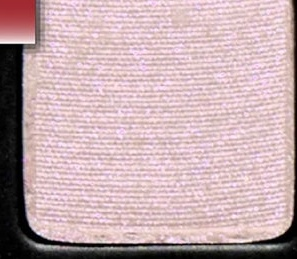
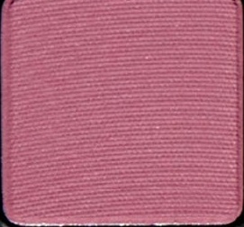
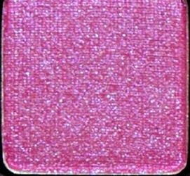

# Viseart 4色 中号 樱花莲盘 Petits Fours Sakura Lotus

> 提示：本页切片来自官网开盖图 `id`，并非独立的带描述色板图 `icons`。
> 第一排色块可能会受到盖子边缘轻微遮挡；如果后续拿到带描述色板图，应优先用 `icons` 重新切图。

## Shade 1: Cherry Petals — Muted, cool-toned beige pink with a matte finish.

Use: This beige pink matte shade can be used as an all over lid tone, beneath complimentary shadows as a base shade, or along the lashline for soft definition. Can also be worn as nude blush on light to medium complexions!

##### 色号 1：樱瓣柔粉 (Cherry Petals) —— 柔和冷调米粉色，哑光质地。
用途：这支米粉哑光色可作全眼铺色，或作为互补眼影下方的打底色，也可沿睫毛根部轻扫，带来柔和轮廓。浅至中等肤色也可作裸感腮红使用。

## Shade 2: Whirling — Iced pink with a purple duochromatic flip

Use: This iced pink duochromatic shade can be used as an all over lid color or along the high points of the face as a highlighter on lighter complexions. Apply to the inner corners of the eyes for a fresh burst of luminosity or as a base beneath any of the other shades in the palette. Mix this shade with water for a wash of color or combine with a mixing medium for a foiled effect. Apply with fingertips or a dense brush for your desired level of intensity.

##### 色号 2：旋樱偏光 (Whirling) —— 冰粉色，带紫调双偏光。
用途：这支冰粉双偏光色可作全眼铺色，也可在浅肤色上用于面部高点提亮。点在眼头可带来清透明亮感，也可作为盘中其他颜色下方的打底色。与清水混合可获得轻透染色感，搭配调和液则可做出箔光效果。可用指腹或扎实刷具按需叠加显色度。

## Shade 3: Blossoming — Soft dusty rose with a matte finish

Use: This soft dusty rose matte shade can be used as an all over lid tone, beneath complimentary shadows as a base shade, or along with lashline for soft definition. Can also be worn as nude blush on light to medium complexions!

##### 色号 3：盛樱玫瑰 (Blossoming) —— 柔雾玫瑰色，哑光质地。
用途：这支柔雾玫瑰哑光色可作全眼铺色，或作为互补眼影下方的打底色，也可沿睫毛根部轻扫，带来柔和轮廓。浅至中等肤色也可作裸感腮红使用。

## Shade 4: Hanami — Bright magenta with a blue duochromatic flip

Use: This duochromatic bright magenta shade can be used as an all over lid color or anywhere you want a pop of vibrant saturation. Mix this shade with water for a wash of color or combine with a mixing medium for a foiled effect. Apply with fingertips or a dense brush for your desired level of intensity. Can also be used as liner or added to gloss for a pearlized effect. Pair with any of the matte shades in the palette for even more saturation.

##### 色号 4：花见洋莓 (Hanami) —— 明亮洋红色，带蓝调双偏光。
用途：这支明亮洋红双偏光色可作全眼铺色，也适合用于任何想增强鲜活饱和度的位置。与清水混合可获得轻透染色感，搭配调和液则可做出箔光效果。可用指腹或扎实刷具按需叠加显色度。也可作为眼线色，或混入唇蜜增添珠泽效果。与盘中任一哑光色搭配，都能进一步提升饱和感。
