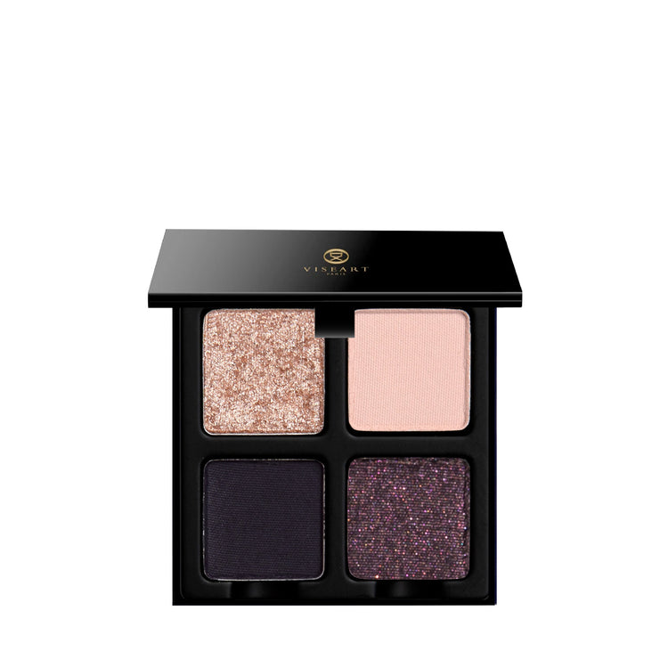
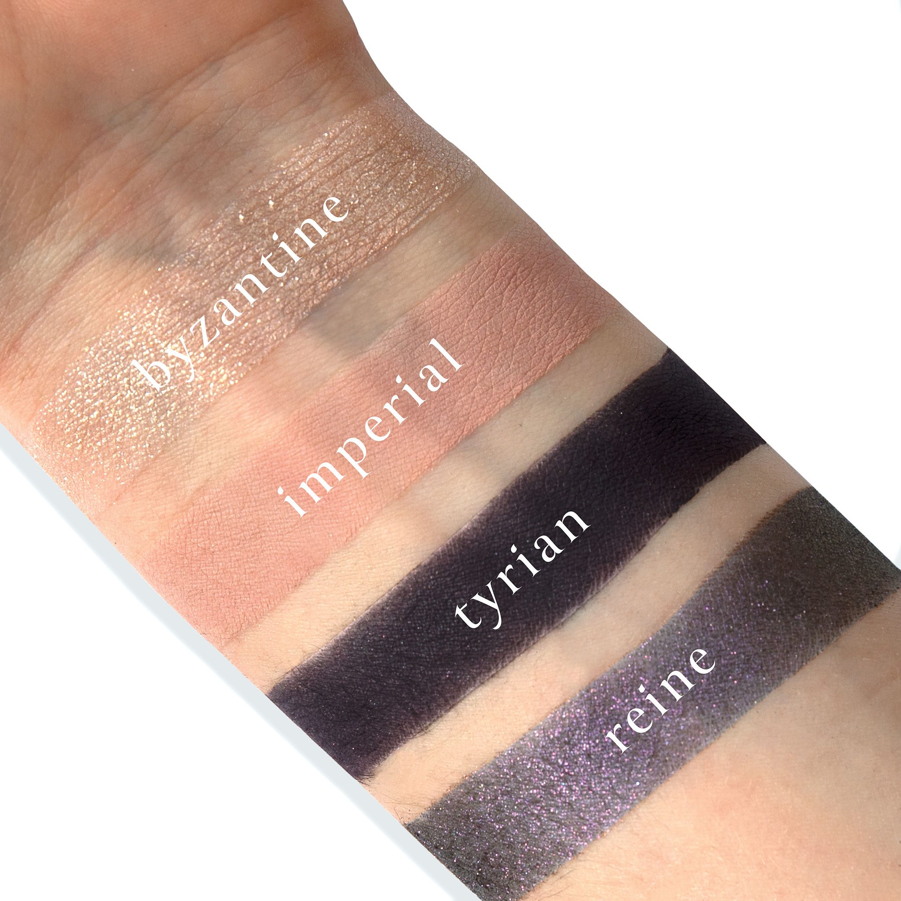
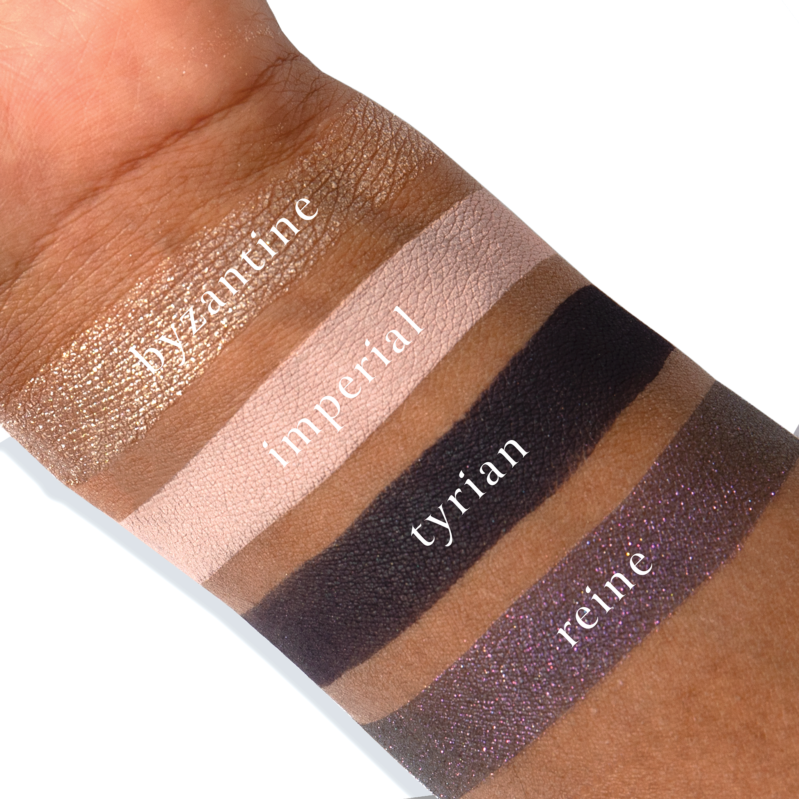
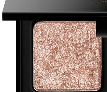
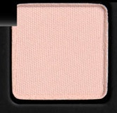
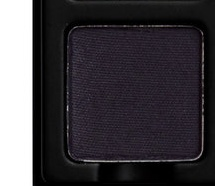
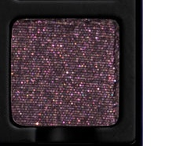

# Viseart 4色 中号 提尔紫盘 Petits Fours Tyrian
*发布：2023*

> 传说中的提尔紫，以其神秘的皇族气息与无上华贵，在这小小四色盘中得以重现。奢华浓郁的哑光深紫、帝国灰粉过渡，配以水晶香槟棱镜光与烟熏蓝紫偏光——一场关于神话与皇权的璀璨视觉宣言。

> *Tyrian celebrates the mythical allure of imperial Tyrian purple — weaving lavishly saturated matte hues with crystalline prism shimmer and smoky cerulean duochrome for a ravishingly rich, resplendent palette of regal mystique.*

## Shade 1: Byzantine — Crystalline champagne reflective topper with a prismatic finish.

Use: This crystalline topper can be used as an all over lid colour or to highlight the brow bone, cheekbones, or high points of the face for a ultra high-shine finish. Wear alone or apply overtop any of the other shades to brighten, lighten, and create over four new hues. Apply with a dense brush and use with the Viseart Seamless Eye Primer or other preferred mixing medium to prevent fall out. Can also be mixed into gloss to add a kiss of brilliance to any lip look. Pair with shades ‘Imperial’ and ‘Reine’ for a regal, reflective, radiant look!

##### 色号 1：拜占庭晶光 (Byzantine) —— 水晶香槟反光 topper，带棱镜般折射效果。
用途：可作全眼提亮色，也适合点亮眉骨、颧骨和面部高点，呈现高闪光泽。可单独使用，也可叠加在盘中其他颜色之上，提亮并变化出更多层次。建议用密实刷具蘸取，并搭配眼部打底或调和液减少飞粉；也可混入唇蜜，为唇妆增添晶亮光泽。与 Imperial、Reine 搭配，能营造华丽夺目的贵气光感。

## Shade 2: Imperial — Cool-toned sandy taupe-pink with a matte finish.

Use: This cool-toned sandy taupe-pink shade can be used as an all over lid colour, or as a base or transitional tone for light complexions. Can be worn as a lighter-toned base colour or brow bone highlighter for medium to deep skin. It can also be used as a transitional shade to build soft depth and dimension in the crease and socket. Blend with other tones to brighten, lighten and create over four new hues. Apply with fingertips or a dense brush for your desired level of intensity. Use as a base tone paired with shades ‘Byzantine’ and ‘Tyrian’ for a velvety veil of majestic mystique!

##### 色号 2：帝国灰粉 (Imperial) —— 冷调沙灰粉色，哑光质地。
用途：可作全眼铺色，也可作为浅肤色的打底或过渡色；中深肤色则可将其用作浅色打底或眉骨提亮。它也很适合放在眼窝与眼褶位置，柔和堆叠出层次与深邃感。与其他颜色混合还能提亮并延展更多变化。可用指腹或密实刷具按需叠加；搭配 Byzantine 与 Tyrian，可营造带神秘感的柔雾紫调底色。

## Shade 3: Tyrian — Opulent, deep tyrian purple with a matte finish.

Use: This densely packed, highly-pigmented powder can be used as an all over lid colour or focused in the outer corners, crease, and lash line for a rich, smokey look. Apply with a dense brush for your desired level of intensity. Wear as a deep base tone beneath ‘Byzantine’ or ‘Reine’ to amplify the reflectivity, or pair with shades ‘Imperial’ and ‘Reine’ for an opulent obsidian eye look!

##### 色号 3：提尔帝紫 (Tyrian) —— 浓郁深提尔紫色，哑光质地。
用途：这是一支压得扎实、显色度很高的深紫色，可单独全眼铺陈，或集中用于眼尾、眼窝与睫毛根部，打造浓郁烟熏感。建议用密实刷具分层叠加；铺在 Byzantine 或 Reine 之下还能增强偏光与反射感。与 Imperial、Reine 搭配，可完成深邃华贵的黑曜紫调眼妆。

## Shade 4: Reine — Cool-toned smoked purple-cerulean with a shimmer finish.

Use: This cool-toned smoked purple-cerulean can be used as an all over lid colour, or focused in the outer corners, crease, and lash line for a shimmery, smokey look. It can be used as a transitional shade in the socket to build depth and dimension. Apply with a dense brush and use with the Viseart Seamless Eye Primer or other preferred mixing medium for foiled finish. Wear overtop of ‘Tyrian’ for a sumptuous smokey sheen, or beneath ‘Byzantine’ for a dazzling, decadent, dramatic look!

##### 色号 4：烟熏紫蔚 (Reine) —— 冷调烟熏紫蔚色，闪光质地。
用途：可作全眼闪耀主色，也可用于眼尾、眼窝与睫毛根部，打造带光泽感的烟熏眼妆。它同样适合作为眼窝过渡色，增加层次与立体度。建议用密实刷具上色，并搭配眼部打底或调和液获得更强箔光效果。叠加在 Tyrian 之上可呈现丰润烟紫光泽，铺在 Byzantine 下方则更显华丽耀目。
