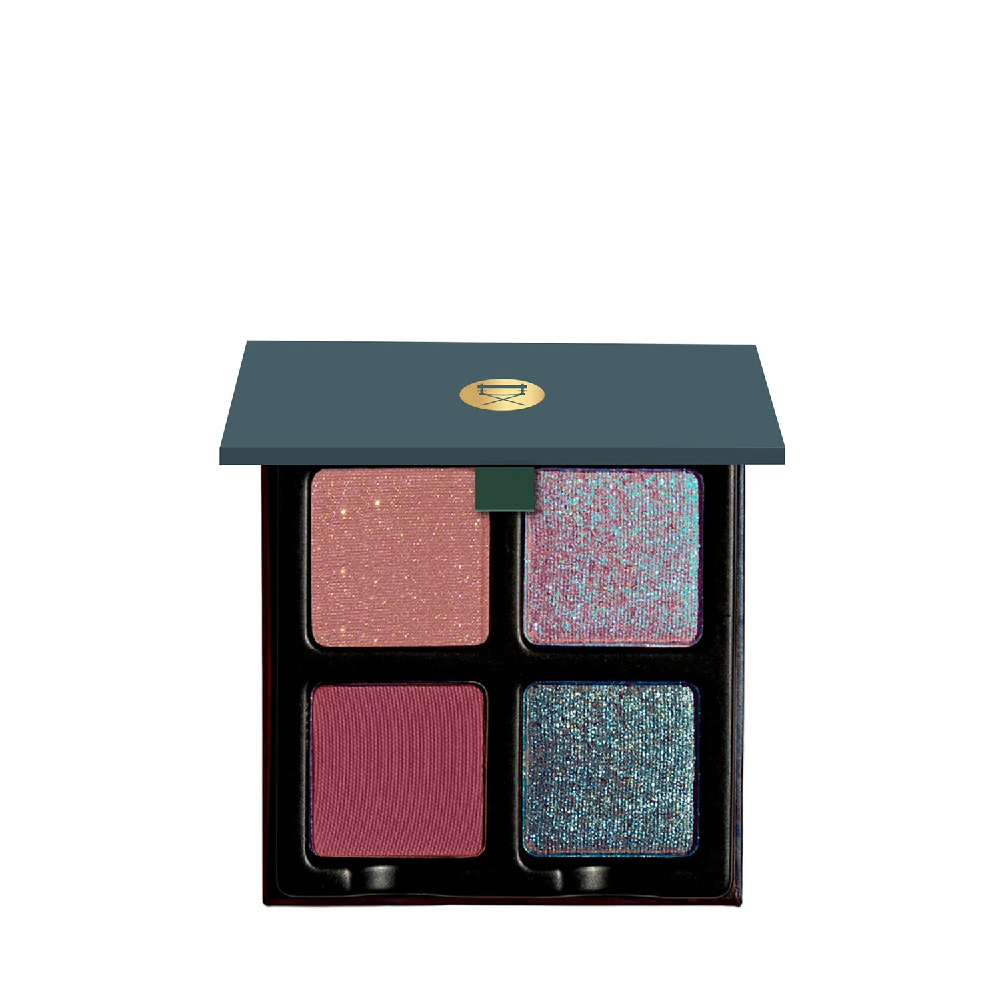

# Viseart 4色 中号 紫罗兰盘 Petits Fours Violetta

## Shade 1: Couperin — Muted mauve with flecks of gold-pink reflectivity matte hybrid finish.

Use: Can be used as an all over lid colour, liner, or foiled for extra depth and dimension.

##### 色号 1：库佩兰灰紫 (Couperin) —— 柔雾灰紫色，带金粉反光，哑光混合质地。
用途：可作全眼铺色、眼线，或搭配调和液压出箔感，增强深度与层次。

## Shade 2: Verrerie — Midnight-purple with a duochromatic metallic finish.

Use: Can be used as a liner, use mixing medium or a damp brush. Can be used as an all over lid tone, also in the inner corners for a pop of deep luminosity, in the center of the eyelid to accentuate the glow, and into any lipgloss to add a pearl finish! Additionally, foil this shade for day-into-evening wear with a mixing medium or damp brush to intensify the hue.

##### 色号 2：琉璃夜紫 (Verrerie) —— 午夜紫色，双偏光金属质地。
用途：可作眼线，也可用湿刷或调和液上色；适合全眼铺色、眼头提亮、点在眼皮中央增强光感，甚至可混入唇蜜增添珍珠光泽。湿刷或调和液还能强化箔感，日夜都适用。

## Shade 3: Châtelet — Rich blackberry with a matte finish.

Use: Use this rich plummy burgundy hue as a wash of color all over the lid or build it up and concentrate the shade in the outer corners of the eye for depth and dimension. Mix with other lighter or deeper mattesa and add a duochrome for a beautiful festive season eyelook!

##### 色号 3：夏特莱黑莓 (Châtelet) —— 浓郁黑莓色，哑光质地。
用途：可作全眼铺色，或集中在眼尾叠加加深，打造深度与层次。也可与更浅或更深的哑光色混合，并加入双偏光色，做出节日感妆容。

## Shade 4: Perchoir — Gunmetal with a metallic pearl finish.

Use: This deep gunmetal shade can be used all over the lid, in the outer corners of the eyes for a smokey effect, or as an eyeliner. Additionally, use a mixing medium or damp brush to intensify the hue.

##### 色号 4：栖台枪灰 (Perchoir) —— 枪灰色，金属珠光质地。
用途：可用于全眼铺色、眼尾烟熏，或直接当眼线；搭配调和液或湿刷可进一步加深显色与光泽。
