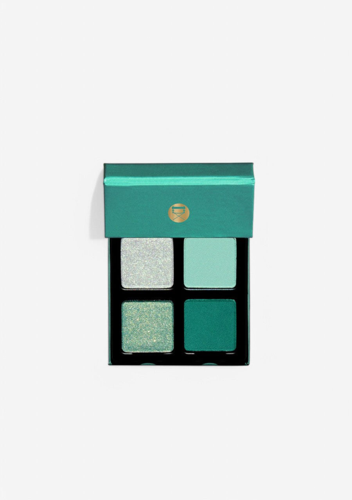
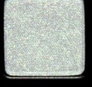
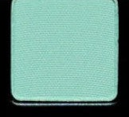
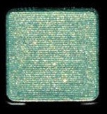
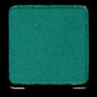

# Viseart 4色 中号 碧波水莲盘 Petits Fours Water Lotus
*发布：~2023*

> 如荷叶上的晨露，薄薄一层，清透而饱满。Water Lotus 的四格色彩源自宁静水域——冰银湖面的微光、雾气里的薄荷绿、随光流转的翡翠幻彩，与夜幕下深沉的碧波。

> *As serene as morning dew resting on lotus leaves. Water Lotus draws from the tranquil lagoon — icy silver shimmer, a mist-soft seafoam, an iridescent duochrome that shifts in the light, and a deep teal as still as a reflective pool at dusk.*

## Shade 1: Mzu — Icy silver shimmer.

Use: All over lid for an ethereal metallic sheen, concentrated on the inner corner for a bright focal glow, or on the brow bone as a highlight.

##### 色号 1：月光银 (Mzu) —— 冰感银色，闪光质地。
用途：可作全眼轻薄金属铺色，集中点于眼头增添发光焦点，或用作眉骨高光。

## Shade 2: Dewdrop — Soft seafoam shimmer.

Use: All over lid wash for a delicate luminous effect, inner corner brightener, or blended with Mzu for a frosty icy finish.

##### 色号 2：晨露 (Dewdrop) —— 柔和薄荷绿，闪光质地。
用途：可作全眼轻透铺色，用于眼头提亮，或与月光银混合呈现冰霜感。

## Shade 3: Pagoda — Iridescent silver-green duochrome lacquer.

Use: All over lid for multidimensional color that shifts between silver and aqua. Apply with a damp brush or mixing medium for an intense foiled finish. Concentrate on the center of the lid for maximum luminosity.

##### 色号 3：碧塔 (Pagoda) —— 银绿幻彩双色，漆光质地。
用途：可作全眼随光幻变铺色（银绿之间游走）；搭配湿刷或调和液可打造高强度箔光效果；集中点于眼皮中央以最大化光感。

## Shade 4: Lily Pad — Deep teal green.

Use: Deep liner along lash line, outer corner drama, or all over lid for a bold teal color statement.

##### 色号 4：荷叶 (Lily Pad) —— 深邃翠碧绿色。
用途：可沿睫毛根部作深色眼线，叠加于眼尾打造戏剧感，或全眼铺色打造大胆翠绿妆效。
