# Viseart 12色 小号 暗调编辑盘 Dark Edit
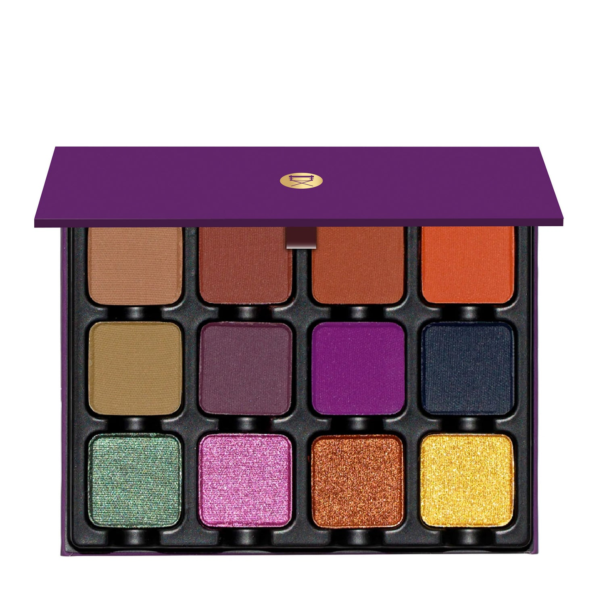

## Shade 1: Toffee — Warm light brown with a matte finish
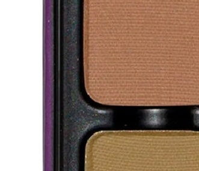

Use: All over base tone for all skin types, highlight for brow bone on medium to deep skin. Use as a mix in with other brown tones and with greens to create different light variations of khaki.

##### 色号 1：太妃棕 (Toffee) —— 暖调浅棕色，哑光质地。
用途：可作全眼铺色，适合所有肤色；中至深肤色可用于眉骨提亮；与其他棕色及绿色混合可调出不同深浅的卡其色。

## Shade 2: Sienna — Muted rosy brown with a matte finish
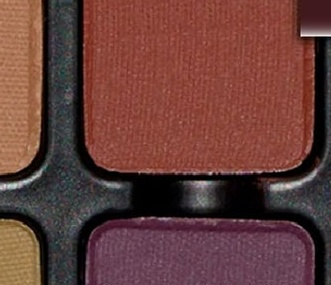

Use: All over tone for all skin types. Use it as a liner to create depth and dimension.

##### 色号 2：赭石棕 (Sienna) —— 柔和玫瑰棕色，哑光质地。
用途：可作全眼铺色，适合所有肤色；也可作眼线色，增添深度与立体感。

## Shade 3: Sepia — Muted orange brown with a matte finish
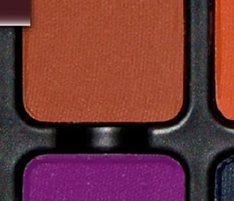

Use: All over tone for all skin types. Use it as a liner to create depth and dimension.

##### 色号 3：棕褐 (Sepia) —— 柔和橘棕色，哑光质地。
用途：可作全眼铺色，适合所有肤色；也可作眼线色，增添深度与立体感。

## Shade 4: Myrtille — Blue purple with a matte finish
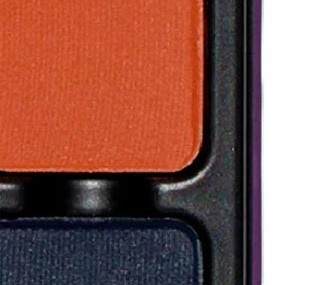

Use: All over tone for all skin types. Use it as a liner to create depth and dimension.

##### 色号 4：蓝莓紫 (Myrtille) —— 蓝紫色，哑光质地。
用途：可作全眼铺色，适合所有肤色；也可作眼线色，增添深度与立体感。

## Shade 5: Olive — Khaki green with a matte finish
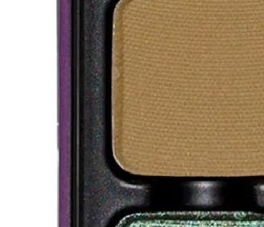

Use: All over tone and also a base tone for deeper skin. Can be used as a midtone with cream, khaki shades for depth and dimension.

##### 色号 5：橄榄绿 (Olive) —— 卡其绿色，哑光质地。
用途：可全眼铺色，也可作深肤色打底；与奶油色、卡其色搭配作中间过渡色，增添深度与层次。

## Shade 6: Beaujolais — Eggplant purple with a matte finish
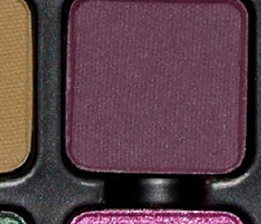

Use: All over tone for all skin types. Use it as a liner to create depth and dimension.

##### 色号 6：博若莱紫 (Beaujolais) —— 茄子紫色，哑光质地。
用途：可作全眼铺色，适合所有肤色；也可作眼线色，增添深度与立体感。

## Shade 7: Lavender — Byzantine purple with a matte finish
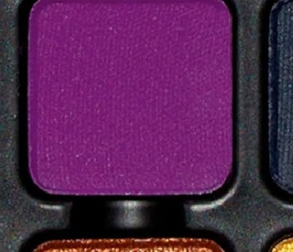

Use: Add to any matte or shimmer for a vibrant or amplified tone! *WARNING* - In the US, this shade contains pigments that the FDA has not approved for use in the eye area.

##### 色号 7：拜占庭薰衣草紫 (Lavender) —— 拜占庭紫色，哑光质地。
用途：与任何哑光或微光色混合可增添活力与饱和度。提示：在美国，此色号含有 FDA 未批准用于眼部周围的色素。

## Shade 8: Minuit — Deep navy blue with a matte finish
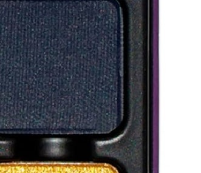

Use: All over tone for all skin types. Use it as a liner to create depth and dimension.

##### 色号 8：午夜蓝 (Minuit) —— 深海军蓝色，哑光质地。
用途：可作全眼铺色，适合所有肤色；也可作眼线色，增添深度与立体感。

## Shade 9: Absinthe — Emerald green with a metallic foil satin finish
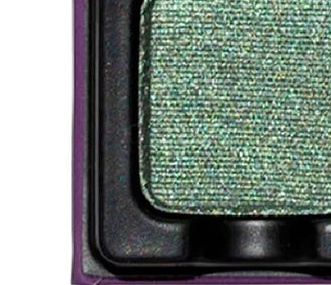

Use: All over tone for all skin types. Use it as a liner with a damp brush to create depth and dimension, add to any matte tone, try a mixing medium to foil the shade.

##### 色号 9：苦艾祖母绿 (Absinthe) —— 祖母绿色，金属箔光绸缎质地。
用途：可全眼铺色；用湿刷作眼线可增添深度与立体感；与任何哑光色叠搭，或使用调和液获得箔光效果。

## Shade 10: Calypso — Fuchsia with a metallic foil satin finish
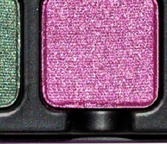

Use: All over tone for all skin types. Use it as a liner with a damp brush to create depth and dimension, add to any matte tone, try a mixing medium to foil the shade. *WARNING* - In the US, this shade contains pigments that the FDA has not approved for use in the eye area.

##### 色号 10：卡利普索洋红 (Calypso) —— 洋红色，金属箔光绸缎质地。
用途：可全眼铺色；用湿刷作眼线可增添深度与立体感；与任何哑光色叠搭，或使用调和液获得箔光效果。提示：在美国，此色号含有 FDA 未批准用于眼部周围的色素。

## Shade 11: Burnished Copper — Fiery burnt peachy red with a metallic foil satin finish
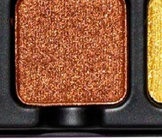

Use: Use as an all over eyeshadow tone, add to the matte tones to create a copper smokey eye. Also can be used as a highlight for deeper skin tones.

##### 色号 11：炙铜橘红 (Burnished Copper) —— 燃烧桃橘红色，金属箔光绸缎质地。
用途：可全眼铺色；与盘内哑光色搭配可打造铜调烟熏眼妆；也可用于深肤色的局部提亮。

## Shade 12: Bullion — Deep gold with a metallic foil satin finish
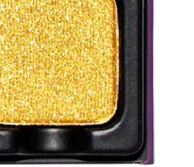

Use: All over tone for all skin types. Use it as a liner with a damp brush to create depth and dimension, add to any matte tone, try a mixing medium to foil the shade. Add to deep tones for a reflective gold smokey eye!

##### 色号 12：金锭深金 (Bullion) —— 深金色，金属箔光绸缎质地。
用途：可全眼铺色；用湿刷作眼线可增添深度与立体感；与任何哑光色叠搭，或使用调和液获得箔光效果；与深色系叠搭可打造反光金调烟熏眼妆。
