# Viseart 12色 小号 巴黎小天使哑光盘 Petites Paris Chérubine Mattes
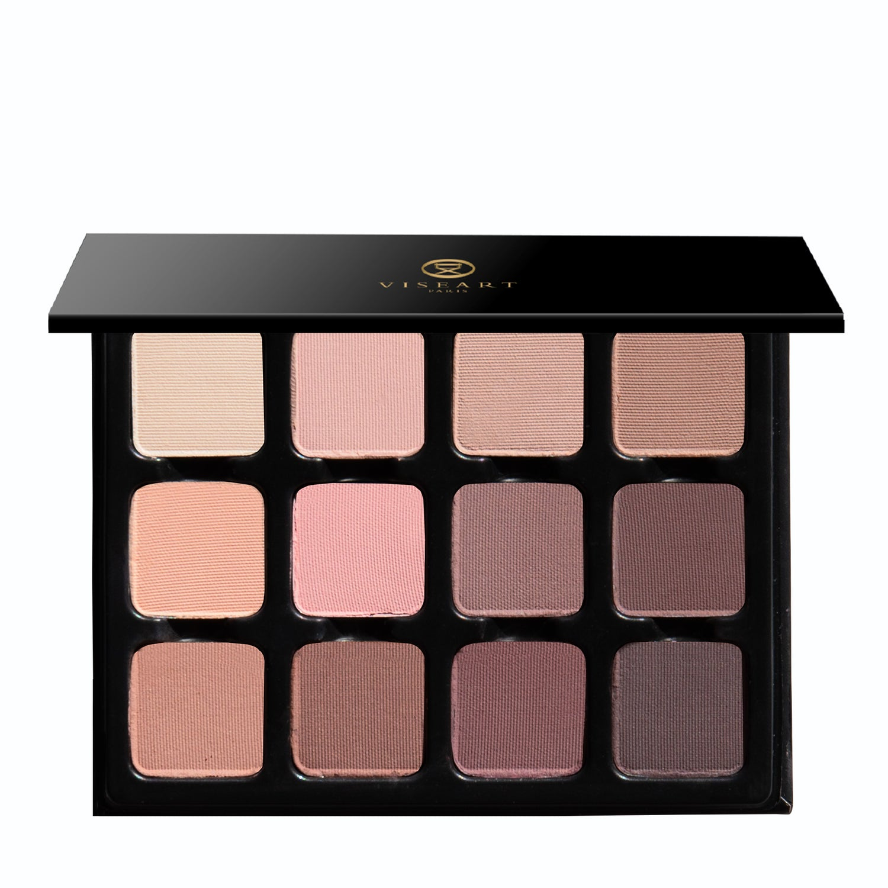

## Shade 1: Plâtre — Soft vanilla cream with a matte finish.
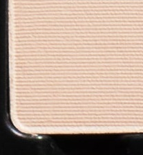

Use: Use this soft vanilla cream shade as an all-over lid color on all complexions, in the crease and outer corners of the eyes as a transitional hue, under the brow bone as a highlighter, or as a soft, neutral base beneath complementary tones. Apply with a brush for your desired level of intensity.

##### 色号 1：石膏奶霜 (Plâtre) —— 柔和香草奶霜色，哑光质地。
用途：适合作为所有肤色的全眼铺色，也可用于眼窝与眼尾过渡、眉骨提亮，或叠在互补色之下作柔和中性色打底。用刷具按需叠加显色即可。

## Shade 2: Porcelaine — Cool-toned light beige with a matte finish
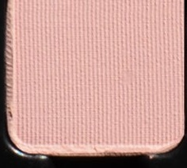

Use: This cool-toned light beige shade can be used as an all-over lid colour or as a base tone beneath complementary hues. It can also be used to highlight the brow bone and inner corners of the eyes or as a transitional shade in the socket. Apply with a brush for your desired level of intensity.

##### 色号 2：瓷白米杏 (Porcelaine) —— 冷调浅米色，哑光质地。
用途：可作全眼铺色，或在互补色之下作打底；也适合用于眉骨、眼头提亮，或作为眼窝过渡色。用刷具按需叠加显色即可。

## Shade 3: Fresque — Cool-toned light taupe with a matte finish.
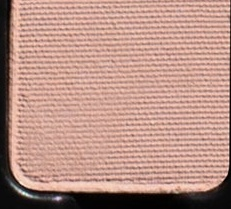

Use: Use this light, cool-toned taupe shade as an all-over base shade or to create soft definition in the crease. It can also be used under the brow bone for light to medium skin. Apply with a brush for your desired level of intensity.

##### 色号 3：壁画灰褐 (Fresque) —— 冷调浅灰褐色，哑光质地。
用途：可作全眼打底，也能用于眼窝轻柔加深，塑造自然层次；浅肤到中等肤色还可用于眉骨提亮。用刷具按需叠加显色即可。

## Shade 4: Rocaille — Sandy taupe with a matte finish.
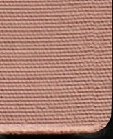

Use: This sandy taupe shade can be used to highlight and accentuate the contours of the face. Apply it under the brow bone on all complexions, or down the bridge of the nose and on the cheekbones on medium to deep complexions to add brightness to the face. *WARNING* - In the US, this shade contains pigments that the FDA has not approved for use in the eye area.

##### 色号 4：洛可灰棕 (Rocaille) —— 沙感灰棕色，哑光质地。
用途：适合提亮并修饰面部轮廓，可用于所有肤色的眉骨提亮；中深肤色也可刷在鼻梁与颧骨位置，增加面部明亮感。提示：按美国法规，本色含有未获 FDA 批准用于眼周的色料。

## Shade 5: Floribelle — Light apricot taupe with a matte finish.
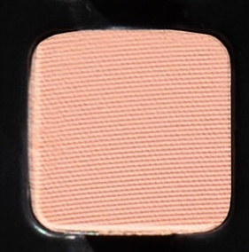

Use: Use this light apricot taupe shade as an all-over lid color on all complexions, in the crease and outer corners of the eyes as a transitional tone, or as a bright, warm-toned base beneath complementary tones. Apply with a brush for your desired level of intensity.

##### 色号 5：花漾杏褐 (Floribelle) —— 浅杏灰褐色，哑光质地。
用途：适合作为所有肤色的全眼铺色，也可用于眼窝与眼尾过渡，或在互补色之下作明亮暖调打底。用刷具按需叠加显色即可。

## Shade 6: Thé Rosâtre — Soft tea rose pink with a matte finish.
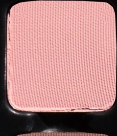

Use: Use this soft tea rose pink shade as an all-over lid color on all complexions, in the crease and outer corners of the eyes as a transitional tone, or as a rosy base beneath complementary tones. Can also be used as blush on light to medium complexions. Apply with a brush for your desired level of intensity.

##### 色号 6：玫瑰茶粉 (Thé Rosâtre) —— 柔和茶玫粉色，哑光质地。
用途：可作所有肤色的全眼铺色，也适合用于眼窝与眼尾过渡，或在互补色之下作玫粉调打底；浅肤到中等肤色还可当作腮红。用刷具按需叠加显色即可。

## Shade 7: Fleur d’Aube — Nude rose-brown with a matte finish.
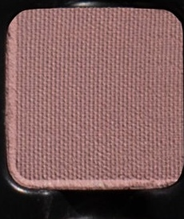

Use: Use this nude rose-brown shade to add subtle definition to the contours of the face. It can also be used as a nude blush on light to medium complexions. Apply with a brush for your desired level of intensity. *WARNING* - In the US, this shade contains pigments that the FDA has not approved for use in the eye area.

##### 色号 7：晨曦玫棕 (Fleur d’Aube) —— 裸玫瑰棕色，哑光质地。
用途：适合用来轻柔修饰面部轮廓，也可作为浅肤到中等肤色的裸调腮红。用刷具按需叠加显色即可。提示：按美国法规，本色含有未获 FDA 批准用于眼周的色料。

## Shade 8: Volute — Muted purple-grey with a matte finish.
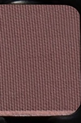

Use: Use this muted purple-grey matte shade as an all-over lid colour, in the crease to contour of the eyes to create dimension, or as a liner for a soft, diffused effect on all complexions. Apply with a brush for your desired level of intensity.

##### 色号 8：雕纹紫灰 (Volute) —— 柔雾紫灰色，哑光质地。
用途：可作全眼铺色，也可用于眼窝轮廓塑形增加层次，或当作眼线色打造柔和晕染效果，适合所有肤色。用刷具按需叠加显色即可。

## Shade 9: Sépia de Soie — Light pink-brown with a matte finish.
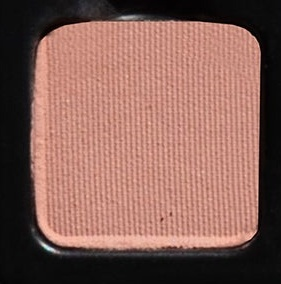

Use: This light pink-brown matte shade can be used as an all-over lid colour or as a base tone beneath complementary hues. It can also be used as a transitional shade to contour the socket for depth and dimension. Apply with a brush for your desired level of intensity.

##### 色号 9：丝绸粉棕 (Sépia de Soie) —— 浅粉棕色，哑光质地。
用途：可作全眼铺色，也可在互补色之下作打底；同时适合作为眼窝过渡与轮廓色，为眼妆增加深度与层次。用刷具按需叠加显色即可。

## Shade 10: Poupée — Mid-tone nude rose-brown with a matte finish.
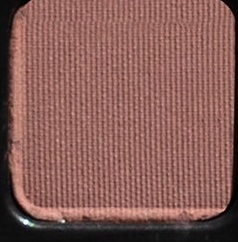

Use: This mid-tone matte rose-brown shade can be used as an all-over lid colour or as a base tone beneath complementary hues. It can also be used as a transitional shade to contour the socket for depth and dimension. Additionally, this color can be used in the brows or as a contour on light to medium complexions. Apply with a brush for your desired level of intensity.

##### 色号 10：洋娃娃玫棕 (Poupée) —— 中调裸玫瑰棕色，哑光质地。
用途：可作全眼铺色，也可在互补色之下作打底；同时适合作为眼窝过渡与轮廓色，增加深度与层次。浅肤到中等肤色还可用于眉部填充或面部修容。用刷具按需叠加显色即可。

## Shade 11: Éther Rosé — Muted mauve with a matte finish.
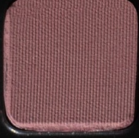

Use: Use this muted mauve matte shade as an all-over lid colour, in the crease to contour of the eyes for depth and dimension, or as a liner for a soft, diffused effect on all complexions. Apply with a brush for your desired level of intensity.

##### 色号 11：玫紫轻雾 (Éther Rosé) —— 柔和灰玫紫色，哑光质地。
用途：可作全眼铺色，也可用于眼窝轮廓塑形增加深度，或当作眼线色打造柔和晕染效果，适合所有肤色。用刷具按需叠加显色即可。

## Shade 12: Élysée — Soft cool grey-brown taupe with a matte finish.
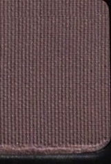

Use: Use this soft cool grey-brown taupe as an all-over lid colour for all complexions. It can be used as a base tone under complementary shades, or layered for depth and dimension. Additionally, this shade can be used to fill in brows or as a contour colour on light to medium complexions. Apply with a brush for your desired level of intensity.

##### 色号 12：爱丽舍灰褐 (Élysée) —— 柔和冷调灰褐色，哑光质地。
用途：适合作为所有肤色的全眼铺色，也可在互补色之下作打底，或层层叠加加深轮廓与层次；浅肤到中等肤色还可用于眉部填充或面部修容。用刷具按需叠加显色即可。
