# Viseart 12色 小号 娇羞和色盘 Petites Shimmers Coy
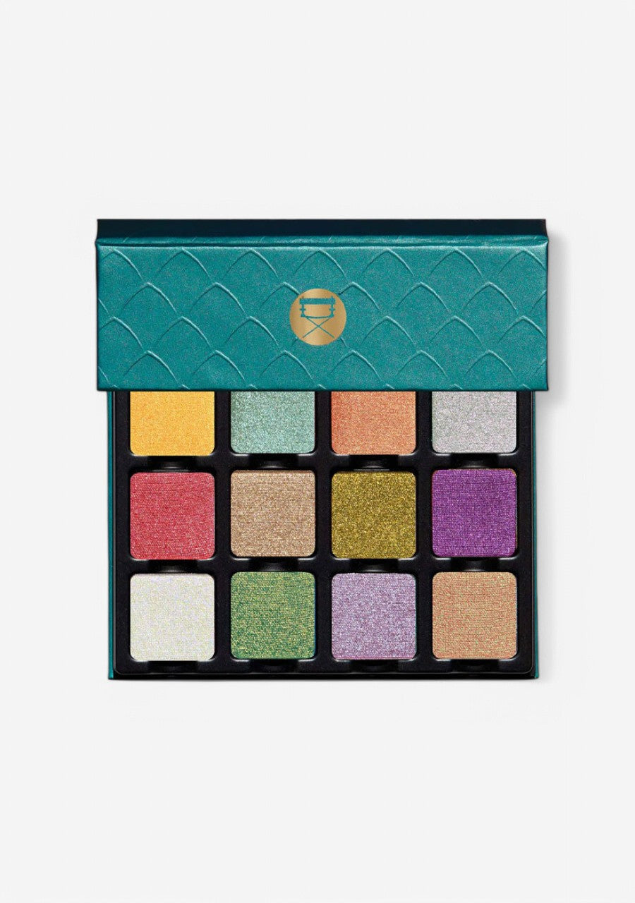

> 提示：本页切片来自官网开盖图 `id`，并非独立的带描述色板图 `icons`。
> 第一排色块可能会受到盖子边缘轻微遮挡；如果后续拿到带描述色板图，应优先用 `icons` 重新切图。

## Shade 1: Kokai — Dandelion yellow with a metallic finish.
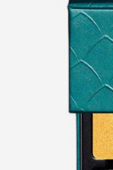

Use: Apply all over the lid for a bright pop of colour, or concentrate on the centre of the eyelid for a sunny highlight. Use a damp brush or a mixing medium to intensify the golden shine for a foiled finish.

##### 色号 1：湖海 (Kokai) —— 蒲公英黄色，金属光泽。
用途：可铺满眼皮作明亮底色，或集中在眼皮中央打造阳光感提亮。湿刷或调和液可强化金属箔光效果。

## Shade 2: Pond — Aquamarine seafoam with a metallic finish.
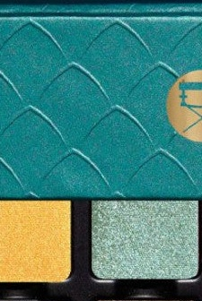

Use: Sweep across the lid for a cool, aquatic wash of colour. Layer on the centre of the lid for dimensional shimmer, or blend into the outer corners for a refreshing, editorial look. Use damp for maximum intensity.

##### 色号 2：水塘 (Pond) —— 水蓝海沫色，金属光泽。
用途：扫满眼皮营造清凉水感，或叠在眼皮中央增添层次，也可延伸至眼尾打造编辑感。湿刷可最大化光泽强度。

## Shade 3: Koi — Melon with gold reflects with a duochrome finish.
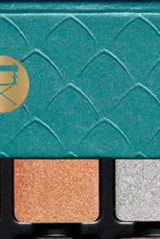

Use: Apply all over the lid for a warm, glowing effect. The gold reflects add depth and dimension. Use dry for a soft, radiant look or damp to intensify the duochromatic shift.

##### 色号 3：锦鲤 (Koi) —— 蜜瓜色，金色双偏光光泽。
用途：铺满眼皮呈现温暖发光效果，金色偏光增添深度与层次感。干用柔和发光，湿用可强化双偏光变化。

## Shade 4: Gin — Icy violet with silver reflects with a duochrome finish.
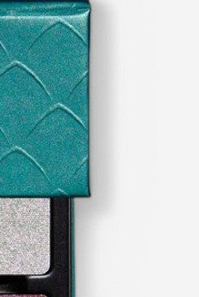

Use: Layer across the lid for a cool, ethereal effect. Concentrate on the inner corner or brow bone as a highlight. The silver reflects shift beautifully in different lighting. Use damp for a foiled finish.

##### 色号 4：银 (Gin) —— 冰感紫罗兰色，银色双偏光光泽。
用途：叠满眼皮营造清冷空灵感，或点在眼头、眉骨提亮。银色偏光在不同灯光下变幻多姿。湿刷可打造箔光效果。

## Shade 5: Sakura — Cherry blossom vermillion with a metallic finish.
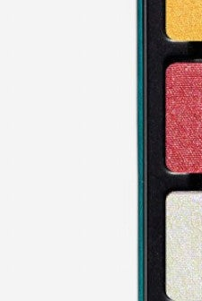

Use: Apply all over the lid for a bold, romantic statement. Blend into the outer corners for depth, or use as a vibrant pop of colour on the centre of the lid. Use damp for a high-shine, metallic effect.

##### 色号 5：樱 (Sakura) —— 樱花朱砂红，金属光泽。
用途：可大面积铺色打造浓烈浪漫感，或集中在眼尾加深；也可点在眼皮中央制造视觉焦点。湿刷可强化高光泽金属质感。

## Shade 6: Tokyo — Pale gold with a metallic finish.
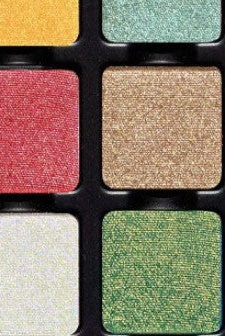

Use: Use as an all-over lid colour for a classic golden shimmer, or as a highlight for the inner corner, brow bone, and centre of the lid. Mix with other shades to lighten them. Use damp for a bright, foiled finish.

##### 色号 6：东京 (Tokyo) —— 浅金色，金属光泽。
用途：可作全眼经典金色底铺，也适合点亮眼头、眉骨和眼皮中央；可与其他色混合提亮。湿刷可获得明亮箔光效果。

## Shade 7: Midori — Sprout green-gold with a metallic finish.
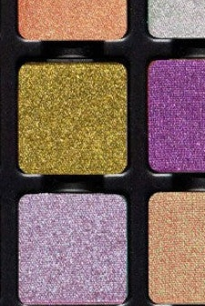

Use: Apply all over the lid for a fresh, earthy shimmer. The green-gold tone pairs beautifully with warm browns and coppers. Use damp for a bright, metallicized finish.

##### 色号 7：碧 (Midori) —— 新芽绿金色，金属光泽。
用途：铺满眼皮呈现清新大地感闪光。绿金调与暖棕色、铜金色搭配相得益彰。湿刷可获得明亮金属质感。

## Shade 8: Murasaki — Iced purple with a metallic finish.
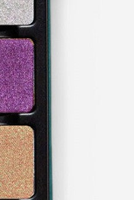

Use: Sweep all over the lid or layer on the outer corners for a cool, regal effect. Blend with warmer tones for contrast, or use alone for a statement look. Use damp to intensify the metallic shimmer.

##### 色号 8：紫 (Murasaki) —— 冰感紫色，金属光泽。
用途：可全眼铺色或叠在眼尾营造冷艳高贵感；与暖调颜色搭配形成对比层次，也可单独使用打造个性妆感。湿刷可强化金属闪光。

## Shade 9: Taiko — White with purple-pink reflects with a duochrome finish.
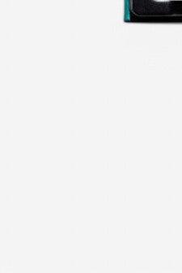

Use: Perfect as an all-over wash of soft iridescence, or use as a highlight for the inner corner and brow bone. The purple-pink duochromatic shift creates a multidimensional effect. Use damp for maximum shimmer.

##### 色号 9：太鼓 (Taiko) —— 白色调，紫粉双偏光光泽。
用途：轻扫全眼打造柔和虹彩感，或用作眼头、眉骨提亮。紫粉双偏光可制造多维立体效果。湿刷可最大化闪亮感。

## Shade 10: Kamakura — Seafoam green-blue with gold reflects with a duochrome finish.
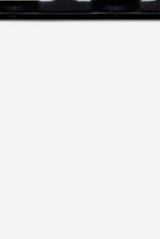

Use: Apply all over the lid for a cool, ocean-inspired look. The gold reflects add warmth to the cool blue-green base. Use damp to amplify the duochromatic shift for an intense, glassy finish.

##### 色号 10：镰仓 (Kamakura) —— 海沫蓝绿色，金色双偏光光泽。
用途：铺满眼皮打造清凉海洋风。金色偏光为冷调蓝绿底色增添温度。湿刷可放大双偏光变化，打造玻璃质感。

## Shade 11: Lotus — Lilac with silver reflects with a duochrome finish.
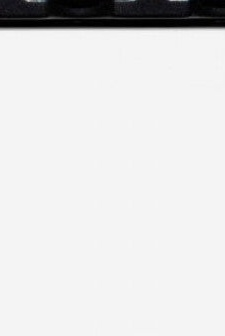

Use: Sweep all over the lid for a soft, dreamy look. Use at the inner corner or brow bone as a highlight. The silver reflects add brightness and multidimensionality. Use damp for a shimmery, otherworldly finish.

##### 色号 11：莲 (Lotus) —— 淡紫色，银色双偏光光泽。
用途：扫满眼皮营造柔美梦幻感，或用作眼头、眉骨提亮。银色偏光增添明亮度与多维立体感。湿刷可打造梦幻闪光效果。

## Shade 12: Yamabuki — Peach with green-gold reflects with a duochrome finish.
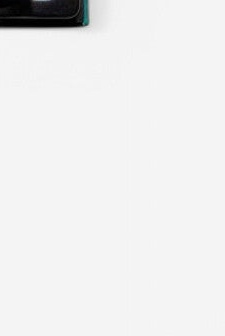

Use: Apply all over the lid for a warm, glowing effect. The green-gold reflects create an unexpected, modern dimension. Use dry for a subtle, romantic look or damp to intensify the duochromatic shift.

##### 色号 12：山吹 (Yamabuki) —— 蜜桃色，绿金双偏光光泽。
用途：铺满眼皮营造温暖发光感。绿金偏光带来意想不到的现代层次感。干用呈现柔和浪漫，湿用可强化双偏光变化。
