# Viseart 12色 小号 01 暖调编辑盘 Warm Edit
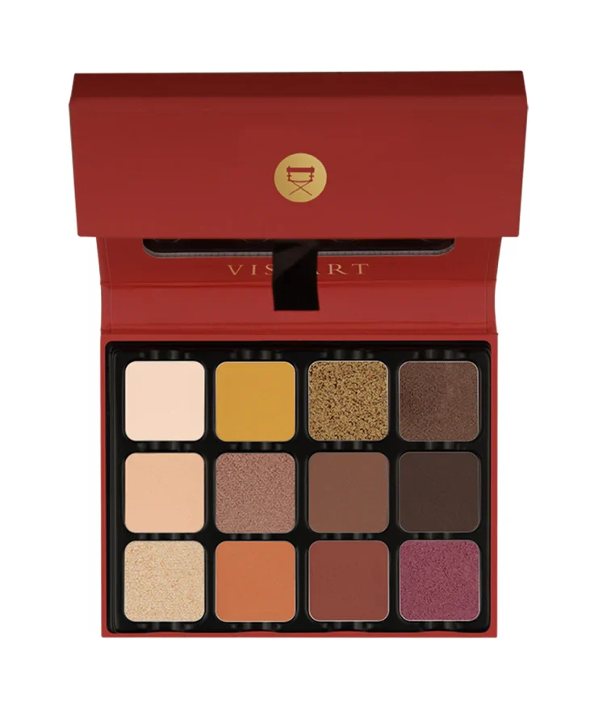

> 提示：本页切片来自官网开盖图 `id`，并非独立的带描述色板图 `icons`。
> 第一排色块可能会受到盖子边缘轻微遮挡；如果后续拿到带描述色板图，应优先用 `icons` 重新切图。

## Shade 1: Moonstone — Very light warm peach with a matte finish.
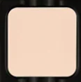

Use: All over lid base or brow bone highlight for all skin tones. Mix with other shades to create lighter transitions.

##### 色号 1：月光石 (Moonstone) —— 极浅暖桃色，哑光质地。
用途：可作全眼铺色打底或眉骨提亮，适合所有肤色；与其他色混合可做浅色过渡。

## Shade 2: Saffron — Warm golden yellow with a matte finish.
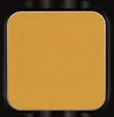

Use: All over lid for a warm sunny look. Pairs with burnt orange and copper for a sunset eye.

##### 色号 2：藏红花金黄 (Saffron) —— 暖调金黄色，哑光质地。
用途：可作全眼铺色，打造温暖阳光妆感；与橙棕和铜色搭配可做日落眼妆。

## Shade 3: Burnt Gold — Warm medium gold with a metallic shimmer finish.
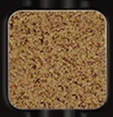

Use: All over lid or layered over matte shades for dimension. Pairs beautifully with warm browns for a metallic eye.

##### 色号 3：烧金色 (Burnt Gold) —— 暖调中调金色，金属微光质地。
用途：可作全眼铺色，或叠加在哑光色上增添层次；与暖棕色搭配可打造金属光泽眼妆。

## Shade 4: Chocolate — Deep warm chocolate brown with a satin finish.
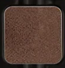

Use: Use in the crease and outer corner for depth, or all over lid for a rich chocolate eye. Works as a liner on deeper skin tones.

##### 色号 4：巧克力棕 (Chocolate) —— 深暖巧克力棕，缎光质地。
用途：可用于眼窝和眼尾加深，或全眼铺色打造浓郁巧克力妆；深肤色也可作眼线使用。

## Shade 5: Apricot Nude — Soft light peach nude with a matte finish.
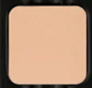

Use: All over base for all skin tones, or inner corner brightener. Blends seamlessly as a transition shade.

##### 色号 5：杏桃裸色 (Apricot Nude) —— 柔和浅桃裸色，哑光质地。
用途：可作全眼底色，适合所有肤色；也可用于眼头提亮；作为过渡色晕染衔接自然。

## Shade 6: Bronzed Peach — Warm rose-bronze with a metallic shimmer finish.
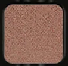

Use: All over lid or center of lid highlight. Pairs with warm browns for a glow. Use damp for a foiled finish.

##### 色号 6：铜桃微光 (Bronzed Peach) —— 暖调玫瑰铜色，金属微光质地。
用途：可作全眼铺色或眼皮中央提亮；与暖棕色搭配可营造发光感；湿刷可打造箔光效果。

## Shade 7: Earth — Medium warm brown with a matte finish.
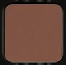

Use: All over tone or crease shade for all skin tones. Use as a liner to add depth and definition.

##### 色号 7：大地棕 (Earth) —— 中调暖棕色，哑光质地。
用途：可全眼铺色或用于眼窝作过渡，适合所有肤色；也可作眼线色增添深度与轮廓。

## Shade 8: Curcumin — Very deep warm dark brown with a matte finish.
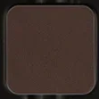

Use: Outer corner and crease for depth. Use as a liner for a precise line. Pairs with warm bronze for a dramatic smokey eye.

##### 色号 8：姜黄深棕 (Curcumin) —— 极深暖棕色，哑光质地。
用途：可用于眼尾和眼窝加深；作眼线色线条精准；与暖铜色搭配可做浓郁烟熏妆。

## Shade 9: Nude Caramel — Warm light caramel with a metallic shimmer finish.
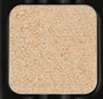

Use: All over base or center of lid highlighter. Mix with darker shades to lighten. Adds warmth and glow to any look.

##### 色号 9：裸焦糖 (Nude Caramel) —— 暖调浅焦糖色，金属微光质地。
用途：可作全眼底色或眼皮中央提亮；与深色混合可提亮；为任何妆容增添温暖发光感。

## Shade 10: Flame — Warm orange terra cotta with a matte finish.
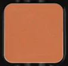

Use: All over lid for a bold warm statement. Blend into the crease with Earth for a smouldering effect. All skin tones.

##### 色号 10：火焰橘赭 (Flame) —— 暖调橙赭色，哑光质地。
用途：可全眼铺色打造大胆暖调妆感；与 `Earth` 晕染于眼窝可做缭绕烟熏效果。

## Shade 11: Mars — Deep warm red-brown with a matte finish.
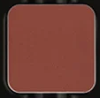

Use: Outer corner and lower lash line for depth. Pairs with Chocolate and Curcumin for a rich deep smokey eye. All skin tones.

##### 色号 11：火星赤棕 (Mars) —— 深暖红棕色，哑光质地。
用途：可用于眼尾和下眼睑加深；与 `Chocolate` 和 `Curcumin` 搭配可做浓郁深邃烟熏妆。

## Shade 12: Cassis — Deep warm berry plum with a metallic shimmer finish.
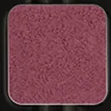

Use: All over lid for a bold statement or outer corner for drama. Pairs with warm copper and bronze for a jewel-toned eye.

##### 色号 12：黑加仑紫 (Cassis) —— 深暖莓果紫色，金属微光质地。
用途：可全眼铺色打造大胆抢眼妆感，或集中在眼尾增添戏剧感；与铜色和青铜色搭配可做宝石色调眼妆。
