# Viseart 12色 小号 02 玫瑰编辑盘 Rosé Edit
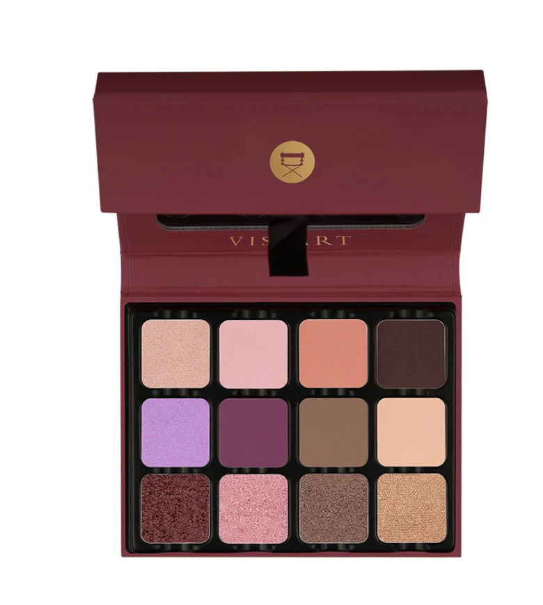

> 提示：本页切片来自官网开盖图 `id`，并非独立的带描述色板图 `icons`。
> 第一排色块可能会受到盖子边缘轻微遮挡；如果后续拿到带描述色板图，应优先用 `icons` 重新切图。

## Shade 1: Peony — Light blush pink with a satin shimmer finish.
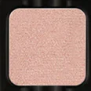

Use: All over lid or inner corner highlight for a romantic pink look. Pairs with deeper roses for a monochromatic eye.

##### 色号 1：牡丹粉 (Peony) —— 浅腮红粉色，缎光微闪质地。
用途：可全眼铺色或点亮眼头，打造浪漫粉调妆感；与深玫瑰色搭配可做单色调眼妆。

## Shade 2: Blossom — Light soft pink with a matte finish.
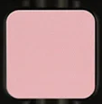

Use: All over base shade or highlight for lighter skin tones. Blend into crease for a fresh pastel look.

##### 色号 2：花瓣粉 (Blossom) —— 浅柔粉色，哑光质地。
用途：可作全眼铺色底色，浅肤色也可用于提亮；晕染于眼窝可做清新粉彩妆。

## Shade 3: Rosette — Warm coral pink with a matte finish.
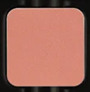

Use: All over lid for a warm, flattering flush of colour. Blend with Peony for a soft gradient. All skin tones.

##### 色号 3：玫瑰珊瑚 (Rosette) —— 暖调珊瑚粉，哑光质地。
用途：可全眼铺色打造温暖好气色妆感；与 `Peony` 晕染可做柔和渐变。

## Shade 4: Truffle — Deep dark plum brown with a matte finish.

Use: Outer corner and crease for depth. Use as a liner for a precise line. Creates a dramatic smokey finish.

##### 色号 4：松露暗棕 (Truffle) —— 深暗李子棕色，哑光质地。
用途：可用于眼尾和眼窝加深；也可作精准眼线色，打造浓郁烟熏感。

## Shade 5: Wisteria — Light cool lavender with a shimmer finish.
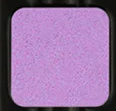

Use: All over lid or inner corner for an ethereal, cool look. Pairs with Violet for a dimensional purple eye.

##### 色号 5：紫藤花 (Wisteria) —— 浅冷调薰衣草色，微光质地。
用途：可全眼铺色或点亮眼头打造梦幻冷调妆感；与深紫搭配可做层次紫调眼妆。

## Shade 6: Violet — Deep cool purple with a matte finish.
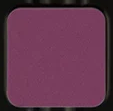

Use: Outer corner and lower lash line for a bold purple statement. Blend with Wisteria for a tonal purple eye.

##### 色号 6：紫罗兰 (Violet) —— 深冷调紫色，哑光质地。
用途：可用于眼尾和下眼睑打造浓郁紫调妆感；与 `Wisteria` 晕染可做同色调紫妆。

## Shade 7: Noisette — Medium warm taupe brown with a matte finish.
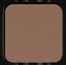

Use: All over base or crease shade for all skin tones. Blends seamlessly for a natural, everyday look.

##### 色号 7：榛子棕 (Noisette) —— 中调暖灰棕色，哑光质地。
用途：可作全眼底色或眼窝过渡色，适合所有肤色；打造自然日常妆，晕染衔接顺滑。

## Shade 8: Rose — Light warm peachy rose with a matte finish.
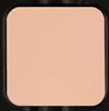

Use: All over lid or transition shade for a subtle romantic look. Pairs with all shades for a rosy dimension.

##### 色号 8：玫瑰裸粉 (Rose) —— 浅暖桃玫瑰粉，哑光质地。
用途：可作全眼铺色或过渡色，营造低调浪漫妆感；与盘内所有色号均可搭配增添玫瑰色调。

## Shade 9: Splendor — Deep wine with a metallic duochrome finish.
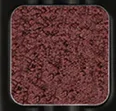

Use: All over lid for a bold jewel-toned statement. Outer corner for drama. Use damp to intensify the duochromatic shift.

##### 色号 9：绮华酒红 (Splendor) —— 深酒红色，金属双偏光质地。
用途：可全眼铺色打造浓郁宝石色妆感，或集中于眼尾增添戏剧感；湿刷可放大双偏光光泽。

## Shade 10: Cerise — Medium vivid pink with a metallic shimmer finish.
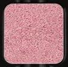

Use: All over lid for a vibrant pop of colour. Center of lid highlight for dimension. Pairs with Violet for a pink-purple statement.

##### 色号 10：樱桃粉 (Cerise) —— 中调鲜艳粉色，金属微光质地。
用途：可全眼铺色打造活力粉调妆感，或点在眼皮中央提亮增加层次；与 `Violet` 搭配可做粉紫跳色妆。

## Shade 11: Magnolia — Warm rose mauve with a shimmer finish.
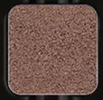

Use: All over lid or blended through the crease for a romantic, warm-toned look. Pairs with Peony and Rose for a soft monochromatic eye.

##### 色号 11：木兰玫紫 (Magnolia) —— 暖调玫瑰紫粉，微光质地。
用途：可全眼铺色或晕染于眼窝打造温暖浪漫妆感；与 `Peony`、`Rose` 搭配可做柔和同色调眼妆。

## Shade 12: Pêche — Warm peach with a metallic shimmer finish.
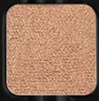

Use: All over lid for a glowing warm look. Inner corner highlight. Pairs beautifully with warm rose tones. Use damp for a foiled finish.

##### 色号 12：蜜桃金 (Pêche) —— 暖调桃色，金属微光质地。
用途：可全眼铺色打造发光暖调妆感；也可用于眼头提亮；与暖玫瑰色搭配相得益彰；湿刷可获得箔光效果。
