# Viseart 12色 小号 03 微醺编辑盘 Spritz Edit
*发布：2022*

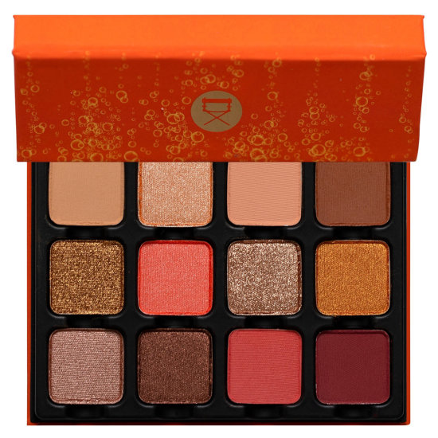

> 以一杯清爽微醺命名，12款沙漠裸棕与暖铜调色彩犹如午后阳光打落在皮肤上的柔和光影，令人联想起慵懒午后与香槟气泡。适合打造低调中性妆，也可叠出铜棕烟熏感，是全日通用的百搭之选。

> *Named for a refreshing afternoon aperitif, this palette's twelve sandy taupes and warm coppers capture the golden shimmer of sunlight on skin. Understated yet versatile, it transitions effortlessly from a soft neutral daytime look to a sun-bronzed smoky evening eye.*

## Shade 1: Ciambella — Sandy taupe with a matte finish.
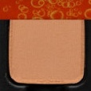

Use: All over base or transition shade for all skin tones. Mix with Brioche for a seamless crease blend. Pairs well with warmer copper tones as a neutral anchor.

##### 色号 1：甜圈沙棕 (Ciambella) —— 沙砾色调灰棕，哑光质地。
用途：可作全眼底色或过渡色，适合所有肤色；与 `Brioche` 混合可做顺滑眼窝晕染；为铜色系妆容提供中性锚定。

## Shade 2: Prosecco — Warm prosecco with a shimmer finish.
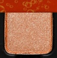

Use: Inner corner, brow bone, and center of lid highlight. Pairs with Fizz for a layered champagne effect. Use damp for a foiled finish.

##### 色号 2：普罗塞克香槟 (Prosecco) —— 暖调气泡香槟色，微光质地。
用途：可用于眼头、眉骨和眼皮中央提亮；与 `Fizz` 叠加可做香槟渐变效果；湿刷可打造箔光感。

## Shade 3: Tarocco — Peach beige with a matte finish.
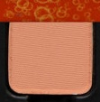

Use: All over lid for a soft warm look, or as a transition shade in the crease. Blends seamlessly with deeper orange tones for a sun-drenched effect.

##### 色号 3：血橙桃米 (Tarocco) —— 桃色米棕，哑光质地。
用途：可全眼铺色打造柔和暖调妆感，或作眼窝过渡色；与深橙色晕染可做日晒阳光妆。

## Shade 4: Brioche — Warm brown with a matte finish.
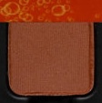

Use: Crease and outer corner for depth and definition. Use as a liner for warm definition. Anchors shimmer shades for a balanced look.

##### 色号 4：布里欧暖棕 (Brioche) —— 暖调棕色，哑光质地。
用途：可用于眼窝和眼尾加深塑型；作眼线色增添暖调轮廓；为微光色调系提供哑光底基。

## Shade 5: Limoncello — Antiqued gold with a shimmer finish.
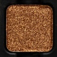

Use: All over lid or center of lid for a warm golden glow. Pairs with Prosecco for a two-tone metallic effect. Use damp to deepen the antique shimmer.

##### 色号 5：柠檬利口古金 (Limoncello) —— 做旧金色，微光质地。
用途：可全眼铺色或点在眼皮中央打造暖调金光；与 `Prosecco` 搭配可做双色金属效果；湿刷可加深古铜微光感。

## Shade 6: Spritz — Sunkissed candied apricot with a shimmer finish.
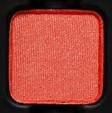

Use: All over lid for a warm, summery statement. Pairs with Arancia and Balmy for a rich warm-toned shimmer eye. Use damp for maximum intensity.

##### 色号 6：斯普里茨糖杏 (Spritz) —— 日晒糖杏色，微光质地。
用途：可全眼铺色打造温暖夏日妆感；与 `Arancia`、`Balmy` 搭配可做饱满暖调微光眼妆；湿刷可最大化光泽强度。

## Shade 7: Fizz — Golden nude with a metallic finish.
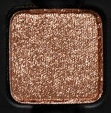

Use: All over lid for a wearable metallic nude. Center of lid highlight or inner corner brightener. Use damp for a foiled, glass-skin effect on the lid.

##### 色号 7：气泡裸金 (Fizz) —— 金调裸色，金属质地。
用途：可全眼铺色打造日常金属裸色妆；点在眼皮中央或眼头提亮；湿刷可打造箔光玻璃肌效果。

## Shade 8: Arancia — Goldfinch with a shimmer finish.
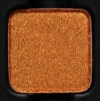

Use: All over lid for a warm yellow-gold statement. Pairs with Spritz for a warm-toned orange-gold eye. Adds a playful pop of colour to any look.

##### 色号 8：橙意金丝雀 (Arancia) —— 金丝雀黄金色，微光质地。
用途：可全眼铺色打造暖调黄金妆感；与 `Spritz` 搭配可做橙金色微光眼妆；为任何妆容增添跳色趣味。

## Shade 9: Balmy — Copper with a shimmer finish.
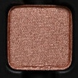

Use: All over lid for a classic copper metallic eye. Pairs with Scala for a layered warm bronze look. Use damp to intensify the copper shimmer.

##### 色号 9：温煦铜光 (Balmy) —— 铜色，微光质地。
用途：可全眼铺色打造经典铜色金属妆；与 `Scala` 搭配可做层次暖铜妆；湿刷可强化铜光效果。

## Shade 10: Scala — Bronzed caramel with a shimmer finish.
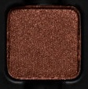

Use: All over lid or blended into crease for depth. Pairs with Balmy for a warm bronze duo. Adds warmth and dimension to any look.

##### 色号 10：铜焦糖微光 (Scala) —— 铜调焦糖色，微光质地。
用途：可全眼铺色或晕染于眼窝增添深度；与 `Balmy` 搭配可做暖铜双色组合；为任何妆容增添温暖层次。

## Shade 11: Granita — Sheer grenadine with a matte finish.
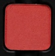

Use: All over lid for a sheer wash of coral-red, or blend through crease for a rosy depth. Pairs with Figura for a warm berry-toned statement.

##### 色号 11：石榴冰沙 (Granita) —— 透明石榴红，哑光质地。
用途：可全眼轻薄铺色打造珊瑚红调妆感，或晕染于眼窝增添玫色深度；与 `Figura` 搭配可做暖莓色妆。

## Shade 12: Figura — Sun-ripened raspberry with a matte finish.
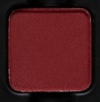

Use: Outer corner and lower lash line for depth. Use as a liner for a bold warm statement. Pairs with Granita and copper shades for a rich summer eye.

##### 色号 12：日熟覆盆子 (Figura) —— 日晒覆盆子红，哑光质地。
用途：可用于眼尾和下眼睑加深；作眼线色打造大胆暖调收边；与 `Granita` 及铜色系搭配可做浓郁夏日眼妆。
