# Viseart 12色 小号 04 巴黎编辑盘 Paris Edit
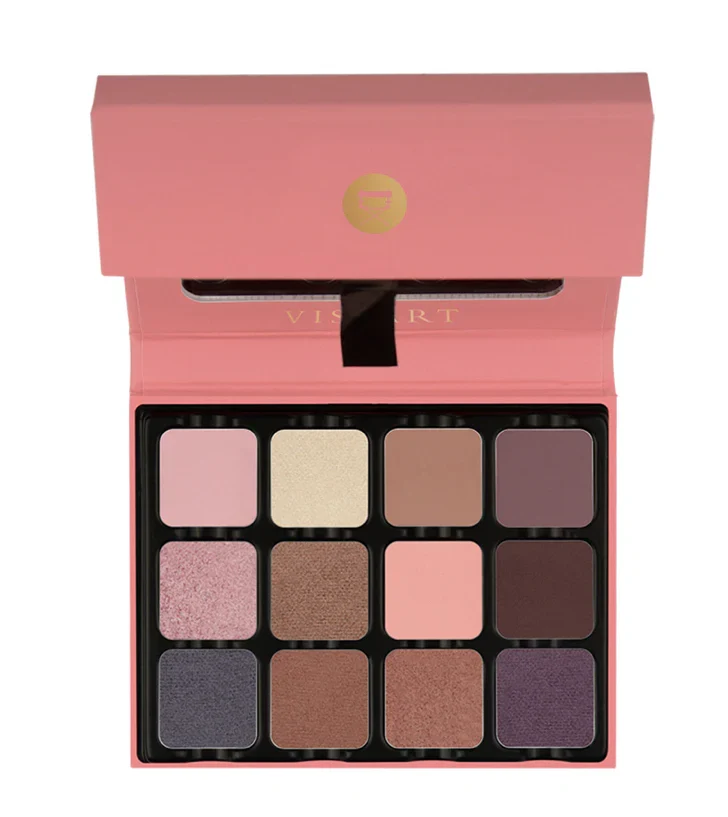

## Shade 1: Chéri — Light baby pink with a matte finish.
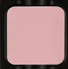

Use: All over base or transition shade. Highlight for brow bone and inner corner on lighter skin tones. Pairs with any deeper shade in the palette.

##### 色号 1：亲爱粉 (Chéri) —— 浅婴儿粉，哑光质地。
用途：可作全眼底色或过渡色；浅肤色可用于眉骨和眼头提亮；与盘内任何深色搭配均可。

## Shade 2: Ivoire — Light ivory champagne with a metallic shimmer finish.
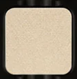

Use: Inner corner, brow bone, and center of lid highlight. Use damp for a foiled finish. Mix with matte shades to add shimmer.

##### 色号 2：象牙香槟 (Ivoire) —— 浅象牙香槟色，金属微光质地。
用途：可用于眼头、眉骨和眼皮中央提亮；湿刷可获得箔光效果；与哑光色混合可增添光泽。

## Shade 3: Marais — Medium warm taupe brown with a matte finish.
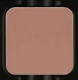

Use: All over lid or crease transition shade for all skin tones. Use as an eyeliner for soft definition.

##### 色号 3：玛黑暖灰棕 (Marais) —— 中调暖灰棕色，哑光质地。
用途：可全眼铺色或用作眼窝过渡，适合所有肤色；也可作为眼线色增添柔和轮廓。

## Shade 4: Bordeaux — Deep dark plum matte with a matte finish.
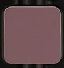

Use: Outer corner and lower lash line for depth and drama. Use as a liner. Pairs with Marais for a dimensional crease.

##### 色号 4：波尔多深紫棕 (Bordeaux) —— 深暗李子棕色，哑光质地。
用途：可用于眼尾和下眼睑加深增添戏剧感；也可作眼线；与 `Marais` 搭配做层次眼窝。

## Shade 5: Lilas — Light cool mauve pink with a shimmer finish.
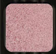

Use: All over lid or inner corner for an ethereal look. Pairs with Bordeaux for a cool-toned dramatic eye.

##### 色号 5：丁香粉紫 (Lilas) —— 浅冷调淡紫粉，微光质地。
用途：可全眼铺色或点亮眼头打造空灵妆感；与 `Bordeaux` 搭配可做冷调戏剧眼妆。

## Shade 6: Opéra — Medium rose brown with a metallic shimmer finish.
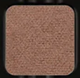

Use: All over lid or crease depth for a sophisticated look. Pairs with Ivoire for a contrasting highlight.

##### 色号 6：歌剧玫棕 (Opéra) —— 中调玫瑰棕，金属微光质地。
用途：可全眼铺色或用于眼窝加深，打造高级感妆容；与 `Ivoire` 形成对比提亮。

## Shade 7: Corail — Light warm coral peach with a matte finish.
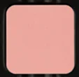

Use: All over lid for a warm, feminine look. Blend with Marais for a warm crease effect. All skin tones.

##### 色号 7：法式珊瑚桃 (Corail) —— 浅暖珊瑚桃色，哑光质地。
用途：可全眼铺色打造温暖女性化妆感；与 `Marais` 晕染于眼窝可做暖调裂变效果。

## Shade 8: Brume — Medium deep muted brown with a matte finish.
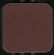

Use: Crease and outer corner for depth. Use as a liner for definition. Pairs with any shimmer shade for a balanced look.

##### 色号 8：薄雾暗棕 (Brume) —— 中深柔和棕色，哑光质地。
用途：可用于眼窝和眼尾加深；作眼线色增添轮廓；与任何微光色搭配可做均衡妆感。

## Shade 9: Ardoise — Cool slate blue with a metallic shimmer finish.
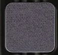

Use: All over lid for an unexpected cool statement or outer corner for depth. Pairs with Bordeaux for a cool smokey eye.

##### 色号 9：石板蓝灰 (Ardoise) —— 冷调石板蓝灰，金属微光质地。
用途：可全眼铺色打造意外冷调妆感，或集中于眼尾加深；与 `Bordeaux` 搭配可做冷调烟熏眼妆。

## Shade 10: Châtaigne — Medium warm brown with a metallic shimmer finish.
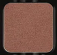

Use: All over lid for a warm, everyday shimmer look. Pairs with Marais in the crease for a monochromatic warm brown eye.

##### 色号 10：栗棕微光 (Châtaigne) —— 中调暖棕，金属微光质地。
用途：可全眼铺色打造日常暖调微光妆；与 `Marais` 搭配于眼窝可做同色调暖棕眼妆。

## Shade 11: Moka — Warm mocha brown with a satin shimmer finish.
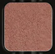

Use: All over lid or blended into the crease. Pairs with Châtaigne for a rich warm metallic look. Use as an eyeliner with a damp brush.

##### 色号 11：摩卡暖棕 (Moka) —— 暖调摩卡棕，缎光微闪质地。
用途：可全眼铺色或晕染于眼窝；与 `Châtaigne` 搭配可做浓郁暖调金属妆；湿刷可作眼线使用。

## Shade 12: Iris — Medium cool purple with a metallic shimmer finish.
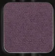

Use: All over lid for a romantic purple look or outer corner for a pop of colour. Pairs with Lilas for a tonal cool-toned eye.

##### 色号 12：鸢尾紫 (Iris) —— 中调冷紫色，金属微光质地。
用途：可全眼铺色打造浪漫紫调妆感，或集中于眼尾做跳色点缀；与 `Lilas` 搭配可做同色调冷紫眼妆。
