# Viseart 12色 小号 06 黎明编辑盘 Dawn Edit
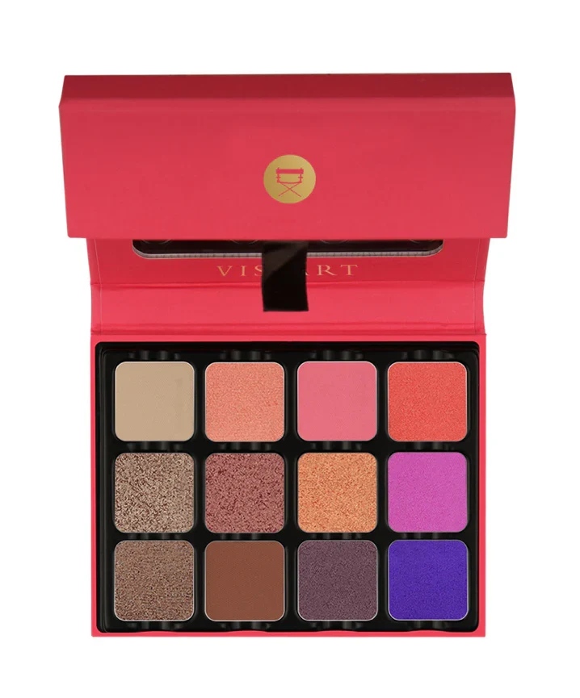

## Shade 1: Dune — Light warm beige with a matte finish.
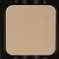

Use: All over base or transition shade for all skin tones. Highlight for brow bone on medium to deep skin.

##### 色号 1：沙丘裸米 (Dune) —— 浅暖米色，哑光质地。
用途：可作全眼底色或过渡色，适合所有肤色；中至深肤色可用于眉骨提亮。

## Shade 2: Coral — Warm light coral with a metallic shimmer finish.
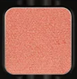

Use: All over lid for a warm radiant look. Inner corner and center of lid highlight. Pairs with deeper oranges for a warm sunset eye.

##### 色号 2：珊瑚金光 (Coral) —— 暖调浅珊瑚色，金属微光质地。
用途：可全眼铺色打造温暖发光妆感；也可用于眼头和眼皮中央提亮；与深橙色搭配可做暖调日落眼妆。

## Shade 3: Sorbet — Vivid warm pink with a matte finish.
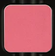

Use: All over lid for a bold, playful statement. Blend into the crease with Dune for a soft gradient. All skin tones.

##### 色号 3：果汁冰霜粉 (Sorbet) —— 鲜明暖粉色，哑光质地。
用途：可全眼铺色打造大胆活泼妆感；与 `Dune` 在眼窝晕染可做柔和渐变。

## Shade 4: Sunset — Warm bright coral orange with a metallic shimmer finish.
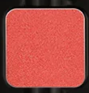

Use: All over lid for a vibrant sunset look. Pairs with Sorbet and Coral for a warm orange-pink editorial eye.

##### 色号 4：日落橘金 (Sunset) —— 暖调亮珊瑚橘，金属微光质地。
用途：可全眼铺色打造活力日落妆感；与 `Sorbet` 和 `Coral` 搭配可做暖橘粉编辑风眼妆。

## Shade 5: Rose Gold — Warm rose gold with a metallic shimmer finish.
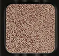

Use: All over lid or center of lid for a modern glow. Use damp for a foiled finish. Pairs with warm nudes for an everyday metallic eye.

##### 色号 5：玫瑰金 (Rose Gold) —— 暖调玫瑰金，金属微光质地。
用途：可全眼铺色或点在眼皮中央打造现代光泽感；湿刷可获得箔光效果；与暖裸色搭配可做日常金属妆。

## Shade 6: Bougainvillea — Deep warm rose with a metallic shimmer finish.
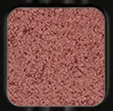

Use: All over lid or outer corner for a deep romantic statement. Pairs with Rose Gold for a tonal warm-pink metallic eye.

##### 色号 6：九重葛玫红 (Bougainvillea) —— 深暖玫红色，金属微光质地。
用途：可全眼铺色或集中于眼尾打造浓郁浪漫感；与 `Rose Gold` 搭配可做同色调暖粉金属眼妆。

## Shade 7: Apricot — Warm copper peach with a metallic shimmer finish.
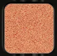

Use: All over lid for a warm glow. Pairs with Sunset for a bold warm metallic eye. Use damp to intensify the copper shine.

##### 色号 7：杏铜微光 (Apricot) —— 暖调铜桃色，金属微光质地。
用途：可全眼铺色打造暖调光泽感；与 `Sunset` 搭配可做大胆暖调金属眼妆；湿刷可强化铜光效果。

## Shade 8: Amethyst — Medium cool purple with a matte finish.
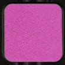

Use: All over lid for a cool-warm contrast or outer corner for depth. Pairs with Rose Gold for an unexpected purple-gold look. All skin tones.

##### 色号 8：紫晶哑调 (Amethyst) —— 中调冷紫色，哑光质地。
用途：可全眼铺色打造冷暖对比，或集中于眼尾加深；与 `Rose Gold` 搭配可做出人意料的紫金妆容。

## Shade 9: Bronze — Warm rich bronze with a metallic shimmer finish.
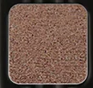

Use: All over lid for a classic metallic eye. Pairs with Apricot and Sunset for a warm layered bronze effect.

##### 色号 9：古铜微光 (Bronze) —— 暖调浓郁铜色，金属微光质地。
用途：可全眼铺色打造经典金属妆感；与 `Apricot` 和 `Sunset` 搭配可做暖调叠层铜光效果。

## Shade 10: Sirocco — Medium warm nude brown with a matte finish.
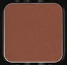

Use: All over base or crease shade for all skin tones. Pairs with Bronze and Rose Gold for a warm eye.

##### 色号 10：热风沙棕 (Sirocco) —— 中调暖裸棕色，哑光质地。
用途：可作全眼底色或眼窝过渡色，适合所有肤色；与 `Bronze` 和 `Rose Gold` 搭配可做暖调妆。

## Shade 11: Mulberry — Medium warm mauve with a satin shimmer finish.
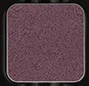

Use: All over lid or outer corner for a warm cool-mauve effect. Pairs with Amethyst for a layered purple look.

##### 色号 11：桑椹玫紫 (Mulberry) —— 中调暖紫粉，缎光微闪质地。
用途：可全眼铺色或集中于眼尾营造暖冷对比的紫粉效果；与 `Amethyst` 搭配可做层次紫调眼妆。

## Shade 12: Violet Dusk — Deep cool violet with a metallic shimmer finish.
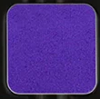

Use: Outer corner and lower lash line for a bold dusk-inspired finish. Pairs with Amethyst and Mulberry for a layered purple smokey eye.

##### 色号 12：暮色深紫 (Violet Dusk) —— 深冷紫色，金属微光质地。
用途：可用于眼尾和下眼睑打造大胆暮色风收边；与 `Amethyst` 和 `Mulberry` 搭配可做层次紫调烟熏眼妆。
