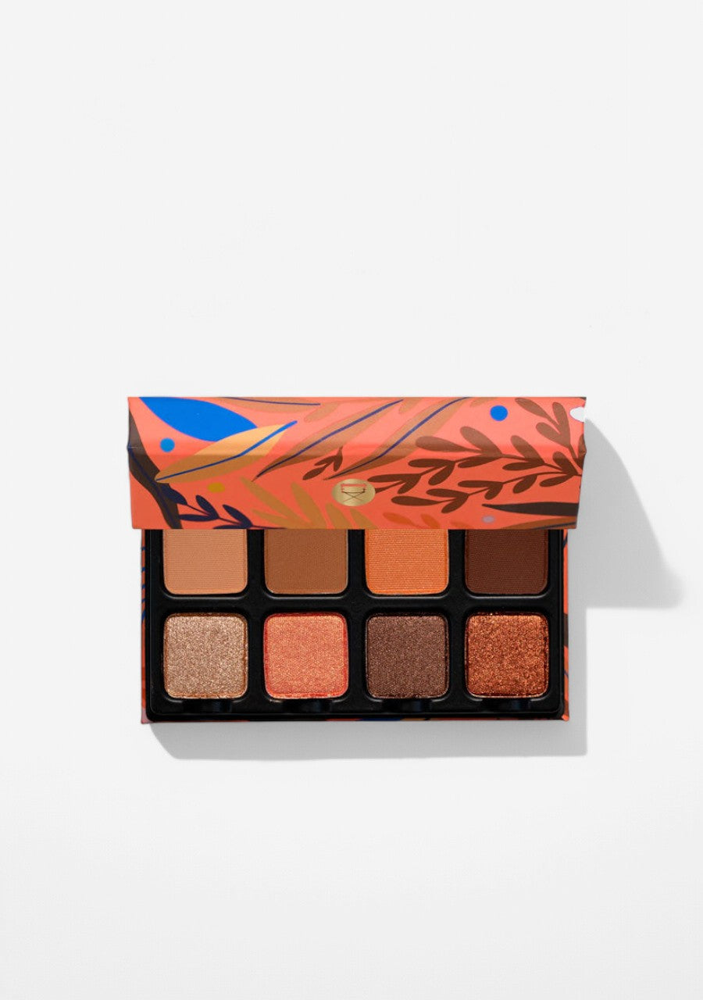
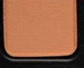
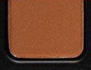
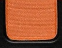
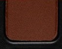
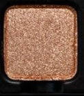
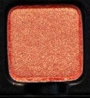
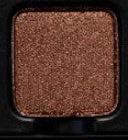
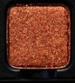

# Viseart 8色 小号 杏蜜橙光盘 Petit Pro Apricotine
*发布：~2022*

> 巴黎街角那杯下午茶，盛满了杏桃蜜糖与焦糖的香气。Petit Pro Apricotine 把最暖的橙调压进八格：从奶油哑光到铜光闪色，每一抹都像咬下一口刚出炉的杏挞。

> *The warmth of a Parisian pâtisserie in eight shades — burnished peaches, toasted caramels, and sparkling copper. Petit Pro Apricotine is an indulgence in every sense, from creamy matte bases to blazing metallic finishes.*

## Shade 1: Meringue — Pale peachy nude with a matte finish.

Use: All over lid base tone for all skin types, or brow bone highlight. An ideal primer and blending shade for all other tones in this palette.

##### 色号 1：蛋白霜米肤 (Meringue) —— 浅桃裸色，哑光质地。
用途：适合所有肤色的全眼打底铺色，或用作眉骨高光；与本盘所有色号融合性极高。

## Shade 2: Praline — Warm tan with a matte finish.

Use: All over lid mid-tone, crease transition shade, or light outer corner definition. Blends seamlessly between Meringue and the deeper shades.

##### 色号 2：果仁焦糖棕 (Praline) —— 暖棕色，哑光质地。
用途：可作全眼中间铺色，眼窝渐变过渡，或轻度眼尾定型；在浅色与深色之间自然衔接。

## Shade 3: Apricotine — Vivid warm orange with a matte finish.

Use: Bold all over lid color, crease definition, or outer corner depth. Mix with deeper mattes for a rich warm smokey eye.

##### 色号 3：杏桃橙 (Apricotine) —— 鲜艳暖橙色，哑光质地。
用途：可作全眼大胆铺色，眼窝立体定型，或眼尾深度；与深色哑光混合可打造浓郁暖调烟熏眼。

## Shade 4: Dolce — Deep amber brown with a matte finish.

Use: Crease depth, outer corner definition, or smokey eye base. Blend with lighter mattes to extend and deepen any warm-toned look.

##### 色号 4：甜蜜琥珀棕 (Dolce) —— 深琥珀棕，哑光质地。
用途：可作眼窝深色定型，眼尾轮廓，或烟熏底色；与浅色哑光混合可拓展暖调妆效的层次。

## Shade 5: Sugared — Champagne gold with a shimmer finish.

Use: All over lid for a soft golden glow, inner corner highlight, or on the cheekbones and brow bone. Can be foiled with a mixing medium for a more intense metallic finish.

##### 色号 5：蜜糖金闪 (Sugared) —— 香槟金色，闪光质地。
用途：可作全眼柔光铺色，眼头高光，或颧骨与眉骨提亮；搭配调和液可打造更高强度的金属感。

## Shade 6: Grenadine — Warm coral with a shimmer finish.

Use: All over lid for a glowing apricot effect, or layered over Apricotine to add metallic brilliance. Use in the outer corner for a sun-kissed pop of warmth.

##### 色号 6：石榴珊瑚闪 (Grenadine) —— 暖珊瑚色，闪光质地。
用途：可作全眼铺色呈现日晒般的光泽感，或叠加于杏桃橙色之上增添金属光彩；点于眼尾制造暖调亮点。

## Shade 7: Bourbon — Rich bronze with a shimmer finish.

Use: All over lid for a deep bronze statement, or layered over warm matte bases for dimensional depth. Blend into the outer corners for a sultry finish.

##### 色号 7：波旁铜棕闪 (Bourbon) —— 深铜棕色，闪光质地。
用途：可作全眼浓郁铜调铺色，或叠加于暖色哑光底色上增添立体层次；融入眼尾打造迷人深邃感。

## Shade 8: Mimolette — Vivid copper metallic.

Use: All over lid for a bold copper statement. Intensify with a damp brush or mixing medium for maximum metallic impact. Also works as a warm highlight on the inner corner and cheekbones.

##### 色号 8：橙铜金属 (Mimolette) —— 鲜明铜色，金属质地。
用途：可作全眼铺色打造大胆铜调宣言感；搭配湿刷或调和液可最大化金属强度；也可用作眼头和颧骨的暖调高光。
